BỘ GIÁO DỤC VÀ ĐÀO TẠO
TRƯỜNG ĐẠI HỌC QUY NHƠN
170 An Dương Vương, TP. Quy Nhơn, Bình Định
Điện thoại: 02563 846 156 Fax: 02563 846 089 Web: www.qnu.edu.vn
Trách nhiệm - Chuyên nghiệp - Chất lượng - Sáng tạo - Nhân văn

---

# BÁO CÁO BÀI TẬP NHÓM
## HỆ THỐNG QUẢN LÝ TRẠM SẠC XE ĐIỆN
**(Học phần: Phân tích thiết kế hệ thống thông tin)**

**GVHP:** Nguyễn Thị Tuyết
**Lớp:** [Nhập tên lớp của bạn]
**Nhóm:** [Nhập tên nhóm của bạn]
**Thành viên nhóm:**
1. [Họ và tên thành viên 1] - MSV: [MSV]
2. [Họ và tên thành viên 2] - MSV: [MSV]
3. [Họ và tên thành viên 3] - MSV: [MSV]
4. [Họ và tên thành viên 4] - MSV: [MSV]

**BÌNH ĐỊNH, 2025**

---

# BÀI 2: PHÁT HOẠ GIAO DIỆN CỦA HỆ THỐNG

## 1. THẢO LUẬN, ĐÓNG GÓP Ý TƯỞNG THIẾT KẾ GIAO DIỆN (UI/UX)

Hệ thống Quản lý Trạm Sạc Xe Điện phục vụ hai nhóm đối tượng hoàn toàn khác nhau (Khách hàng và Quản trị viên), do đó nhóm đã thảo luận và quyết định áp dụng hai triết lý thiết kế UI/UX tách biệt để tối ưu hóa trải nghiệm cho từng nhóm:

**1.1. Giao diện Khách hàng (Customer - Mobile First)**
*   **Màu sắc chủ đạo:** Sử dụng tông màu Xanh lá cây (Green/Eco) làm màu nhấn chủ đạo trên nền Trắng/Xám nhạt. Màu xanh lá tượng trưng cho năng lượng sạch, xe điện và sự thân thiện với môi trường.
*   **Bố cục (Layout):** Khách hàng chủ yếu sử dụng điện thoại di động khi đang di chuyển trên đường. Vì vậy, nhóm thiết kế theo chuẩn **Mobile-First** với thanh điều hướng nằm ở dưới đáy màn hình (Bottom Navigation Bar). Điều này giúp người dùng dễ dàng thao tác bằng một tay.
*   **Font chữ & Icon:** Sử dụng font chữ không chân (San-serif) hiện đại như Inter hoặc Roboto, kết hợp với bộ icon sắc nét để biểu đạt thông tin nhanh (ví dụ: icon sấm sét cho trạm sạc, icon bản đồ).
*   **Trải nghiệm (UX):** Giảm thiểu tối đa số lần bấm (clicks). Các nút "Bắt đầu sạc", "Dừng sạc" được thiết kế to, màu nổi bật (Xanh/Đỏ) để không bị bấm nhầm. Giao diện bản đồ được mở ra ngay lập tức giúp tìm trạm nhanh nhất.

**1.2. Giao diện Quản trị viên (Admin - Desktop First)**
*   **Bố cục (Layout):** Admin làm việc tại văn phòng nên giao diện được thiết kế theo chuẩn **Desktop-First**. Bố cục chia làm 2 phần chính: Thanh menu bên trái (Sidebar) cố định để chứa nhiều mục quản lý, và phần nội dung bên phải (Main Content) rộng rãi để hiển thị bảng dữ liệu (DataTables).
*   **Hiển thị dữ liệu:** Sử dụng các thẻ (Cards) để nhấn mạnh các chỉ số KPI quan trọng (Tổng doanh thu, Tổng phiên sạc) ở ngay Dashboard. Sử dụng biểu đồ để Admin nắm bắt tình hình kinh doanh trực quan.
*   **Trải nghiệm (UX):** Áp dụng thiết kế "Bảng dữ liệu tương tác", hỗ trợ phân trang, tìm kiếm và lọc dữ liệu. Các nút hành động (Thêm/Sửa/Xóa) sử dụng mã màu chuẩn: Xanh dương (Sửa), Đỏ (Xóa), Xanh lá (Thêm mới) kèm theo các thông báo (Notifications) góc màn hình.

---

## 2. PHÁT HOẠ CÁC GIAO DIỆN CHÍNH CỦA HỆ THỐNG

### 2.1. Nhóm Giao diện Xác thực (Authentication)

Giao diện đăng nhập, đăng ký và lấy lại mật khẩu được thiết kế đơn giản, tập trung vào form nhập liệu, với hình nền thân thiện liên quan đến xe điện. Có cơ chế xác thực OTP bảo mật.

**Giao diện Đăng nhập:**
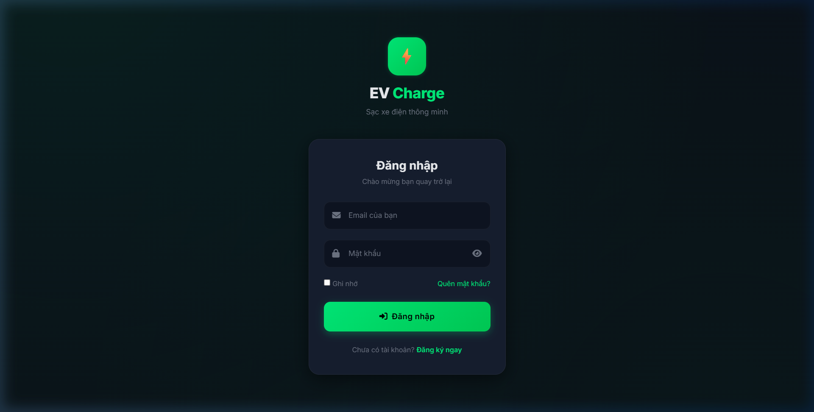

**Giao diện Đăng ký tài khoản:**
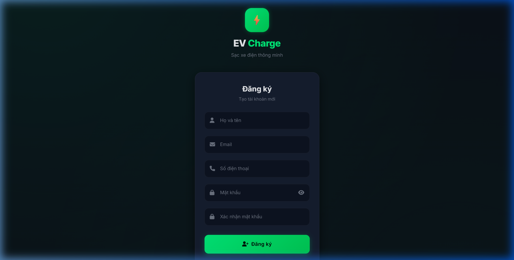

**Giao diện Xác thực mã OTP:**
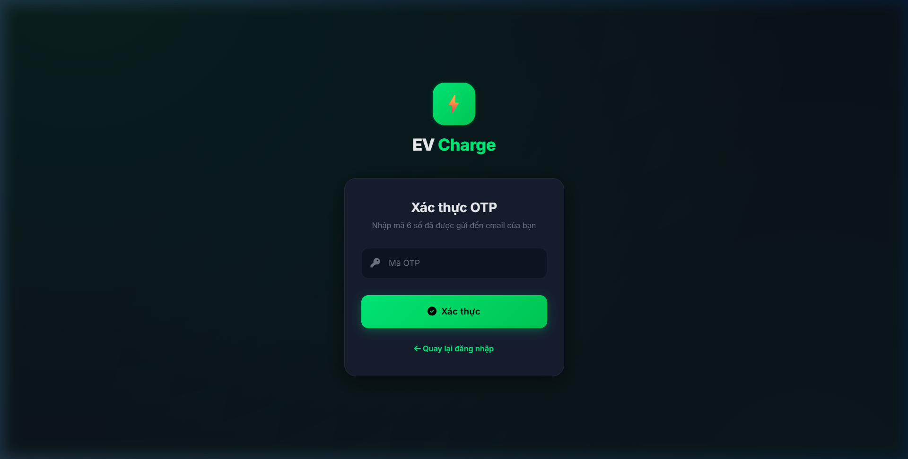

**Giao diện Quên mật khẩu & Đặt lại mật khẩu:**
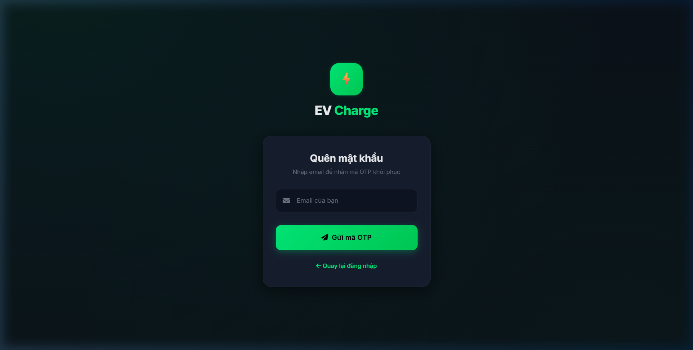
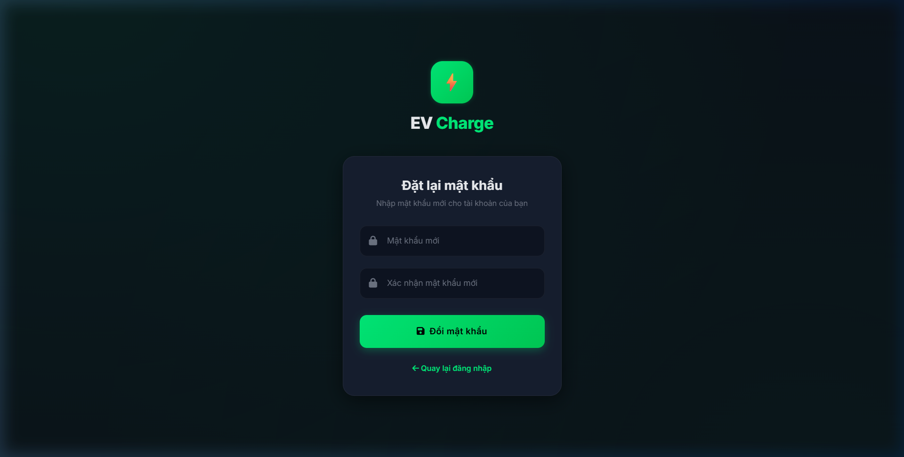

---

### 2.2. Nhóm Giao diện Khách hàng (Customer)

**Trang chủ Khách hàng:**
Giao diện chào mừng, hiển thị tóm tắt các tính năng chính và thanh điều hướng Bottom Navigation.
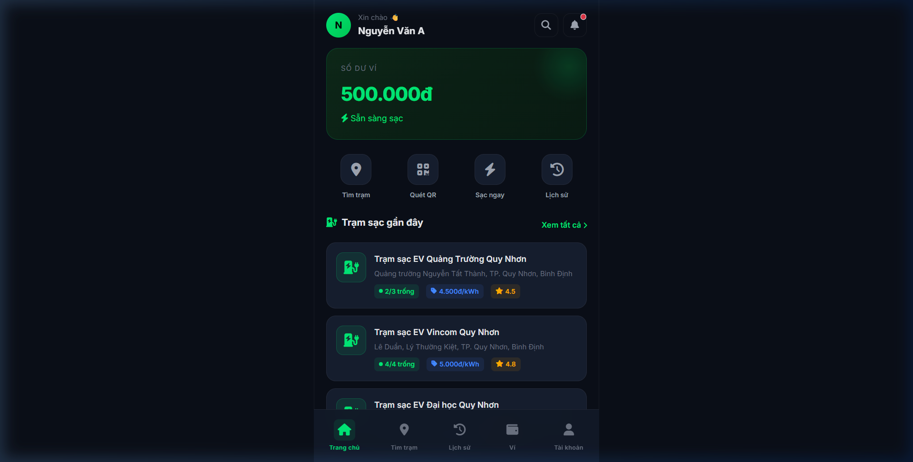

**Bản đồ Trạm sạc (Map):**
Tích hợp bản đồ Leaflet.js, cho phép khách hàng tìm kiếm trạm sạc xung quanh vị trí GPS hiện tại, hiển thị các marker nổi bật.
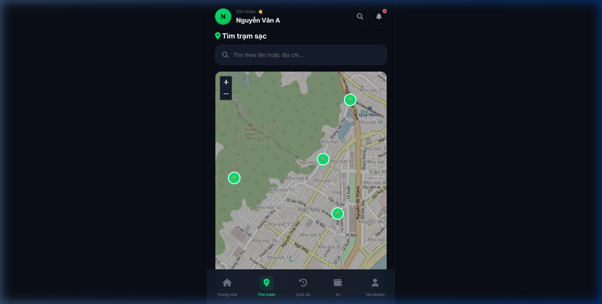

**Chi tiết Trạm sạc & Trụ sạc:**
Hiển thị thông tin địa chỉ, đơn giá điện. Hiển thị danh sách các súng sạc (Connector) cùng trạng thái (Trống/Đang sử dụng) để khách hàng lựa chọn bắt đầu sạc.
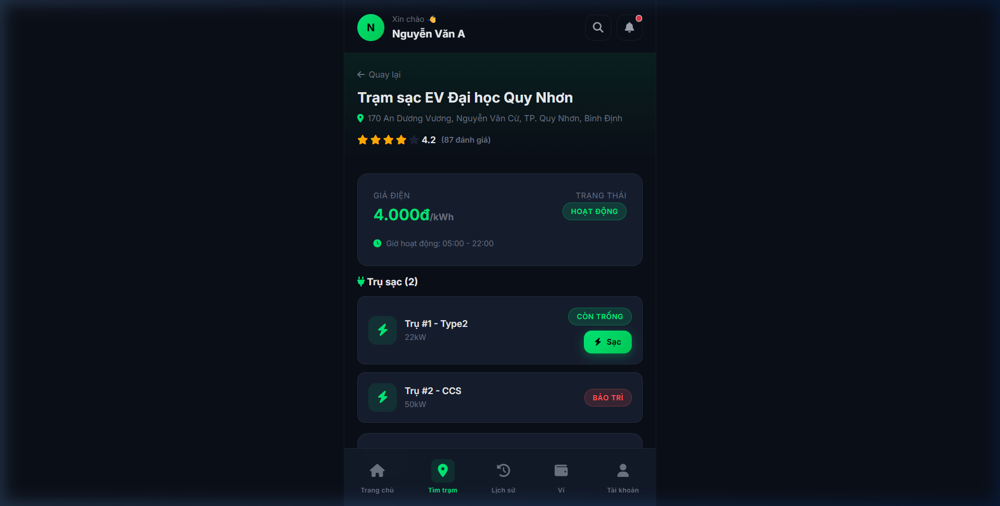

**Giao diện Ví điện tử & Nạp tiền (VietQR):**
Cho phép khách hàng xem số dư, tạo mã QR thanh toán chuẩn VietQR (PayOS) để quét bằng app ngân hàng.
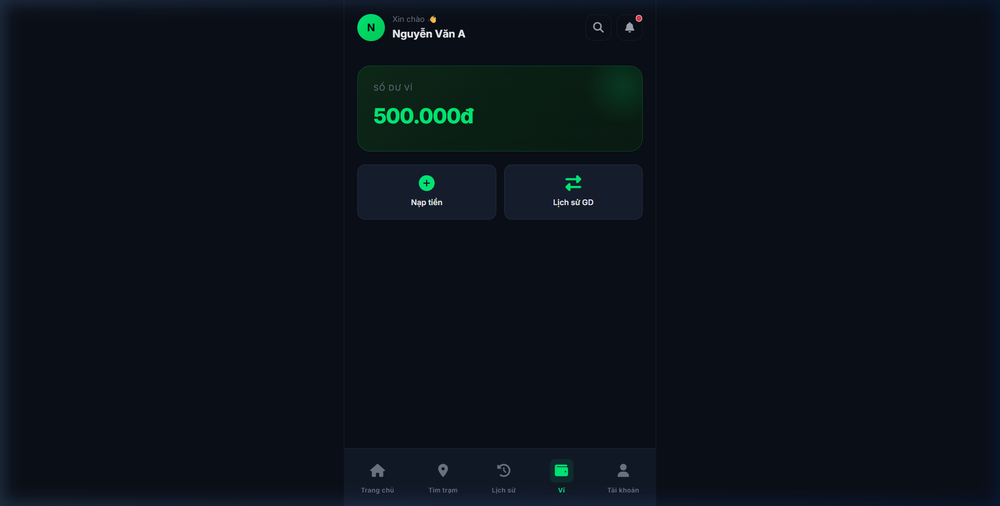

**Lịch sử Sạc xe:**
Hiển thị danh sách các phiên sạc trước đây, lượng điện tiêu thụ và tổng tiền.
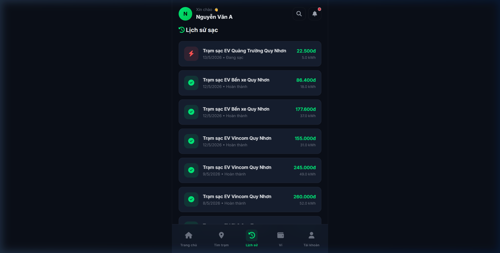

**Hồ sơ cá nhân:**
Nơi người dùng cập nhật thông tin cá nhân và thay đổi mật khẩu.
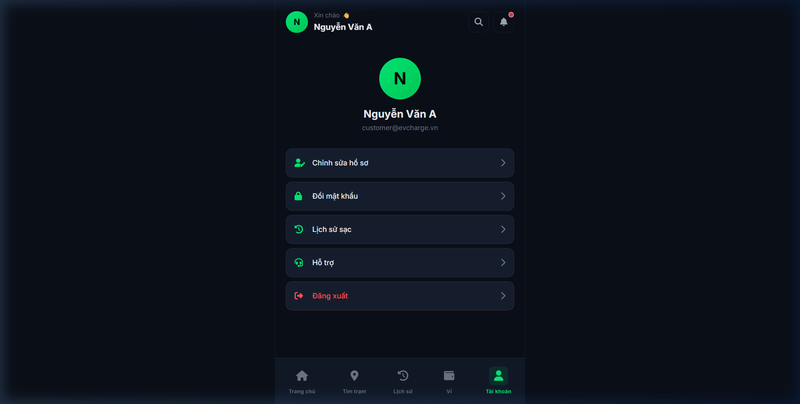

---

### 2.3. Nhóm Giao diện Quản trị viên (Admin)

**Bảng điều khiển (Dashboard):**
Hiển thị các thẻ KPI (tổng trạm, tổng khách hàng, tổng doanh thu...) và các biểu đồ phân tích doanh thu theo thời gian.
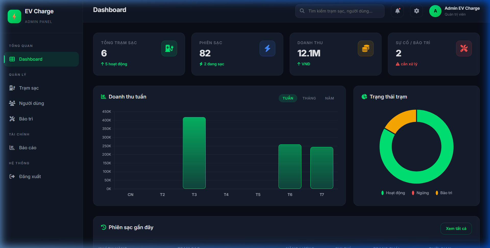

**Quản lý Danh sách Trạm sạc:**
Bảng dữ liệu liệt kê tất cả trạm sạc, hỗ trợ tìm kiếm và các nút hành động (Sửa, Xóa).
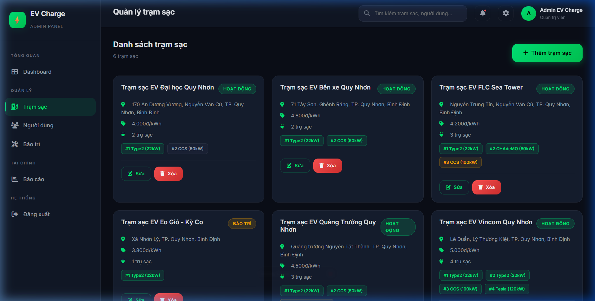

**Thêm mới Trạm sạc:**
Form nhập liệu để Admin thêm trạm mới, điền tọa độ, giá điện, và cấu hình từng súng sạc.
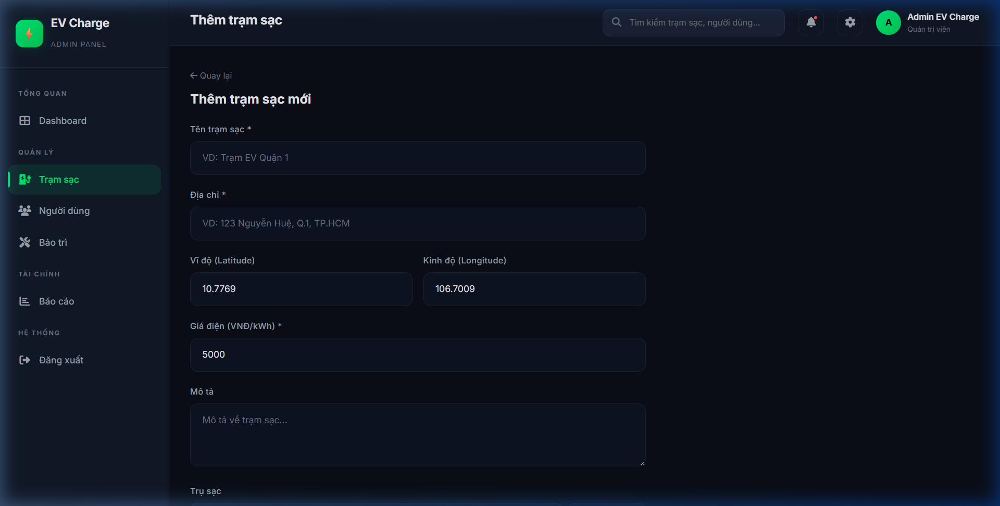

**Quản lý Khách hàng:**
Bảng danh sách toàn bộ người dùng trong hệ thống, Admin có quyền khóa (Disable) tài khoản.
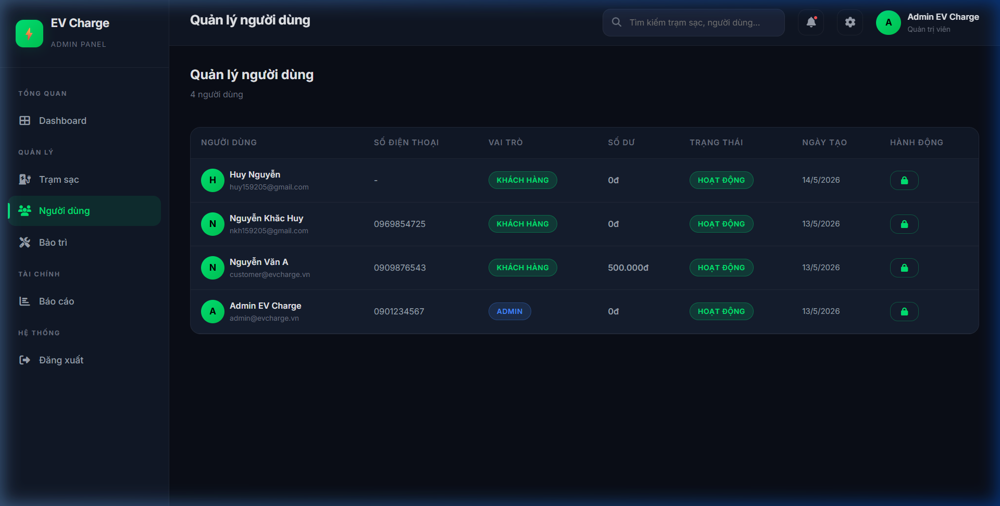

**Báo cáo & Thống kê:**
Lọc dữ liệu theo ngày tháng, hiển thị bảng doanh thu chi tiết và top các trạm sạc hiệu quả nhất.
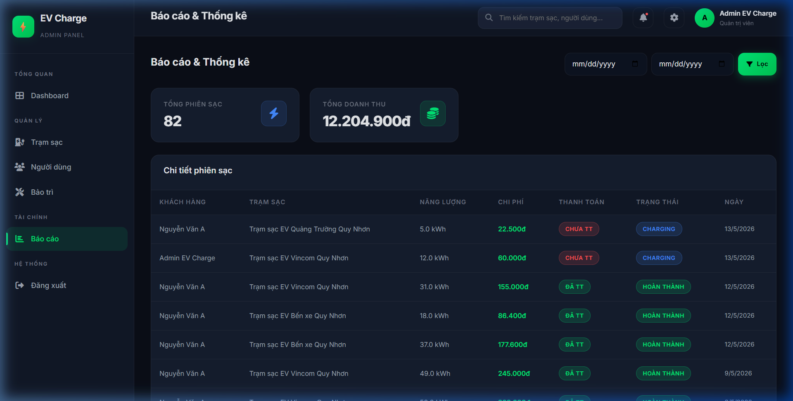

**Quản lý Bảo trì:**
Theo dõi các phiếu báo lỗi thiết bị, cập nhật tiến trình sửa chữa (Pending -> In Progress -> Completed).
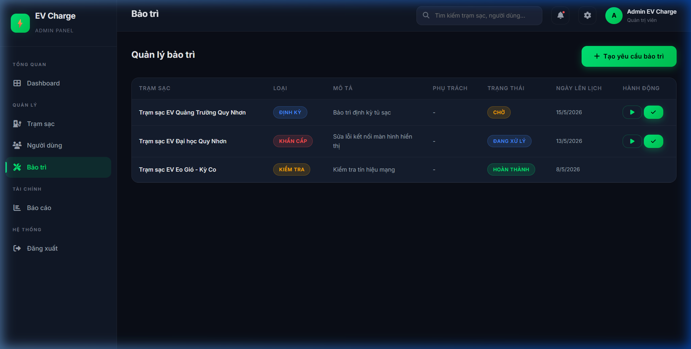

**Cài đặt Hệ thống:**
Giao diện quản lý cấu hình chung của hệ thống.
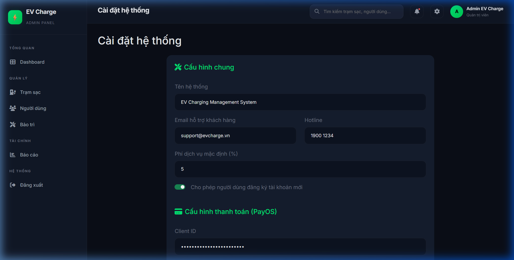
