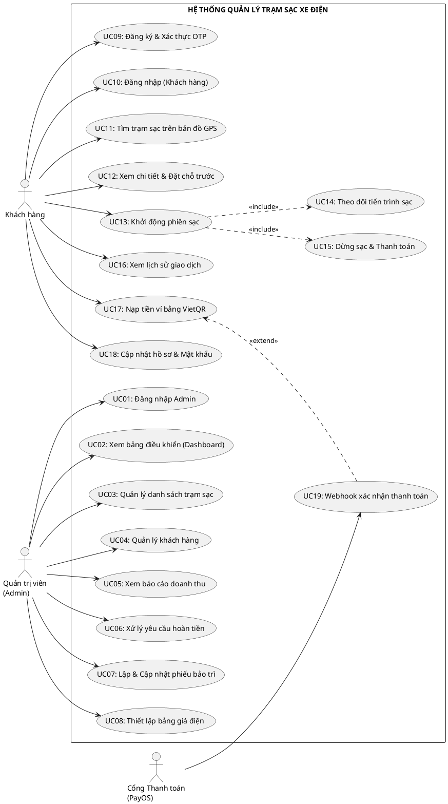

TRƯỜNG ĐẠI HỌC QUY NHƠN
KHOA CÔNG NGHỆ THÔNG TIN
----- -----

BÀI THỰC HÀNH
HỌC PHẦN: PHÂN TÍCH VÀ THIẾT KẾ
HỆ THỐNG THÔNG TIN

GIẢNG VIÊN HƯỚNG DẪN: NGUYỄN THỊ TUYẾT

BÁO CÁO BÀI TẬP NHÓM HỆ THỐNG
<QUẢN LÝ TRẠM SẠC XE ĐIỆN Ở MỘT THÀNH PHỐ>

THÀNH VIÊN NHÓM 8
4651050029 - Phạm Bình Chương
4651050177 - Nguyễn Nhất Nguyên
4651050096 - Nguyễn Khắc Huy
4651050094 - Huỳnh Nhật Huy
4651050066 - Đặng Nhật Hào

Năm 2025

---

# BÀI 3: PHÂN TÍCH CHỨC NĂNG

## I. Tìm tác nhân (người sử dụng hệ thống)
- **Người dùng (Customer):** Chủ xe điện, người truy cập vào hệ thống để tìm kiếm trạm sạc, nạp tiền vào ví điện tử, đặt chỗ trước, thực hiện sạc xe, thanh toán và quản lý hồ sơ cá nhân.
- **Quản trị viên (Admin):** Người quản lý vận hành hệ thống, theo dõi hoạt động kinh doanh, giám sát trạng thái các trạm sạc, quản lý khách hàng, thiết lập giá điện, lập phiếu bảo trì và xử lý hoàn tiền sự cố.
- **Cổng Thanh toán (Payment Gateway - PayOS):** Hệ thống tự động bên thứ ba, chịu trách nhiệm xử lý các giao dịch nạp tiền qua mã QR (VietQR) và gửi Webhook phản hồi kết quả về cho hệ thống.

## II. Tìm Use case (chức năng)

### 1. Quản trị viên (Admin)
**a) Chức năng chính:**
- **Đăng nhập hệ thống:** Cổng vào duy nhất, bắt buộc phải có tài khoản hợp lệ để truy cập vào vùng quản trị.
- **Quản lý tổng quan (Dashboard):** Màn hình hiển thị đầu tiên, cung cấp các chỉ số KPI theo thời gian thực (tổng doanh thu, tổng số trạm, số trạm đang sạc, tổng khách hàng) và biểu đồ phân tích (theo tuần, tháng, năm).
- **Quản lý danh sách trạm sạc (Station Management):** Giao diện chính giúp admin giám sát toàn bộ mạng lưới trạm sạc. Cho phép thêm trạm mới (nhập tọa độ GPS, cấu hình các trụ sạc), chỉnh sửa thông tin hoặc thay đổi trạng thái trạm.
- **Báo cáo doanh thu (Reports):** Công cụ lọc và xuất dữ liệu doanh thu chi tiết theo khoảng thời gian tùy chọn. Hiển thị danh sách các phiên sạc và Top 5 trạm mang lại doanh thu cao nhất.

**b) Chức năng phụ:**
- **Quản lý người dùng (User Management):** Tra cứu danh sách khách hàng, xem thông tin liên hệ và thực hiện thao tác khóa/mở khóa tài khoản (Active/Inactive) khi phát hiện vi phạm.
- **Thiết lập bảng giá điện (Price Management):** Quản lý, thêm, sửa, xóa các mức giá điện khác nhau dựa theo loại cổng hoặc khung giờ (cao điểm, thấp điểm).
- **Quản lý bảo trì (Maintenance):** Tạo mới các phiếu yêu cầu bảo trì khi có trạm gặp sự cố, phân công người phụ trách và cập nhật tiến độ (Pending, In Progress, Completed).
- **Xử lý hoàn tiền (Refunds):** Công cụ giúp admin can thiệp hoàn lại tiền vào ví điện tử của khách hàng nếu hệ thống hoặc phiên sạc gặp lỗi ngoài ý muốn.

### 2. Khách hàng (Customer)
**a) Chức năng chính:**
- **Bản đồ tương tác (Map View):** Màn hình chính sau khi đăng nhập. Sử dụng định vị GPS để tìm các trạm sạc trong bán kính xung quanh, hiển thị trực quan bằng các Marker (điểm đánh dấu).
- **Chi tiết trạm & Đặt chỗ trước (Station Detail & Reservation):** Cho phép xem tình trạng rảnh/bận của từng trụ sạc (connector) tại một trạm và cho phép đặt chỗ trước để giữ trụ sạc.
- **Khởi động phiên sạc (Start Charging):** Hành động kích hoạt sạc xe sau khi đã chọn trụ sạc. Bắt buộc kiểm tra số dư ví (tối thiểu 200.000đ).
- **Theo dõi phiên sạc (Charging Session):** Màn hình tự động cập nhật liên tục (polling) tiến độ sạc: % pin, công suất sạc hiện tại (kW), sản lượng điện (kWh), và tiền tạm tính.
- **Dừng sạc & Thanh toán (Stop & Payment):** Kết thúc phiên sạc, chốt số điện năng tiêu thụ, tự động trừ tiền trong ví điện tử và lưu trữ hóa đơn.
- **Nạp tiền ví điện tử (Wallet Topup):** Sinh mã QR chuẩn VietQR tự động qua PayOS để người dùng dùng app ngân hàng quét nạp tiền. Tiền được cộng tự động qua Webhook.

**b) Chức năng phụ:**
- **Đăng ký tài khoản (Register):** Dành cho khách hàng mới. Yêu cầu nhập thông tin cá nhân và xác thực danh tính qua mã OTP gửi về Email.
- **Quên mật khẩu (Forgot Password):** Hỗ trợ khách hàng lấy lại quyền truy cập thông qua mã xác thực OTP.
- **Lịch sử giao dịch (History):** Tra cứu lại các phiên sạc trước đây và các biến động số dư trong ví.
- **Quản lý hồ sơ cá nhân (Profile):** Cập nhật họ tên, số điện thoại, đổi mật khẩu tài khoản.

---

## III. Đặc tả (kịch bản) các use case

### 1) Quản trị viên (Admin)

**Đăng nhập Admin**
- **Tên Use case:** Đăng nhập Admin
- **Tác nhân (Actor):** Quản trị viên (Admin)
- **Level:** Summary
- **Mô tả ngắn (Brief):** Quản trị viên đăng nhập vào hệ thống quản lý.
- **Tiền điều kiện (Preconditions):** Admin đã có tài khoản được cấp quyền "admin".
- **Kết quả (Postconditions):** Admin được xác thực và chuyển đến trang tổng quan (Dashboard).
- **Điều kiện kích hoạt use case (Triggers):** Admin truy cập trang đăng nhập của hệ thống quản lý.
- **Luồng sự kiện chính (Main scenario, basic flow):** 
  1. Admin nhập email và mật khẩu.
  2. Admin nhấn nút "Đăng nhập".
  3. Hệ thống kiểm tra thông tin, mã hóa và đối chiếu với CSDL.
  4. Xác thực thành công, hệ thống chuyển hướng Admin đến trang Dashboard.
- **Luồng sự kiện phụ (Extensions):** Sai thông tin: Hệ thống hiển thị thông báo lỗi "Email hoặc mật khẩu không đúng".

**Xem bảng điều khiển tổng quan**
- **Tên Use case:** Xem bảng điều khiển tổng quan
- **Tác nhân (Actor):** Quản trị viên (Admin)
- **Level:** Summary
- **Mô tả ngắn (Brief):** Admin xem các chỉ số tổng hợp về hệ thống: doanh thu, số trạm, số phiên sạc, cảnh báo.
- **Tiền điều kiện (Preconditions):** Admin đã đăng nhập.
- **Kết quả (Postconditions):** Hiển thị các biểu đồ và số liệu thống kê thời gian thực.
- **Điều kiện kích hoạt use case (Triggers):** Admin truy cập trang chủ sau đăng nhập (Dashboard).
- **Luồng sự kiện chính (Main scenario, basic flow):** Hệ thống tổng hợp dữ liệu từ cơ sở dữ liệu và hiển thị: Tổng doanh thu, Tổng số trạm đang hoạt động, Tổng khách hàng, Số phiếu bảo trì. Hệ thống vẽ biểu đồ xu hướng doanh thu theo tuần/tháng/năm.
- **Luồng sự kiện phụ (Extensions):** Không có.

**Quản lý danh sách trạm sạc**
- **Tên Use case:** Quản lý danh sách trạm sạc
- **Tác nhân (Actor):** Quản trị viên (Admin)
- **Level:** Summary
- **Mô tả ngắn (Brief):** Admin thêm mới, chỉnh sửa, xóa hoặc thay đổi trạng thái các trạm sạc.
- **Tiền điều kiện (Preconditions):** Admin đã đăng nhập.
- **Kết quả (Postconditions):** Thông tin trạm được cập nhật vào hệ thống.
- **Điều kiện kích hoạt use case (Triggers):** Admin chọn "Quản lý trạm sạc" trong menu.
- **Luồng sự kiện chính (Main scenario, basic flow):** 
  1. Hệ thống hiển thị danh sách các trạm dưới dạng bảng.
  2. Admin có thể tìm kiếm, lọc theo trạng thái.
  3. **Thêm mới:** Admin nhấn "Thêm trạm", nhập thông tin: tên, địa chỉ, tọa độ (kinh độ, vĩ độ), giá điện, số lượng và loại súng sạc. Nhấn "Lưu" để thêm.
  4. **Sửa:** Admin chọn trạm cần sửa, cập nhật thông tin và lưu.
  5. **Xóa:** Admin chọn xóa, hệ thống yêu cầu xác nhận và thực hiện xóa khỏi DB.
- **Luồng sự kiện phụ (Extensions):** Tại bước thêm/sửa: Nếu thông tin không hợp lệ (thiếu trường bắt buộc), hệ thống báo lỗi và yêu cầu nhập lại.

**Quản lý khách hàng**
- **Tên Use case:** Quản lý khách hàng
- **Tác nhân (Actor):** Quản trị viên (Admin)
- **Level:** Summary
- **Mô tả ngắn (Brief):** Admin xem danh sách khách hàng, tra cứu, khóa/mở khóa tài khoản.
- **Tiền điều kiện (Preconditions):** Admin đã đăng nhập.
- **Kết quả (Postconditions):** Thông tin khách hàng được cập nhật.
- **Điều kiện kích hoạt use case (Triggers):** Admin chọn "Quản lý người dùng" trong menu.
- **Luồng sự kiện chính (Main scenario, basic flow):** Hiển thị danh sách khách hàng (tên, email, số điện thoại, số dư ví, trạng thái). Admin có thể tìm kiếm. Admin nhấn nút "Khóa tài khoản" đối với khách hàng vi phạm. Hệ thống cập nhật trạng thái `isActive = false` và chặn khách hàng đăng nhập.
- **Luồng sự kiện phụ (Extensions):** Admin có thể "Mở khóa" để khách hàng hoạt động lại.

**Thiết lập biểu giá điện**
- **Tên Use case:** Thiết lập biểu giá điện
- **Tác nhân (Actor):** Quản trị viên (Admin)
- **Level:** Summary
- **Mô tả ngắn (Brief):** Admin cấu hình giá sạc theo thời gian hoặc các chương trình cụ thể.
- **Tiền điều kiện (Preconditions):** Admin đã đăng nhập.
- **Kết quả (Postconditions):** Biểu giá mới được áp dụng cho các phiên sạc sau đó.
- **Điều kiện kích hoạt use case (Triggers):** Admin chọn "Thiết lập giá" trong menu.
- **Luồng sự kiện chính (Main scenario, basic flow):** Hiển thị danh sách các biểu giá hiện tại. Admin có thể thêm mới biểu giá: Nhập tên (VD: Giờ cao điểm), chọn khung giờ áp dụng, nhập giá tiền cho mỗi kWh. Admin nhấn "Lưu" để cập nhật. Hệ thống ghi nhận vào cơ sở dữ liệu.
- **Luồng sự kiện phụ (Extensions):** Có thể sửa hoặc xóa biểu giá cũ.

**Xem báo cáo doanh thu**
- **Tên Use case:** Xem báo cáo doanh thu
- **Tác nhân (Actor):** Quản trị viên (Admin)
- **Level:** Summary
- **Mô tả ngắn (Brief):** Admin xem báo cáo tổng hợp doanh thu theo khoảng thời gian tùy chọn.
- **Tiền điều kiện (Preconditions):** Admin đã đăng nhập.
- **Kết quả (Postconditions):** Hiển thị danh sách hóa đơn và số liệu doanh thu.
- **Điều kiện kích hoạt use case (Triggers):** Admin chọn "Báo cáo & Thống kê" trong menu.
- **Luồng sự kiện chính (Main scenario, basic flow):** Hiển thị giao diện với bộ lọc ngày bắt đầu và ngày kết thúc. Admin chọn khoảng thời gian và nhấn "Lọc". Hệ thống tổng hợp dữ liệu và hiển thị: Tổng doanh thu trong khoảng thời gian, Danh sách các giao dịch, và Top 5 trạm sạc mang lại doanh thu cao nhất.
- **Luồng sự kiện phụ (Extensions):** Nếu không chọn ngày, hệ thống lấy toàn bộ 100 phiên sạc gần nhất.

**Lập lịch bảo trì**
- **Tên Use case:** Lập lịch bảo trì
- **Tác nhân (Actor):** Quản trị viên (Admin)
- **Level:** Summary
- **Mô tả ngắn (Brief):** Admin tạo phiếu yêu cầu sửa chữa cho trạm sạc gặp sự cố.
- **Tiền điều kiện (Preconditions):** Admin đã đăng nhập.
- **Kết quả (Postconditions):** Phiếu bảo trì được tạo, trạm sạc tự động báo "Bảo trì".
- **Điều kiện kích hoạt use case (Triggers):** Admin chọn "Quản lý bảo trì".
- **Luồng sự kiện chính (Main scenario, basic flow):** Hiển thị danh sách các trạm và lịch bảo trì hiện có. Admin nhấn Tạo phiếu, chọn Trạm sạc cần bảo trì, nhập mô tả lỗi và chọn người phụ trách. Nhấn Lưu. Hệ thống tạo phiếu và tự động chuyển trạng thái của trạm sạc đó thành "Maintenance" (Khách hàng không thể sạc tại trạm này).
- **Luồng sự kiện phụ (Extensions):** Khi hoàn tất sửa chữa, Admin chuyển trạng thái phiếu thành "Completed", trạm tự động trở lại hoạt động.

**Xử lý yêu cầu hoàn tiền**
- **Tên Use case:** Xử lý yêu cầu hoàn tiền
- **Tác nhân (Actor):** Quản trị viên (Admin)
- **Level:** Summary
- **Mô tả ngắn (Brief):** Admin bồi thường lại tiền cho khách do lỗi hệ thống trừ sai tiền.
- **Tiền điều kiện (Preconditions):** Admin đã đăng nhập, tiếp nhận yêu cầu khiếu nại.
- **Kết quả (Postconditions):** Số tiền được hoàn lại vào ví khách hàng.
- **Điều kiện kích hoạt use case (Triggers):** Admin chọn "Hoàn tiền" trong menu.
- **Luồng sự kiện chính (Main scenario, basic flow):** Admin nhập Mã phiên sạc (Session ID) gặp lỗi, nhập số tiền cần hoàn và lý do. Hệ thống kiểm tra ID hợp lệ, tạo một giao dịch Refund mới, tự động cộng lại tiền vào số dư ví của khách hàng và đổi trạng thái phiên sạc thành "Đã hoàn tiền".
- **Luồng sự kiện phụ (Extensions):** Nếu mã phiên sạc không tồn tại, hệ thống báo lỗi.

### 2) Khách hàng (Customer)

**Đăng ký tài khoản**
- **Tên Use case:** Đăng ký tài khoản
- **Tác nhân (Actor):** Khách hàng chưa có tài khoản
- **Level:** User Goal
- **Mô tả ngắn (Brief):** Người dùng tạo tài khoản mới để sử dụng dịch vụ sạc xe điện.
- **Tiền điều kiện (Preconditions):** Khách hàng chưa có tài khoản trong hệ thống.
- **Kết quả (Postconditions):** Tài khoản mới được tạo, đã xác thực OTP thành công.
- **Điều kiện kích hoạt use case (Triggers):** Người dùng chọn chức năng "Đăng ký" trên ứng dụng.
- **Luồng sự kiện chính (Main scenario, basic flow):** 
  1. Người dùng nhập các thông tin: họ tên, số điện thoại, email, mật khẩu. Nhấn "Đăng ký".
  2. Hệ thống kiểm tra tính hợp lệ (email duy nhất, mật khẩu có chữ hoa và ký tự đặc biệt).
  3. Hệ thống tạo tài khoản (chưa kích hoạt), sinh mã OTP 6 số và gửi qua Email.
  4. Khách hàng nhập 6 số OTP vào hệ thống.
  5. Hệ thống xác thực mã OTP. Nếu đúng, kích hoạt tài khoản và tự động đăng nhập.
- **Luồng sự kiện phụ (Extensions):** Tại bước 5: Nếu OTP sai hoặc quá 5 phút, hệ thống báo "Mã OTP không hợp lệ hoặc đã hết hạn". Khách phải xin cấp lại OTP.

**Đăng nhập hệ thống**
- **Tên Use case:** Đăng nhập hệ thống
- **Tác nhân (Actor):** Khách hàng (đã có tài khoản)
- **Level:** User Goal
- **Mô tả ngắn (Brief):** Khách hàng đăng nhập vào ứng dụng để sử dụng dịch vụ.
- **Tiền điều kiện (Preconditions):** Khách hàng đã có tài khoản và đã xác thực.
- **Kết quả (Postconditions):** Khách hàng được xác thực thành công và chuyển đến Bản đồ.
- **Điều kiện kích hoạt use case (Triggers):** Khách hàng mở ứng dụng.
- **Luồng sự kiện chính (Main scenario, basic flow):** Khách hàng nhập email và mật khẩu. Nhấn nút "Đăng nhập". Hệ thống kiểm tra tài khoản tồn tại và mật khẩu hợp lệ (Bcrypt). Xác thực thành công, hệ thống tạo Session lưu 7 ngày và chuyển hướng khách sang màn hình Bản đồ tương tác.
- **Luồng sự kiện phụ (Extensions):** Nếu sai mật khẩu, hệ thống hiển thị "Email hoặc mật khẩu không đúng".

**Tìm trạm sạc trên bản đồ tương tác**
- **Tên Use case:** Tìm trạm sạc trên bản đồ tương tác
- **Tác nhân (Actor):** Khách hàng
- **Level:** User Goal
- **Mô tả ngắn (Brief):** Khách hàng sử dụng bản đồ thời gian thực để tìm trạm sạc gần nhất.
- **Tiền điều kiện (Preconditions):** Khách hàng đã đăng nhập ứng dụng.
- **Kết quả (Postconditions):** Khách hàng xem được bản đồ các trạm sạc khả dụng.
- **Điều kiện kích hoạt use case (Triggers):** Khách hàng chọn tab "Bản đồ".
- **Luồng sự kiện chính (Main scenario, basic flow):** 
  1. Hệ thống xin cấp quyền lấy vị trí GPS hiện tại của khách hàng.
  2. Hệ thống truy vấn CSDL tìm các trạm sạc trong bán kính xung quanh.
  3. Hiển thị các trạm sạc bằng các Marker trên bản đồ Leaflet.js.
  4. Khách hàng bấm chọn một trạm, hiển thị popup tóm tắt: tên trạm, địa chỉ, đơn giá. Khách bấm "Xem chi tiết" để vào xem danh sách súng sạc.
- **Luồng sự kiện phụ (Extensions):** Khách hàng có thể nhập tên trạm/khu vực vào thanh tìm kiếm. Hệ thống dùng Regex lọc kết quả.

**Xem chi tiết & Đặt chỗ trước**
- **Tên Use case:** Xem chi tiết & Đặt chỗ trước
- **Tác nhân (Actor):** Khách hàng
- **Level:** User Goal
- **Mô tả ngắn (Brief):** Khách hàng giữ trước một súng sạc để đảm bảo có chỗ khi đến nơi.
- **Tiền điều kiện (Preconditions):** Trạm sạc có ít nhất một súng sạc trống (Available).
- **Kết quả (Postconditions):** Một súng sạc bị khóa giữ chỗ cho khách hàng.
- **Điều kiện kích hoạt use case (Triggers):** Khách hàng nhấn "Đặt chỗ".
- **Luồng sự kiện chính (Main scenario, basic flow):** Khách hàng chọn súng sạc phù hợp và nhấn "Đặt chỗ". Nhập thời gian dự kiến đến trạm. Hệ thống ghi nhận, đổi trạng thái súng sạc thành "Đã đặt", tạo bản ghi Reservation.
- **Luồng sự kiện phụ (Extensions):** Khách hàng có thể bấm "Hủy đặt chỗ" để giải phóng súng sạc lại thành trạng thái "Trống".

**Khởi động phiên sạc**
- **Tên Use case:** Khởi động phiên sạc
- **Tác nhân (Actor):** Khách hàng
- **Level:** User Goal
- **Mô tả ngắn (Brief):** Khách hàng kích hoạt súng sạc để bắt đầu nạp điện vào xe.
- **Tiền điều kiện (Preconditions):** Khách hàng đang ở trạm, súng sạc đang rảnh.
- **Kết quả (Postconditions):** Phiên sạc bắt đầu, hệ thống bắt đầu tính tiền.
- **Điều kiện kích hoạt use case (Triggers):** Nhấn "Bắt đầu sạc".
- **Luồng sự kiện chính (Main scenario, basic flow):** 
  1. Khách hàng cắm súng vào xe, nhấn nút "Bắt đầu sạc".
  2. Hệ thống kiểm tra số dư ví phải >= 200.000đ.
  3. Đổi trạng thái súng sạc thành "In Use" (Đang sử dụng).
  4. Tạo bản ghi `ChargingSession` mới. 
  5. Chuyển hướng khách hàng sang màn hình theo dõi tiến độ sạc.
- **Luồng sự kiện phụ (Extensions):** Nếu ví < 200.000đ -> Hệ thống từ chối và báo lỗi "Ví phải có tối thiểu 200.000đ".

**Theo dõi phiên sạc**
- **Tên Use case:** Theo dõi phiên sạc
- **Tác nhân (Actor):** Khách hàng
- **Level:** User Goal
- **Mô tả ngắn (Brief):** Khách hàng theo dõi thời gian thực phần trăm pin và số tiền.
- **Tiền điều kiện (Preconditions):** Phiên sạc đang diễn ra thành công.
- **Kết quả (Postconditions):** Giao diện liên tục cập nhật tiến độ sạc.
- **Điều kiện kích hoạt use case (Triggers):** Phiên sạc bắt đầu.
- **Luồng sự kiện chính (Main scenario, basic flow):** Hệ thống liên tục nhận yêu cầu (Polling) từ giao diện 2 giây 1 lần. Máy chủ thực hiện thuật toán tính toán lượng điện sinh ra (kW), cộng dồn thành sản lượng (kWh) và tính số tiền tạm thời. Giao diện khách hàng lập tức nhảy số cập nhật liên tục để người dùng dễ theo dõi. Khi đầy 100% pin, hệ thống tự động ngắt nguồn điện (chuyển qua bước Dừng sạc).
- **Luồng sự kiện phụ (Extensions):** Khách hàng có quyền chủ động bấm nút "Dừng sạc" bất cứ lúc nào.

**Thanh toán & Dừng sạc**
- **Tên Use case:** Thanh toán & Dừng sạc
- **Tác nhân (Actor):** Khách hàng
- **Level:** User Goal
- **Mô tả ngắn (Brief):** Hệ thống tự tính phí, trừ tiền ví và hoàn tất hóa đơn.
- **Tiền điều kiện (Preconditions):** Phiên sạc đang diễn ra.
- **Kết quả (Postconditions):** Hóa đơn chốt, tiền trong ví bị trừ.
- **Điều kiện kích hoạt use case (Triggers):** Nhấn "Dừng sạc" hoặc pin đầy.
- **Luồng sự kiện chính (Main scenario, basic flow):** Hệ thống ghi nhận thời gian kết thúc (`endTime`). Lấy tổng sản lượng (kWh) nhân với Đơn giá trạm để ra tổng tiền phải trả. Hệ thống truy xuất ví điện tử của người dùng và trừ đi số tiền tương ứng. Hệ thống giải phóng súng sạc trở về trạng thái "Trống" (Available). Lưu hóa đơn vào lịch sử.
- **Luồng sự kiện phụ (Extensions):** Không có.

**Nạp tiền ví bằng VietQR**
- **Tên Use case:** Nạp tiền ví bằng VietQR
- **Tác nhân (Actor):** Khách hàng, Cổng PayOS
- **Level:** User Goal
- **Mô tả ngắn (Brief):** Khách hàng quét mã QR để nạp tiền vào ví điện tử.
- **Tiền điều kiện (Preconditions):** Khách hàng đang ở mục "Ví của tôi".
- **Kết quả (Postconditions):** Giao dịch thành công, ví được cộng tiền.
- **Điều kiện kích hoạt use case (Triggers):** Khách hàng nhấn "Nạp tiền".
- **Luồng sự kiện chính (Main scenario, basic flow):** 
  1. Khách nhập số tiền muốn nạp.
  2. Hệ thống gọi API PayOS sinh ra một mã QR động chuẩn VietQR.
  3. Khách hàng dùng app ngân hàng trên điện thoại quét mã và chuyển tiền.
  4. Hệ thống PayOS xác nhận có tiền vào tài khoản công ty, lập tức gửi Webhook về cho máy chủ.
  5. Máy chủ xác minh bảo mật chữ ký HMAC, nếu chuẩn sẽ tự động cộng số dư vào ví điện tử của khách hàng. Giao diện báo Nạp tiền thành công.
- **Luồng sự kiện phụ (Extensions):** Hết 2 phút chưa chuyển tiền -> Đơn nạp tiền tự hủy.

**Xem lịch sử giao dịch**
- **Tên Use case:** Xem lịch sử giao dịch
- **Tác nhân (Actor):** Khách hàng
- **Level:** User Goal
- **Mô tả ngắn (Brief):** Khách hàng xem lại danh sách hóa đơn các lần sạc trước.
- **Tiền điều kiện (Preconditions):** Đã đăng nhập.
- **Kết quả (Postconditions):** Hiển thị danh sách lịch sử phân trang.
- **Điều kiện kích hoạt use case (Triggers):** Chọn tab "Lịch sử".
- **Luồng sự kiện chính (Main scenario, basic flow):** Hệ thống truy vấn CSDL lấy toàn bộ danh sách `ChargingSession` của riêng User đó. Hiển thị thông tin: Ngày giờ, tên trạm, số kWh và tổng tiền thanh toán. Sắp xếp các phiên mới nhất lên đầu tiên.
- **Luồng sự kiện phụ (Extensions):** Khách có thể click vào 1 dòng để xem chi tiết đầy đủ của hóa đơn đó.

**Quản lý hồ sơ cá nhân**
- **Tên Use case:** Quản lý hồ sơ cá nhân
- **Tác nhân (Actor):** Khách hàng
- **Level:** User Goal
- **Mô tả ngắn (Brief):** Khách hàng xem và sửa thông tin cá nhân, đổi mật khẩu.
- **Tiền điều kiện (Preconditions):** Đã đăng nhập.
- **Kết quả (Postconditions):** Thông tin được cập nhật vào CSDL.
- **Điều kiện kích hoạt use case (Triggers):** Chọn tab "Hồ sơ".
- **Luồng sự kiện chính (Main scenario, basic flow):** Khách có thể chỉnh sửa Họ tên, Số điện thoại và nhấn "Cập nhật". Để đổi mật khẩu, khách cần nhập mật khẩu hiện tại và mật khẩu mới. Hệ thống kiểm tra mật khẩu hiện tại (Bcrypt), nếu đúng thì băm mật khẩu mới và lưu lại.
- **Luồng sự kiện phụ (Extensions):** Nhập sai mật khẩu hiện tại -> Báo lỗi "Mật khẩu hiện tại không đúng".

---

## IV. Vẽ biểu đồ Use Case

Dưới đây là mã mô tả Sơ đồ Use Case tổng quan của toàn bộ hệ thống (dựa theo ngôn ngữ PlantUML), khớp với chính xác **18 đặc tả kịch bản** ở trên. Bạn có thể copy dán vào web Plantuml.com để xuất hình ảnh đưa vào báo cáo:

