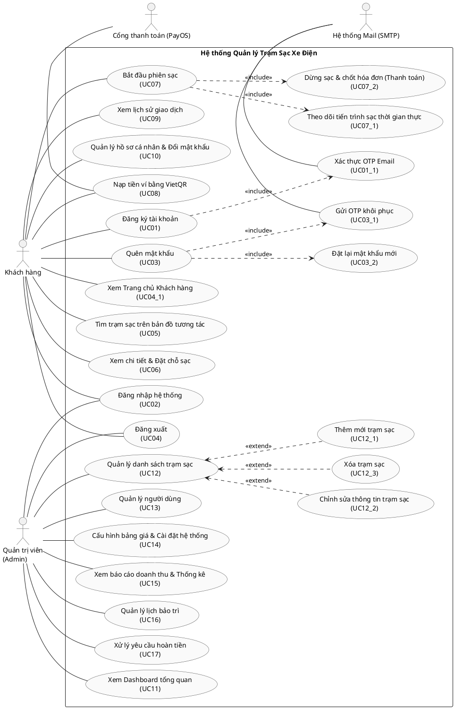

TRƯỜNG ĐẠI HỌC QUY NHƠN
KHOA CÔNG NGHỆ THÔNG TIN
----- -----

BÀI THỰC HÀNH
HỌC PHẦN: PHÂN TÍCH VÀ THIẾT KẾ
HỆ THỐNG THÔNG TIN

GIẢNG VIÊN HƯỚNG DẪN: NGUYỄN THỊ TUYẾT

BÁO CÁO BÀI TẬP NHÓM HỆ THỐNG
<QUẢN LÝ TRẠM SẠC XE ĐIỆN Ở MỘT THÀNH PHỐ>

THÀNH VIÊN NHÓM 8
4651050029 - Phạm Bình Chương
4651050177 - Nguyễn Nhất Nguyên
4651050096 - Nguyễn Khắc Huy
4651050094 - Huỳnh Nhật Huy
4651050066 - Đặng Nhật Hào

Năm 2025

---

# BÀI 3: PHÂN TÍCH CHỨC NĂNG

## I. TÌM TÁC NHÂN (ACTORS)

Tác nhân là các thực thể bên ngoài tương tác với hệ thống. Trong Hệ thống Quản lý Trạm Sạc Xe Điện, các tác nhân bao gồm:

- **Khách hàng (Customer):** Chủ phương tiện xe điện sử dụng thiết bị di động (Mobile UI) để đăng ký/đăng nhập, tìm trạm sạc trên bản đồ, đặt chỗ trước, khởi động/theo dõi phiên sạc, thực hiện thanh toán tự động và nạp tiền vào ví điện tử.
- **Quản trị viên (Admin):** Người vận hành hệ thống sử dụng trình duyệt máy tính (Desktop Dashboard) để quản lý trạm sạc, cấu hình bảng giá điện, kiểm soát tài khoản người dùng, lập lịch bảo trì, xử lý hoàn tiền sự cố và xem báo cáo thống kê doanh thu.
- **Cổng thanh toán (PayOS):** Hệ thống thanh toán bên thứ ba, tự động sinh mã QR động VietQR và gửi Webhook (HTTP POST) để xác nhận giao dịch nạp tiền thành công của khách hàng.
- **Hệ thống gửi email (SMTP Server):** Hệ thống máy chủ gửi email tự động được gọi bởi ứng dụng để gửi mã OTP xác thực khi đăng ký tài khoản hoặc khôi phục mật khẩu.

---

## II. TÌM USE CASE (CHỨC NĂNG)

Dựa trên các yêu cầu nghiệp vụ và giao diện màn hình thực tế của hệ thống, các Use Case được chia thành 2 phân hệ chính (Server & Client) với các chức năng chi tiết như sau:

### 1. Về phía Server (Trung tâm điều phối & Quản lý vận hành của Admin)

➢ **Chức năng Đăng nhập & Xác thực hệ thống:**
+ Xác thực tài khoản quản trị viên (đăng nhập bằng email/mật khẩu quản trị, phân quyền truy cập trang Admin).
+ Bảo mật phiên làm việc (mã hóa mật khẩu bằng Bcrypt, tự động hết hạn session sau khoảng thời gian không hoạt động).

➢ **Chức năng Quản lý trạm sạc xe điện:**
+ Theo dõi danh sách và trạng thái hoạt động của các trạm sạc trong thành phố (Đang hoạt động, Bảo trì, Ngừng hoạt động).
+ Thêm trạm sạc mới (nhập tên, địa chỉ, định vị tọa độ kinh độ/vĩ độ GPS, đơn giá điện sạc, cấu hình danh sách trụ sạc với loại súng sạc và công suất sạc).
+ Chỉnh sửa thông tin trạm sạc (cập nhật đơn giá điện, thay đổi trạng thái hoạt động).
+ Xóa trạm sạc khỏi hệ thống (chỉ cho phép xóa khi không có xe nào đang sạc tại trạm đó).

➢ **Chức năng Quản lý người dùng (Khách hàng):**
+ Tra cứu danh sách tài khoản khách hàng (Họ tên, email, số điện thoại, số dư ví, ngày tạo tài khoản).
+ Khóa/Mở khóa tài khoản khách hàng (chuyển trạng thái `isActive = false` để chặn đăng nhập đối với tài khoản vi phạm hoặc theo yêu cầu).

➢ **Chức năng Cấu hình hệ thống & Thiết lập bảng giá điện:**
+ Cấu hình biểu giá sạc điện (đơn giá tiêu chuẩn theo kWh, cài đặt khung giờ cao điểm/thấp điểm).
+ Thiết lập các tham số hệ thống chung (như số dư tối thiểu trong ví để bắt đầu sạc, thời gian giữ chỗ tối đa).

➢ **Chức năng Thống kê doanh thu & Báo cáo:**
+ Tổng hợp các chỉ số KPI vận hành thời gian thực (tổng doanh thu, tổng số trạm sạc, số cổng sạc đang hoạt động, tổng số khách hàng).
+ Vẽ biểu đồ trực quan hóa xu hướng doanh thu theo thời gian (ngày, tuần, tháng, năm) bằng Chart.js.
+ Lọc và xuất dữ liệu hóa đơn giao dịch chi tiết theo khoảng thời gian tùy chọn.

➢ **Chức năng Quản lý bảo trì thiết bị:**
+ Lập phiếu yêu cầu bảo trì khi có trạm/trụ sạc gặp sự cố (ghi nhận lỗi, phân công nhân viên kỹ thuật phụ trách).
+ Tự động đồng bộ trạng thái thiết bị sang "Bảo trì" (chặn khách hàng đặt chỗ hoặc sạc tại trụ lỗi).
+ Cập nhật tiến độ bảo trì và tự động kích hoạt lại trụ sạc sang trạng thái sẵn sàng khi hoàn thành sửa chữa.

➢ **Chức năng Xử lý yêu cầu hoàn tiền (Refunds):**
+ Tiếp nhận và tra cứu thông tin phiên sạc bị lỗi kỹ thuật (mất điện, lỗi trụ sạc) qua mã giao dịch.
+ Bồi hoàn tiền tự động cộng số dư vào ví điện tử của khách hàng.
+ Ghi nhận lịch sử hoàn tiền và cập nhật trạng thái thanh toán của phiên sạc thành "refunded".

---

### 2. Các chức năng chính về phía Client (Trạm sạc vật lý & Ứng dụng người dùng)

#### A. Trạm sạc & Trụ sạc vật lý (Client - Hệ thống sạc tự động)

➢ **Chức năng nhận tín hiệu & cấp điện:**
+ Phát hiện kết nối vật lý khi súng sạc cắm vào cổng nhận của xe điện và kiểm tra sự tương thích.
+ Nhận lệnh kích hoạt sạc từ server và thực hiện cấp nguồn điện sạc an toàn cho xe.
+ Tự động ngắt nguồn cấp điện khi pin xe đầy 100% hoặc khi nhận lệnh dừng sạc chủ động từ server.

➢ **Chức năng truyền thông số thời gian thực:**
+ Đo đạc liên tục các thông số kỹ thuật (điện năng tiêu thụ kWh, công suất sạc kW, phần trăm pin xe).
+ Đồng bộ dữ liệu sạc thời gian thực về máy chủ sau mỗi 2 giây để cập nhật cho người dùng.
+ Gửi tín hiệu cảnh báo khẩn cấp về máy chủ khi phát hiện quá dòng, quá nhiệt hoặc mất kết nối đột ngột.

#### B. Ứng dụng di động (Client - Khách hàng sử dụng dịch vụ)

➢ **Chức năng Đăng ký tài khoản & Xác thực:**
+ Khách hàng đăng ký tài khoản mới bằng cách cung cấp thông tin Họ tên, Email, Số điện thoại và Mật khẩu.
+ Xác thực tài khoản bằng mã OTP 6 số được gửi tự động qua Email thông qua hệ thống Mail SMTP để kích hoạt.

➢ **Chức năng Đăng nhập & Bảo mật tài khoản:**
+ Đăng nhập vào ứng dụng di động bằng tài khoản đã được kích hoạt.
+ Khôi phục quyền truy cập qua chức năng Quên mật khẩu (nhận OTP khôi phục và đặt lại mật khẩu mới).
+ Đăng xuất tài khoản để bảo vệ thông tin cá nhân.
+ Xem màn hình Trang chủ di động hiển thị số dư ví, các nút hành động nhanh và cảnh báo ví yếu (< 200k).

➢ **Chức năng Tìm kiếm trạm sạc & Bản đồ tương tác:**
+ Định vị vị trí hiện tại của khách hàng qua GPS trên bản đồ Leaflet.js.
+ Tìm kiếm trạm sạc xung quanh theo tên trạm hoặc địa chỉ.
+ Hiển thị trực quan vị trí và trạng thái trạm sạc bằng các marker màu sắc khác nhau (Xanh: Hoạt động, Vàng: Bảo trì).

➢ **Chức năng Xem chi tiết trạm sạc & Đặt chỗ súng sạc trước:**
+ Xem thông tin chi tiết trạm sạc (địa chỉ, đơn giá, giờ mở/đóng cửa, đánh giá sao, mô tả).
+ Hiển thị danh sách các cổng sạc kèm công suất và trạng thái thực tế (Còn trống, Đang sạc, Bảo trì).
+ Đặt giữ chỗ súng sạc trước khi di chuyển đến trạm để đảm bảo có chỗ sạc, hỗ trợ hủy đặt chỗ khi thay đổi kế hoạch.

➢ **Chức năng Khởi động & Theo dõi phiên sạc xe:**
+ Gửi yêu cầu bắt đầu phiên sạc từ điện thoại sau khi đã cắm súng sạc vào xe (kiểm tra số dư ví tối thiểu 200.000đ).
+ Theo dõi tiến trình sạc thời gian thực trên màn hình di động (hiển thị vòng tròn đo năng lượng pin dạng conic-gradient, phần trăm pin cập nhật liên tục, lượng điện kWh đã sạc và số tiền tạm tính nhảy số mỗi 2 giây).
+ Gửi lệnh dừng sạc chủ động bất kỳ lúc nào để kết thúc phiên sạc sớm.

➢ **Chức năng Thanh toán điện tử & Nạp tiền ví:**
+ Xem số dư ví và lịch sử biến động số dư.
+ Nạp tiền vào ví bằng cách quét mã VietQR động được tạo tự động qua cổng PayOS, tiền được cộng tự động thông qua Webhook.
+ Tự động trừ tiền trong ví điện tử và hiển thị hóa đơn thanh toán điện tử chi tiết ngay khi kết thúc phiên sạc.

➢ **Chức năng Quản lý hồ sơ cá nhân & Đổi mật khẩu:**
+ Cập nhật thông tin cá nhân (Họ tên, Số điện thoại).
+ Thay đổi mật khẩu tài khoản trực tiếp trong ứng dụng (yêu cầu nhập mật khẩu hiện tại để xác minh).

---

## III. ĐẶC TẢ KỊCH BẢN CÁC USE CASE

Dưới đây là kịch bản đặc tả chi tiết cho tất cả 26 Use Case của hệ thống, sử dụng biểu mẫu bảng hai cột xen kẽ (Hoạt động của tác nhân và Hoạt động của hệ thống không nằm cùng một dòng) để thể hiện rõ ràng trình tự tương tác.

---

### PHÂN HỆ XÁC THỰC & TÀI KHOẢN

#### UC01: Đăng ký tài khoản
- **Mã số UC:** UC01
- **Mô tả tóm tắt:** Cho phép khách hàng mới tạo tài khoản để sử dụng dịch vụ sạc xe điện.
- **Tác nhân:** Khách hàng
- **Tiền điều kiện:** Khách hàng chưa đăng nhập và đang ở màn hình Đăng ký.
- **Hậu điều kiện:** Tài khoản mới được khởi tạo ở trạng thái chưa kích hoạt (isActive = false), mã OTP được gửi về Email.

##### Luồng sự kiện chính:
| Hoạt động của tác nhân | Hoạt động của hệ thống |
| :--- | :--- |
| 1. Khách hàng mở giao diện Đăng ký tài khoản. | |
| | 2. Hệ thống hiển thị Form đăng ký gồm các trường: Họ tên, Email, Số điện thoại, Mật khẩu, Xác nhận mật khẩu. |
| 3. Khách hàng nhập đầy đủ thông tin cá nhân và nhấn nút "Đăng ký". | |
| | 4. Hệ thống kiểm tra tính hợp lệ của dữ liệu đầu vào. |
| | 5. Hệ thống kiểm tra email xem đã tồn tại trong cơ sở dữ liệu hay chưa. |
| | 6. Hệ thống tạo tài khoản mới ở trạng thái chờ kích hoạt (isActive = false). |
| | 7. Hệ thống tự động gọi Mail Service (SMTP) gửi mã OTP 6 số về Email của khách hàng và chuyển hướng sang màn hình Xác thực OTP. |

##### Luồng sự kiện rẽ nhánh:
- **(4) Nếu dữ liệu không hợp lệ:** Hệ thống báo lỗi tương ứng trên giao diện (ví dụ: "Mật khẩu nhập lại không khớp", "Email không đúng định dạng").
- **(5) Nếu email đã tồn tại:** Hệ thống báo lỗi "Email này đã được đăng ký trên hệ thống".

---

#### UC01_1: Xác thực OTP Email
- **Mã số UC:** UC01_1
- **Mô tả tóm tắt:** Xác thực tài khoản khách hàng thông qua mã OTP gửi về Email.
- **Tác nhân:** Khách hàng, SMTP Server
- **Tiền điều kiện:** Khách hàng vừa đăng ký tài khoản (UC01) hoặc có yêu cầu kích hoạt lại tài khoản.
- **Hậu điều kiện:** Tài khoản được kích hoạt (isActive = true), tự động đăng nhập vào Trang chủ.

##### Luồng sự kiện chính:
| Hoạt động của tác nhân | Hoạt động của hệ thống |
| :--- | :--- |
| 1. Khách hàng nhận mã OTP từ Email cá nhân. | |
| 2. Khách hàng nhập mã OTP 6 chữ số vào Form xác thực và bấm "Xác nhận". | |
| | 3. Hệ thống đối chiếu mã OTP nhập vào với mã OTP đã lưu trong CSDL và kiểm tra thời hạn (5 phút). |
| | 4. Hệ thống cập nhật trạng thái tài khoản thành kích hoạt (isActive = true). |
| | 5. Hệ thống tạo phiên làm việc (Session) đăng nhập và chuyển hướng người dùng sang Trang chủ Khách hàng kèm thông báo thành công. |

##### Luồng sự kiện rẽ nhánh:
- **(3) Nếu mã OTP không chính xác hoặc hết hạn:** Hệ thống báo lỗi "Mã OTP không hợp lệ hoặc đã hết hạn".
- **Khách hàng bấm "Gửi lại mã":** Hệ thống sinh mã OTP mới và gửi lại qua Email.

---

#### UC02: Đăng nhập hệ thống
- **Mã số UC:** UC02
- **Mô tả tóm tắt:** Xác thực thông tin đăng nhập của Khách hàng hoặc Quản trị viên để truy cập hệ thống.
- **Tác nhân:** Khách hàng hoặc Quản trị viên (Admin)
- **Tiền điều kiện:** Đã có tài khoản được đăng ký trên hệ thống.
- **Hậu điều kiện:** Đăng nhập thành công, thiết lập phiên làm việc (Session) và chuyển hướng tới giao diện tương ứng.

##### Luồng sự kiện chính:
| Hoạt động của tác nhân | Hoạt động của hệ thống |
| :--- | :--- |
| 1. Tác nhân mở màn hình Đăng nhập, nhập Email và Mật khẩu, rồi bấm "Đăng nhập". | |
| | 2. Hệ thống tìm kiếm email trong cơ sở dữ liệu. |
| | 3. Hệ thống so sánh mật khẩu nhập vào (đã mã hóa) với mật khẩu hash trong CSDL bằng Bcrypt. |
| | 4. Hệ thống kiểm tra trạng thái kích hoạt của tài khoản (isActive == true). |
| | 5. Hệ thống thiết lập Session lưu thông tin người dùng. |
| | 6. Hệ thống phân quyền: Nếu role là "customer", chuyển hướng đến Trang chủ Khách hàng. Nếu role là "admin", chuyển hướng đến Dashboard Quản trị. |

##### Luồng sự kiện rẽ nhánh:
- **(2) (3) Nếu email không tồn tại hoặc sai mật khẩu:** Hệ thống hiển thị thông báo lỗi "Email hoặc mật khẩu không đúng".
- **(4) Nếu tài khoản chưa kích hoạt (isActive = false):** Hệ thống tự động chuyển hướng đến màn hình xác thực OTP để yêu cầu kích hoạt lại.

---

#### UC03: Quên mật khẩu
- **Mã số UC:** UC03
- **Mô tả tóm tắt:** Người dùng yêu cầu khôi phục mật khẩu thông qua Email đăng ký.
- **Tác nhân:** Khách hàng
- **Tiền điều kiện:** Khách hàng quên mật khẩu và đang ở giao diện đăng nhập.
- **Hậu điều kiện:** Sinh mã OTP khôi phục gửi về email, chuyển hướng tới màn hình xác nhận OTP khôi phục.

##### Luồng sự kiện chính:
| Hoạt động của tác nhân | Hoạt động của hệ thống |
| :--- | :--- |
| 1. Khách hàng bấm vào liên kết "Quên mật khẩu" trên giao diện Đăng nhập. | |
| | 2. Hệ thống hiển thị Form yêu cầu nhập Email để khôi phục mật khẩu. |
| 3. Khách hàng nhập Email đã đăng ký tài khoản và bấm "Gửi mã xác nhận". | |
| | 4. Hệ thống kiểm tra Email trong cơ sở dữ liệu. |
| | 5. Hệ thống sinh mã OTP ngẫu nhiên, lưu vào CSDL kèm thời gian hết hạn. |
| | 6. Hệ thống gọi Mail Service gửi mã OTP khôi phục qua email người dùng và tự động chuyển hướng sang màn hình nhập OTP. |

##### Luồng sự kiện rẽ nhánh:
- **(4) Nếu Email không tồn tại trên hệ thống:** Hệ thống báo lỗi "Email không tồn tại trên hệ thống".

---

#### UC03_1: Gửi OTP khôi phục
- **Mã số UC:** UC03_1
- **Mô tả tóm tắt:** Khách hàng nhập mã OTP khôi phục để xác minh quyền sở hữu tài khoản.
- **Tác nhân:** Khách hàng, SMTP Server
- **Tiền điều kiện:** Đã gửi yêu cầu quên mật khẩu thành công.
- **Hậu điều kiện:** Xác thực OTP thành công, chuyển hướng người dùng sang trang đặt lại mật khẩu mới.

##### Luồng sự kiện chính:
| Hoạt động của tác nhân | Hoạt động của hệ thống |
| :--- | :--- |
| 1. Khách hàng nhận OTP từ Email và nhập vào Form xác thực OTP khôi phục, bấm "Xác nhận". | |
| | 2. Hệ thống kiểm tra mã OTP trùng khớp và còn hạn sử dụng. |
| | 3. Hệ thống xác nhận mã OTP hợp lệ, lưu trạng thái xác thực tạm thời vào Session và chuyển hướng đến trang Đặt lại mật khẩu. |

##### Luồng sự kiện rẽ nhánh:
- **(2) Nếu OTP không trùng khớp hoặc quá hạn:** Hệ thống hiển thị thông báo lỗi "Mã OTP không hợp lệ hoặc đã hết hạn".

---

#### UC03_2: Đặt lại mật khẩu mới
- **Mã số UC:** UC03_2
- **Mô tả tóm tắt:** Khách hàng nhập mật khẩu mới sau khi xác thực OTP khôi phục thành công.
- **Tác nhân:** Khách hàng
- **Tiền điều kiện:** Đã qua bước xác thực OTP khôi phục thành công (UC03_1).
- **Hậu điều kiện:** Cập nhật mật khẩu mới vào cơ sở dữ liệu và yêu cầu đăng nhập lại.

##### Luồng sự kiện chính:
| Hoạt động của tác nhân | Hoạt động của hệ thống |
| :--- | :--- |
| 1. Khách hàng nhập Mật khẩu mới và Nhập lại mật khẩu mới vào Form, sau đó bấm "Đặt lại mật khẩu". | |
| | 2. Hệ thống kiểm tra tính hợp lệ (hai mật khẩu phải trùng khớp, có độ dài tối thiểu 6 ký tự). |
| | 3. Hệ thống thực hiện mã hóa (hash) mật khẩu mới bằng Bcrypt và cập nhật vào CSDL. |
| | 4. Hệ thống xóa các thông tin OTP cũ, thông báo "Đặt lại mật khẩu thành công" và tự động chuyển hướng người dùng về giao diện Đăng nhập. |

##### Luồng sự kiện rẽ nhánh:
- **(2) Nếu mật khẩu không khớp hoặc quá yếu:** Hệ thống báo lỗi tương ứng để người dùng nhập lại.

---

#### UC04: Đăng xuất
- **Mã số UC:** UC04
- **Mô tả tóm tắt:** Đăng xuất khỏi hệ thống để bảo vệ tài khoản.
- **Tác nhân:** Khách hàng hoặc Quản trị viên
- **Tiền điều kiện:** Đã đăng nhập vào hệ thống.
- **Hậu điều kiện:** Hủy Session hiện tại, chuyển hướng về giao diện đăng nhập.

##### Luồng sự kiện chính:
| Hoạt động của tác nhân | Hoạt động của hệ thống |
| :--- | :--- |
| 1. Tác nhân bấm vào nút "Đăng xuất" trên menu điều hướng. | |
| | 2. Hệ thống xóa bỏ Session lưu trữ thông tin đăng nhập trên máy chủ. |
| | 3. Hệ thống hiển thị thông báo "Đăng xuất thành công" và chuyển hướng người dùng về trang Đăng nhập. |

---

### PHÂN HỆ KHÁCH HÀNG (MOBILE UI)

#### UC04_1: Xem Trang chủ Khách hàng
- **Mã số UC:** UC04_1
- **Mô tả tóm tắt:** Màn hình chính của ứng dụng di động hiển thị thông tin số dư ví, các nút chức năng nhanh và danh sách trạm sạc gần đây.
- **Tác nhân:** Khách hàng
- **Tiền điều kiện:** Đăng nhập thành công với vai trò "customer".
- **Hậu điều kiện:** Hiển thị giao diện EJS Trang chủ Khách hàng với dữ liệu chính xác theo thời gian thực.

##### Luồng sự kiện chính:
| Hoạt động của tác nhân | Hoạt động của hệ thống |
| :--- | :--- |
| 1. Khách hàng truy cập Trang chủ di động. | |
| | 2. Hệ thống truy vấn thông tin số dư ví hiện tại của khách hàng từ CSDL. |
| | 3. Hệ thống kiểm tra: Nếu số dư < 200.000đ, hiển thị cảnh báo "Số dư không đủ sạc (<200k)". Ngược lại hiển thị trạng thái "Sẵn sàng sạc". |
| | 4. Hệ thống truy vấn danh sách 5 trạm sạc đang hoạt động và tính toán số cổng sạc còn trống của mỗi trạm. |
| | 5. Hệ thống hiển thị giao diện Trang chủ hoàn chỉnh bao gồm: Thẻ số dư ví, 4 nút chức năng nhanh (Tìm trạm, Quét QR, Sạc ngay, Lịch sử), danh sách trạm sạc gần đây và banner khuyến mãi nạp ví. |

---

#### UC05: Tìm trạm sạc trên bản đồ tương tác
- **Mã số UC:** UC05
- **Mô tả tóm tắt:** Khách hàng tìm kiếm trạm sạc xung quanh vị trí của mình thông qua bản đồ số trực quan.
- **Tác nhân:** Khách hàng
- **Tiền điều kiện:** Đã đăng nhập hệ thống, thiết bị mở chức năng vị trí (GPS).
- **Hậu điều kiện:** Bản đồ hiển thị các trạm sạc và danh sách kết quả lọc chính xác.

##### Luồng sự kiện chính:
| Hoạt động của tác nhân | Hoạt động của hệ thống |
| :--- | :--- |
| 1. Khách hàng nhấn nút "Tìm trạm" trên thanh điều hướng dưới đáy. | |
| | 2. Hệ thống tải bản đồ tương tác Leaflet.js và xin quyền truy cập GPS của thiết bị. |
| | 3. Hệ thống lấy tọa độ GPS hiện tại của khách hàng (hoặc mặc định tọa độ Quy Nhơn nếu không có quyền GPS) và truy vấn CSDL lấy danh sách các trạm sạc trong bán kính xung quanh. |
| | 4. Hệ thống hiển thị các điểm đánh dấu (Marker) của các trạm sạc lên bản đồ Leaflet. |
| 5. Khách hàng nhập từ khóa tên trạm hoặc địa chỉ vào thanh tìm kiếm. | |
| | 6. Hệ thống thực hiện lọc danh sách các trạm sạc theo từ khóa và vẽ lại các marker trên bản đồ tương ứng. |
| 7. Khách hàng bấm chọn một trạm sạc trên bản đồ hoặc trong danh sách kết quả. | |
| | 8. Hệ thống hiển thị popup thông tin tóm tắt của trạm sạc gồm: Tên trạm, địa chỉ, đơn giá điện sạc, số cổng sạc còn trống và nút "Xem chi tiết". |
| 9. Khách hàng bấm vào nút "Xem chi tiết". | |
| | 10. Hệ thống chuyển hướng khách hàng sang màn hình Chi tiết trạm sạc. |

---

#### UC06: Xem chi tiết & Đặt chỗ sạc
- **Mã số UC:** UC06
- **Mô tả tóm tắt:** Khách hàng xem thông tin chi tiết các trụ sạc tại trạm và đặt giữ chỗ trước một trụ sạc để tránh bị người khác sử dụng.
- **Tác nhân:** Khách hàng
- **Tiền điều kiện:** Khách hàng đang ở màn hình Chi tiết trạm sạc.
- **Hậu điều kiện:** Tạo đơn đặt chỗ ở trạng thái xác nhận (status = 'confirmed'), trụ sạc được giữ chỗ.

##### Luồng sự kiện chính:
| Hoạt động của tác nhân | Hoạt động của hệ thống |
| :--- | :--- |
| 1. Khách hàng mở trang chi tiết một trạm sạc cụ thể. | |
| | 2. Hệ thống hiển thị thông tin trạm sạc: tên trạm, địa chỉ, đơn giá điện (đ/kWh), giờ hoạt động, đánh giá chất lượng và danh sách các connector sạc (Trụ sạc) kèm trạng thái: Còn trống (Available), Đang sạc (In use), Bảo trì (Maintenance). |
| 3. Khách hàng bấm chọn nút "Đặt chỗ" tại một trụ sạc đang còn trống. | |
| | 4. Hệ thống hiển thị giao diện tùy chọn nhập thời gian dự kiến đến trạm sạc. |
| 5. Khách hàng chọn thời gian dự kiến và nhấn nút "Xác nhận đặt chỗ". | |
| | 6. Hệ thống kiểm tra số dư ví điện tử của khách hàng (phải tối thiểu 200.000đ). |
| | 7. Hệ thống tạo bản ghi Đặt chỗ (Reservation) trong cơ sở dữ liệu. |
| | 8. Hệ thống chuyển trạng thái trụ sạc đã đặt sang "reserved" (được giữ chỗ) và hiển thị thông báo đặt chỗ thành công. |

##### Luồng sự kiện rẽ nhánh:
- **(6) Nếu số dư ví < 200.000đ:** Hệ thống thông báo lỗi "Số dư ví không đủ để đặt chỗ, vui lòng nạp tối thiểu 200.000đ" và chuyển hướng đến trang ví.

---

#### UC07: Bắt đầu phiên sạc
- **Mã số UC:** UC07
- **Mô tả tóm tắt:** Khách hàng thực hiện cắm súng sạc vào xe và bấm kích hoạt phiên sạc điện tử trên ứng dụng di động.
- **Tác nhân:** Khách hàng
- **Tiền điều kiện:** Đang đứng cạnh trụ sạc trống, súng sạc đã cắm vào xe và số dư ví điện tử >= 200.000đ.
- **Hậu điều kiện:** Rơ-le điện của trụ sạc được kích hoạt cấp nguồn sạc, tạo bản ghi ChargingSession ở trạng thái "charging".

##### Luồng sự kiện chính:
| Hoạt động của tác nhân | Hoạt động của hệ thống |
| :--- | :--- |
| 1. Khách hàng kết nối đầu súng sạc của trạm vào cổng nhận sạc trên xe điện. | |
| 2. Khách hàng bấm nút "Sạc" tại trụ tương ứng trên màn hình chi tiết trạm sạc. | |
| | 3. Hệ thống kiểm tra số dư ví điện tử của khách hàng. |
| | 4. Hệ thống kiểm tra trạng thái cổng sạc có phải là "available" hay không. |
| | 5. Hệ thống khởi tạo bản ghi phiên sạc (ChargingSession) với các dữ liệu: ID người dùng, ID trạm, chỉ số trụ sạc, thời gian bắt đầu (startTime), đơn giá điện, số kWh sạc ban đầu = 0, tiền tạm tính = 0 và trạng thái phiên là "charging". |
| | 6. Hệ thống cập nhật trạng thái trụ sạc sạc thành "in_use" trong CSDL. |
| | 7. Hệ thống truyền lệnh kích hoạt cấp điện sạc vật lý tại trụ sạc và chuyển hướng khách hàng đến giao diện Theo dõi phiên sạc thời gian thực. |

##### Luồng sự kiện rẽ nhánh:
- **(3) Nếu số dư ví < 200.000đ:** Hệ thống từ chối sạc và thông báo: "Số dư ví không đủ, vui lòng nạp tối thiểu 200.000đ để bắt đầu sạc".
- **(4) Nếu cổng sạc đã bị khóa hoặc bận:** Hệ thống thông báo lỗi: "Cổng sạc hiện không khả dụng, vui lòng chọn cổng sạc khác".

---

#### UC07_1: Theo dõi tiến trình sạc thời gian thực
- **Mã số UC:** UC07_1
- **Mô tả tóm tắt:** Hệ thống cập nhật động các thông số của phiên sạc hiện tại lên màn hình theo dõi cho khách hàng nắm bắt thông tin.
- **Tác nhân:** Khách hàng
- **Tiền điều kiện:** Phiên sạc vừa được kích hoạt thành công (UC07).
- **Hậu điều kiện:** Dữ liệu sạc (phần trăm pin, số kWh, tiền tạm tính) hiển thị mượt mà trên giao diện mỗi 2 giây.

##### Luồng sự kiện chính:
| Hoạt động của tác nhân | Hoạt động của hệ thống |
| :--- | :--- |
| 1. Khách hàng xem màn hình Theo dõi tiến trình sạc. | |
| | 2. Hệ thống thiết lập Polling tự động gửi request lên server mỗi 2 giây. |
| | 3. Server tính toán lượng điện năng sạc được theo công suất trụ, tăng dần sản lượng điện tiêu thụ (energyDelivered) và cập nhật phần trăm pin tương ứng. |
| | 4. Server tính toán tiền tạm tính = energyDelivered * đơn giá điện của trạm sạc. |
| | 5. Server lưu tạm dữ liệu vào bản ghi phiên sạc trong CSDL và phản hồi kết quả về client. |
| | 6. Giao diện ứng dụng cập nhật vòng tròn phần trăm pin và số tiền tạm tính nhảy số liên tục. |
| | 7. Hệ thống tự động kích hoạt chức năng dừng sạc khi xe đạt 100% pin hoặc đạt mức mục tiêu điện năng thiết lập trước. |

---

#### UC07_2: Dừng sạc & chốt hóa đơn (Thanh toán)
- **Mã số UC:** UC07_2
- **Mô tả tóm tắt:** Khách hàng ngừng sạc xe, hệ thống chốt số điện năng tiêu thụ, tự động trừ tiền trong ví và giải phóng trụ sạc.
- **Tác nhân:** Khách hàng
- **Tiền điều kiện:** Phiên sạc đang chạy ở trạng thái "charging".
- **Hậu điều kiện:** Phiên sạc kết thúc (status = 'completed'), số dư ví điện tử bị trừ, trụ sạc trở về trạng thái "available".

##### Luồng sự kiện chính:
| Hoạt động của tác nhân | Hoạt động của hệ thống |
| :--- | :--- |
| 1. Khách hàng nhấn nút "Dừng sạc" trên màn hình theo dõi sạc (hoặc hệ thống tự ngắt sạc). | |
| | 2. Hệ thống lập tức ngắt rơ-le điện tại trụ sạc vật lý. |
| | 3. Hệ thống ghi nhận thời gian dừng sạc (endTime) và chốt tổng lượng điện tiêu thụ cuối cùng (energyDelivered). |
| | 4. Hệ thống tính tổng chi phí = energyDelivered * đơn giá trạm sạc. |
| | 5. Hệ thống trừ tiền trực tiếp vào tài khoản ví điện tử của khách hàng. |
| | 6. Hệ thống đổi trạng thái phiên sạc thành "completed" và ghi nhận trạng thái thanh toán là "paid". |
| | 7. Hệ thống giải phóng cổng sạc của trạm về trạng thái trống ("available"). |
| | 8. Hệ thống hiển thị màn hình hóa đơn chi tiết phiên sạc cho khách hàng xem và xác nhận. |

---

#### UC08: Nạp tiền ví bằng VietQR
- **Mã số UC:** UC08
- **Mô tả tóm tắt:** Khách hàng nạp tiền vào ví điện tử thông qua quét mã QR động chuẩn VietQR được kết nối với cổng thanh toán PayOS.
- **Tác nhân:** Khách hàng, Cổng thanh toán (PayOS)
- **Tiền điều kiện:** Đã đăng nhập, đang ở giao diện Ví cá nhân.
- **Hậu điều kiện:** Giao dịch nạp tiền thành công, số dư ví được cộng tự động theo thời gian thực.

##### Luồng sự kiện chính:
| Hoạt động của tác nhân | Hoạt động của hệ thống |
| :--- | :--- |
| 1. Khách hàng vào màn hình Ví điện tử, chọn hoặc nhập số tiền muốn nạp và bấm "Nạp tiền". | |
| | 2. Hệ thống tạo mã giao dịch duy nhất (orderCode) và tạo bản ghi Payment ở trạng thái "pending". |
| | 3. Hệ thống gọi API cổng thanh toán PayOS để tạo link thanh toán và mã QR VietQR động chứa đúng số tiền cùng nội dung chuyển khoản bảo mật. |
| | 4. Hệ thống hiển thị mã QR VietQR động lên màn hình điện thoại của khách hàng. |
| 5. Khách hàng mở ứng dụng ngân hàng trên thiết bị cá nhân, thực hiện quét mã QR và xác nhận chuyển tiền. | |
| | 6. Hệ thống PayOS ghi nhận giao dịch chuyển tiền thành công, lập tức gửi Webhook (HTTP POST) kèm chữ ký HMAC về máy chủ của hệ thống. |
| | 7. Máy chủ tiếp nhận Webhook, xác thực tính hợp lệ chữ ký bảo mật từ PayOS. |
| | 8. Máy chủ cập nhật trạng thái đơn Payment thành "completed" and tự động cộng số dư vào ví điện tử của khách hàng. |
| | 9. Ứng dụng di động của khách hàng (thông qua cơ chế tự động check trạng thái đơn) phát hiện giao dịch thành công, hiển thị thông báo "Nạp tiền thành công" và cập nhật lại số dư ví mới. |

##### Luồng sự kiện rẽ nhánh:
- **Quá thời hạn thanh toán (2 phút) mà chưa chuyển khoản:** Hệ thống tự động hủy liên kết nạp tiền và cập nhật trạng thái Payment thành "failed".

---

#### UC09: Xem lịch sử giao dịch
- **Mã số UC:** UC09
- **Mô tả tóm tắt:** Khách hàng tra cứu lại danh sách các phiên sạc và các giao dịch nạp tiền ví điện tử trước đây.
- **Tác nhân:** Khách hàng
- **Tiền điều kiện:** Đã đăng nhập vào hệ thống.
- **Hậu điều kiện:** Danh sách lịch sử giao dịch hiển thị trực quan và sắp xếp theo thời gian mới nhất.

##### Luồng sự kiện chính:
| Hoạt động của tác nhân | Hoạt động của hệ thống |
| :--- | :--- |
| 1. Khách hàng bấm chọn mục "Lịch sử" trên thanh điều hướng di động. | |
| | 2. Hệ thống truy vấn CSDL để tìm kiếm tất cả các phiên sạc (ChargingSession) và các giao dịch nạp tiền (Payment) liên quan đến tài khoản của khách hàng. |
| | 3. Hệ thống sắp xếp danh sách kết quả theo thời gian giảm dần (mới nhất lên đầu). |
| | 4. Hệ thống render giao diện hiển thị danh sách gồm: tên trạm, ngày giờ, số kWh sạc, số tiền, và trạng thái giao dịch. |
| 5. Khách hàng bấm chọn một phiên sạc cụ thể để xem chi tiết hóa đơn. | |
| | 6. Hệ thống hiển thị hóa đơn chi tiết phiên sạc: mã phiên sạc, thời gian bắt đầu/kết thúc, lượng điện năng tiêu thụ, đơn giá, tổng tiền, phương thức thanh toán. |

---

#### UC10: Quản lý hồ sơ cá nhân & Đổi mật khẩu
- **Mã số UC:** UC10
- **Mô tả tóm tắt:** Cho phép khách hàng cập nhật thông tin cá nhân hoặc thay đổi mật khẩu tài khoản.
- **Tác nhân:** Khách hàng
- **Tiền điều kiện:** Đã đăng nhập vào hệ thống.
- **Hậu điều kiện:** Thông tin tài khoản được cập nhật và lưu trữ an toàn trong CSDL.

##### Luồng sự kiện chính:
| Hoạt động của tác nhân | Hoạt động của hệ thống |
| :--- | :--- |
| 1. Khách hàng bấm chọn mục "Tài khoản" trên thanh điều hướng dưới đáy. | |
| | 2. Hệ thống hiển thị thông tin cá nhân hiện tại: Họ tên, Email, Số điện thoại và Form đổi mật khẩu. |
| 3. Khách hàng chỉnh sửa Họ tên, Số điện thoại và nhấn nút "Cập nhật thông tin". | |
| | 4. Hệ thống kiểm tra dữ liệu đầu vào hợp lệ và cập nhật vào CSDL, hiển thị thông báo "Cập nhật hồ sơ thành công". |
| 5. Khách hàng nhập Mật khẩu hiện tại, Mật khẩu mới, Xác nhận mật khẩu mới và bấm "Đổi mật khẩu". | |
| | 6. Hệ thống kiểm tra mật khẩu hiện tại bằng cách đối chiếu mã Bcrypt hash trong cơ sở dữ liệu. |
| | 7. Hệ thống mã hóa mật khẩu mới và cập nhật vào CSDL, thông báo "Thay đổi mật khẩu thành công". |

##### Luồng sự kiện rẽ nhánh:
- **(6) Nếu mật khẩu hiện tại không khớp:** Hệ thống báo lỗi "Mật khẩu hiện tại không đúng".
- **(7) Mật khẩu mới nhập lại không khớp:** Hệ thống báo lỗi "Mật khẩu xác nhận không khớp".

---

### PHÂN HỆ QUẢN TRỊ VIÊN (ADMIN DASHBOARD)

#### UC11: Xem Dashboard tổng quan
- **Mã số UC:** UC11
- **Mô tả tóm tắt:** Màn hình chính của giao diện quản trị hiển thị các chỉ số đo lường hiệu quả hoạt động (KPI) và biểu đồ phân tích doanh thu.
- **Tác nhân:** Quản trị viên (Admin)
- **Tiền điều kiện:** Đăng nhập thành công với quyền "admin".
- **Hậu điều kiện:** Hiển thị trang Dashboard trực quan với dữ liệu chính xác theo thời gian thực.

##### Luồng sự kiện chính:
| Hoạt động của tác nhân | Hoạt động của hệ thống |
| :--- | :--- |
| 1. Admin truy cập trang chủ quản lý /admin/dashboard. | |
| | 2. Hệ thống thực hiện các phép truy vấn tính toán: Tổng doanh thu từ trước đến nay, Tổng số trạm sạc đang quản lý, Tổng số khách hàng hoạt động và Số cổng sạc hiện đang sạc (In use). |
| | 3. Hệ thống tổng hợp dữ liệu doanh thu của 7 ngày gần nhất để làm nguồn dữ liệu cho biểu đồ. |
| | 4. Hệ thống tải lên danh sách các giao dịch sạc xe mới nhất và các cảnh báo bảo trì trạm sạc. |
| | 5. Hệ thống hiển thị giao diện Dashboard hoàn chỉnh với các thẻ số liệu KPI và biểu đồ cột/đường trực quan hóa doanh thu. |

---

#### UC12: Quản lý danh sách trạm sạc
- **Mã số UC:** UC12
- **Mô tả tóm tắt:** Quản trị viên xem, tìm kiếm và kiểm soát danh sách toàn bộ các trạm sạc xe điện trong mạng lưới.
- **Tác nhân:** Quản trị viên (Admin)
- **Tiền điều kiện:** Đã đăng nhập tài khoản admin.
- **Hậu điều kiện:** Hiển thị danh sách trạm sạc dạng bảng dữ liệu đầy đủ.

##### Luồng sự kiện chính:
| Hoạt động của tác nhân | Hoạt động của hệ thống |
| :--- | :--- |
| 1. Admin nhấn vào mục "Quản lý trạm sạc" trên thanh Sidebar. | |
| | 2. Hệ thống truy vấn cơ sở dữ liệu lấy danh sách toàn bộ các trạm sạc xe điện hiện có. |
| | 3. Hệ thống hiển thị danh sách trạm sạc dưới dạng bảng bao gồm: tên trạm, địa chỉ, đơn giá điện (đ/kWh), số cổng sạc, trạng thái hoạt động (Hoạt động/Bảo trì/Dừng hoạt động) và các nút hành động nhanh (Thêm, Sửa, Xóa). |
| 4. Admin nhập tên trạm hoặc địa chỉ vào ô tìm kiếm trên đầu bảng. | |
| | 5. Hệ thống thực hiện bộ lọc dữ liệu nhanh bằng Regex và cập nhật lại bảng danh sách trạm sạc tương ứng. |

---

#### UC12_1: Thêm mới trạm sạc
- **Mã số UC:** UC12_1
- **Mô tả tóm tắt:** Quản trị viên thêm trạm sạc mới vào hệ thống bằng cách nhập thông tin tọa độ và số lượng trụ sạc.
- **Tác nhân:** Quản trị viên (Admin)
- **Tiền điều kiện:** Đang ở giao diện Quản lý danh sách trạm sạc (UC12).
- **Hậu điều kiện:** Lưu trạm sạc mới vào cơ sở dữ liệu thành công.

##### Luồng sự kiện chính:
| Hoạt động của tác nhân | Hoạt động của hệ thống |
| :--- | :--- |
| 1. Admin bấm vào nút "Thêm trạm sạc mới" trên giao diện quản lý trạm sạc. | |
| | 2. Hệ thống hiển thị Form nhập thông tin trạm sạc gồm các trường: Tên trạm, Địa chỉ, Kinh độ, Vĩ độ, Đơn giá điện (đ/kWh), Mô tả và khu vực Cấu hình danh sách trụ sạc (loại cổng sạc, công suất). |
| 3. Admin nhập các thông tin chi tiết của trạm sạc, cấu hình các trụ sạc đi kèm và bấm nút "Lưu trạm sạc". | |
| | 4. Hệ thống kiểm tra dữ liệu nhập vào: không bỏ trống các trường bắt buộc, giá trị tọa độ GPS (kinh độ, vĩ độ) phải đúng định dạng số thực. |
| | 5. Hệ thống thực hiện thêm bản ghi Trạm sạc mới vào cơ sở dữ liệu với trạng thái ban đầu là hoạt động ("active") và các trụ sạc trạng thái "available". |
| | 6. Hệ thống chuyển hướng Admin về trang quản lý trạm sạc và hiển thị thông báo "Thêm trạm sạc thành công". |

##### Luồng sự kiện rẽ nhánh:
- **(4) Nếu dữ liệu không hợp lệ:** Hệ thống hiển thị cảnh báo lỗi chi tiết trên Form đăng ký trạm và giữ nguyên dữ liệu đã nhập để Admin chỉnh sửa.

---

#### UC12_2: Chỉnh sửa thông tin trạm sạc
- **Mã số UC:** UC12_2
- **Mô tả tóm tắt:** Cho phép quản trị viên thay đổi các thông số kỹ thuật, địa chỉ hoặc trạng thái vận hành của một trạm sạc đang có.
- **Tác nhân:** Quản trị viên (Admin)
- **Tiền điều kiện:** Đang ở giao diện Quản lý danh sách trạm sạc (UC12).
- **Hậu điều kiện:** Dữ liệu chỉnh sửa được cập nhật thành công vào CSDL.

##### Luồng sự kiện chính:
| Hoạt động của tác nhân | Hoạt động của hệ thống |
| :--- | :--- |
| 1. Admin nhấn vào nút "Sửa" tại dòng của trạm sạc cần chỉnh sửa. | |
| | 2. Hệ thống tải dữ liệu hiện tại của trạm sạc đó lên Form chỉnh sửa thông tin trạm sạc. |
| 3. Admin sửa đổi các thông tin cần thiết (như điều chỉnh đơn giá điện sạc hoặc chuyển trạng thái sang "maintenance" để bảo trì) và nhấn "Cập nhật". | |
| | 4. Hệ thống thực hiện kiểm tra tính hợp lệ dữ liệu. |
| | 5. Hệ thống cập nhật các thay đổi mới vào cơ sở dữ liệu. |
| | 6. Hệ thống chuyển hướng Admin về trang quản lý trạm sạc và thông báo "Cập nhật trạm sạc thành công". |

##### Luồng sự kiện rẽ nhánh:
- **(4) Nếu dữ liệu không đúng định dạng:** Hệ thống báo lỗi và yêu cầu nhập lại thông tin.

---

#### UC12_3: Xóa trạm sạc
- **Mã số UC:** UC12_3
- **Mô tả tóm tắt:** Quản trị viên xóa một trạm sạc không còn hoạt động ra khỏi hệ thống.
- **Tác nhân:** Quản trị viên (Admin)
- **Tiền điều kiện:** Đang ở giao diện Quản lý danh sách trạm sạc (UC12).
- **Hậu điều kiện:** Bản ghi trạm sạc bị xóa khỏi CSDL.

##### Luồng sự kiện chính:
| Hoạt động của tác nhân | Hoạt động của hệ thống |
| :--- | :--- |
| 1. Admin nhấn nút "Xóa" tại dòng của trạm sạc mong muốn. | |
| | 2. Hệ thống hiển thị hộp thoại cảnh báo yêu cầu Admin xác nhận: "Bạn có chắc chắn muốn xóa trạm sạc này? Hành động này không thể hoàn tác". |
| 3. Admin bấm nút "Xác nhận xóa". | |
| | 4. Hệ thống kiểm tra xem trạm sạc đó có cổng sạc nào đang có xe sạc hay không (connectors[i].status == 'in_use'). |
| | 5. Hệ thống xóa bản ghi trạm sạc ra khỏi cơ sở dữ liệu. |
| | 6. Hệ thống tải lại danh sách trạm sạc và hiển thị thông báo "Xóa trạm sạc thành công". |

##### Luồng sự kiện rẽ nhánh:
- **(4) Nếu trạm sạc đang có xe sạc điện:** Hệ thống từ chối xóa và hiển thị cảnh báo: "Không thể xóa trạm sạc do đang có phiên sạc đang hoạt động".

---

#### UC13: Quản lý người dùng
- **Mã số UC:** UC13
- **Mô tả tóm tắt:** Admin tra cứu danh sách khách hàng và thực hiện khóa hoặc mở khóa tài khoản người dùng khi có vi phạm hoặc theo yêu cầu hỗ trợ.
- **Tác nhân:** Quản trị viên (Admin)
- **Tiền điều kiện:** Đăng nhập thành công tài khoản admin.
- **Hậu điều kiện:** Trạng thái tài khoản khách hàng (isActive) được thay đổi trong CSDL.

##### Luồng sự kiện chính:
| Hoạt động của tác nhân | Hoạt động của hệ thống |
| :--- | :--- |
| 1. Admin bấm vào mục "Người dùng" trên Sidebar. | |
| | 2. Hệ thống truy vấn CSDL lấy danh sách toàn bộ tài khoản người dùng có vai trò là "customer". |
| | 3. Hệ thống hiển thị danh sách khách hàng dưới dạng bảng gồm: Họ tên, Email, Số điện thoại, Số dư ví hiện tại, ngày tạo và Trạng thái tài khoản (Đang hoạt động/Bị khóa). |
| 4. Admin nhấn nút "Khóa tài khoản" (hoặc "Mở khóa tài khoản") đối với một khách hàng cụ thể. | |
| | 5. Hệ thống đổi trạng thái trường isActive của khách hàng trong cơ sở dữ liệu (true thành false hoặc ngược lại). |
| | 6. Hệ thống cập nhật hiển thị dòng trạng thái tương ứng trên bảng và hiển thị thông báo thao tác thành công. |

---

#### UC14: Cấu hình bảng giá & Cài đặt hệ thống
- **Mã số UC:** UC14
- **Mô tả tóm tắt:** Quản trị viên thiết lập giá điện mặc định của hệ thống và các tham số vận hành chung của hệ thống.
- **Tác nhân:** Quản trị viên (Admin)
- **Tiền điều kiện:** Đăng nhập tài khoản admin.
- **Hậu điều kiện:** Cài đặt hệ thống được cập nhật trong CSDL và áp dụng ngay lập tức.

##### Luồng sự kiện chính:
| Hoạt động của tác nhân | Hoạt động của hệ thống |
| :--- | :--- |
| 1. Admin chọn mục "Cài đặt hệ thống" hoặc "Quản lý bảng giá" trên Sidebar. | |
| | 2. Hệ thống hiển thị giao diện cài đặt bao gồm các thiết lập: Đơn giá điện tiêu chuẩn, giá giờ cao điểm/giờ thấp điểm, số dư ví tối thiểu để sạc xe (mặc định 200k) và các cấu hình chung. |
| 3. Admin thay đổi các thông số cài đặt mong muốn và bấm nút "Lưu cài đặt". | |
| | 4. Hệ thống kiểm tra dữ liệu đầu vào (đơn giá điện phải là số dương hợp lệ). |
| | 5. Hệ thống lưu cấu hình mới vào cơ sở dữ liệu và hiển thị thông báo "Cập nhật cài đặt hệ thống thành công". |

---

#### UC15: Xem báo cáo doanh thu & Thống kê
- **Mã số UC:** UC15
- **Mô tả tóm tắt:** Admin tổng hợp và phân tích doanh thu của toàn bộ hệ thống trạm sạc theo các khoảng thời gian tùy chọn.
- **Tác nhân:** Quản trị viên (Admin)
- **Tiền điều kiện:** Đăng nhập tài khoản admin.
- **Hậu điều kiện:** Kết quả báo cáo tổng hợp hiển thị trực quan dưới dạng bảng số liệu và biểu đồ.

##### Luồng sự kiện chính:
| Hoạt động của tác nhân | Hoạt động của hệ thống |
| :--- | :--- |
| 1. Admin bấm vào mục "Báo cáo doanh thu" trên Sidebar. | |
| | 2. Hệ thống hiển thị giao diện báo cáo kèm theo bộ lọc Ngày bắt đầu và Ngày kết thúc. |
| 3. Admin chọn khoảng thời gian cần thống kê doanh thu và bấm nút "Xem báo cáo". | |
| | 4. Hệ thống truy vấn CSDL, tổng hợp doanh thu trong thời gian chọn: Tổng số lượt sạc, tổng điện lượng tiêu thụ (kWh), tổng số tiền thu được và doanh thu chi tiết của từng trạm sạc. |
| | 5. Hệ thống hiển thị bảng dữ liệu doanh thu chi tiết và vẽ biểu đồ doanh thu theo khoảng thời gian được lọc. |

---

#### UC16: Quản lý lịch bảo trì
- **Mã số UC:** UC16
- **Mô tả tóm tắt:** Admin tạo các phiếu yêu cầu sửa chữa trạm sạc gặp sự cố, phân công nhân viên kỹ thuật thực hiện và tự động chuyển trạng thái của trạm sạc đó.
- **Tác nhân:** Quản trị viên (Admin)
- **Tiền điều kiện:** Đăng nhập tài khoản admin.
- **Hậu điều kiện:** Tạo/cập nhật phiếu bảo trì thành công, trạng thái trạm sạc được tự động đồng bộ.

##### Luồng sự kiện chính:
| Hoạt động của tác nhân | Hoạt động của hệ thống |
| :--- | :--- |
| 1. Admin chọn mục "Quản lý bảo trì" trên Sidebar. | |
| | 2. Hệ thống hiển thị danh sách các phiếu bảo trì hiện tại của hệ thống. |
| 3. Admin nhấn nút "Tạo phiếu bảo trì", chọn trạm sạc và trụ sạc bị lỗi, nhập mô tả hư hỏng, phân công người phụ trách và nhấn "Lưu". | |
| | 4. Hệ thống tạo phiếu bảo trì mới ở trạng thái "pending", đồng thời tự động cập nhật trạng thái trụ sạc/trạm sạc đó sang "maintenance" để khóa không cho khách hàng đặt sạc. |
| 5. Sau khi sửa chữa xong, Admin mở phiếu bảo trì tương ứng và chọn trạng thái là "completed" (hoàn thành). | |
| | 6. Hệ thống cập nhật trạng thái phiếu bảo trì thành hoàn thành và tự động trả trạng thái trụ sạc/trạm sạc tương ứng về bình thường ("available"). |

---

#### UC17: Xử lý yêu cầu hoàn tiền
- **Mã số UC:** UC17
- **Mô tả tóm tắt:** Cho phép quản trị viên bồi hoàn tiền trực tiếp vào tài khoản ví của khách hàng trong trường hợp xảy ra sự cố lỗi hệ thống hoặc cúp điện đột ngột làm phiên sạc bị lỗi nhưng vẫn trừ tiền.
- **Tác nhân:** Quản trị viên (Admin)
- **Tiền điều kiện:** Đăng nhập tài khoản admin, đã xác nhận khiếu nại của khách hàng là chính xác.
- **Hậu điều kiện:** Ví khách hàng được hoàn lại tiền, cập nhật trạng thái giao dịch.

##### Luồng sự kiện chính:
| Hoạt động của tác nhân | Hoạt động của hệ thống |
| :--- | :--- |
| 1. Admin chọn mục "Yêu cầu hoàn tiền" (hoặc nhấn nút "Hoàn tiền" trực tiếp tại hóa đơn phiên sạc lỗi trên bảng doanh thu). | |
| | 2. Hệ thống hiển thị Form hoàn tiền gồm: Mã phiên sạc (Session ID), Số tiền bồi hoàn, Lý do bồi hoàn. |
| 3. Admin điền chính xác Mã phiên sạc, nhập số tiền hoàn và bấm nút "Xác nhận hoàn tiền". | |
| | 4. Hệ thống tìm kiếm phiên sạc tương ứng trong cơ sở dữ liệu. |
| | 5. Hệ thống thực hiện lệnh cộng số tiền hoàn vào số dư tài khoản ví điện tử của khách hàng liên kết với phiên sạc lỗi đó. |
| | 6. Hệ thống cập nhật trạng thái thanh toán của phiên sạc đó thành "refunded", lưu lịch sử bồi hoàn và thông báo "Hoàn tiền cho khách hàng thành công". |

##### Luồng sự kiện rẽ nhánh:
- **(4) Nếu mã phiên sạc không tồn tại hoặc đã được hoàn tiền trước đó:** Hệ thống báo lỗi và từ chối xử lý hoàn tiền.

---

## IV. VẼ BIỂU ĐỒ USE CASE

Dưới đây là mã PlantUML mô tả Sơ đồ Use Case tổng quan đơn giản, phẳng (không sử dụng khung package) của toàn bộ hệ thống. Sơ đồ này biểu diễn chính xác **26 Use Case** (các Use Case chính từ UC01 đến UC17 và các Use Case con có gạch dưới) đúng theo nội dung đặc tả của báo cáo:

