# BÀI 4: PHÂN TÍCH HỆ THỐNG - PHẦN 2: PHÂN TÍCH ĐỘNG

## 4.2 Phân tích động

### 4.2.1 Xây dựng biểu đồ trạng thái

Trong mục này, hệ thống xây dựng biểu đồ trạng thái (Statechart Diagram) để mô tả chi tiết các vòng đời và luồng tiến trình cho các nghiệp vụ vận hành chính, tuân thủ chặt chẽ theo cấu trúc gọn gàng và logic:

**- Biểu đồ trạng thái phiên sạc (Statechart Diagram)**

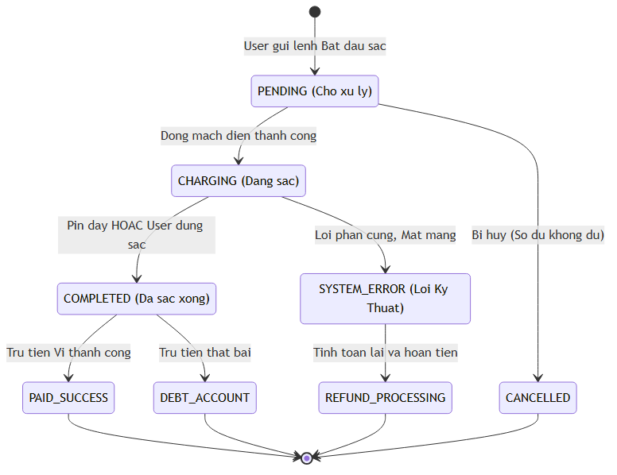

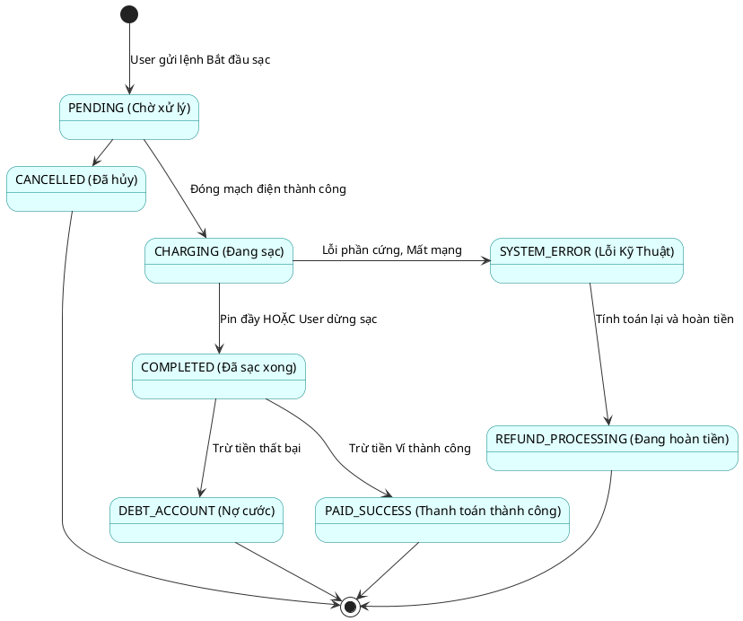

**- Quản lý tài khoản (Biểu đồ trạng thái)**
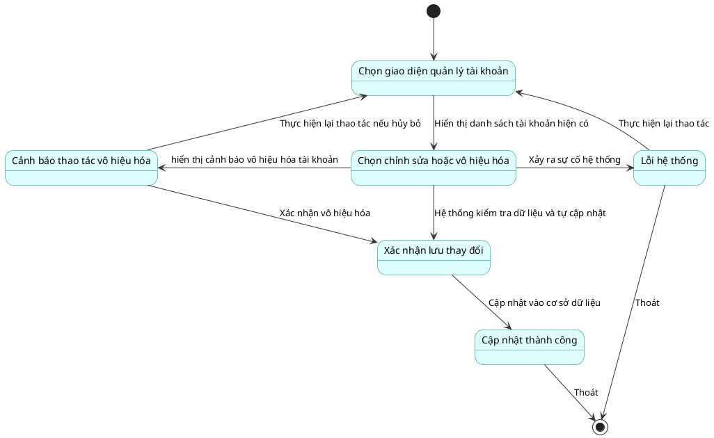

**- Quản lý trạm sạc (Biểu đồ trạng thái)**
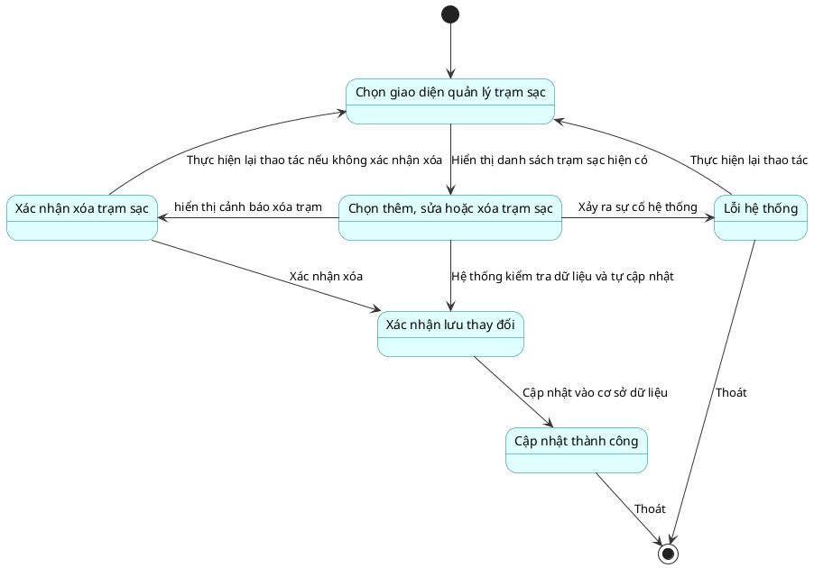

**- Quản lý bảo trì (Biểu đồ trạng thái)**
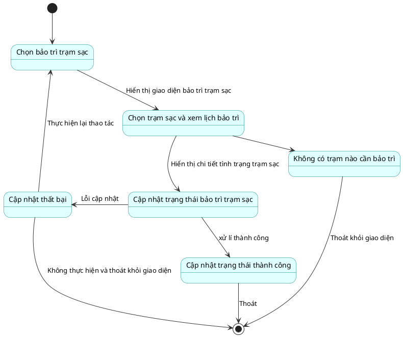

**- Quản lý Giá Cước (Biểu đồ trạng thái)**
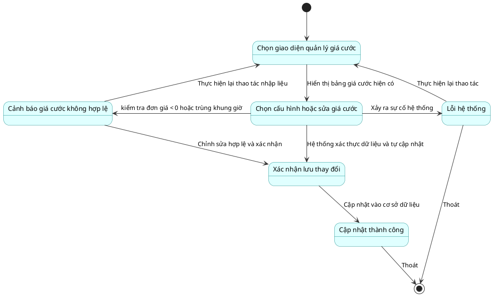

**- Khởi động sạc (Biểu đồ trạng thái)**
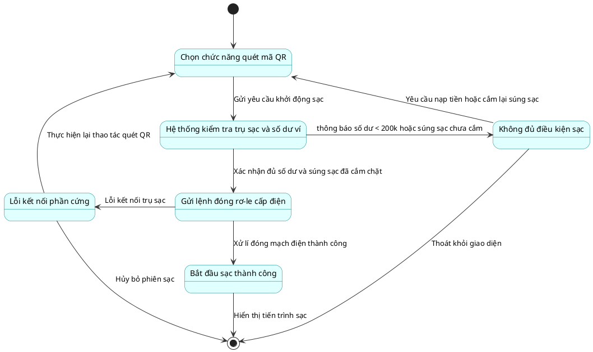

**- Đặt chỗ trước (Biểu đồ trạng thái)**
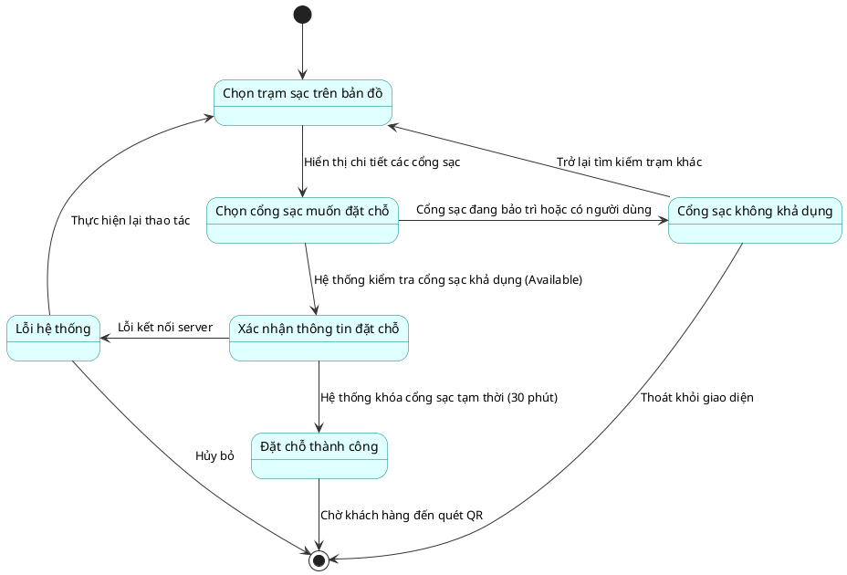

**- Thanh toán (Biểu đồ trạng thái)**
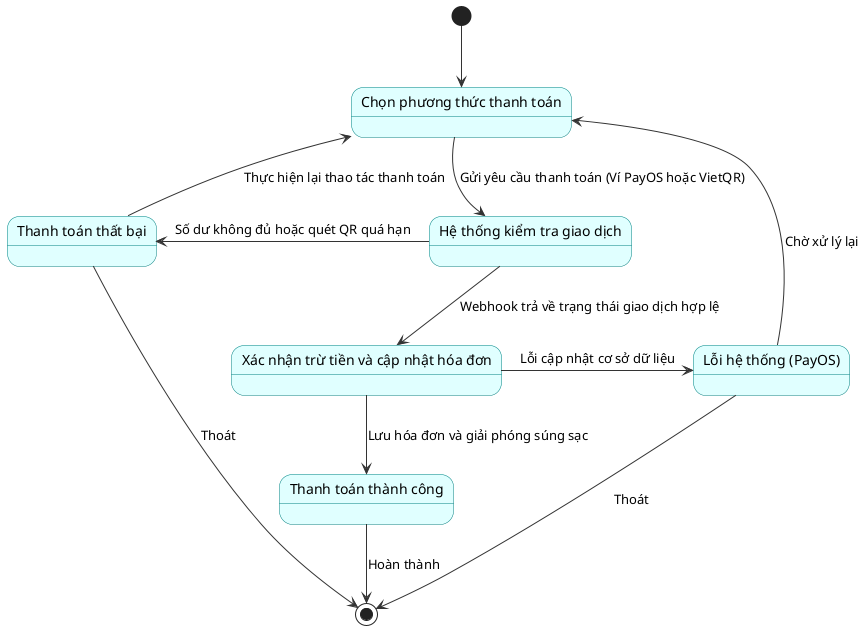

---

### 4.2.2 Xây dựng biểu đồ tuần tự

Dưới đây là 7 biểu đồ tuần tự được xây dựng theo đúng nguyên lý Robustness ECB (Entity - Control - Boundary) và đã được dịch nghĩa toàn bộ sang tiếng Việt cho dễ hiểu. Các biểu tượng Actor (Người dùng/Hệ thống bên ngoài), Boundary (Giao diện), Control (Bộ điều khiển logic), và Entity (Thực thể dữ liệu) được thể hiện rõ ràng.

**- Quản lý tài khoản**
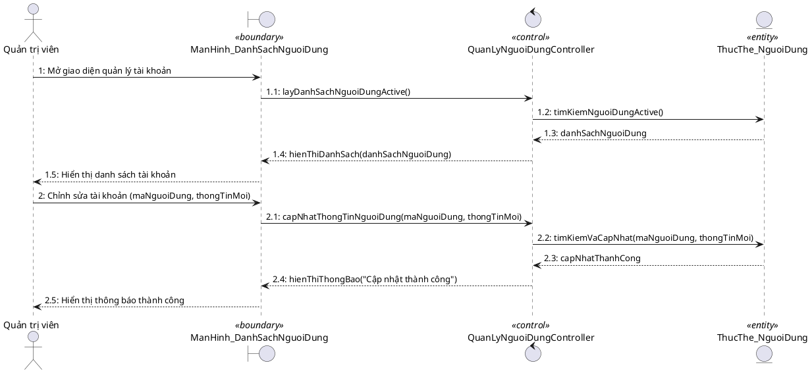

**- Quản lý trạm sạc**
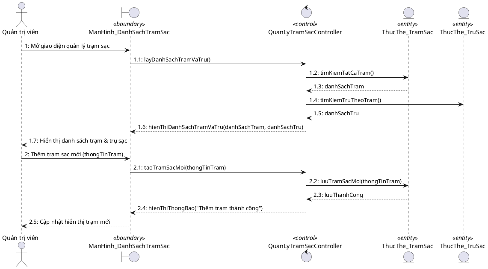

**- Quản lý bảo trì**
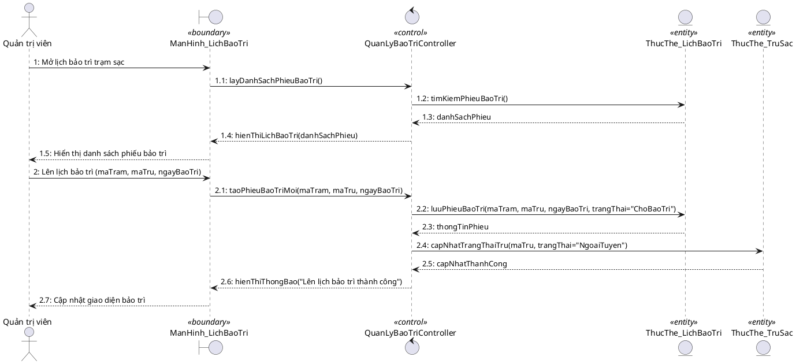

**- Quản lý Giá Cước**
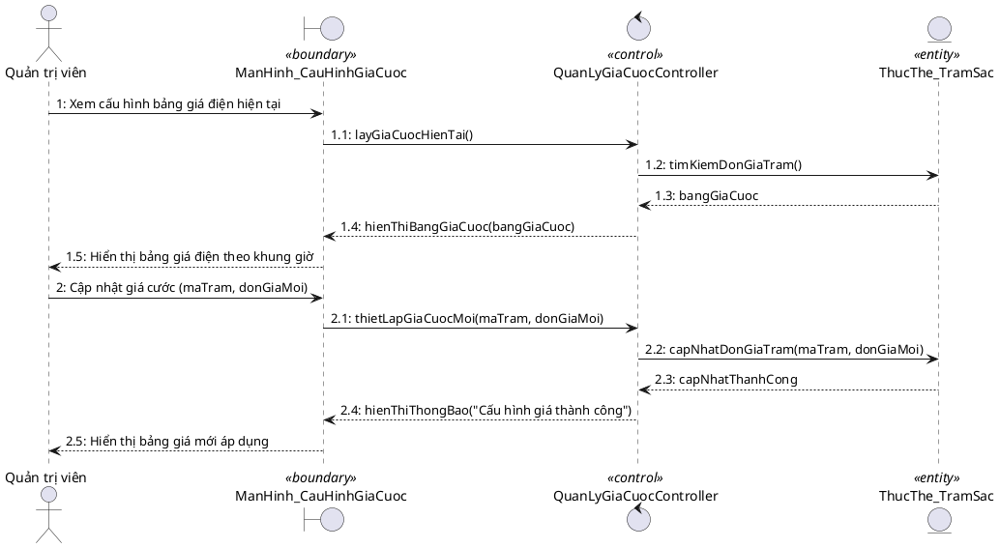

**- Khởi động sạc**

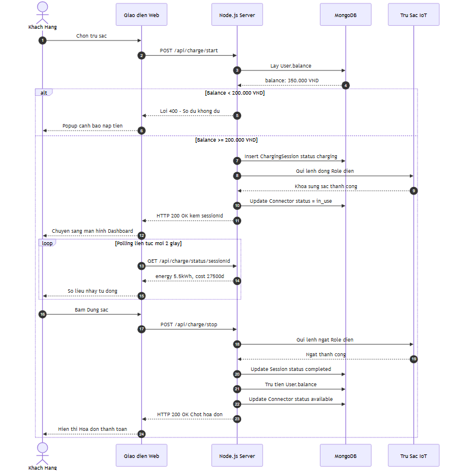
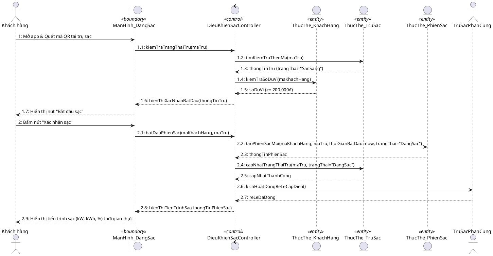

**- Đặt chỗ trước**
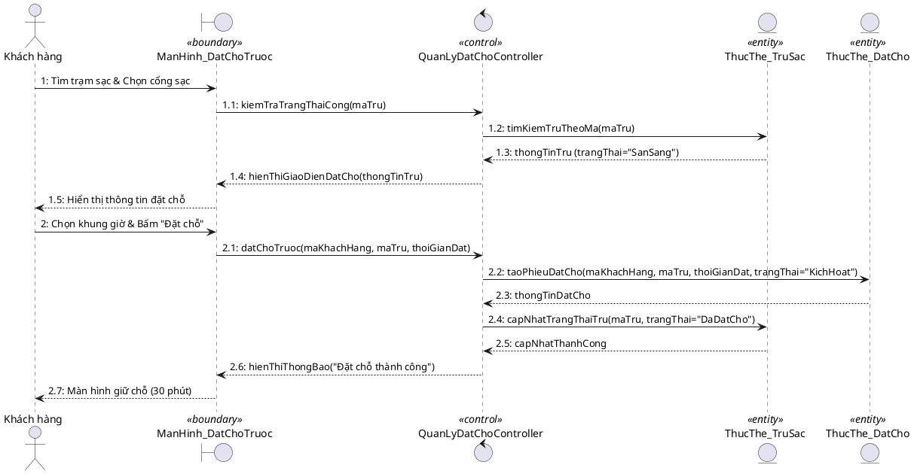

**- Thanh toán**

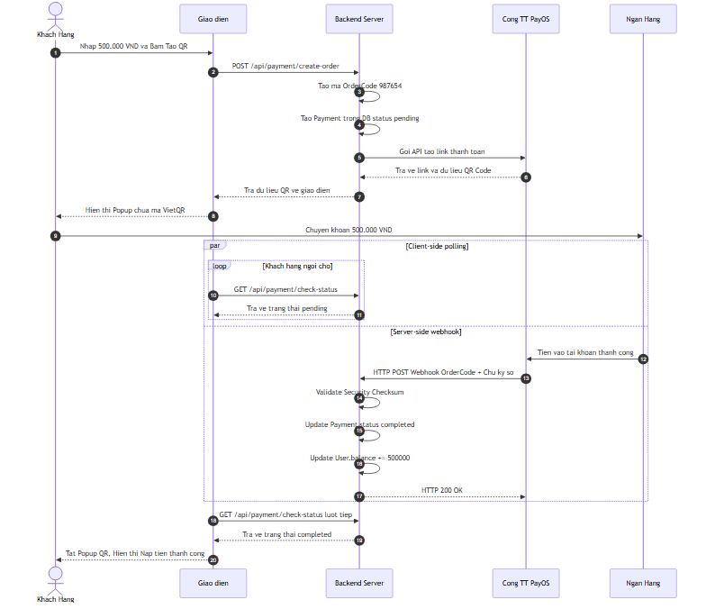
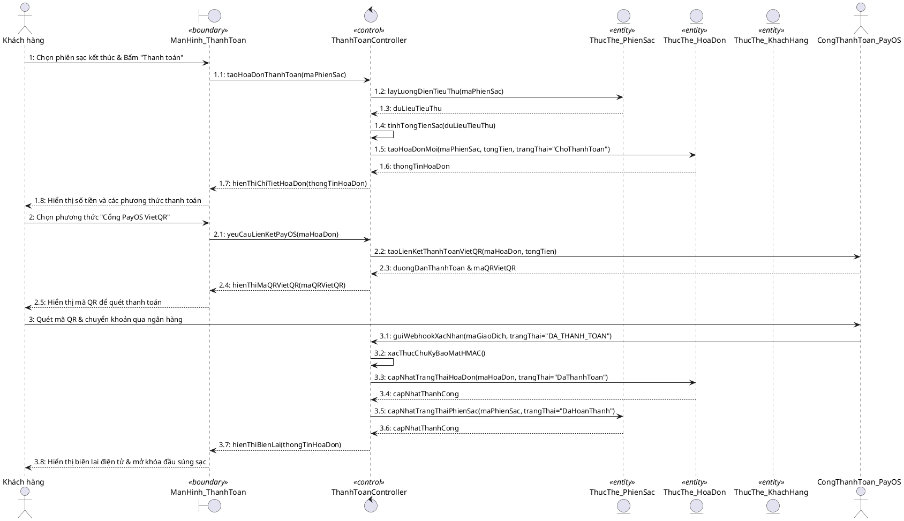

---

### 4.2.3 Vẽ lại biểu đồ lớp hoàn chỉnh

*(Đây là biểu đồ lớp hoàn chỉnh được thiết kế tập trung vào 7 lớp nghiệp vụ chính yếu nhất với đầy đủ các thuộc tính và phương thức từ đầu, sử dụng tông màu vàng).*

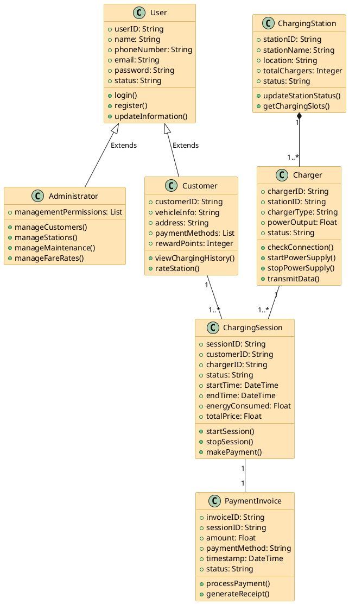