TRƯỜNG ĐẠI HỌC QUY NHƠN
KHOA CÔNG NGHỆ THÔNG TIN
----- -----

BÀI THỰC HÀNH
HỌC PHẦN: PHÂN TÍCH VÀ THIẾT KẾ
HỆ THỐNG THÔNG TIN

GIẢNG VIÊN HƯỚNG DẪN: NGUYỄN THỊ TUYẾT

BÁO CÁO BÀI TẬP NHÓM HỆ THỐNG
<QUẢN LÝ TRẠM SẠC XE ĐIỆN Ở MỘT THÀNH PHỐ>

THÀNH VIÊN NHÓM 8
4651050029 - Phạm Bình Chương
4651050177 - Nguyễn Nhất Nguyên
4651050096 - Nguyễn Khắc Huy
4651050094 - Huỳnh Nhật Huy
4651050066 - Đặng Nhật Hào

Năm 2025

---

# BÀI 4: PHÂN TÍCH HỆ THỐNG

Dựa trên yêu cầu của đề tài, hệ thống **Quản lý trạm sạc xe điện** được phân tích chi tiết thông qua hai giai đoạn: Phân tích tĩnh và Phân tích động.

## 4.1 Phân tích tĩnh

### 4.1.1 Xác định các lớp

Dựa trên yêu cầu nghiệp vụ của hệ thống, chúng ta xác định được các lớp (Class) chi tiết như sau:

**- Lớp Người Sử Dụng (User) - Lớp Cha:** Cho phép người dùng đăng ký, đăng nhập, cập nhật thông tin cá nhân.
- **Thuộc tính:**
  - userId: String
  - name: String
  - gender: String
  - phoneNumber: String
  - email: String
  - password: String
- **Phương thức:**
  - login()
  - register()
  - updateInformation()

*(Mã PlantUML để vẽ hộp xanh lớp User)*
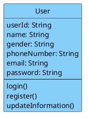

**- Lớp Khách hàng (Customer) - Kế thừa từ User:** Quản lý ví tiền cá nhân, xem lịch sử sạc, đánh giá trạm sạc.
- **Thuộc tính:**
  - userType: String
  - address: String
  - balance: Float
  - paymentMethods: List
- **Phương thức:**
  - viewChargingHistory()
  - rateStation()
  - depositMoney()

*(Mã PlantUML để vẽ hộp xanh lớp Customer)*
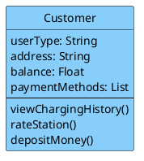

**- Lớp Quản Trị Viên (Administrator) - Kế thừa từ User:** Quản lý khách hàng, trạm sạc, bảo trì, giá điện.
- **Thuộc tính:**
  - managementPermissions: List
- **Phương thức:**
  - manageCustomers()
  - manageStations()
  - managePricingRates()
  - manageMaintenance()

*(Mã PlantUML để vẽ hộp xanh lớp Administrator)*
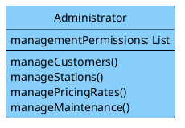

**- Lớp Trạm Sạc (ChargingStation) - Lớp Trọng tâm:** Quản lý thông tin chung của một trạm, cập nhật tình trạng hoạt động tổng thể.
- **Thuộc tính:**
  - stationId: String
  - name: String
  - address: String
  - locationCoordinates: String
  - totalChargers: Integer
  - operationStatus: String
- **Phương thức:**
  - updateStationStatus()
  - checkAvailability()

*(Mã PlantUML để vẽ hộp xanh lớp ChargingStation)*
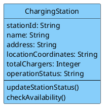

**- Lớp Trụ Sạc/Cổng Sạc (Charger) - Phụ thuộc Trạm sạc:** Quản lý từng trụ sạc cụ thể tại trạm (ví dụ: sạc nhanh, sạc thường).
- **Thuộc tính:**
  - chargerId: String
  - stationId: String
  - chargerType: String
  - maxPower: Float
  - status: String
- **Phương thức:**
  - updateChargerStatus()
  - startChargingProcess()
  - stopChargingProcess()

*(Mã PlantUML để vẽ hộp xanh lớp Charger)*
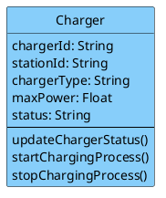

**- Lớp Phương Tiện (ElectricVehicle):** Thông tin về xe điện của khách hàng để hệ thống tính toán thời gian và công suất sạc phù hợp.
- **Thuộc tính:**
  - vehicleId: String
  - customerId: String
  - licensePlate: String
  - vehicleModel: String
  - batteryCapacity: Float
- **Phương thức:**
  - getVehicleInfo()

*(Mã PlantUML)*
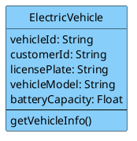

**- Lớp Bảo Trì Trạm Sạc (StationMaintenance):** Lên lịch bảo trì trạm hoặc trụ sạc cụ thể, cập nhật trạng thái bảo trì.
- **Thuộc tính:**
  - maintenanceId: String
  - stationId: String
  - chargerId: String
  - maintenanceDate: Date
  - status: String
- **Phương thức:**
  - scheduleMaintenance()
  - updateStatus()

*(Mã PlantUML)*
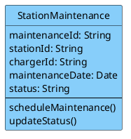

**- Lớp Đặt Chỗ Sạc (Reservation):** Cho phép khách hàng tìm và đặt trước trụ sạc để tối ưu hóa thời gian.
- **Thuộc tính:**
  - reservationId: String
  - customerId: String
  - chargerId: String
  - reservedStartTime: DateTime
  - reservedEndTime: DateTime
  - status: String
- **Phương thức:**
  - bookSlot()
  - cancelReservation()

*(Mã PlantUML)*
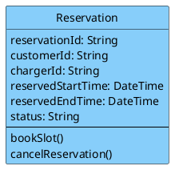

**- Lớp Sự Cố Trạm Sạc (StationIncident):** Báo cáo sự cố về điện, hỏng hóc thiết bị tại trạm.
- **Thuộc tính:**
  - incidentId: String
  - stationId: String
  - chargerId: String
  - description: String
  - timestamp: DateTime
  - status: String
- **Phương thức:**
  - reportIncident()
  - updateStatus()

*(Mã PlantUML)*
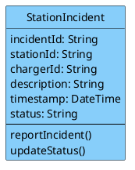

**- Lớp Quản Lý Phiên Sạc (ChargingSession):** Quản lý quá trình sạc thực tế từ lúc cắm súng sạc đến lúc thanh toán.
- **Thuộc tính:**
  - sessionId: String
  - customerId: String
  - chargerId: String
  - vehicleId: String
  - startTime: DateTime
  - endTime: DateTime
  - energyConsumed: Float
  - totalPrice: Float
  - status: String
- **Phương thức:**
  - startSession()
  - stopSession()
  - calculateFee()
  - processPayment()

*(Mã PlantUML)*
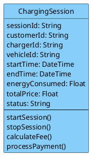

### 4.1.2 Xác định quan hệ giữa các lớp

**1) Quan hệ kế thừa**
**Customer kế thừa User**
- Customer là một loại người dùng trong hệ thống.
- Kế thừa các thuộc tính và phương thức chung như:
  - userId, name, email, password
  - login(), register(), updateInformation()

**Administrator kế thừa User**
- Administrator cũng là một loại người dùng.
- Kế thừa thông tin và chức năng chung từ User.

*(Mã PlantUML cho quan hệ kế thừa)*
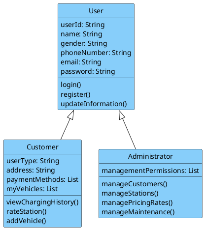

**Thành phần/Tập hợp (Composition/Aggregation):** Lớp Charger là một thành phần (thuộc về) của lớp ChargingStation.
*(Mã PlantUML)*
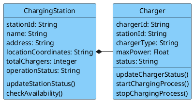

**2) Quan hệ kết hợp / liên kết giữa các lớp**

**Customer — ElectricVehicle**
- Một khách hàng có thể sở hữu nhiều xe điện.
- Mỗi xe điện thuộc về một khách hàng.
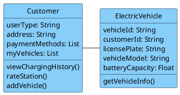

**ChargingStation — Charger**
- Một trạm sạc gồm nhiều trụ sạc.
- Mỗi trụ sạc thuộc về một trạm sạc.
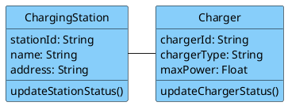

**Customer — Reservation**
- Một khách hàng có thể tạo nhiều lượt đặt chỗ.
- Mỗi lượt đặt chỗ thuộc về một khách hàng.
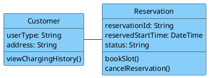

**Charger — Reservation**
- Một trụ sạc có thể xuất hiện trong nhiều lượt đặt chỗ ở các thời điểm khác nhau.
- Mỗi lượt đặt chỗ chỉ gắn với một trụ sạc.
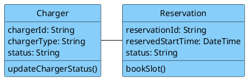

**Customer — ChargingSession**
- Một khách hàng có thể thực hiện nhiều phiên sạc.
- Mỗi phiên sạc thuộc về một khách hàng.
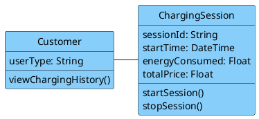

**ElectricVehicle — ChargingSession**
- Một xe điện có thể tham gia nhiều phiên sạc.
- Mỗi phiên sạc gắn với một xe điện.
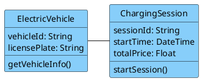

**Charger — ChargingSession**
- Một trụ sạc có thể phục vụ nhiều phiên sạc theo thời gian.
- Mỗi phiên sạc chỉ diễn ra tại một trụ sạc.
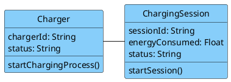

**ChargingStation — StationMaintenance**
- Một trạm sạc có thể có nhiều lần bảo trì.
- Mỗi bản ghi bảo trì thuộc về một trạm sạc.
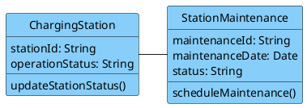

**Charger — StationMaintenance**
- Một lần bảo trì có thể áp dụng cho một trụ sạc cụ thể.
- Nếu không gắn với trụ nào thì là bảo trì toàn trạm.
```plantuml
@startuml
skinparam classBackgroundColor #87CEFA
skinparam classBorderColor black
class Charger {
  chargerId: String
  status: String
  updateChargerStatus()
}
class StationMaintenance {
  maintenanceId: String
  maintenanceDate: Date
  status: String
  scheduleMaintenance()
}
Charger -right- StationMaintenance
hide circle
@enduml
```

**ChargingStation — StationIncident**
- Một trạm sạc có thể phát sinh nhiều sự cố.
- Mỗi sự cố thuộc về một trạm sạc.
```plantuml
@startuml
skinparam classBackgroundColor #87CEFA
skinparam classBorderColor black
class ChargingStation {
  stationId: String
  operationStatus: String
}
class StationIncident {
  incidentId: String
  description: String
  status: String
  reportIncident()
}
ChargingStation -right- StationIncident
hide circle
@enduml
```

**Charger — StationIncident**
- Một sự cố có thể liên quan đến một trụ sạc cụ thể.
- Nếu không xác định trụ cụ thể thì đó là sự cố toàn trạm.
```plantuml
@startuml
skinparam classBackgroundColor #87CEFA
skinparam classBorderColor black
class Charger {
  chargerId: String
  status: String
}
class StationIncident {
  incidentId: String
  description: String
  status: String
  reportIncident()
}
Charger -right- StationIncident
hide circle
@enduml
```

**3) Quan hệ phụ thuộc**

**Administrator → Customer**
- Quản trị viên có quyền quản lý khách hàng.
```plantuml
@startuml
skinparam classBackgroundColor #87CEFA
skinparam classBorderColor black
class Administrator {
  managementPermissions: List
  manageCustomers()
}
class Customer {
  userType: String
  viewChargingHistory()
}
Administrator .right.> Customer
hide circle
@enduml
```

**Administrator → ChargingStation**
- Quản trị viên quản lý thông tin trạm sạc.
```plantuml
@startuml
skinparam classBackgroundColor #87CEFA
skinparam classBorderColor black
class Administrator {
  manageStations()
}
class ChargingStation {
  stationId: String
  operationStatus: String
}
Administrator .right.> ChargingStation
hide circle
@enduml
```

**Administrator → StationMaintenance**
- Quản trị viên theo dõi và cập nhật bảo trì.
```plantuml
@startuml
skinparam classBackgroundColor #87CEFA
skinparam classBorderColor black
class Administrator {
  manageMaintenance()
}
class StationMaintenance {
  maintenanceId: String
  status: String
}
Administrator .right.> StationMaintenance
hide circle
@enduml
```

**Administrator → StationIncident**
- Quản trị viên xử lý và cập nhật sự cố.
```plantuml
@startuml
skinparam classBackgroundColor #87CEFA
skinparam classBorderColor black
class Administrator {
  manageMaintenance()
}
class StationIncident {
  incidentId: String
  status: String
}
Administrator .right.> StationIncident
hide circle
@enduml
```

**Customer → ChargingStation**
- Khách hàng có thể đánh giá trạm sạc thông qua rateStation().
```plantuml
@startuml
skinparam classBackgroundColor #87CEFA
skinparam classBorderColor black
class Customer {
  rateStation()
}
class ChargingStation {
  operationStatus: String
}
Customer .right.> ChargingStation
hide circle
@enduml
```

### 4.1.3 Xây dựng biểu đồ lớp

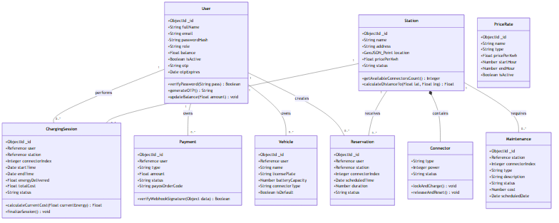

Dưới đây là Sơ đồ lớp Tổng thể bao gồm toàn bộ 10 Lớp, các Thuộc tính, Phương thức và đầy đủ các mối Quan hệ:

```plantuml
@startuml
skinparam classAttributeIconSize 0
skinparam classBackgroundColor #87CEFA
skinparam classBorderColor black

class User {
  + userId: String
  + name: String
  + gender: String
  + phoneNumber: String
  + email: String
  + password: String
  + login()
  + register()
  + updateInformation()
}

class Customer {
  + userType: String
  + address: String
  + balance: Float
  + paymentMethods: List
  + viewChargingHistory()
  + rateStation()
  + depositMoney()
}

class Administrator {
  + managementPermissions: List
  + manageCustomers()
  + manageStations()
  + managePricingRates()
  + manageMaintenance()
}

class ChargingStation {
  + stationId: String
  + name: String
  + address: String
  + locationCoordinates: String
  + totalChargers: Integer
  + operationStatus: String
  + updateStationStatus()
  + checkAvailability()
}

class Charger {
  + chargerId: String
  + stationId: String
  + chargerType: String
  + maxPower: Float
  + status: String
  + updateChargerStatus()
  + startChargingProcess()
  + stopChargingProcess()
}

class ElectricVehicle {
  + vehicleId: String
  + customerId: String
  + licensePlate: String
  + vehicleModel: String
  + batteryCapacity: Float
  + getVehicleInfo()
}

class StationMaintenance {
  + maintenanceId: String
  + stationId: String
  + chargerId: String
  + maintenanceDate: Date
  + status: String
  + scheduleMaintenance()
  + updateStatus()
}

class Reservation {
  + reservationId: String
  + customerId: String
  + chargerId: String
  + reservedStartTime: DateTime
  + reservedEndTime: DateTime
  + status: String
  + bookSlot()
  + cancelReservation()
}

class StationIncident {
  + incidentId: String
  + stationId: String
  + chargerId: String
  + description: String
  + timestamp: DateTime
  + status: String
  + reportIncident()
  + updateStatus()
}

class ChargingSession {
  + sessionId: String
  + customerId: String
  + chargerId: String
  + vehicleId: String
  + startTime: DateTime
  + endTime: DateTime
  + energyConsumed: Float
  + totalPrice: Float
  + status: String
  + startSession()
  + stopSession()
  + calculateFee()
  + processPayment()
}

' Quan hệ kế thừa
User <|-- Customer
User <|-- Administrator

' Quan hệ Thành phần (Aggregation / Composition)
ChargingStation *-- "1..*" Charger

' Quan hệ Liên kết
Customer "1" -- "0..*" ElectricVehicle
Customer "1" -- "0..*" Reservation
Charger "1" -- "0..*" Reservation
Customer "1" -- "0..*" ChargingSession
ElectricVehicle "1" -- "0..*" ChargingSession
Charger "1" -- "0..*" ChargingSession

ChargingStation "1" -- "0..*" StationMaintenance
Charger "1" -- "0..*" StationMaintenance

ChargingStation "1" -- "0..*" StationIncident
Charger "1" -- "0..*" StationIncident

' Quan hệ Phụ thuộc
Administrator ..> Customer
Administrator ..> ChargingStation
Administrator ..> StationMaintenance
Administrator ..> StationIncident
Customer ..> ChargingStation
@enduml
```

### 4.1.4 Xác định thuộc tính lớp

**1. Lớp người dùng (User) - Lớp cha**
| Thuộc tính | Kiểu dữ liệu | Mô tả |
| :--- | :--- | :--- |
| userId | String | Mã định danh duy nhất của người dùng |
| name | String | Họ và tên |
| gender | String | Giới tính (nam, nữ) |
| phoneNumber | String | Số điện thoại |
| email | String | Địa chỉ email (dùng để đăng nhập) |
| password | String | Mật khẩu đã mã hóa |

**2. Lớp khách hàng (Customer) - Kế thừa User**
| Thuộc tính | Kiểu dữ liệu | Mô tả |
| :--- | :--- | :--- |
| userType | String | Loại người dùng, mặc định "Customer" |
| address | String | Địa chỉ thường trú |
| paymentMethods| List<String> | Danh sách phương thức thanh toán |
| balance | Float | Số dư ví tiền PayOS |

**3. Lớp quản trị viên (Administrator) - Kế thừa User**
| Thuộc tính | Kiểu dữ liệu | Mô tả |
| :--- | :--- | :--- |
| userType | String | Loại người dùng, mặc định "Administrator" |
| managementPermissions| List<String> | Danh sách các quyền quản trị |

**4. Lớp trạm sạc (ChargingStation)**
| Thuộc tính | Kiểu dữ liệu | Mô tả |
| :--- | :--- | :--- |
| stationId | String | Mã định danh duy nhất của trạm |
| name | String | Tên trạm |
| address | String | Địa chỉ chi tiết |
| locationCoordinates| String | Tọa độ (kinh độ, vĩ độ) |
| totalChargers | Integer | Tổng số trụ sạc tại trạm |
| operationStatus| String | Trạng thái hoạt động |

**5. Lớp trụ sạc (Charger)**
| Thuộc tính | Kiểu dữ liệu | Mô tả |
| :--- | :--- | :--- |
| chargerId | String | Mã định danh duy nhất của trụ sạc |
| stationId | String | Mã trạm sạc mà trụ này thuộc về |
| chargerType | String | Loại trụ (AC Normal, DC Fast) |
| maxPower | Float | Công suất tối đa (kW) |
| status | String | Trạng thái hiện tại |

**6. Lớp phương tiện (ElectricVehicle)**
| Thuộc tính | Kiểu dữ liệu | Mô tả |
| :--- | :--- | :--- |
| vehicleId | String | Mã định danh duy nhất của xe |
| customerId | String | Mã khách hàng sở hữu |
| licensePlate | String | Biển số xe |
| vehicleModel | String | Mẫu xe |
| batteryCapacity| Float | Dung lượng pin |

**7. Lớp Bảo Trì Trạm Sạc (StationMaintenance)**
| Thuộc tính | Kiểu dữ liệu | Mô tả |
| :--- | :--- | :--- |
| maintenanceId | String | Mã phiếu bảo trì |
| stationId | String | Mã trạm được bảo trì |
| chargerId | String | Mã trụ sạc cụ thể (có thể null) |
| maintenanceDate| Date | Ngày dự kiến bảo trì |
| status | String | Trạng thái (Scheduled, Completed) |

**8. Lớp Đặt Chỗ Sạc (Reservation)**
| Thuộc tính | Kiểu dữ liệu | Mô tả |
| :--- | :--- | :--- |
| reservationId | String | Mã đặt chỗ |
| customerId | String | Mã khách hàng đặt chỗ |
| chargerId | String | Mã trụ sạc được đặt |
| reservedStartTime| DateTime | Thời gian bắt đầu đặt chỗ |
| reservedEndTime| DateTime | Thời gian kết thúc đặt chỗ |
| status | String | Trạng thái (Active, Expired) |

**9. Lớp Sự Cố Trạm Sạc (StationIncident)**
| Thuộc tính | Kiểu dữ liệu | Mô tả |
| :--- | :--- | :--- |
| incidentId | String | Mã sự cố |
| stationId | String | Mã trạm xảy ra sự cố |
| chargerId | String | Mã trụ sạc |
| description | String | Mô tả sự cố |
| timestamp | DateTime | Thời điểm báo cáo |
| status | String | Trạng thái xử lý |

**10. Lớp Quản Lý Phiên Sạc (ChargingSession)**
| Thuộc tính | Kiểu dữ liệu | Mô tả |
| :--- | :--- | :--- |
| sessionId | String | Mã phiên sạc |
| customerId | String | Mã khách hàng thực hiện |
| chargerId | String | Mã trụ sạc được sử dụng |
| vehicleId | String | Mã phương tiện đang sạc |
| startTime | DateTime | Thời điểm bắt đầu sạc |
| endTime | DateTime | Thời điểm kết thúc sạc |
| energyConsumed| Float | Lượng điện tiêu thụ (kWh) |
| totalPrice | Float | Tổng tiền phải trả |
| status | String | Trạng thái phiên sạc |

---