TRƯỜNG ĐẠI HỌC QUY NHƠN
KHOA CÔNG NGHỆ THÔNG TIN
----- -----

BÀI THỰC HÀNH
HỌC PHẦN: PHÂN TÍCH VÀ THIẾT KẾ
HỆ THỐNG THÔNG TIN

GIẢNG VIÊN HƯỚNG DẪN: NGUYỄN THỊ TUYẾT

BÁO CÁO BÀI TẬP NHÓM HỆ THỐNG
<QUẢN LÝ TRẠM SẠC XE ĐIỆN Ở MỘT THÀNH PHỐ>

THÀNH VIÊN NHÓM 8
4651050029 - Phạm Bình Chương
4651050177 - Nguyễn Nhất Nguyên
4651050096 - Nguyễn Khắc Huy
4651050094 - Huỳnh Nhật Huy
4651050066 - Đặng Nhật Hào

Năm 2025

---

# BÀI 4: PHÂN TÍCH HỆ THỐNG

Dựa trên yêu cầu của đề tài, hệ thống **Quản lý trạm sạc xe điện** được phân tích chi tiết thông qua hai giai đoạn: Phân tích tĩnh và Phân tích động.

## 4.1 Phân tích tĩnh

### 4.1.1 Xác định các lớp

Dựa trên yêu cầu nghiệp vụ của hệ thống, chúng ta xác định được các lớp (Class) chi tiết như sau:

**- Lớp Người Sử Dụng (User) - Lớp Cha:** Cho phép người dùng đăng ký, đăng nhập, cập nhật thông tin cá nhân.
- **Thuộc tính:**
  - userId: String
  - name: String
  - gender: String
  - phoneNumber: String
  - email: String
  - password: String
- **Phương thức:**
  - login()
  - register()
  - updateInformation()

*(Mã PlantUML để vẽ hộp xanh lớp User)*
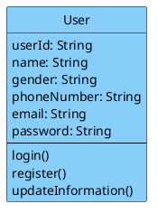

**- Lớp Khách hàng (Customer) - Kế thừa từ User:** Quản lý ví tiền cá nhân, xem lịch sử sạc, đánh giá trạm sạc.
- **Thuộc tính:**
  - userType: String ("Customer")
  - address: String
  - balance: Float (Số dư ví PayOS)
  - paymentMethods: List
- **Phương thức:**
  - viewChargingHistory()
  - rateStation()
  - depositMoney()

*(Mã PlantUML để vẽ hộp xanh lớp Customer)*
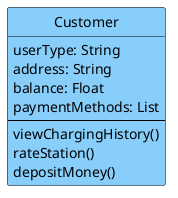

**- Lớp Quản Trị Viên (Administrator) - Kế thừa từ User:** Quản lý khách hàng, trạm sạc, bảo trì, giá điện.
- **Thuộc tính:**
  - managementPermissions: List
- **Phương thức:**
  - manageCustomers()
  - manageStations()
  - manageMaintenance()
  - managePricingRates()

*(Mã PlantUML để vẽ hộp xanh lớp Administrator)*
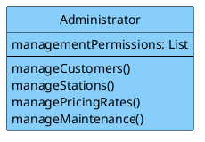

**- Lớp Trạm Sạc (ChargingStation) - Lớp Trọng tâm:** Quản lý thông tin chung của một trạm, cập nhật tình trạng hoạt động tổng thể.
- **Thuộc tính:**
  - stationId: String
  - name: String
  - address: String
  - locationCoordinates: String (Kinh độ, vĩ độ)
  - totalChargers: Integer
  - operationStatus: String
- **Phương thức:**
  - updateStationStatus()
  - checkAvailability()

*(Mã PlantUML để vẽ hộp xanh lớp ChargingStation)*
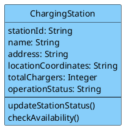

**- Lớp Trụ Sạc/Cổng Sạc (Charger) - Phụ thuộc Trạm sạc:** Quản lý từng trụ sạc cụ thể tại trạm (ví dụ: sạc nhanh, sạc thường).
- **Thuộc tính:**
  - chargerId: String
  - stationId: String
  - chargerType: String ("AC Normal", "DC Fast")
  - maxPower: Float (Công suất sạc tối đa - kW)
  - status: String ("Available", "In Use", "Offline")
- **Phương thức:**
  - updateChargerStatus()
  - startChargingProcess()
  - stopChargingProcess()

*(Mã PlantUML để vẽ hộp xanh lớp Charger)*
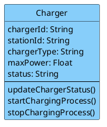

**- Lớp Phương Tiện (ElectricVehicle):** Thông tin về xe điện của khách hàng để hệ thống tính toán thời gian và công suất sạc phù hợp.
- **Thuộc tính:**
  - vehicleId: String
  - customerId: String
  - licensePlate: String
  - vehicleModel: String
  - batteryCapacity: Float (Dung lượng pin tổng - kWh)
- **Phương thức:**
  - getVehicleInfo()

*(Mã PlantUML)*
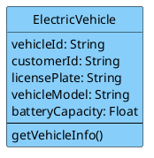

**- Lớp Bảo Trì Trạm Sạc (StationMaintenance):** Lên lịch bảo trì trạm hoặc trụ sạc cụ thể, cập nhật trạng thái bảo trì.
- **Thuộc tính:**
  - maintenanceId: String
  - stationId: String
  - chargerId: String (Có thể Null nếu bảo trì toàn trạm)
  - maintenanceDate: Date
  - status: String
- **Phương thức:**
  - scheduleMaintenance()
  - updateStatus()

*(Mã PlantUML)*
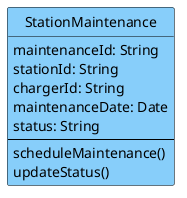

**- Lớp Đặt Chỗ Sạc (Reservation):** Cho phép khách hàng tìm và đặt trước trụ sạc để tối ưu hóa thời gian.
- **Thuộc tính:**
  - reservationId: String
  - customerId: String
  - chargerId: String
  - reservedStartTime: DateTime
  - reservedEndTime: DateTime
  - status: String
- **Phương thức:**
  - bookSlot()
  - cancelReservation()

*(Mã PlantUML)*
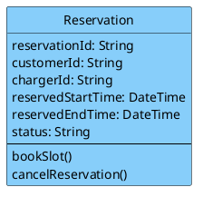

**- Lớp Sự Cố Trạm Sạc (StationIncident):** Báo cáo sự cố về điện, hỏng hóc thiết bị tại trạm.
- **Thuộc tính:**
  - incidentId: String
  - stationId: String
  - chargerId: String
  - description: String
  - timestamp: DateTime
  - status: String ("Reported", "Fixing", "Resolved")
- **Phương thức:**
  - reportIncident()
  - updateStatus()

*(Mã PlantUML)*
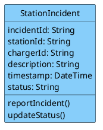

**- Lớp Quản Lý Phiên Sạc (ChargingSession):** Quản lý quá trình sạc thực tế từ lúc cắm súng sạc đến lúc thanh toán.
- **Thuộc tính:**
  - sessionId: String
  - customerId: String
  - chargerId: String
  - vehicleId: String
  - startTime: DateTime
  - endTime: DateTime
  - energyConsumed: Float (kWh đã sạc)
  - totalPrice: Float
  - status: String ("Charging", "Completed", "Payment Pending")
- **Phương thức:**
  - startSession()
  - stopSession()
  - calculateFee()
  - processPayment()

*(Mã PlantUML)*
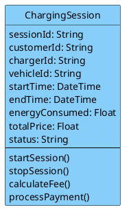

### 4.1.2 Xác định quan hệ giữa các lớp

**1) Quan hệ kế thừa**
**Customer kế thừa User**
- Customer là một loại người dùng trong hệ thống.
- Kế thừa các thuộc tính và phương thức chung như:
  - userId, name, email, password
  - login(), register(), updateInformation()

**Administrator kế thừa User**
- Administrator cũng là một loại người dùng.
- Kế thừa thông tin và chức năng chung từ User.

*(Mã PlantUML cho quan hệ kế thừa)*
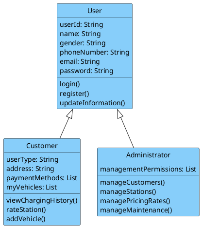

**Thành phần/Tập hợp (Composition/Aggregation):** Lớp Charger là một thành phần (thuộc về) của lớp ChargingStation.
*(Mã PlantUML)*
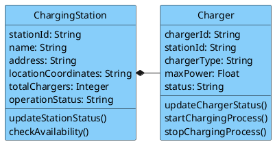

**2) Quan hệ kết hợp / liên kết giữa các lớp**

**Customer — ElectricVehicle**
- Một khách hàng có thể sở hữu nhiều xe điện.
- Mỗi xe điện thuộc về một khách hàng.
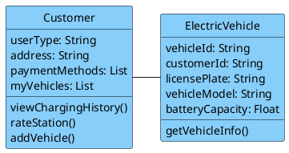

**ChargingStation — Charger**
- Một trạm sạc gồm nhiều trụ sạc.
- Mỗi trụ sạc thuộc về một trạm sạc.
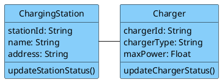

**Customer — Reservation**
- Một khách hàng có thể tạo nhiều lượt đặt chỗ.
- Mỗi lượt đặt chỗ thuộc về một khách hàng.
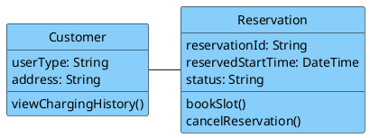

**Charger — Reservation**
- Một trụ sạc có thể xuất hiện trong nhiều lượt đặt chỗ ở các thời điểm khác nhau.
- Mỗi lượt đặt chỗ chỉ gắn với một trụ sạc.
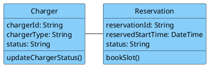

**Customer — ChargingSession**
- Một khách hàng có thể thực hiện nhiều phiên sạc.
- Mỗi phiên sạc thuộc về một khách hàng.
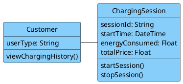

**ElectricVehicle — ChargingSession**
- Một xe điện có thể tham gia nhiều phiên sạc.
- Mỗi phiên sạc gắn với một xe điện.
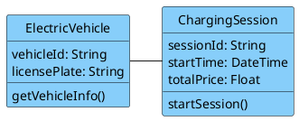

**Charger — ChargingSession**
- Một trụ sạc có thể phục vụ nhiều phiên sạc theo thời gian.
- Mỗi phiên sạc chỉ diễn ra tại một trụ sạc.
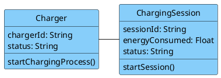

**ChargingStation — StationMaintenance**
- Một trạm sạc có thể có nhiều lần bảo trì.
- Mỗi bản ghi bảo trì thuộc về một trạm sạc.
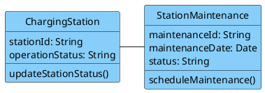

**Charger — StationMaintenance**
- Một lần bảo trì có thể áp dụng cho một trụ sạc cụ thể.
- Nếu không gắn với trụ nào thì là bảo trì toàn trạm.
```plantuml
@startuml
skinparam classBackgroundColor #87CEFA
skinparam classBorderColor black
class Charger {
  chargerId: String
  status: String
  updateChargerStatus()
}
class StationMaintenance {
  maintenanceId: String
  maintenanceDate: Date
  status: String
  scheduleMaintenance()
}
Charger -right- StationMaintenance
hide circle
@enduml
```

**ChargingStation — StationIncident**
- Một trạm sạc có thể phát sinh nhiều sự cố.
- Mỗi sự cố thuộc về một trạm sạc.
```plantuml
@startuml
skinparam classBackgroundColor #87CEFA
skinparam classBorderColor black
class ChargingStation {
  stationId: String
  operationStatus: String
}
class StationIncident {
  incidentId: String
  description: String
  status: String
  reportIncident()
}
ChargingStation -right- StationIncident
hide circle
@enduml
```

**Charger — StationIncident**
- Một sự cố có thể liên quan đến một trụ sạc cụ thể.
- Nếu không xác định trụ cụ thể thì đó là sự cố toàn trạm.
```plantuml
@startuml
skinparam classBackgroundColor #87CEFA
skinparam classBorderColor black
class Charger {
  chargerId: String
  status: String
}
class StationIncident {
  incidentId: String
  description: String
  status: String
  reportIncident()
}
Charger -right- StationIncident
hide circle
@enduml
```

**3) Quan hệ phụ thuộc**

**Administrator → Customer**
- Quản trị viên có quyền quản lý khách hàng.
```plantuml
@startuml
skinparam classBackgroundColor #87CEFA
skinparam classBorderColor black
class Administrator {
  managementPermissions: List
  manageCustomers()
}
class Customer {
  userType: String
  viewChargingHistory()
}
Administrator .right.> Customer
hide circle
@enduml
```

**Administrator → ChargingStation**
- Quản trị viên quản lý thông tin trạm sạc.
```plantuml
@startuml
skinparam classBackgroundColor #87CEFA
skinparam classBorderColor black
class Administrator {
  manageStations()
}
class ChargingStation {
  stationId: String
  operationStatus: String
}
Administrator .right.> ChargingStation
hide circle
@enduml
```

**Administrator → StationMaintenance**
- Quản trị viên theo dõi và cập nhật bảo trì.
```plantuml
@startuml
skinparam classBackgroundColor #87CEFA
skinparam classBorderColor black
class Administrator {
  manageMaintenance()
}
class StationMaintenance {
  maintenanceId: String
  status: String
}
Administrator .right.> StationMaintenance
hide circle
@enduml
```

**Administrator → StationIncident**
- Quản trị viên xử lý và cập nhật sự cố.
```plantuml
@startuml
skinparam classBackgroundColor #87CEFA
skinparam classBorderColor black
class Administrator {
  manageMaintenance()
}
class StationIncident {
  incidentId: String
  status: String
}
Administrator .right.> StationIncident
hide circle
@enduml
```

**Customer → ChargingStation**
- Khách hàng có thể đánh giá trạm sạc thông qua rateStation().
```plantuml
@startuml
skinparam classBackgroundColor #87CEFA
skinparam classBorderColor black
class Customer {
  rateStation()
}
class ChargingStation {
  operationStatus: String
}
Customer .right.> ChargingStation
hide circle
@enduml
```

### 4.1.3 Xác định thuộc tính lớp (Bảng chi tiết)

**1. Lớp người dùng (User) - Lớp cha**
| Thuộc tính | Kiểu dữ liệu | Mô tả |
| :--- | :--- | :--- |
| userId | String | Mã định danh duy nhất của người dùng |
| name | String | Họ và tên |
| gender | String | Giới tính (nam, nữ) |
| phoneNumber | String | Số điện thoại |
| email | String | Địa chỉ email (dùng để đăng nhập) |
| password | String | Mật khẩu đã mã hóa |

**2. Lớp khách hàng (Customer) - Kế thừa User**
| Thuộc tính | Kiểu dữ liệu | Mô tả |
| :--- | :--- | :--- |
| userType | String | Loại người dùng, default “Customer” |
| address | String | Địa chỉ thường trú |
| paymentMethods| List<String> | Danh sách phương thức thanh toán |
| balance | Float | Số dư ví tiền PayOS |

**3. Lớp quản trị viên (Administrator) - Kế thừa User**
| Thuộc tính | Kiểu dữ liệu | Mô tả |
| :--- | :--- | :--- |
| userType | String | Loại người dùng, default “Administrator” |
| managementPermissions| List<String> | Danh sách các quyền quản trị |

**4. Lớp trạm sạc (ChargingStation)**
| Thuộc tính | Kiểu dữ liệu | Mô tả |
| :--- | :--- | :--- |
| stationId | String | Mã định danh duy nhất của trạm |
| name | String | Tên trạm |
| address | String | Địa chỉ chi tiết |
| locationCoordinates| String | Tọa độ (kinh độ, vĩ độ) |
| totalChargers | Integer | Tổng số trụ sạc tại trạm |
| operationStatus| String | Trạng thái hoạt động |

**5. Lớp trụ sạc (Charger)**
| Thuộc tính | Kiểu dữ liệu | Mô tả |
| :--- | :--- | :--- |
| chargerId | String | Mã định danh duy nhất của trụ sạc |
| stationId | String | Mã trạm sạc mà trụ này thuộc về |
| chargerType | String | Loại trụ (AC Normal, DC Fast) |
| maxPower | Float | Công suất tối đa (kW) |
| status | String | Trạng thái hiện tại |

**6. Lớp phương tiện (ElectricVehicle)**
| Thuộc tính | Kiểu dữ liệu | Mô tả |
| :--- | :--- | :--- |
| vehicleId | String | Mã định danh duy nhất của xe |
| customerId | String | Mã khách hàng sở hữu |
| licensePlate | String | Biển số xe |
| vehicleModel | String | Mẫu xe |
| batteryCapacity| Float | Dung lượng pin |

**7. Lớp Bảo Trì Trạm Sạc (StationMaintenance)**
| Thuộc tính | Kiểu dữ liệu | Mô tả |
| :--- | :--- | :--- |
| maintenanceId | String | Mã phiếu bảo trì |
| stationId | String | Mã trạm được bảo trì |
| chargerId | String | Mã trụ sạc cụ thể (có thể null) |
| maintenanceDate| Date | Ngày dự kiến bảo trì |
| status | String | Trạng thái (Scheduled, Completed) |

**8. Lớp Đặt Chỗ Sạc (Reservation)**
| Thuộc tính | Kiểu dữ liệu | Mô tả |
| :--- | :--- | :--- |
| reservationId | String | Mã đặt chỗ |
| customerId | String | Mã khách hàng đặt chỗ |
| chargerId | String | Mã trụ sạc được đặt |
| reservedStartTime| DateTime | Thời gian bắt đầu đặt chỗ |
| reservedEndTime| DateTime | Thời gian kết thúc đặt chỗ |
| status | String | Trạng thái (Active, Expired) |

**9. Lớp Sự Cố Trạm Sạc (StationIncident)**
| Thuộc tính | Kiểu dữ liệu | Mô tả |
| :--- | :--- | :--- |
| incidentId | String | Mã sự cố |
| stationId | String | Mã trạm xảy ra sự cố |
| chargerId | String | Mã trụ sạc |
| description | String | Mô tả sự cố |
| timestamp | DateTime | Thời điểm báo cáo |
| status | String | Trạng thái xử lý |

**10. Lớp Quản Lý Phiên Sạc (ChargingSession)**
| Thuộc tính | Kiểu dữ liệu | Mô tả |
| :--- | :--- | :--- |
| sessionId | String | Mã phiên sạc |
| customerId | String | Mã khách hàng thực hiện |
| chargerId | String | Mã trụ sạc được sử dụng |
| vehicleId | String | Mã phương tiện đang sạc |
| startTime | DateTime | Thời điểm bắt đầu sạc |
| endTime | DateTime | Thời điểm kết thúc sạc |
| energyConsumed| Float | Lượng điện tiêu thụ (kWh) |
| totalPrice | Float | Tổng tiền phải trả |
| status | String | Trạng thái phiên sạc |

### 4.1.4 Biểu đồ lớp hoàn chỉnh

Dưới đây là Sơ đồ lớp Tổng thể bao gồm toàn bộ 10 Lớp, các Thuộc tính, Phương thức và đầy đủ các mối Quan hệ:

```plantuml
@startuml
skinparam classAttributeIconSize 0
skinparam classBackgroundColor #87CEFA
skinparam classBorderColor black

class User {
  + userId: String
  + name: String
  + gender: String
  + phoneNumber: String
  + email: String
  + password: String
  + login()
  + register()
  + updateInformation()
}

class Customer {
  + userType: String
  + address: String
  + balance: Float
  + paymentMethods: List
  + viewChargingHistory()
  + rateStation()
  + depositMoney()
}

class Administrator {
  + managementPermissions: List
  + manageCustomers()
  + manageStations()
  + managePricingRates()
  + manageMaintenance()
}

class ChargingStation {
  + stationId: String
  + name: String
  + address: String
  + locationCoordinates: String
  + totalChargers: Integer
  + operationStatus: String
  + updateStationStatus()
  + checkAvailability()
}

class Charger {
  + chargerId: String
  + stationId: String
  + chargerType: String
  + maxPower: Float
  + status: String
  + updateChargerStatus()
  + startChargingProcess()
  + stopChargingProcess()
}

class ElectricVehicle {
  + vehicleId: String
  + customerId: String
  + licensePlate: String
  + vehicleModel: String
  + batteryCapacity: Float
  + getVehicleInfo()
}

class StationMaintenance {
  + maintenanceId: String
  + stationId: String
  + chargerId: String
  + maintenanceDate: Date
  + status: String
  + scheduleMaintenance()
  + updateStatus()
}

class Reservation {
  + reservationId: String
  + customerId: String
  + chargerId: String
  + reservedStartTime: DateTime
  + reservedEndTime: DateTime
  + status: String
  + bookSlot()
  + cancelReservation()
}

class StationIncident {
  + incidentId: String
  + stationId: String
  + chargerId: String
  + description: String
  + timestamp: DateTime
  + status: String
  + reportIncident()
  + updateStatus()
}

class ChargingSession {
  + sessionId: String
  + customerId: String
  + chargerId: String
  + vehicleId: String
  + startTime: DateTime
  + endTime: DateTime
  + energyConsumed: Float
  + totalPrice: Float
  + status: String
  + startSession()
  + stopSession()
  + calculateFee()
  + processPayment()
}

' Quan hệ kế thừa
User <|-- Customer
User <|-- Administrator

' Quan hệ Thành phần (Aggregation / Composition)
ChargingStation *-- "1..*" Charger

' Quan hệ Liên kết
Customer "1" -- "0..*" ElectricVehicle
Customer "1" -- "0..*" Reservation
Charger "1" -- "0..*" Reservation
Customer "1" -- "0..*" ChargingSession
ElectricVehicle "1" -- "0..*" ChargingSession
Charger "1" -- "0..*" ChargingSession

ChargingStation "1" -- "0..*" StationMaintenance
Charger "1" -- "0..*" StationMaintenance

ChargingStation "1" -- "0..*" StationIncident
Charger "1" -- "0..*" StationIncident

' Quan hệ Phụ thuộc
Administrator ..> Customer
Administrator ..> ChargingStation
Administrator ..> StationMaintenance
Administrator ..> StationIncident
Customer ..> ChargingStation
@enduml
```

---

## 4.2 Phân tích động

### 4.2.1 Xây dựng biểu đồ trạng thái (Activity Diagram)

**- Quản lý tài khoản**
```plantuml
@startuml
skinparam activityBackgroundColor #E0FFFF
skinparam activityBorderColor #008B8B
skinparam arrowColor #2F4F4F

start
:Chọn giao diện quản lý tài khoản;
note right: Hiển thị danh sách người dùng
:Tìm kiếm tài khoản cần quản lý;
note right: Hiển thị kết quả tìm kiếm

if (Tài khoản) then (Không tồn tại)
  :Tìm kiếm thất bại;
  note right: Thực hiện lại thao tác
  :Chọn giao diện quản lý tài khoản;
else (Tồn tại)
  :Chỉnh sửa hoặc vô hiệu hóa tài khoản;
  note right: Gửi yêu cầu
  :Xác nhận thao tác;
  if (Thao tác) then (Vô hiệu hóa)
    :Tài khoản người dùng bị vô hiệu hóa;
    note bottom: Gửi thông báo đến người dùng
  else (Cập nhật thông tin)
    :Cập nhật thành công;
  endif
  :Thoát khỏi quản lý tài khoản;
  stop
endif
@enduml
```

**- Quản lý trạm sạc**
```plantuml
@startuml
skinparam activityBackgroundColor #E0FFFF
skinparam activityBorderColor #008B8B
skinparam arrowColor #2F4F4F

start
:Chọn giao diện quản lý trạm sạc;
note right: Hiển thị danh sách trạm sạc hiện có
:Chọn thêm, sửa hoặc xóa trạm sạc;

if (Lỗi hệ thống) then (Có)
  :Lỗi hệ thống;
  note right: Thực hiện lại thao tác
  :Chọn giao diện quản lý trạm sạc;
else (Không)
  if (Thao tác) then (Xác nhận xóa trạm sạc)
    :Xác nhận xóa;
    :Xác nhận lưu thay đổi;
  else (Hệ thống kiểm tra dữ liệu và tự cập nhật)
    :Xác nhận lưu thay đổi;
  endif
  :Cập nhật vào cơ sở dữ liệu;
  :Cập nhật thành công;
  stop
endif
@enduml
```

**- Quản lý bảo trì**
```plantuml
@startuml
skinparam activityBackgroundColor #E0FFFF
skinparam activityBorderColor #008B8B
skinparam arrowColor #2F4F4F

start
:Chọn bảo trì trạm sạc;
note right: Hiển thị giao diện bảo trì trạm sạc
:Chọn trạm sạc và xem lịch bảo trì;

if (Tình trạng) then (Không có trạm sạc cần bảo trì)
  :Không có trạm sạc cần bảo trì;
  :Thoát khỏi giao diện;
  stop
else (Hiển thị chi tiết tình trạng trạm sạc)
  :Cập nhật trạng thái bảo trì trạm sạc;
  if (Kết quả) then (Lỗi cập nhật)
    :Cập nhật thất bại;
    note right: Thực hiện lại thao tác
    :Chọn bảo trì trạm sạc;
  else (Xử lý thành công)
    :Cập nhật trạng thái thành công;
    :Thoát khỏi giao diện;
    stop
  endif
endif
@enduml
```

**- Quản lý Giá Cước**
```plantuml
@startuml
skinparam activityBackgroundColor #E0FFFF
skinparam activityBorderColor #008B8B
skinparam arrowColor #2F4F4F

start
:Chọn quản lý giá cước điện;
note right: Hiển thị giao diện quản lý giá cước
:Thiết lập, thay đổi giá cước theo khung giờ;

if (Xác nhận) then (Chưa được kiểm định/Hủy)
  :Hủy thay đổi;
  note right: Thực hiện lại thao tác
  :Chọn quản lý giá cước điện;
else (Kiểm tra dữ liệu và tự cập nhật)
  :Cập nhật thành công;
  :Thoát khỏi quản lý giá cước;
  stop
endif
@enduml
```

**- Khởi động sạc**
```plantuml
@startuml
skinparam activityBackgroundColor #E0FFFF
skinparam activityBorderColor #008B8B
skinparam arrowColor #2F4F4F

start
:Quét mã QR tại cổng sạc;
note right: Gửi yêu cầu khởi động
:Hệ thống kiểm tra thông tin kết nối;

if (Kết nối) then (Cáp chưa cắm/Lỗi mạng)
  :Thông báo lỗi kết nối;
  note right: Yêu cầu thao tác lại
  :Quét mã QR tại cổng sạc;
else (Hiển thị thông tin cổng sạc)
  :Xác nhận bắt đầu sạc;
  if (Số dư ví) then (Không đủ)
    :Thông báo số dư thấp;
    :Hướng dẫn nạp tiền;
    stop
  else (Gửi lệnh đến trạm sạc)
    :Trạm sạc đóng rơ le, cấp điện;
    note right: Cập nhật màn hình
    :Hiển thị tiến trình sạc theo thời gian thực;
    note right: Người dùng bấm dừng hoặc Pin đầy
    :Kết thúc phiên sạc;
    stop
  endif
endif
@enduml
```

**- Đặt chỗ trước**
```plantuml
@startuml
skinparam activityBackgroundColor #E0FFFF
skinparam activityBorderColor #008B8B
skinparam arrowColor #2F4F4F

start
:Mở chức năng tìm trạm sạc;
note right: Hiển thị bản đồ / danh sách trạm
:Chọn trạm sạc và cổng sạc muốn đặt;

if (Tình trạng cổng) then (Đang sử dụng/Lỗi)
  :Thông báo cổng không khả dụng;
  note right: Đề xuất cổng khác
  :Chọn trạm sạc và cổng sạc muốn đặt;
else (Hiển thị thông tin giữ chỗ (giới hạn 30 phút))
  :Xác nhận đặt chỗ;
  note right: Hệ thống khóa cổng tạm thời
  :Cập nhật trạng thái "Đã đặt";
  if (Hành động khách hàng) then (Chuyển trạng thái)
    :Sẵn sàng sạc điện;
    stop
  else (Hủy tự động)
    :Mở khóa cổng, trừ điểm tín nhiệm;
    stop
  endif
endif
@enduml
```

**- Thanh toán**
```plantuml
@startuml
skinparam activityBackgroundColor #E0FFFF
skinparam activityBorderColor #008B8B
skinparam arrowColor #2F4F4F

start
:Nhận thông báo kết thúc sạc;
note right: Hiển thị hóa đơn chi tiết (kWh, số tiền)
:Giao diện chọn phương thức thanh toán;

if (Tùy chọn) then (Kiểm tra số dư)
  if (Đủ tiền?) then (Không đủ)
    :Yêu cầu nạp thêm tiền;
  else (Đủ)
    :Trừ tiền tự động;
  endif
else (Chuyển hướng VNPay/MoMo)
  :Xác thực giao dịch;
endif

if (Kết quả thanh toán) then (Lỗi ngân hàng)
  :Thanh toán thất bại;
  note right: Yêu cầu thử lại
  :Giao diện chọn phương thức thanh toán;
else (Cập nhật trạng thái hóa đơn)
  :Lưu lịch sử và gửi biên lai;
  note right: Mở khóa ngàm cáp
  :Khách hàng rút súng sạc rời đi;
  stop
endif
@enduml
```

---

### 4.2.2 Xây dựng biểu đồ tuần tự (Sequence Diagram)

**- Quản lý tài khoản**
```plantuml
@startuml
actor Admin
participant "System" as System
participant "Database" as DB
actor User

Admin -> System: 1.1. Mở giao diện quản lý người dùng
System -> DB: 1.2. Lấy danh sách người dùng
DB --> System: 1.3. Trả về danh sách người dùng
System --> Admin: 1.4. Hiển thị danh sách người dùng

Admin -> System: 2.1. Tìm kiếm tài khoản cần quản lý
System -> DB: 2.2. Truy vấn thông tin tài khoản
DB --> System: 2.3. Trả về kết quả tìm kiếm
System --> Admin: 2.4. Hiển thị kết quả tìm kiếm

Admin -> System: 3.1. Chỉnh sửa hoặc vô hiệu hóa tài khoản
System -> DB: 3.2. Cập nhật thông tin tài khoản
DB --> System: 3.3. Xác nhận cập nhật thành công
System --> Admin: 3.4. Thông báo cập nhật thành công
System -> User: 3.4.1. Gửi thông báo vô hiệu hóa tài khoản
@enduml
```

**- Quản lý trạm sạc**
```plantuml
@startuml
actor Admin
participant "System" as System
participant "Database" as DB

Admin -> System: 1.1. Mở giao diện quản lý trạm sạc
System -> DB: 1.2. Lấy danh sách trạm sạc
DB --> System: 1.3. Trả về danh sách trạm sạc
System --> Admin: 1.4. Hiển thị danh sách trạm sạc

Admin -> System: 2.1. Thêm, sửa hoặc xóa trạm sạc
System -> DB: 2.2. Kiểm tra và cập nhật dữ liệu trạm sạc
DB --> System: 2.3. Xác nhận cập nhật thành công
System --> Admin: 2.4. Thông báo thao tác thành công
System --> Admin: 2.4.1. Hiển thị cảnh báo và yêu cầu xác nhận (Nếu xóa trạm đang hoạt động)
@enduml
```

**- Quản lý bảo trì**
```plantuml
@startuml
actor Admin
participant "System" as System
participant "Database" as DB
actor User

Admin -> System: 1.1. Mở giao diện bảo trì trạm sạc
System -> DB: 1.2. Lấy danh sách trạm sạc
DB --> System: 1.3. Trả về danh sách trạm sạc
System --> Admin: 1.4. Hiển thị danh sách trạm sạc

Admin -> System: 2.1. Chọn trạm sạc cần bảo trì
System -> DB: 2.2. Truy xuất thông tin trạm sạc
DB --> System: 2.3. Trả về dữ liệu trạm sạc
System --> Admin: 2.4. Hiển thị chi tiết trạm sạc

Admin -> System: 3.1. Cập nhật trạng thái bảo trì
System -> DB: 3.2. Lưu thông tin bảo trì
DB --> System: 3.3. Xác nhận cập nhật thành công
System --> Admin: 3.4. Thông báo cập nhật thành công
System -> User: 4. Gửi thông báo (Trạm sạc đang bảo trì)
@enduml
```

**- Quản lý Giá Cước**
```plantuml
@startuml
actor Admin
participant "System" as System
participant "Database" as DB

Admin -> System: 1.1. Mở giao diện quản lý giá cước
System -> DB: 1.2. Lấy giá cước hiện tại
DB --> System: 1.3. Trả về dữ liệu giá cước
System --> Admin: 1.4. Hiển thị giá cước hiện tại

Admin -> System: 2.1. Thêm, sửa giá cước theo khung giờ
System -> DB: 2.2. Kiểm tra và cập nhật dữ liệu giá
DB --> System: 2.3. Xác nhận cập nhật thành công
System --> Admin: 2.4. Thông báo thao tác thành công
System --> Admin: 2.4.1. Hiển thị cảnh báo và yêu cầu xác nhận (Nếu áp dụng ngay lập tức)
@enduml
```

**- Khởi động sạc**
```plantuml
@startuml
actor User
participant "System" as System
participant "Database" as DB
actor Hardware

User -> System: 1.1. Mở ứng dụng & Quét mã QR
System -> DB: 1.2. Truy vấn trạng thái cổng sạc & thông tin người dùng
DB --> System: 1.3. Trả về dữ liệu cổng sạc & số dư
System --> User: 1.4. Hiển thị chi tiết cổng sạc và xác nhận bắt đầu

User -> System: 2.1. Xác nhận bắt đầu sạc
System -> DB: 2.2. Tạo phiên sạc mới
DB --> System: 2.3. Xác nhận đã tạo phiên sạc
System -> Hardware: 2.4. Gửi lệnh mở khóa rơ le
Hardware --> System: 2.5. Xác nhận rơ le đã mở
System --> User: 2.6. Thông báo thao tác thành công
System --> User: 2.6.1. Hiển thị bảng điều khiển sạc trực tiếp
@enduml
```

**- Đặt chỗ trước**
```plantuml
@startuml
actor User
participant "System" as System
participant "Database" as DB

User -> System: 1.1. Mở giao diện tìm kiếm trạm sạc
System -> DB: 1.2. Lấy danh sách trạm sạc/cổng sạc khả dụng
DB --> System: 1.3. Trả về danh sách trạm sạc/cổng sạc
System --> User: 1.4. Hiển thị bản đồ/danh sách trạm sạc

User -> System: 2.1. Yêu cầu đặt chỗ một cổng sạc
System -> DB: 2.2. Kiểm tra yêu cầu và cập nhật trạng thái cổng (Đã đặt)
DB --> System: 2.3. Xác nhận cập nhật thành công
System --> User: 2.4. Thông báo đặt chỗ thành công
System --> User: 2.4.1. Hiển thị thời gian giữ chỗ (30 phút)
@enduml
```

**- Thanh toán**
```plantuml
@startuml
actor User
participant "System" as System
participant "Database" as DB
actor PaymentGateway

User -> System: 1.1. Chọn giao diện thanh toán cho phiên sạc đã kết thúc
System -> DB: 1.2. Lấy chi tiết hóa đơn phiên sạc
DB --> System: 1.3. Trả về chi tiết hóa đơn
System --> User: 1.4. Hiển thị hóa đơn và các phương thức thanh toán

User -> System: 2.1. Chọn phương thức thanh toán và xác nhận
System -> PaymentGateway: 2.2. Xử lý giao dịch thanh toán
PaymentGateway --> System: 2.3. Trả về kết quả giao dịch thành công
System -> DB: 2.4. Cập nhật trạng thái hóa đơn thành "Đã thanh toán"
DB --> System: 2.5. Xác nhận cập nhật trạng thái
System --> User: 2.6. Thông báo thanh toán thành công
System --> User: 2.6.1. Hiển thị biên lai điện tử và yêu cầu rút súng sạc
@enduml
```

---

### 4.2.3 Bổ sung thuộc tính, phương thức vào các lớp

Ở giai đoạn này, các lớp được bổ sung chi tiết các phương thức (hành vi) và mức độ truy cập (Public `+`, Private `-`).

**- Lớp Người Sử Dụng (User) - Lớp Cha**
Cho phép người dùng đăng ký, đăng nhập và cập nhật thông tin cá nhân.
- **Thuộc tính:**
  - `userID: String`
  - `name: String`
  - `phoneNumber: String`
  - `email: String`
  - `password: String`
  - `status: String`
- **Phương thức:**
  - `login()`
  - `register()`
  - `updateInformation()`

```plantuml
@startuml
skinparam classBackgroundColor #FFE4B5
skinparam classBorderColor #B8860B
class User {
  + userID: String
  + name: String
  + phoneNumber: String
  + email: String
  + password: String
  + status: String
  --
  + login()
  + register()
  + updateInformation()
}
@enduml
```

**- Lớp Quản Trị Viên (Administrator) - Thừa kế từ User**
Quản lý khách hàng, các trạm sạc, lịch bảo trì và giá cước.
- **Thuộc tính:**
  - `managementPermissions: List`
- **Phương thức:**
  - `manageCustomers()`
  - `manageStations()`
  - `manageMaintenance()`
  - `manageFareRates()`

```plantuml
@startuml
skinparam classBackgroundColor #FFE4B5
skinparam classBorderColor #B8860B
class Administrator {
  + managementPermissions: List
  --
  + manageCustomers()
  + manageStations()
  + manageMaintenance()
  + manageFareRates()
}
@enduml
```

**- Lớp Khách Hàng (Customer) - Thừa kế từ User**
Thực hiện các thao tác đặt chỗ sạc, thanh toán và xem lịch sử sạc.
- **Thuộc tính:**
  - `customerID: String`
  - `vehicleInfo: String`
  - `address: String`
  - `paymentMethods: List`
  - `rewardPoints: Integer`
- **Phương thức:**
  - `viewChargingHistory()`
  - `rateStation()`

```plantuml
@startuml
skinparam classBackgroundColor #FFE4B5
skinparam classBorderColor #B8860B
class Customer {
  + customerID: String
  + vehicleInfo: String
  + address: String
  + paymentMethods: List
  + rewardPoints: Integer
  --
  + viewChargingHistory()
  + rateStation()
}
@enduml
```

**- Lớp Trạm Sạc (ChargingStation)**
Lưu trữ thông tin về một khu vực trạm sạc (bao gồm nhiều cổng sạc).
- **Thuộc tính:**
  - `stationID: String`
  - `stationName: String`
  - `location: String`
  - `totalChargers: Integer`
  - `status: String`
- **Phương thức:**
  - `updateStationStatus()`
  - `getChargingSlots()`

```plantuml
@startuml
skinparam classBackgroundColor #FFE4B5
skinparam classBorderColor #B8860B
class ChargingStation {
  + stationID: String
  + stationName: String
  + location: String
  + totalChargers: Integer
  + status: String
  --
  + updateStationStatus()
  + getChargingSlots()
}
@enduml
```

**- Lớp Cổng Sạc / Trụ Sạc (Charger)**
Quản lý thiết bị phần cứng cung cấp điện lưới cho xe.
- **Thuộc tính:**
  - `chargerID: String`
  - `stationID: String`
  - `chargerType: String`
  - `powerOutput: Float`
  - `status: String`
- **Phương thức:**
  - `checkConnection()`
  - `startPowerSupply()`
  - `stopPowerSupply()`
  - `transmitData()`

```plantuml
@startuml
skinparam classBackgroundColor #FFE4B5
skinparam classBorderColor #B8860B
class Charger {
  + chargerID: String
  + stationID: String
  + chargerType: String
  + powerOutput: Float
  + status: String
  --
  + checkConnection()
  + startPowerSupply()
  + stopPowerSupply()
  + transmitData()
}
@enduml
```

**- Lớp Phiên Sạc (ChargingSession)**
Theo dõi một giao dịch sạc xe cụ thể của khách hàng.
- **Thuộc tính:**
  - `sessionID: String`
  - `customerID: String`
  - `chargerID: String`
  - `status: String`
  - `startTime: DateTime`
  - `endTime: DateTime`
  - `energyConsumed: Float`
  - `totalPrice: Float`
- **Phương thức:**
  - `startSession()`
  - `stopSession()`
  - `makePayment()`

```plantuml
@startuml
skinparam classBackgroundColor #FFE4B5
skinparam classBorderColor #B8860B
class ChargingSession {
  + sessionID: String
  + customerID: String
  + chargerID: String
  + status: String
  + startTime: DateTime
  + endTime: DateTime
  + energyConsumed: Float
  + totalPrice: Float
  --
  + startSession()
  + stopSession()
  + makePayment()
}
@enduml
```

**- Lớp Hóa Đơn Thanh Toán (PaymentInvoice)**
Quản lý quá trình thanh toán chi phí của mỗi phiên sạc.
- **Thuộc tính:**
  - `invoiceID: String`
  - `sessionID: String`
  - `amount: Float`
  - `paymentMethod: String`
  - `timestamp: DateTime`
  - `status: String`
- **Phương thức:**
  - `processPayment()`
  - `generateReceipt()`

```plantuml
@startuml
skinparam classBackgroundColor #FFE4B5
skinparam classBorderColor #B8860B
class PaymentInvoice {
  + invoiceID: String
  + sessionID: String
  + amount: Float
  + paymentMethod: String
  + timestamp: DateTime
  + status: String
  --
  + processPayment()
  + generateReceipt()
}
@enduml
```

---

### 4.2.4 Vẽ lại biểu đồ lớp hoàn chỉnh

*(Đây là biểu đồ lớp hoàn chỉnh theo mẫu màu vàng, tập trung vào 7 lớp nghiệp vụ chính yếu nhất).*

```plantuml
@startuml
skinparam classBackgroundColor #FFE4B5
skinparam classBorderColor #B8860B

class User {
  + userID: String
  + name: String
  + phoneNumber: String
  + email: String
  + password: String
  + status: String
  + login()
  + register()
  + updateInformation()
}

class Administrator {
  + managementPermissions: List
  + manageCustomers()
  + manageStations()
  + manageMaintenance()
  + manageFareRates()
}

class Customer {
  + customerID: String
  + vehicleInfo: String
  + address: String
  + paymentMethods: List
  + rewardPoints: Integer
  + viewChargingHistory()
  + rateStation()
}

class ChargingStation {
  + stationID: String
  + stationName: String
  + location: String
  + totalChargers: Integer
  + status: String
  + updateStationStatus()
  + getChargingSlots()
}

class Charger {
  + chargerID: String
  + stationID: String
  + chargerType: String
  + powerOutput: Float
  + status: String
  + checkConnection()
  + startPowerSupply()
  + stopPowerSupply()
  + transmitData()
}

class ChargingSession {
  + sessionID: String
  + customerID: String
  + chargerID: String
  + status: String
  + startTime: DateTime
  + endTime: DateTime
  + energyConsumed: Float
  + totalPrice: Float
  + startSession()
  + stopSession()
  + makePayment()
}

class PaymentInvoice {
  + invoiceID: String
  + sessionID: String
  + amount: Float
  + paymentMethod: String
  + timestamp: DateTime
  + status: String
  + processPayment()
  + generateReceipt()
}

User <|-- Customer : Extends
User <|-- Administrator : Extends

Customer "1" -- "1..*" ChargingSession
ChargingSession "1" -- "1" PaymentInvoice
ChargingStation "1" *-- "1..*" Charger
Charger "1" -- "1..*" ChargingSession
@enduml
```

