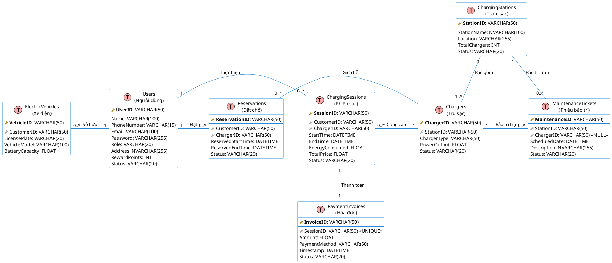

# BÀI 5: THIẾT KẾ CƠ SỞ DỮ LIỆU

Dựa trên kết quả phân tích hệ thống từ Bài 4, dưới đây là quá trình thiết kế cơ sở dữ liệu (Database Design) chi tiết, bao gồm xác định thực thể, mối liên kết, thiết kế bảng và chuẩn hóa mô hình dữ liệu.

---

## 5.1 Các thực thể và thuộc tính

Từ các Lớp (Class) đã phân tích, khi chuyển sang thiết kế CSDL (Mô hình Thực thể - Liên kết), các thực thể chính và thuộc tính cơ bản được xác định như sau:

**1. Thực thể Người dùng (User)**
*(Bao gồm cả Admin và Customer, sử dụng cột `Role` để phân biệt theo chiến lược Single Table)*
- **Thuộc tính:** UserID (Khóa chính), Name, PhoneNumber, Email, Password, Role (Admin/Customer), Address, RewardPoints, Status.

**2. Thực thể Trạm sạc (ChargingStation)**
- **Thuộc tính:** StationID (Khóa chính), StationName, Location, TotalChargers, Status.

**3. Thực thể Trụ sạc / Cổng sạc (Charger)**
- **Thuộc tính:** ChargerID (Khóa chính), StationID (Khóa ngoại), ChargerType, PowerOutput, Status.

**4. Thực thể Phương tiện / Xe điện (ElectricVehicle)**
- **Thuộc tính:** VehicleID (Khóa chính), CustomerID (Khóa ngoại), LicensePlate, VehicleModel, BatteryCapacity.

**5. Thực thể Phiên sạc (ChargingSession)**
- **Thuộc tính:** SessionID (Khóa chính), CustomerID (Khóa ngoại), ChargerID (Khóa ngoại), StartTime, EndTime, EnergyConsumed, TotalPrice, Status.

**6. Thực thể Đặt chỗ (Reservation)**
- **Thuộc tính:** ReservationID (Khóa chính), CustomerID (Khóa ngoại), ChargerID (Khóa ngoại), ReservedStartTime, ReservedEndTime, Status.

**7. Thực thể Hóa đơn thanh toán (PaymentInvoice)**
- **Thuộc tính:** InvoiceID (Khóa chính), SessionID (Khóa ngoại), Amount, PaymentMethod, Timestamp, Status.

**8. Thực thể Phiếu bảo trì (MaintenanceTicket)**
*(Đã được phân tích trong biểu đồ tuần tự Quản lý bảo trì)*
- **Thuộc tính:** MaintenanceID (Khóa chính), StationID (Khóa ngoại), ChargerID (Khóa ngoại - có thể Null), ScheduledDate, Description, Status.

---

## 5.2 Mối liên kết giữa các thực thể

Các thực thể tương tác với nhau thông qua các mối liên kết nghiệp vụ. Trong CSDL quan hệ, các liên kết này được thể hiện qua Khóa chính (PK) và Khóa ngoại (FK).

1. **User (Admin) QUẢN LÝ ChargingStation:** 
   - Một Admin có thể quản lý nhiều Trạm sạc (1-N).
2. **ChargingStation BAO GỒM Charger:**
   - Một Trạm sạc chứa nhiều Trụ sạc (1-N). Trụ sạc phụ thuộc vào sự tồn tại của Trạm sạc.
   - *Thuộc tính liên kết:* `StationID` được lưu làm khóa ngoại trong bảng Charger.
3. **User (Customer) SỞ HỮU ElectricVehicle:**
   - Một Khách hàng có thể đăng ký nhiều xe điện trên app (1-N).
   - *Thuộc tính liên kết:* `CustomerID` lưu trong bảng ElectricVehicle.
4. **User (Customer) ĐẶT CHỖ Charger:**
   - Đây là mối quan hệ Nhiều - Nhiều (N-N), được tách thành thực thể **Reservation**. Một Khách hàng tạo Đặt chỗ, và Đặt chỗ đó giữ chỗ cho một Trụ sạc.
5. **User (Customer) THỰC HIỆN ChargingSession:**
   - Một Khách hàng có thể có nhiều phiên sạc khác nhau qua các ngày (1-N).
6. **Charger CUNG CẤP ChargingSession:**
   - Một Trụ sạc có thể phục vụ nhiều phiên sạc qua các khung giờ khác nhau (1-N).
7. **ChargingSession SINH RA PaymentInvoice:**
   - Mỗi Phiên sạc hoàn tất sẽ sinh ra duy nhất một Hóa đơn thanh toán (1-1).
8. **Admin (User) LẬP PHIẾU BẢO TRÌ (MaintenanceTicket) cho ChargingStation:**
   - Admin lên lịch bảo trì cho Trạm sạc hoặc Trụ sạc cụ thể (1-N).

---

## 5.3 Chuyển thành Bảng dữ liệu và Chuẩn hóa 3NF

### Tiêu chí Chuẩn hóa dạng 3 (3NF)
Mô hình dữ liệu đã được thiết kế tuân thủ nguyên tắc Chuẩn hóa dạng 3 (Third Normal Form - 3NF):
1. **1NF:** Tất cả các thuộc tính đều chứa giá trị nguyên tố, không có thuộc tính lặp.
2. **2NF:** Mọi thuộc tính không phải khóa (non-key attribute) đều phụ thuộc hoàn toàn vào khóa chính (Ví dụ: `StationName` phụ thuộc vào `StationID`).
3. **3NF:** Không có sự phụ thuộc bắc cầu giữa các thuộc tính không khóa. Tất cả các cột không phải khóa đều phụ thuộc trực tiếp vào khóa chính.

### Danh sách các Bảng Dữ Liệu (Tables)

*(PK: Primary Key, FK: Foreign Key)*

**Bảng: Users**
| Tên cột | Kiểu dữ liệu | Ràng buộc | Mô tả |
|---|---|---|---|
| UserID | VARCHAR(50) | PK | Mã định danh người dùng |
| Name | VARCHAR(100) | NOT NULL | Họ và tên |
| PhoneNumber | VARCHAR(15) | UNIQUE | Số điện thoại |
| Email | VARCHAR(100) | UNIQUE | Email đăng nhập |
| Password | VARCHAR(255) | NOT NULL | Mật khẩu (đã mã hóa) |
| Role | VARCHAR(20) | NOT NULL | Phân quyền (Customer/Admin) |
| Address | NVARCHAR(255) | NULL | Địa chỉ |
| RewardPoints | INT | DEFAULT 0 | Điểm tích lũy (cho Customer) |
| Status | VARCHAR(20) | DEFAULT 'Active' | Trạng thái tài khoản |

**Bảng: ChargingStations**
| Tên cột | Kiểu dữ liệu | Ràng buộc | Mô tả |
|---|---|---|---|
| StationID | VARCHAR(50) | PK | Mã trạm sạc |
| StationName | NVARCHAR(100)| NOT NULL | Tên trạm sạc |
| Location | VARCHAR(255) | NOT NULL | Tọa độ/Địa chỉ cụ thể |
| TotalChargers | INT | DEFAULT 0 | Tổng số lượng trụ sạc |
| Status | VARCHAR(20) | DEFAULT 'Active' | Trạng thái hoạt động của trạm |

**Bảng: Chargers**
| Tên cột | Kiểu dữ liệu | Ràng buộc | Mô tả |
|---|---|---|---|
| ChargerID | VARCHAR(50) | PK | Mã trụ sạc / cổng sạc |
| StationID | VARCHAR(50) | FK | Mã trạm sạc chứa trụ này |
| ChargerType | VARCHAR(50) | NOT NULL | Loại cổng (AC, DC, CHAdeMO) |
| PowerOutput | FLOAT | NOT NULL | Công suất đầu ra (kW) |
| Status | VARCHAR(20) | DEFAULT 'Available'| Trạng thái (Available, In Use, Offline) |

**Bảng: ElectricVehicles**
| Tên cột | Kiểu dữ liệu | Ràng buộc | Mô tả |
|---|---|---|---|
| VehicleID | VARCHAR(50) | PK | Mã xe |
| CustomerID| VARCHAR(50) | FK | Mã khách hàng sở hữu |
| LicensePlate| VARCHAR(20) | UNIQUE | Biển số xe |
| VehicleModel| VARCHAR(100) | NOT NULL | Mẫu xe |
| BatteryCapacity| FLOAT | NOT NULL | Dung lượng pin (kWh) |

**Bảng: Reservations**
| Tên cột | Kiểu dữ liệu | Ràng buộc | Mô tả |
|---|---|---|---|
| ReservationID | VARCHAR(50) | PK | Mã đặt chỗ |
| CustomerID | VARCHAR(50) | FK | Mã khách hàng đặt chỗ |
| ChargerID | VARCHAR(50) | FK | Mã trụ sạc được đặt |
| ReservedStartTime| DATETIME | NOT NULL | Thời gian bắt đầu giữ chỗ |
| ReservedEndTime | DATETIME | NOT NULL | Thời gian hết hạn giữ chỗ |
| Status | VARCHAR(20) | DEFAULT 'Active' | Trạng thái đặt chỗ |

**Bảng: ChargingSessions**
| Tên cột | Kiểu dữ liệu | Ràng buộc | Mô tả |
|---|---|---|---|
| SessionID | VARCHAR(50) | PK | Mã phiên sạc |
| CustomerID | VARCHAR(50) | FK | Khách hàng thực hiện |
| ChargerID | VARCHAR(50) | FK | Trụ sạc cung cấp |
| StartTime | DATETIME | NOT NULL | Thời gian bắt đầu sạc |
| EndTime | DATETIME | NULL | Thời gian kết thúc sạc |
| EnergyConsumed| FLOAT | DEFAULT 0 | Điện năng tiêu thụ (kWh) |
| TotalPrice | FLOAT | DEFAULT 0 | Tổng chi phí tạm tính |
| Status | VARCHAR(20) | DEFAULT 'Charging'| Trạng thái (Charging, Completed) |

**Bảng: PaymentInvoices**
| Tên cột | Kiểu dữ liệu | Ràng buộc | Mô tả |
|---|---|---|---|
| InvoiceID | VARCHAR(50) | PK | Mã hóa đơn |
| SessionID | VARCHAR(50) | FK, UNIQUE | Mã phiên sạc (Quan hệ 1-1) |
| Amount | FLOAT | NOT NULL | Tổng số tiền thanh toán |
| PaymentMethod | VARCHAR(50) | NOT NULL | Phương thức (VietQR, Momo) |
| Timestamp | DATETIME | DEFAULT GETDATE()| Thời điểm thanh toán |
| Status | VARCHAR(20) | DEFAULT 'Pending' | Trạng thái (Pending, Paid) |

**Bảng: MaintenanceTickets**
| Tên cột | Kiểu dữ liệu | Ràng buộc | Mô tả |
|---|---|---|---|
| MaintenanceID | VARCHAR(50) | PK | Mã phiếu bảo trì |
| StationID | VARCHAR(50) | FK | Trạm sạc cần bảo trì |
| ChargerID | VARCHAR(50) | FK, NULL | Trụ sạc cần bảo trì (nếu có) |
| ScheduledDate| DATETIME | NOT NULL | Ngày giờ dự kiến bảo trì |
| Description | NVARCHAR(255) | NULL | Ghi chú/Mô tả lỗi |
| Status | VARCHAR(20) | DEFAULT 'Scheduled' | Trạng thái (Scheduled, In Progress, Completed) |

---

## 5.4 Vẽ Database Diagram (Biểu đồ CSDL)

Dưới đây là sơ đồ Lược đồ Thực thể - Liên kết (Entity Relationship Diagram - ERD) thể hiện cấu trúc các bảng và mối quan hệ Khóa chính (PK) / Khóa ngoại (FK) trong cơ sở dữ liệu.

*(Copy mã bên dưới dán vào PlantText hoặc Draw.io để lấy ảnh Lược đồ CSDL)*

