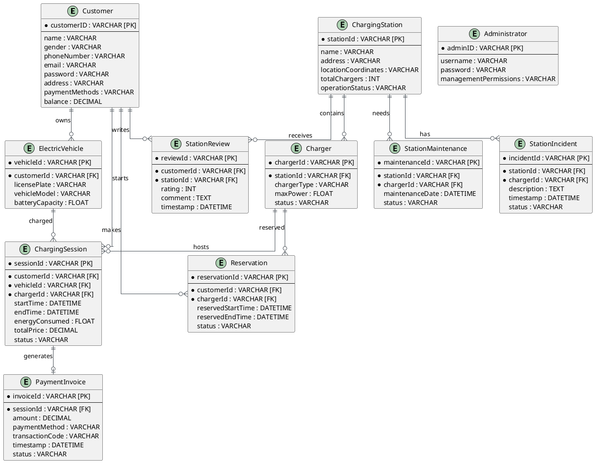

# BÀI 5: THIẾT KẾ CƠ SỞ DỮ LIỆU

---

## 5.1. CÁC THỰC THỂ VÀ THUỘC TÍNH

Dựa trên cấu trúc lớp ở Bài 4, hệ thống Quản lý trạm sạc xe điện được xây dựng cơ sở dữ liệu quan hệ với các thực thể và thuộc tính tiếng Anh đồng bộ như sau:

* **Customer (Khách hàng)**
  - Thuộc tính: `customerID`, `name`, `gender`, `phoneNumber`, `email`, `password`, `address`, `paymentMethods`, `balance`
* **Administrator (Quản trị viên)**
  - Thuộc tính: `adminID`, `username`, `password`, `managementPermissions`
* **ElectricVehicle (Xe điện)**
  - Thuộc tính: `vehicleId`, `customerId`, `licensePlate`, `vehicleModel`, `batteryCapacity`
* **ChargingStation (Trạm sạc)**
  - Thuộc tính: `stationId`, `name`, `address`, `locationCoordinates`, `totalChargers`, `operationStatus`
* **Charger (Trụ sạc)**
  - Thuộc tính: `chargerId`, `stationId`, `chargerType`, `maxPower`, `status`
* **Reservation (Đặt chỗ trước)**
  - Thuộc tính: `reservationId`, `customerId`, `chargerId`, `reservedStartTime`, `reservedEndTime`, `status`
* **ChargingSession (Phiên sạc)**
  - Thuộc tính: `sessionId`, `customerId`, `vehicleId`, `chargerId`, `startTime`, `endTime`, `energyConsumed`, `totalPrice`, `status`
* **PaymentInvoice (Hóa đơn thanh toán)**
  - Thuộc tính: `invoiceId`, `sessionId`, `amount`, `paymentMethod`, `transactionCode`, `timestamp`, `status`
* **StationReview (Đánh giá trạm sạc)**
  - Thuộc tính: `reviewId`, `customerId`, `stationId`, `rating`, `comment`, `timestamp`
* **StationMaintenance (Bảo trì trạm sạc)**
  - Thuộc tính: `maintenanceId`, `stationId`, `chargerId`, `maintenanceDate`, `status`
* **StationIncident (Sự cố trạm sạc)**
  - Thuộc tính: `incidentId`, `stationId`, `chargerId`, `description`, `timestamp`, `status`

---

## 5.2. MỐI QUAN HỆ GIỮA CÁC THỰC THỂ

* **Customer – Owns – ElectricVehicle**
  - *Mô tả:* Quan hệ 1 - Nhiều (1 khách hàng sở hữu nhiều xe điện).
* **Customer – Makes – Reservation**
  - *Mô tả:* Quan hệ 1 - Nhiều (1 khách hàng thực hiện nhiều đơn đặt chỗ trước).
* **Charger – Receives – Reservation**
  - *Mô tả:* Quan hệ 1 - Nhiều (1 trụ sạc nhận nhiều lượt đặt chỗ theo thời gian).
* **Customer – Initiates – ChargingSession**
  - *Mô tả:* Quan hệ 1 - Nhiều (1 khách hàng thực hiện nhiều phiên sạc).
* **ElectricVehicle – Undergoes – ChargingSession**
  - *Mô tả:* Quan hệ 1 - Nhiều (1 xe điện tham gia vào nhiều phiên sạc).
* **Charger – Hosts – ChargingSession**
  - *Mô tả:* Quan hệ 1 - Nhiều (1 trụ sạc phục vụ nhiều phiên sạc).
* **ChargingSession – Generates – PaymentInvoice**
  - *Mô tả:* Quan hệ 1 - 1 (1 phiên sạc tạo ra duy nhất 1 hóa đơn thanh toán).
* **ChargingStation – Contains – Charger**
  - *Mô tả:* Quan hệ thành phần (1 trạm sạc chứa nhiều trụ sạc).
* **Customer – Writes – StationReview**
  - *Mô tả:* Quan hệ 1 - Nhiều (1 khách hàng gửi nhiều đánh giá trạm sạc).
* **ChargingStation – Receives – StationReview**
  - *Mô tả:* Quan hệ 1 - Nhiều (1 trạm sạc nhận nhiều đánh giá từ khách hàng).
* **ChargingStation – Incident/Maintenance**
  - *Mô tả:* Quan hệ 1 - Nhiều (1 trạm sạc có nhiều phiếu bảo trì và báo cáo sự cố kỹ thuật).

---

## 5.3. CHUẨN HÓA 3NF

Các bảng dữ liệu trên hoàn toàn đạt chuẩn hóa 3NF:
* **Đạt chuẩn 1NF:** Tất cả các thuộc tính đều chứa giá trị nguyên tố đơn trị. Không có mảng hoặc nhóm lặp trong các ô dữ liệu (ví dụ: `paymentMethods` và `managementPermissions` được phân rã hoặc lưu dưới dạng quan hệ chuẩn).
* **Đạt chuẩn 2NF:** Đạt 1NF và toàn bộ các cột không phải khóa đều phụ thuộc hoàn toàn vào khóa chính (các bảng đều sử dụng khóa đơn duy nhất).
* **Đạt chuẩn 3NF:** Đạt 2NF và loại bỏ hoàn toàn các phụ thuộc bắc cầu. Các thông tin thực thể liên đới đều được phân tách rõ ràng thành các bảng riêng biệt (`Customer`, `ElectricVehicle`, `ChargingStation`, `Charger`), chỉ giữ lại các khóa ngoại để tham chiếu liên kết.

---

## 5.4. SƠ ĐỒ DATABASE DIAGRAM (ERD)

