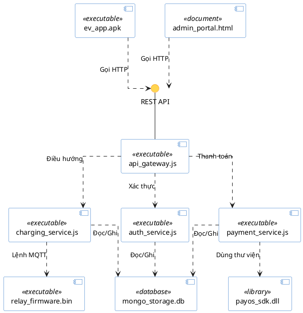
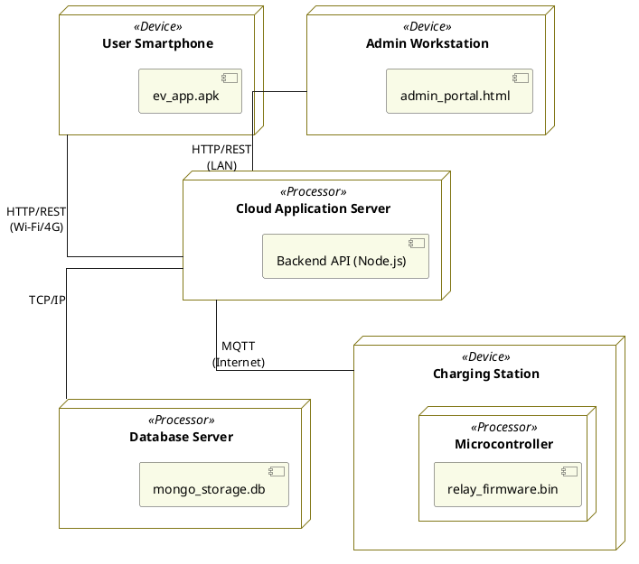

# BÀI 6: THIẾT KẾ HỆ THỐNG

Dựa trên yêu cầu của môn học, hệ thống **Quản lý trạm sạc xe điện** sẽ được thiết kế kiến trúc thông qua hai biểu đồ: Biểu đồ thành phần (Component Diagram) và Biểu đồ triển khai (Deployment Diagram). Các biểu đồ này tuân thủ nghiêm ngặt quy tắc nét đứt, nét liền, và các hình khối theo chuẩn UML.

---

## 6.1 Biểu đồ thành phần (Component Diagram)

Biểu đồ thành phần mô tả cấu trúc vật lý của phần mềm, bao gồm các tệp thực thi (`<<executable>>`), các thư viện (`<<library>>`), các thành phần xử lý nghiệp vụ (`<<component>>`) và cơ sở dữ liệu (`<<database>>`). Nó thể hiện sự phụ thuộc (mũi tên nét đứt) và giao tiếp (giao diện) giữa các thành phần.

### 6.1.1 Phân tích các thành phần

Hệ thống được phân rã thành các tệp tin vật lý (artifact) cụ thể như sau:

1. **Frontend (Giao diện người dùng):**
   - `ev_app.apk (<<executable>>)`: Tệp cài đặt ứng dụng trên điện thoại khách hàng, dùng để tìm trạm sạc, đặt chỗ và thanh toán.
   - `admin_portal.html (<<document>>)`: Trang giao diện web dành cho Quản trị viên để quản lý toàn bộ hệ thống.
2. **Backend (Hệ thống xử lý trung tâm Node.js):**
   - `api_gateway.js (<<executable>>)`: Cổng giao tiếp trung gian (`REST API`) nhận và điều phối mọi request từ Frontend.
   - `auth_service.js (<<executable>>)`: Thành phần xử lý đăng nhập, xác thực và cấp quyền truy cập.
   - `charging_service.js (<<executable>>)`: Thành phần lõi quản lý phiên sạc, trạm sạc và đặt chỗ.
   - `payment_service.js (<<executable>>)`: Thành phần xử lý giao dịch.
   - `payos_sdk.dll (<<library>>)`: Thư viện nhúng của bên thứ 3 dùng để tạo mã VietQR thanh toán.
3. **Database (Cơ sở dữ liệu):**
   - `mongo_storage.db (<<database>>)`: File lưu trữ toàn bộ dữ liệu của hệ thống (MongoDB).
4. **Hardware (Phần cứng):**
   - `relay_firmware.bin (<<executable>>)`: Tệp nhúng điều khiển rơ-le (đóng/ngắt điện) nạp thẳng vào mạch ESP32 tại trụ sạc.

### 6.1.2 Biểu đồ thành phần
*(Tuân thủ: Thành phần có icon hình chữ nhật gắn hình chữ nhật nhỏ, quan hệ phụ thuộc dùng mũi tên nét đứt `..>`, giao diện dùng hình tròn `()` )*

---

## 6.2 Biểu đồ triển khai (Deployment Diagram)

Biểu đồ triển khai biểu diễn kiến trúc cài đặt phần mềm lên hệ thống phần cứng (vật lý).
Nó tuân thủ quy tắc: Các khối hình hộp 3D (Nodes/Processors) và các liên kết truyền thông là đường nét liền (`--`) ghi rõ giao thức kết nối (TCP/IP, HTTP, MQTT).

### 6.2.1 Phân tích các Node vật lý

Hệ thống được triển khai lên các thiết bị và máy chủ vật lý cụ thể:

1. **User Smartphone (`<<Device>>`)**: Điện thoại thông minh của khách hàng chạy iOS/Android, là nơi cài đặt trực tiếp tệp `ev_app.apk`.
2. **Admin Workstation (`<<Device>>`)**: Máy tính của quản trị viên dùng trình duyệt web để mở `admin_portal.html`.
3. **Cloud Application Server (`<<Processor>>`)**: Máy chủ đám mây có bộ vi xử lý mạnh mẽ. Bên trong chứa môi trường thực thi (Node.js) để chạy các file xử lý Backend (`.js`).
4. **Database Server (`<<Processor>>`)**: Máy chủ chuyên dụng dùng để host hệ quản trị CSDL MongoDB và chứa file `mongo_storage.db`.
5. **Charging Station (`<<Device>>`)**: Trạm sạc vật lý. Bên trong chứa mạch vi điều khiển (Microcontroller - ESP32) đóng vai trò là bộ vi xử lý (`<<Processor>>`) để chạy tệp `relay_firmware.bin` điều khiển rơ-le.

### 6.2.2 Biểu đồ triển khai
*(Tuân thủ: Dùng hình hộp 3D, đường truyền thông nét liền có mô tả giao thức)*

