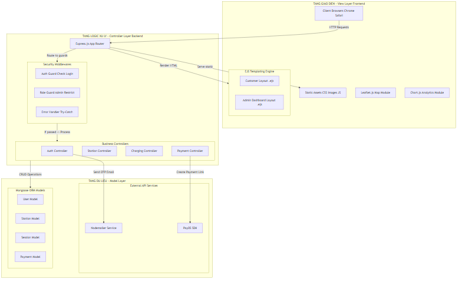
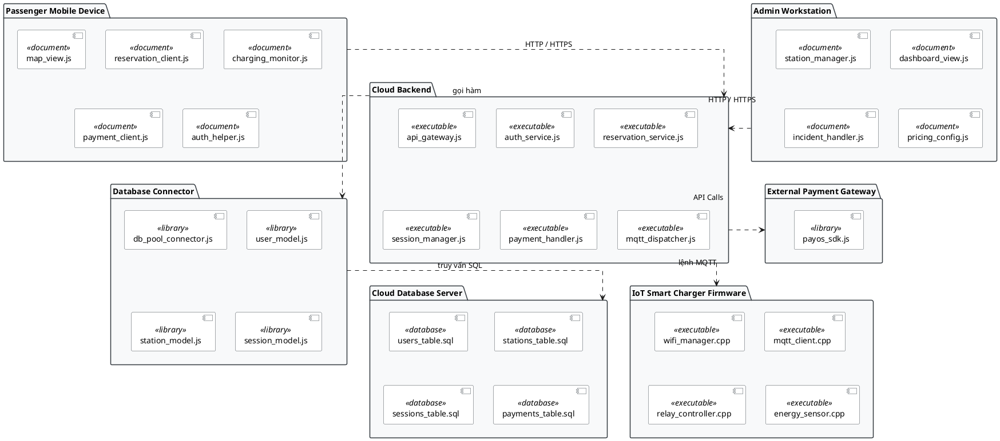
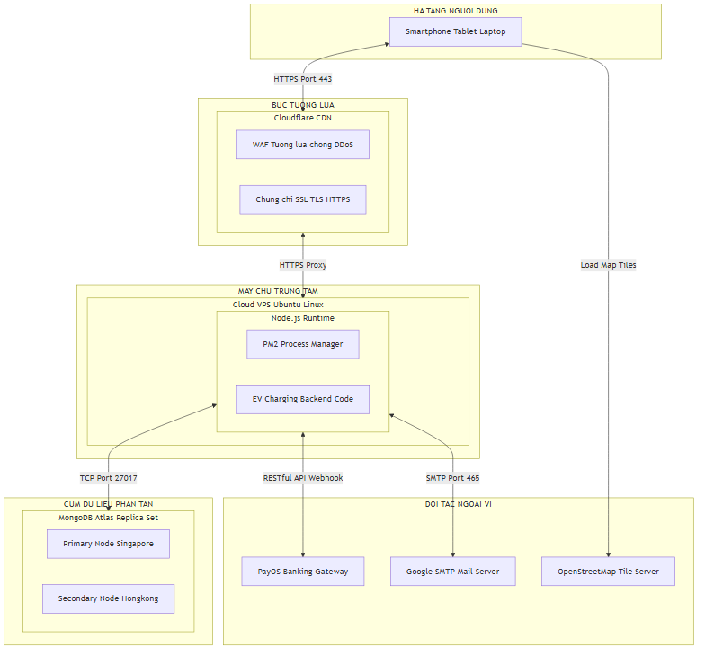
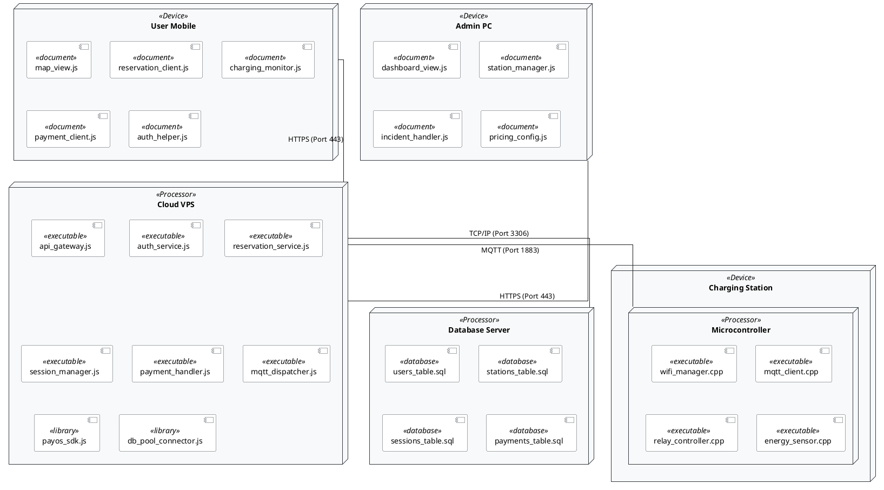

# BÀI 6: THIẾT KẾ HỆ THỐNG

---

Dựa trên các yêu cầu phân tích hệ thống, chương này tập trung thiết kế kiến trúc phần mềm và hạ tầng triển khai vật lý của hệ thống Quản lý Trạm sạc Xe điện thông qua Biểu đồ thành phần (Component Diagram) và Biểu đồ triển khai (Deployment Diagram) chi tiết.

---

## 6.1. BIỂU ĐỒ THÀNH PHẦN (COMPONENT DIAGRAM)

Biểu đồ thành phần mô tả cấu trúc vật lý của các mô-đun phần mềm (tài liệu giao diện, logic backend, các module nhúng và cơ sở dữ liệu) và mối quan hệ phụ thuộc giữa chúng:

---

## 6.2. BIỂU ĐỒ TRIỂN KHAI (DEPLOYMENT DIAGRAM)

Biểu đồ triển khai mô tả cấu trúc phân bổ các thành phần phần mềm lên các thiết bị phần cứng vật lý và các giao thức truyền thông kết nối giữa chúng:

