<div style="text-align: center; font-family: 'Times New Roman', Times, serif; margin-top: 50px;">
  <h2>BÁO CÁO CUỐI KỲ MÔN HỌC</h2>
  <h1>PHÂN TÍCH THIẾT KẾ HỆ THỐNG</h1>
  <h2>HỆ THỐNG QUẢN LÝ TRẠM SẠC XE ĐIỆN</h2>
  <h3>(EV Charging Station Management System)</h3>
</div>

<div style="page-break-after: always;"></div>

---

# BÀI 1: XÁC ĐỊNH YÊU CẦU

---

## 1.1. MÔ TẢ HỆ THỐNG

### 1.1.1. Giới thiệu tổng quan

Hệ thống Quản lý Trạm Sạc Xe Điện (EV Charging Station Management System) là một ứng dụng Web toàn diện được xây dựng nhằm giải quyết bài toán quản lý và vận hành mạng lưới trạm sạc xe điện. Trong bối cảnh xu hướng chuyển đổi từ phương tiện sử dụng nhiên liệu hóa thạch sang xe điện đang diễn ra mạnh mẽ trên toàn cầu, nhu cầu về một hệ thống quản lý trạm sạc thông minh, tự động hóa và thân thiện với người dùng là vô cùng cấp thiết.

Hệ thống được thiết kế để phục vụ hai nhóm đối tượng chính: Khách hàng sử dụng dịch vụ sạc xe và Quản trị viên vận hành hệ thống. Toàn bộ quy trình từ tìm kiếm trạm sạc trên bản đồ tương tác, đặt chỗ trước, sạc xe theo thời gian thực, thanh toán qua ví điện tử cho đến quản lý hạ tầng và báo cáo doanh thu đều được số hóa và tự động hóa hoàn toàn thông qua nền tảng Web.

Hệ thống được xây dựng trên nền tảng công nghệ hiện đại: Node.js làm môi trường Runtime phía máy chủ, Express.js làm Web Framework, MongoDB Atlas làm cơ sở dữ liệu NoSQL trên đám mây, EJS làm View Engine để render giao diện HTML động, và tích hợp các dịch vụ bên ngoài như PayOS (cổng thanh toán VietQR) và Nodemailer (gửi Email OTP qua Gmail SMTP).

### 1.1.2. Nghiệp vụ — Công việc hệ thống sẽ làm

Hệ thống thực hiện các nghiệp vụ chính sau đây, được phân chia theo từng nhóm đối tượng sử dụng:

**A. Nghiệp vụ dành cho Khách hàng (Customer):**

**1. Đăng ký và Xác thực tài khoản:**
Khách hàng truy cập trang web và thực hiện đăng ký tài khoản mới bằng cách cung cấp các thông tin: Họ và tên đầy đủ, Địa chỉ Email (đồng thời là tên đăng nhập), Số điện thoại liên hệ, và Mật khẩu. Hệ thống yêu cầu mật khẩu phải tuân thủ chính sách bảo mật nghiêm ngặt: tối thiểu 6 ký tự, phải chứa ít nhất 1 chữ cái viết hoa và 1 ký tự đặc biệt (ví dụ: @, #, $, %). Sau khi nhận được thông tin đăng ký, máy chủ (Server) thực hiện các bước xử lý: (a) Kiểm tra Email đã tồn tại trong cơ sở dữ liệu chưa, (b) Băm mật khẩu bằng thuật toán bcrypt với 12 vòng lặp (salt rounds) để đảm bảo an toàn tuyệt đối ngay cả khi cơ sở dữ liệu bị xâm phạm, (c) Sinh mã OTP ngẫu nhiên 6 chữ số có thời hạn 5 phút, (d) Lưu thông tin người dùng vào MongoDB với trạng thái isActive = false (chưa kích hoạt), (e) Gửi mã OTP qua Email thông qua dịch vụ Nodemailer kết nối máy chủ Gmail SMTP. Khách hàng phải nhập đúng mã OTP nhận được qua Email để kích hoạt tài khoản, lúc này trường isActive được chuyển thành true.

**2. Đăng nhập và Phân quyền truy cập:**
Hệ thống hỗ trợ đăng nhập bằng Email và Mật khẩu. Quy trình xử lý đăng nhập phía Server: (a) Truy vấn MongoDB tìm document User có email tương ứng, (b) Sử dụng hàm bcrypt.compare() để so sánh mật khẩu nhập vào với chuỗi hash đã lưu, (c) Kiểm tra trường isActive — nếu tài khoản chưa kích hoạt, hệ thống tự động gửi lại mã OTP và chuyển hướng đến trang xác thực, (d) Nếu đăng nhập thành công, Server tạo một Session Cookie được lưu trữ trên MongoDB (thông qua thư viện connect-mongo với MongoStore) với thời hạn 7 ngày. Session chứa các thông tin quan trọng: _id, fullName, email, phone, role, avatar, balance. (e) Hệ thống tự động phân quyền dựa trên trường role: nếu role = 'customer' thì chuyển hướng đến giao diện Khách hàng (/customer), nếu role = 'admin' thì chuyển hướng đến bảng điều khiển Quản trị (/admin/dashboard). Đặc biệt, hệ thống có cơ chế returnTo: nếu người dùng chưa đăng nhập mà cố truy cập một trang yêu cầu xác thực, URL đó sẽ được lưu lại và tự động chuyển hướng sau khi đăng nhập thành công.

**3. Khôi phục mật khẩu (Forgot Password):**
Khi quên mật khẩu, khách hàng truy cập trang /auth/forgot-password và nhập Email đã đăng ký. Hệ thống không tiết lộ Email có tồn tại hay không (chống dò quét tài khoản — Security Best Practice). Nếu Email hợp lệ, hệ thống sinh mã OTP 6 số, gửi qua Email với template HTML chuyên nghiệp (tiêu đề "Khôi phục mật khẩu EV Charge", nội dung gồm logo, mã OTP nổi bật, và ghi chú thời hạn 5 phút). Sau khi xác thực OTP thành công, khách hàng được chuyển đến trang đặt lại mật khẩu mới. Mật khẩu mới phải tuân thủ cùng chính sách bảo mật như khi đăng ký.

**4. Tìm kiếm trạm sạc trên bản đồ tương tác (GIS Map):**
Đây là chức năng cốt lõi nhất của phía khách hàng. Hệ thống tích hợp thư viện JavaScript mã nguồn mở Leaflet.js để hiển thị bản đồ tương tác toàn màn hình. Các trạm sạc được đánh dấu bằng các marker (điểm đánh dấu) trên bản đồ. Khi khách hàng bấm vào một marker, một popup (cửa sổ nổi) hiển thị thông tin tóm tắt: tên trạm, địa chỉ, đơn giá điện (VNĐ/kWh), số lượng súng sạc khả dụng/tổng, và nút "Xem chi tiết". Phía Backend, hệ thống sử dụng chỉ mục không gian 2dsphere (Geospatial Index) của MongoDB được khai báo trên trường location (GeoJSON Point) để thực hiện truy vấn không gian (Geospatial Query), tìm các trạm sạc trong bán kính lân cận vị trí GPS hiện tại của khách hàng. Phía trên bản đồ có thanh tìm kiếm cho phép lọc trạm theo tên hoặc địa chỉ bằng biểu thức chính quy (Regular Expression) không phân biệt hoa thường.

**5. Đặt chỗ sạc trước (Reservation):**
Khách hàng có thể "đặt gạch" một súng sạc cụ thể tại một trạm sạc trước khi di chuyển đến. Quy trình: chọn trạm sạc, chọn vị trí súng sạc (connectorIndex), chọn thời gian dự kiến đến (scheduledTime), nhập thời lượng dự kiến sạc (duration, mặc định 60 phút). Hệ thống tạo một document Reservation với trạng thái pending. Khách hàng có thể hủy đặt chỗ bất cứ lúc nào trước thời gian hẹn.

**6. Sạc xe và Theo dõi thời gian thực (Real-time Charging):**
Khi đến trạm sạc, khách hàng bấm nút "Bắt đầu sạc" trên giao diện Web. Hệ thống thực hiện các bước: (a) Kiểm tra số dư ví điện tử >= 200.000 VNĐ (yêu cầu tối thiểu để đảm bảo thanh toán), (b) Kiểm tra súng sạc được chọn có trạng thái available không, (c) Tạo một document ChargingSession với status = 'charging' và ghi nhận startTime, (d) Chuyển trạng thái súng sạc từ available sang in_use trong mảng connectors embedded của Station. Trong suốt quá trình sạc, giao diện Client sử dụng kỹ thuật Polling — gọi API GET /customer/charging/:id/status mỗi 2 giây — để cập nhật các chỉ số thời gian thực: công suất hiện tại (kW), lượng điện đã nạp (kWh), phần trăm pin (%), và tổng chi phí tạm tính (VNĐ). Khi khách hàng bấm "Dừng sạc" hoặc lượng điện đạt đến targetEnergy, hệ thống tự động: chốt hóa đơn (tính totalCost = energyDelivered * pricePerKwh), trừ tiền từ ví điện tử (balance -= totalCost), cập nhật paymentStatus = 'paid', giải phóng súng sạc (connector.status = 'available'), và cộng doanh thu vào trạm sạc (station.totalRevenue += totalCost).

**7. Ví điện tử và Nạp tiền qua VietQR:**
Mỗi tài khoản khách hàng được trang bị một ví điện tử nội bộ (trường balance trong collection users). Khách hàng nạp tiền vào ví thông qua cổng thanh toán PayOS. Quy trình: (a) Khách nhập số tiền muốn nạp (tối thiểu 10.000 VNĐ), (b) Server gọi PayOS SDK tạo Payment Link kèm mã đơn hàng (orderCode = Date.now()), thời hạn thanh toán 2 phút, URL callback (returnUrl/cancelUrl), (c) PayOS trả về checkoutUrl và mã QR theo chuẩn VietQR, (d) Giao diện hiển thị mã QR để khách quét bằng ứng dụng ngân hàng, (e) Khi khách chuyển khoản thành công, PayOS gửi Webhook callback HTTP POST đến endpoint /webhook/payos của hệ thống, (f) Server xác minh tính toàn vẹn dữ liệu Webhook bằng chữ ký HMAC checksum (sử dụng hàm payos.webhooks.verifyPaymentWebhookData), (g) Nếu hợp lệ, Server cập nhật Payment status = 'completed' và cộng tiền vào balance.

**8. Xem lịch sử giao dịch:**
Khách hàng xem lại toàn bộ lịch sử phiên sạc và giao dịch tài chính. Hệ thống truy vấn các document ChargingSession và Payment có user = userId, sắp xếp theo thời gian mới nhất (sort createdAt: -1). Mỗi bản ghi hiển thị đầy đủ: thời gian bắt đầu/kết thúc, tên trạm sạc, lượng điện tiêu thụ (kWh), đơn giá, tổng tiền, trạng thái thanh toán.

**9. Quản lý hồ sơ cá nhân:**
Khách hàng cập nhật thông tin cá nhân: họ tên, số điện thoại. Khách hàng cũng có thể đổi mật khẩu (yêu cầu nhập mật khẩu cũ để xác minh).

**B. Nghiệp vụ dành cho Quản trị viên (Admin):**

**1. Dashboard thống kê tổng quan:**
Bảng điều khiển (Dashboard) được thiết kế theo phong cách Dark Mode chuyên nghiệp, hiển thị các chỉ số KPI (Key Performance Indicator) quan trọng: Tổng số trạm sạc trong hệ thống, Số trạm sạc đang hoạt động (status = active), Tổng số khách hàng đã đăng ký, Tổng số phiên sạc đã thực hiện, Số phiên sạc đang diễn ra thời gian thực (status = charging), Tổng doanh thu tích lũy (tính bằng MongoDB Aggregation Pipeline: match paymentStatus = 'paid' rồi group sum totalCost), Số yêu cầu bảo trì đang chờ xử lý. Biểu đồ doanh thu được vẽ bằng thư viện Chart.js với 3 chế độ xem: Theo Tuần (nhóm theo ngày trong tuần — $dayOfWeek), Theo Tháng (nhóm theo tuần trong tháng — $week), và Theo Năm (nhóm theo tháng trong năm — $month). Bên cạnh biểu đồ cột doanh thu là biểu đồ tròn (Doughnut Chart) thể hiện phân bố trạng thái trạm sạc (active/inactive/maintenance). Cuối Dashboard là bảng 10 phiên sạc gần nhất, populate thông tin tên khách hàng và tên trạm sạc.

**2. Quản lý trạm sạc — Thao tác CRUD đầy đủ:**
- **Create (Thêm mới):** Admin nhập thông tin: tên trạm, địa chỉ, tọa độ GPS (kinh độ longitude, vĩ độ latitude), đơn giá điện (VNĐ/kWh), mô tả. Admin thêm động nhiều súng sạc, mỗi súng sạc chọn loại đầu cắm (Type1, Type2, CCS, CHAdeMO, Tesla) và nhập công suất (kW). Hệ thống lưu tọa độ dưới dạng GeoJSON Point { type: 'Point', coordinates: [lng, lat] }, các súng sạc được lưu dưới dạng mảng embedded (connectors) bên trong document Station. Sau khi tạo thành công, hệ thống ghi nhận thông báo vào biến toàn cục global.adminNotifications để hiển thị real-time trên giao diện.
- **Read (Xem):** Hiển thị danh sách trạm sạc dạng bảng DataTable với các cột: Tên, Địa chỉ, Giá/kWh, Số súng sạc, Trạng thái, Hành động. Có thanh tìm kiếm theo tên hoặc địa chỉ (sử dụng $regex MongoDB).
- **Update (Sửa):** Admin sửa mọi thông tin trạm sạc, bao gồm cả trạng thái (active/inactive/maintenance).
- **Delete (Xóa):** Xóa trạm sạc khỏi hệ thống, hệ thống ghi nhận thông báo xóa.

**3. Quản lý người dùng:** Admin xem danh sách toàn bộ khách hàng. Admin khóa/mở tài khoản bằng nút toggle. Admin xóa tài khoản vĩnh viễn.

**4. Cấu hình bảng giá điện theo khung giờ:** Admin tạo các gói giá: Giá tiêu chuẩn (standard), Giá giờ cao điểm (peak), Giá giờ thấp điểm (off_peak), Giá cuối tuần (weekend). Mỗi gói gồm: tên, đơn giá, giờ bắt đầu, giờ kết thúc, mô tả.

**5. Báo cáo kế toán:** Hệ thống tổng hợp báo cáo doanh thu chi tiết từ các document ChargingSession đã thanh toán.

**6. Quản lý bảo trì thiết bị:** Admin tạo phiếu bảo trì khi phát hiện sự cố (loại: khẩn cấp/định kỳ/kiểm tra), ghi nhận trạm bị ảnh hưởng, mô tả sự cố, chỉ định kỹ thuật viên, theo dõi tiến độ, ghi nhận chi phí sửa chữa.

**7. Xử lý hoàn tiền:** Admin duyệt và xử lý hoàn tiền cho khách hàng khi có sự cố.

### 1.1.3. Thiết bị sử dụng

| STT | Thiết bị | Mục đích | Yêu cầu |
|:---:|:---|:---|:---|
| 1 | Điện thoại thông minh | Khách hàng tìm trạm sạc, đặt chỗ, theo dõi sạc, nạp tiền | Chrome/Safari, Internet, GPS |
| 2 | Máy tính bảng | Truy cập hệ thống | Trình duyệt hiện đại |
| 3 | Máy tính xách tay / PC | Admin quản lý hệ thống qua Dashboard | Chrome, Internet |
| 4 | Cloud VPS Ubuntu | Chạy Node.js Backend | Node.js v22+, PM2 |
| 5 | MongoDB Atlas Cloud | Lưu trữ dữ liệu | Replica Set 3 node |

### 1.1.4. Đối tượng sử dụng hệ thống — Tác nhân (Actors)

| STT | Tác nhân | Vai trò chi tiết |
|:---:|:---|:---|
| 1 | **Khách hàng (Customer)** | Người sở hữu xe điện, sử dụng dịch vụ sạc xe. Là nguồn tạo ra doanh thu chính. Tương tác qua giao diện Web trên điện thoại hoặc máy tính. |
| 2 | **Quản trị viên (Admin)** | Nhân viên vận hành. Toàn quyền quản lý hạ tầng trạm sạc, người dùng, bảng giá, báo cáo tài chính và bảo trì. Truy cập qua Dashboard trên máy tính. |
| 3 | **Cổng thanh toán PayOS** | Hệ thống bên ngoài (External System), trung gian xử lý giao dịch ngân hàng. Tự động gửi Webhook khi khách chuyển khoản thành công. |

## 1.2. PHẠM VI CỦA HỆ THỐNG

### 1.2.1. Phạm vi chức năng (Trong phạm vi)

- **Quản lý danh tính:** Đăng ký, Đăng nhập, Xác thực OTP qua Email, Khôi phục mật khẩu, Phân quyền Customer/Admin.
- **Quản lý trạm sạc:** CRUD trạm sạc, Quản lý súng sạc embedded, Hiển thị trên bản đồ GIS Leaflet.js, Tìm kiếm Geospatial.
- **Quản lý giao dịch sạc xe:** Đặt chỗ trước, Bắt đầu/Dừng sạc, Theo dõi thời gian thực bằng Polling, Chốt hóa đơn tự động.
- **Quản lý tài chính:** Ví điện tử nội bộ, Nạp tiền qua VietQR (PayOS SDK), Xác minh Webhook HMAC, Lịch sử giao dịch.
- **Quản lý vận hành:** Dashboard KPI với Chart.js, Biểu đồ doanh thu (Tuần/Tháng/Năm), Bảng giá động, Bảo trì thiết bị, Hoàn tiền.

### 1.2.2. Ngoài phạm vi

- Không quản lý phần cứng vật lý thực tế của trụ sạc (không điều khiển dòng điện, không đọc cảm biến IoT).
- Không tích hợp ứng dụng di động Native (iOS/Android), chỉ hoạt động trên trình duyệt Web (Responsive).
- Không xử lý thuế VAT hoặc xuất hóa đơn đỏ theo quy định kế toán Việt Nam.

<div style="page-break-after: always;"></div>

---

# BÀI 2: PHÁT HỌA GIAO DIỆN HỆ THỐNG

---

## 2.1. GIAO DIỆN XÁC THỰC (Authentication)

### 2.1.1. Trang Đăng nhập

Giao diện đăng nhập được thiết kế theo phong cách hiện đại, sử dụng gradient màu xanh lá cây (#00d26a) làm chủ đạo, phù hợp với thương hiệu "Năng lượng xanh" của hệ thống. Bố cục chia làm 2 phần: bên trái là hình minh họa xe điện đang sạc, bên phải là form đăng nhập. Form gồm 2 ô nhập liệu (Email và Mật khẩu), nút "Đăng nhập" nổi bật, liên kết "Quên mật khẩu?" và liên kết "Chưa có tài khoản? Đăng ký ngay". Thiết kế responsive, trên điện thoại form sẽ chiếm toàn bộ màn hình.


### 2.1.2. Trang Đăng ký

Giao diện đăng ký mở rộng từ trang đăng nhập (cùng file login.ejs, chuyển đổi bằng biến isRegister). Bổ sung thêm các trường: Họ và tên, Số điện thoại, Mật khẩu và Xác nhận mật khẩu. Giao diện hiển thị gợi ý chính sách mật khẩu (ít nhất 1 chữ hoa + 1 ký tự đặc biệt) ngay dưới ô nhập để người dùng biết trước khi submit.


### 2.1.3. Trang Xác thực OTP

Sau khi đăng ký, hệ thống chuyển hướng đến trang nhập mã OTP 6 số. Giao diện hiển thị rõ Email đã đăng ký để người dùng biết kiểm tra đúng hộp thư. Có hướng dẫn "Mã OTP có hiệu lực trong 5 phút" và nút Xác nhận.


### 2.1.4. Trang Quên mật khẩu

Giao diện đơn giản: 1 ô nhập Email và nút "Gửi mã OTP". Thiết kế tối giản, tập trung vào hành động duy nhất.


### 2.1.5. Trang Đặt lại mật khẩu

Sau khi xác thực OTP khôi phục thành công, khách hàng nhập mật khẩu mới và xác nhận. Giao diện giống trang đăng ký nhưng chỉ có 2 ô: Mật khẩu mới và Xác nhận mật khẩu mới.


## 2.2. GIAO DIỆN KHÁCH HÀNG (Customer)

### 2.2.1. Trang chủ Khách hàng

Trang chủ hiển thị lời chào cá nhân hóa ("Xin chào, [Tên]!"), các trạm sạc gần đây dạng card ngang, và thanh điều hướng dạng Bottom Navigation Bar (Trang chủ, Bản đồ, Ví tiền, Lịch sử, Hồ sơ) phù hợp với trải nghiệm di động (Mobile-First). Giao diện sử dụng tone màu xanh lá (#00d26a) xuyên suốt, tạo cảm giác năng lượng sạch và thân thiện môi trường.


### 2.2.2. Bản đồ Trạm sạc (GIS Map)

Đây là màn hình cốt lõi nhất của phía khách hàng. Bản đồ tương tác toàn màn hình được xây dựng bằng thư viện Leaflet.js, sử dụng tile map từ OpenStreetMap. Toàn bộ trạm sạc được hiển thị dưới dạng marker (điểm đánh dấu) với biểu tượng sạc điện tùy chỉnh. Khi bấm vào marker, popup nổi hiển thị: tên trạm, địa chỉ, giá điện (VNĐ/kWh), số súng sạc khả dụng/tổng, và nút "Xem chi tiết" chuyển đến trang chi tiết trạm. Phía trên bản đồ có thanh tìm kiếm cho phép lọc trạm theo tên hoặc địa chỉ. Bản đồ tự động lấy vị trí GPS hiện tại của người dùng (nếu được cấp quyền) và hiển thị marker vị trí của họ.


### 2.2.3. Chi tiết Trạm sạc

Khi khách hàng bấm vào một trạm sạc trên bản đồ, màn hình chi tiết hiển thị đầy đủ: tên trạm, địa chỉ đầy đủ, đơn giá điện, giờ hoạt động, mô tả. Phần quan trọng nhất là danh sách từng súng sạc: hiển thị dạng card với thông tin loại đầu cắm (Type1/Type2/CCS/CHAdeMO/Tesla), công suất (kW), và trạng thái (Available — màu xanh, In Use — màu cam, Maintenance — màu đỏ). Có 2 nút hành động: "Đặt chỗ" và "Bắt đầu sạc" (chỉ hiện khi súng sạc Available).


### 2.2.4. Ví điện tử và Nạp tiền

Giao diện ví điện tử hiển thị số dư hiện tại nổi bật ở trên cùng (font lớn, in đậm). Phía dưới là form nạp tiền: ô nhập số tiền, các nút gợi ý nhanh (50K, 100K, 200K, 500K), và nút "Nạp tiền". Khi bấm Nạp tiền, modal popup hiển thị mã QR VietQR để khách quét bằng app ngân hàng. Bên dưới form nạp tiền là danh sách lịch sử giao dịch (nạp tiền — màu xanh, trừ tiền sạc — màu đỏ) sắp xếp theo thời gian mới nhất.


### 2.2.5. Lịch sử Giao dịch

Màn hình hiển thị toàn bộ lịch sử phiên sạc dạng danh sách card. Mỗi card gồm: ngày giờ sạc, tên trạm sạc, lượng điện tiêu thụ (kWh), tổng tiền (VNĐ), và trạng thái (Completed — badge xanh, Cancelled — badge đỏ). Bấm vào card để xem chi tiết hóa đơn.


### 2.2.6. Hồ sơ cá nhân

Khách hàng xem và chỉnh sửa thông tin: họ tên, email (không đổi được), số điện thoại, ảnh đại diện. Giao diện dạng tab: Tab "Thông tin" và Tab "Đổi mật khẩu". Tab đổi mật khẩu yêu cầu nhập mật khẩu cũ để xác minh trước khi cho phép đặt mật khẩu mới.


## 2.3. GIAO DIỆN QUẢN TRỊ VIÊN (Admin Dashboard)

### 2.3.1. Bảng điều khiển tổng quan (Dashboard)

Dashboard được thiết kế theo phong cách Dark Mode sang trọng, chuyên nghiệp. Bố cục gồm: Thanh sidebar trái (menu điều hướng: Dashboard, Trạm sạc, Người dùng, Bảng giá, Báo cáo, Bảo trì, Cài đặt). Phần trên cùng của nội dung chính là 4 thẻ KPI card nổi bật với biểu tượng và số liệu: Tổng trạm sạc, Tổng người dùng, Tổng phiên sạc, Tổng doanh thu. Phía dưới chia 2 cột: cột trái là biểu đồ cột/đường doanh thu theo thời gian (Chart.js) với 3 tab chuyển đổi Tuần/Tháng/Năm; cột phải là biểu đồ tròn Doughnut phân bố trạng thái trạm sạc. Cuối trang là bảng DataTable hiển thị 10 phiên sạc gần nhất (populate tên khách hàng + tên trạm).


### 2.3.2. Quản lý Trạm sạc

Giao diện dạng DataTable hiển thị danh sách trạm sạc với các cột: Tên trạm, Địa chỉ, Giá/kWh, Số súng sạc, Trạng thái (badge màu: Active-xanh, Inactive-xám, Maintenance-cam), Hành động (nút Sửa — icon bút, nút Xóa — icon thùng rác màu đỏ, có xác nhận SweetAlert2 chống xóa nhầm). Phía trên bảng có nút "Thêm trạm mới" và thanh tìm kiếm.


### 2.3.3. Form Thêm/Sửa Trạm sạc

Form nhập liệu chi tiết: Tên trạm, Địa chỉ, Tọa độ GPS (2 ô nhập Latitude/Longitude), Đơn giá điện, Mô tả. Phần đặc biệt: khu vực "Danh sách súng sạc" cho phép Admin thêm động nhiều súng sạc bằng nút "Thêm súng sạc" — mỗi dòng gồm dropdown chọn loại đầu cắm (Type1/Type2/CCS/CHAdeMO/Tesla) và ô nhập công suất (kW).


### 2.3.4. Quản lý Người dùng

Bảng danh sách người dùng: Họ tên, Email, Số dư ví (định dạng VNĐ), Trạng thái (Active — badge xanh, Inactive — badge đỏ), Ngày đăng ký, Hành động (nút Toggle khóa/mở, nút Xóa).


### 2.3.5. Báo cáo Kế toán

Giao diện báo cáo tổng hợp: biểu đồ phân tích doanh thu theo thời gian, bảng chi tiết từng giao dịch đã thanh toán, tổng doanh thu tích lũy.


### 2.3.6. Quản lý Bảo trì

Bảng danh sách phiếu bảo trì: Trạm sạc, Loại (Emergency — badge đỏ, Scheduled — badge xanh), Mô tả sự cố, Trạng thái (Pending/In Progress/Completed), Kỹ thuật viên, Chi phí, Ngày tạo. Có form tạo phiếu bảo trì mới ngay trên trang.


### 2.3.7. Cài đặt Hệ thống

Giao diện cài đặt cho phép Admin tùy chỉnh các thông số hệ thống và xem thông tin cấu hình.


<div style="page-break-after: always;"></div>

---

# BÀI 3: PHÂN TÍCH CHỨC NĂNG

## I. TÌM TÁC NHÂN (ACTORS)

Tác nhân là các thực thể bên ngoài tương tác với hệ thống. Trong Hệ thống Quản lý Trạm Sạc Xe Điện, các tác nhân bao gồm:

- **Khách hàng (Customer):** Chủ phương tiện xe điện sử dụng thiết bị di động (Mobile UI) để đăng ký/đăng nhập, tìm trạm sạc trên bản đồ, đặt chỗ trước, khởi động/theo dõi phiên sạc, thực hiện thanh toán tự động và nạp tiền vào ví điện tử.
- **Quản trị viên (Admin):** Người vận hành hệ thống sử dụng trình duyệt máy tính (Desktop Dashboard) để quản lý trạm sạc, cấu hình bảng giá điện, kiểm soát tài khoản người dùng, lập lịch bảo trì, xử lý hoàn tiền sự cố và xem báo cáo thống kê doanh thu.
- **Cổng thanh toán (PayOS):** Hệ thống thanh toán bên thứ ba, tự động sinh mã QR động VietQR và gửi Webhook (HTTP POST) để xác nhận giao dịch nạp tiền thành công của khách hàng.
- **Hệ thống gửi email (SMTP Server):** Hệ thống máy chủ gửi email tự động được gọi bởi ứng dụng để gửi mã OTP xác thực khi đăng ký tài khoản hoặc khôi phục mật khẩu.

---

## II. TÌM USE CASE (CHỨC NĂNG)

Dựa trên các yêu cầu nghiệp vụ và giao diện màn hình thực tế của hệ thống, các Use Case được chia thành 2 phân hệ chính (Server & Client) với các chức năng chi tiết như sau:

### 1. Về phía Server (Trung tâm điều phối & Quản lý vận hành của Admin)

➢ **Chức năng Đăng nhập & Xác thực hệ thống:**
+ Xác thực tài khoản quản trị viên (đăng nhập bằng email/mật khẩu quản trị, phân quyền truy cập trang Admin).
+ Bảo mật phiên làm việc (mã hóa mật khẩu bằng Bcrypt, tự động hết hạn session sau khoảng thời gian không hoạt động).

➢ **Chức năng Quản lý trạm sạc xe điện:**
+ Theo dõi danh sách và trạng thái hoạt động của các trạm sạc trong thành phố (Đang hoạt động, Bảo trì, Ngừng hoạt động).
+ Thêm trạm sạc mới (nhập tên, địa chỉ, định vị tọa độ kinh độ/vĩ độ GPS, đơn giá điện sạc, cấu hình danh sách trụ sạc với loại súng sạc và công suất sạc).
+ Chỉnh sửa thông tin trạm sạc (cập nhật đơn giá điện, thay đổi trạng thái hoạt động).
+ Xóa trạm sạc khỏi hệ thống (chỉ cho phép xóa khi không có xe nào đang sạc tại trạm đó).

➢ **Chức năng Quản lý người dùng (Khách hàng):**
+ Tra cứu danh sách tài khoản khách hàng (Họ tên, email, số điện thoại, số dư ví, ngày tạo tài khoản).
+ Khóa/Mở khóa tài khoản khách hàng (chuyển trạng thái `isActive = false` để chặn đăng nhập đối với tài khoản vi phạm hoặc theo yêu cầu).

➢ **Chức năng Cấu hình hệ thống & Thiết lập bảng giá điện:**
+ Cấu hình biểu giá sạc điện (đơn giá tiêu chuẩn theo kWh, cài đặt khung giờ cao điểm/thấp điểm).
+ Thiết lập các tham số hệ thống chung (như số dư tối thiểu trong ví để bắt đầu sạc, thời gian giữ chỗ tối đa).

➢ **Chức năng Thống kê doanh thu & Báo cáo:**
+ Tổng hợp các chỉ số KPI vận hành thời gian thực (tổng doanh thu, tổng số trạm sạc, số cổng sạc đang hoạt động, tổng số khách hàng).
+ Vẽ biểu đồ trực quan hóa xu hướng doanh thu theo thời gian (ngày, tuần, tháng, năm) bằng Chart.js.
+ Lọc và xuất dữ liệu hóa đơn giao dịch chi tiết theo khoảng thời gian tùy chọn.

➢ **Chức năng Quản lý bảo trì thiết bị:**
+ Lập phiếu yêu cầu bảo trì khi có trạm/trụ sạc gặp sự cố (ghi nhận lỗi, phân công nhân viên kỹ thuật phụ trách).
+ Tự động đồng bộ trạng thái thiết bị sang "Bảo trì" (chặn khách hàng đặt chỗ hoặc sạc tại trụ lỗi).
+ Cập nhật tiến độ bảo trì và tự động kích hoạt lại trụ sạc sang trạng thái sẵn sàng khi hoàn thành sửa chữa.

➢ **Chức năng Xử lý yêu cầu hoàn tiền (Refunds):**
+ Tiếp nhận và tra cứu thông tin phiên sạc bị lỗi kỹ thuật (mất điện, lỗi trụ sạc) qua mã giao dịch.
+ Bồi hoàn tiền tự động cộng số dư vào ví điện tử của khách hàng.
+ Ghi nhận lịch sử hoàn tiền và cập nhật trạng thái thanh toán của phiên sạc thành "refunded".

---

### 2. Các chức năng chính về phía Client (Trạm sạc vật lý & Ứng dụng người dùng)

#### A. Trạm sạc & Trụ sạc vật lý (Client - Hệ thống sạc tự động)

➢ **Chức năng nhận tín hiệu & cấp điện:**
+ Phát hiện kết nối vật lý khi súng sạc cắm vào cổng nhận của xe điện và kiểm tra sự tương thích.
+ Nhận lệnh kích hoạt sạc từ server và thực hiện cấp nguồn điện sạc an toàn cho xe.
+ Tự động ngắt nguồn cấp điện khi pin xe đầy 100% hoặc khi nhận lệnh dừng sạc chủ động từ server.

➢ **Chức năng truyền thông số thời gian thực:**
+ Đo đạc liên tục các thông số kỹ thuật (điện năng tiêu thụ kWh, công suất sạc kW, phần trăm pin xe).
+ Đồng bộ dữ liệu sạc thời gian thực về máy chủ sau mỗi 2 giây để cập nhật cho người dùng.
+ Gửi tín hiệu cảnh báo khẩn cấp về máy chủ khi phát hiện quá dòng, quá nhiệt hoặc mất kết nối đột ngột.

#### B. Ứng dụng di động (Client - Khách hàng sử dụng dịch vụ)

➢ **Chức năng Đăng ký tài khoản & Xác thực:**
+ Khách hàng đăng ký tài khoản mới bằng cách cung cấp thông tin Họ tên, Email, Số điện thoại và Mật khẩu.
+ Xác thực tài khoản bằng mã OTP 6 số được gửi tự động qua Email thông qua hệ thống Mail SMTP để kích hoạt.

➢ **Chức năng Đăng nhập & Bảo mật tài khoản:**
+ Đăng nhập vào ứng dụng di động bằng tài khoản đã được kích hoạt.
+ Khôi phục quyền truy cập qua chức năng Quên mật khẩu (nhận OTP khôi phục và đặt lại mật khẩu mới).
+ Đăng xuất tài khoản để bảo vệ thông tin cá nhân.
+ Xem màn hình Trang chủ di động hiển thị số dư ví, các nút hành động nhanh và cảnh báo ví yếu (< 200k).

➢ **Chức năng Tìm kiếm trạm sạc & Bản đồ tương tác:**
+ Định vị vị trí hiện tại của khách hàng qua GPS trên bản đồ Leaflet.js.
+ Tìm kiếm trạm sạc xung quanh theo tên trạm hoặc địa chỉ.
+ Hiển thị trực quan vị trí và trạng thái trạm sạc bằng các marker màu sắc khác nhau (Xanh: Hoạt động, Vàng: Bảo trì).

➢ **Chức năng Xem chi tiết trạm sạc & Đặt chỗ súng sạc trước:**
+ Xem thông tin chi tiết trạm sạc (địa chỉ, đơn giá, giờ mở/đóng cửa, đánh giá sao, mô tả).
+ Hiển thị danh sách các cổng sạc kèm công suất và trạng thái thực tế (Còn trống, Đang sạc, Bảo trì).
+ Đặt giữ chỗ súng sạc trước khi di chuyển đến trạm để đảm bảo có chỗ sạc, hỗ trợ hủy đặt chỗ khi thay đổi kế hoạch.

➢ **Chức năng Khởi động & Theo dõi phiên sạc xe:**
+ Gửi yêu cầu bắt đầu phiên sạc từ điện thoại sau khi đã cắm súng sạc vào xe (kiểm tra số dư ví tối thiểu 200.000đ).
+ Theo dõi tiến trình sạc thời gian thực trên màn hình di động (hiển thị vòng tròn đo năng lượng pin dạng conic-gradient, phần trăm pin cập nhật liên tục, lượng điện kWh đã sạc và số tiền tạm tính nhảy số mỗi 2 giây).
+ Gửi lệnh dừng sạc chủ động bất kỳ lúc nào để kết thúc phiên sạc sớm.

➢ **Chức năng Thanh toán điện tử & Nạp tiền ví:**
+ Xem số dư ví và lịch sử biến động số dư.
+ Nạp tiền vào ví bằng cách quét mã VietQR động được tạo tự động qua cổng PayOS, tiền được cộng tự động thông qua Webhook.
+ Tự động trừ tiền trong ví điện tử và hiển thị hóa đơn thanh toán điện tử chi tiết ngay khi kết thúc phiên sạc.

➢ **Chức năng Quản lý hồ sơ cá nhân & Đổi mật khẩu:**
+ Cập nhật thông tin cá nhân (Họ tên, Số điện thoại).
+ Thay đổi mật khẩu tài khoản trực tiếp trong ứng dụng (yêu cầu nhập mật khẩu hiện tại để xác minh).

---

## III. ĐẶC TẢ KỊCH BẢN CÁC USE CASE

Dưới đây là kịch bản đặc tả chi tiết cho tất cả 26 Use Case của hệ thống, sử dụng biểu mẫu bảng hai cột xen kẽ (Hoạt động của tác nhân và Hoạt động của hệ thống không nằm cùng một dòng) để thể hiện rõ ràng trình tự tương tác.

---

### PHÂN HỆ XÁC THỰC & TÀI KHOẢN

#### UC01: Đăng ký tài khoản
- **Mã số UC:** UC01
- **Mô tả tóm tắt:** Cho phép khách hàng mới tạo tài khoản để sử dụng dịch vụ sạc xe điện.
- **Tác nhân:** Khách hàng
- **Tiền điều kiện:** Khách hàng chưa đăng nhập và đang ở màn hình Đăng ký.
- **Hậu điều kiện:** Tài khoản mới được khởi tạo ở trạng thái chưa kích hoạt (isActive = false), mã OTP được gửi về Email.

##### Luồng sự kiện chính:
| Hoạt động của tác nhân | Hoạt động của hệ thống |
| :--- | :--- |
| 1. Khách hàng mở giao diện Đăng ký tài khoản. | |
| | 2. Hệ thống hiển thị Form đăng ký gồm các trường: Họ tên, Email, Số điện thoại, Mật khẩu, Xác nhận mật khẩu. |
| 3. Khách hàng nhập đầy đủ thông tin cá nhân và nhấn nút "Đăng ký". | |
| | 4. Hệ thống kiểm tra tính hợp lệ của dữ liệu đầu vào. |
| | 5. Hệ thống kiểm tra email xem đã tồn tại trong cơ sở dữ liệu hay chưa. |
| | 6. Hệ thống tạo tài khoản mới ở trạng thái chờ kích hoạt (isActive = false). |
| | 7. Hệ thống tự động gọi Mail Service (SMTP) gửi mã OTP 6 số về Email của khách hàng và chuyển hướng sang màn hình Xác thực OTP. |

##### Luồng sự kiện rẽ nhánh:
- **(4) Nếu dữ liệu không hợp lệ:** Hệ thống báo lỗi tương ứng trên giao diện (ví dụ: "Mật khẩu nhập lại không khớp", "Email không đúng định dạng").
- **(5) Nếu email đã tồn tại:** Hệ thống báo lỗi "Email này đã được đăng ký trên hệ thống".

---

#### UC01_1: Xác thực OTP Email
- **Mã số UC:** UC01_1
- **Mô tả tóm tắt:** Xác thực tài khoản khách hàng thông qua mã OTP gửi về Email.
- **Tác nhân:** Khách hàng, SMTP Server
- **Tiền điều kiện:** Khách hàng vừa đăng ký tài khoản (UC01) hoặc có yêu cầu kích hoạt lại tài khoản.
- **Hậu điều kiện:** Tài khoản được kích hoạt (isActive = true), tự động đăng nhập vào Trang chủ.

##### Luồng sự kiện chính:
| Hoạt động của tác nhân | Hoạt động của hệ thống |
| :--- | :--- |
| 1. Khách hàng nhận mã OTP từ Email cá nhân. | |
| 2. Khách hàng nhập mã OTP 6 chữ số vào Form xác thực và bấm "Xác nhận". | |
| | 3. Hệ thống đối chiếu mã OTP nhập vào với mã OTP đã lưu trong CSDL và kiểm tra thời hạn (5 phút). |
| | 4. Hệ thống cập nhật trạng thái tài khoản thành kích hoạt (isActive = true). |
| | 5. Hệ thống tạo phiên làm việc (Session) đăng nhập và chuyển hướng người dùng sang Trang chủ Khách hàng kèm thông báo thành công. |

##### Luồng sự kiện rẽ nhánh:
- **(3) Nếu mã OTP không chính xác hoặc hết hạn:** Hệ thống báo lỗi "Mã OTP không hợp lệ hoặc đã hết hạn".
- **Khách hàng bấm "Gửi lại mã":** Hệ thống sinh mã OTP mới và gửi lại qua Email.

---

#### UC02: Đăng nhập hệ thống
- **Mã số UC:** UC02
- **Mô tả tóm tắt:** Xác thực thông tin đăng nhập của Khách hàng hoặc Quản trị viên để truy cập hệ thống.
- **Tác nhân:** Khách hàng hoặc Quản trị viên (Admin)
- **Tiền điều kiện:** Đã có tài khoản được đăng ký trên hệ thống.
- **Hậu điều kiện:** Đăng nhập thành công, thiết lập phiên làm việc (Session) và chuyển hướng tới giao diện tương ứng.

##### Luồng sự kiện chính:
| Hoạt động của tác nhân | Hoạt động của hệ thống |
| :--- | :--- |
| 1. Tác nhân mở màn hình Đăng nhập, nhập Email và Mật khẩu, rồi bấm "Đăng nhập". | |
| | 2. Hệ thống tìm kiếm email trong cơ sở dữ liệu. |
| | 3. Hệ thống so sánh mật khẩu nhập vào (đã mã hóa) với mật khẩu hash trong CSDL bằng Bcrypt. |
| | 4. Hệ thống kiểm tra trạng thái kích hoạt của tài khoản (isActive == true). |
| | 5. Hệ thống thiết lập Session lưu thông tin người dùng. |
| | 6. Hệ thống phân quyền: Nếu role là "customer", chuyển hướng đến Trang chủ Khách hàng. Nếu role là "admin", chuyển hướng đến Dashboard Quản trị. |

##### Luồng sự kiện rẽ nhánh:
- **(2) (3) Nếu email không tồn tại hoặc sai mật khẩu:** Hệ thống hiển thị thông báo lỗi "Email hoặc mật khẩu không đúng".
- **(4) Nếu tài khoản chưa kích hoạt (isActive = false):** Hệ thống tự động chuyển hướng đến màn hình xác thực OTP để yêu cầu kích hoạt lại.

---

#### UC03: Quên mật khẩu
- **Mã số UC:** UC03
- **Mô tả tóm tắt:** Người dùng yêu cầu khôi phục mật khẩu thông qua Email đăng ký.
- **Tác nhân:** Khách hàng
- **Tiền điều kiện:** Khách hàng quên mật khẩu và đang ở giao diện đăng nhập.
- **Hậu điều kiện:** Sinh mã OTP khôi phục gửi về email, chuyển hướng tới màn hình xác nhận OTP khôi phục.

##### Luồng sự kiện chính:
| Hoạt động của tác nhân | Hoạt động của hệ thống |
| :--- | :--- |
| 1. Khách hàng bấm vào liên kết "Quên mật khẩu" trên giao diện Đăng nhập. | |
| | 2. Hệ thống hiển thị Form yêu cầu nhập Email để khôi phục mật khẩu. |
| 3. Khách hàng nhập Email đã đăng ký tài khoản và bấm "Gửi mã xác nhận". | |
| | 4. Hệ thống kiểm tra Email trong cơ sở dữ liệu. |
| | 5. Hệ thống sinh mã OTP ngẫu nhiên, lưu vào CSDL kèm thời gian hết hạn. |
| | 6. Hệ thống gọi Mail Service gửi mã OTP khôi phục qua email người dùng và tự động chuyển hướng sang màn hình nhập OTP. |

##### Luồng sự kiện rẽ nhánh:
- **(4) Nếu Email không tồn tại trên hệ thống:** Hệ thống báo lỗi "Email không tồn tại trên hệ thống".

---

#### UC03_1: Gửi OTP khôi phục
- **Mã số UC:** UC03_1
- **Mô tả tóm tắt:** Khách hàng nhập mã OTP khôi phục để xác minh quyền sở hữu tài khoản.
- **Tác nhân:** Khách hàng, SMTP Server
- **Tiền điều kiện:** Đã gửi yêu cầu quên mật khẩu thành công.
- **Hậu điều kiện:** Xác thực OTP thành công, chuyển hướng người dùng sang trang đặt lại mật khẩu mới.

##### Luồng sự kiện chính:
| Hoạt động của tác nhân | Hoạt động của hệ thống |
| :--- | :--- |
| 1. Khách hàng nhận OTP từ Email và nhập vào Form xác thực OTP khôi phục, bấm "Xác nhận". | |
| | 2. Hệ thống kiểm tra mã OTP trùng khớp và còn hạn sử dụng. |
| | 3. Hệ thống xác nhận mã OTP hợp lệ, lưu trạng thái xác thực tạm thời vào Session và chuyển hướng đến trang Đặt lại mật khẩu. |

##### Luồng sự kiện rẽ nhánh:
- **(2) Nếu OTP không trùng khớp hoặc quá hạn:** Hệ thống hiển thị thông báo lỗi "Mã OTP không hợp lệ hoặc đã hết hạn".

---

#### UC03_2: Đặt lại mật khẩu mới
- **Mã số UC:** UC03_2
- **Mô tả tóm tắt:** Khách hàng nhập mật khẩu mới sau khi xác thực OTP khôi phục thành công.
- **Tác nhân:** Khách hàng
- **Tiền điều kiện:** Đã qua bước xác thực OTP khôi phục thành công (UC03_1).
- **Hậu điều kiện:** Cập nhật mật khẩu mới vào cơ sở dữ liệu và yêu cầu đăng nhập lại.

##### Luồng sự kiện chính:
| Hoạt động của tác nhân | Hoạt động của hệ thống |
| :--- | :--- |
| 1. Khách hàng nhập Mật khẩu mới và Nhập lại mật khẩu mới vào Form, sau đó bấm "Đặt lại mật khẩu". | |
| | 2. Hệ thống kiểm tra tính hợp lệ (hai mật khẩu phải trùng khớp, có độ dài tối thiểu 6 ký tự). |
| | 3. Hệ thống thực hiện mã hóa (hash) mật khẩu mới bằng Bcrypt và cập nhật vào CSDL. |
| | 4. Hệ thống xóa các thông tin OTP cũ, thông báo "Đặt lại mật khẩu thành công" và tự động chuyển hướng người dùng về giao diện Đăng nhập. |

##### Luồng sự kiện rẽ nhánh:
- **(2) Nếu mật khẩu không khớp hoặc quá yếu:** Hệ thống báo lỗi tương ứng để người dùng nhập lại.

---

#### UC04: Đăng xuất
- **Mã số UC:** UC04
- **Mô tả tóm tắt:** Đăng xuất khỏi hệ thống để bảo vệ tài khoản.
- **Tác nhân:** Khách hàng hoặc Quản trị viên
- **Tiền điều kiện:** Đã đăng nhập vào hệ thống.
- **Hậu điều kiện:** Hủy Session hiện tại, chuyển hướng về giao diện đăng nhập.

##### Luồng sự kiện chính:
| Hoạt động của tác nhân | Hoạt động của hệ thống |
| :--- | :--- |
| 1. Tác nhân bấm vào nút "Đăng xuất" trên menu điều hướng. | |
| | 2. Hệ thống xóa bỏ Session lưu trữ thông tin đăng nhập trên máy chủ. |
| | 3. Hệ thống hiển thị thông báo "Đăng xuất thành công" và chuyển hướng người dùng về trang Đăng nhập. |

---

### PHÂN HỆ KHÁCH HÀNG (MOBILE UI)

#### UC04_1: Xem Trang chủ Khách hàng
- **Mã số UC:** UC04_1
- **Mô tả tóm tắt:** Màn hình chính của ứng dụng di động hiển thị thông tin số dư ví, các nút chức năng nhanh và danh sách trạm sạc gần đây.
- **Tác nhân:** Khách hàng
- **Tiền điều kiện:** Đăng nhập thành công với vai trò "customer".
- **Hậu điều kiện:** Hiển thị giao diện EJS Trang chủ Khách hàng với dữ liệu chính xác theo thời gian thực.

##### Luồng sự kiện chính:
| Hoạt động của tác nhân | Hoạt động của hệ thống |
| :--- | :--- |
| 1. Khách hàng truy cập Trang chủ di động. | |
| | 2. Hệ thống truy vấn thông tin số dư ví hiện tại của khách hàng từ CSDL. |
| | 3. Hệ thống kiểm tra: Nếu số dư < 200.000đ, hiển thị cảnh báo "Số dư không đủ sạc (<200k)". Ngược lại hiển thị trạng thái "Sẵn sàng sạc". |
| | 4. Hệ thống truy vấn danh sách 5 trạm sạc đang hoạt động và tính toán số cổng sạc còn trống của mỗi trạm. |
| | 5. Hệ thống hiển thị giao diện Trang chủ hoàn chỉnh bao gồm: Thẻ số dư ví, 4 nút chức năng nhanh (Tìm trạm, Quét QR, Sạc ngay, Lịch sử), danh sách trạm sạc gần đây và banner khuyến mãi nạp ví. |

---

#### UC05: Tìm trạm sạc trên bản đồ tương tác
- **Mã số UC:** UC05
- **Mô tả tóm tắt:** Khách hàng tìm kiếm trạm sạc xung quanh vị trí của mình thông qua bản đồ số trực quan.
- **Tác nhân:** Khách hàng
- **Tiền điều kiện:** Đã đăng nhập hệ thống, thiết bị mở chức năng vị trí (GPS).
- **Hậu điều kiện:** Bản đồ hiển thị các trạm sạc và danh sách kết quả lọc chính xác.

##### Luồng sự kiện chính:
| Hoạt động của tác nhân | Hoạt động của hệ thống |
| :--- | :--- |
| 1. Khách hàng nhấn nút "Tìm trạm" trên thanh điều hướng dưới đáy. | |
| | 2. Hệ thống tải bản đồ tương tác Leaflet.js và xin quyền truy cập GPS của thiết bị. |
| | 3. Hệ thống lấy tọa độ GPS hiện tại của khách hàng (hoặc mặc định tọa độ Quy Nhơn nếu không có quyền GPS) và truy vấn CSDL lấy danh sách các trạm sạc trong bán kính xung quanh. |
| | 4. Hệ thống hiển thị các điểm đánh dấu (Marker) của các trạm sạc lên bản đồ Leaflet. |
| 5. Khách hàng nhập từ khóa tên trạm hoặc địa chỉ vào thanh tìm kiếm. | |
| | 6. Hệ thống thực hiện lọc danh sách các trạm sạc theo từ khóa và vẽ lại các marker trên bản đồ tương ứng. |
| 7. Khách hàng bấm chọn một trạm sạc trên bản đồ hoặc trong danh sách kết quả. | |
| | 8. Hệ thống hiển thị popup thông tin tóm tắt của trạm sạc gồm: Tên trạm, địa chỉ, đơn giá điện sạc, số cổng sạc còn trống và nút "Xem chi tiết". |
| 9. Khách hàng bấm vào nút "Xem chi tiết". | |
| | 10. Hệ thống chuyển hướng khách hàng sang màn hình Chi tiết trạm sạc. |

---

#### UC06: Xem chi tiết & Đặt chỗ sạc
- **Mã số UC:** UC06
- **Mô tả tóm tắt:** Khách hàng xem thông tin chi tiết các trụ sạc tại trạm và đặt giữ chỗ trước một trụ sạc để tránh bị người khác sử dụng.
- **Tác nhân:** Khách hàng
- **Tiền điều kiện:** Khách hàng đang ở màn hình Chi tiết trạm sạc.
- **Hậu điều kiện:** Tạo đơn đặt chỗ ở trạng thái xác nhận (status = 'confirmed'), trụ sạc được giữ chỗ.

##### Luồng sự kiện chính:
| Hoạt động của tác nhân | Hoạt động của hệ thống |
| :--- | :--- |
| 1. Khách hàng mở trang chi tiết một trạm sạc cụ thể. | |
| | 2. Hệ thống hiển thị thông tin trạm sạc: tên trạm, địa chỉ, đơn giá điện (đ/kWh), giờ hoạt động, đánh giá chất lượng và danh sách các connector sạc (Trụ sạc) kèm trạng thái: Còn trống (Available), Đang sạc (In use), Bảo trì (Maintenance). |
| 3. Khách hàng bấm chọn nút "Đặt chỗ" tại một trụ sạc đang còn trống. | |
| | 4. Hệ thống hiển thị giao diện tùy chọn nhập thời gian dự kiến đến trạm sạc. |
| 5. Khách hàng chọn thời gian dự kiến và nhấn nút "Xác nhận đặt chỗ". | |
| | 6. Hệ thống kiểm tra số dư ví điện tử của khách hàng (phải tối thiểu 200.000đ). |
| | 7. Hệ thống tạo bản ghi Đặt chỗ (Reservation) trong cơ sở dữ liệu. |
| | 8. Hệ thống chuyển trạng thái trụ sạc đã đặt sang "reserved" (được giữ chỗ) và hiển thị thông báo đặt chỗ thành công. |

##### Luồng sự kiện rẽ nhánh:
- **(6) Nếu số dư ví < 200.000đ:** Hệ thống thông báo lỗi "Số dư ví không đủ để đặt chỗ, vui lòng nạp tối thiểu 200.000đ" và chuyển hướng đến trang ví.

---

#### UC07: Bắt đầu phiên sạc
- **Mã số UC:** UC07
- **Mô tả tóm tắt:** Khách hàng thực hiện cắm súng sạc vào xe và bấm kích hoạt phiên sạc điện tử trên ứng dụng di động.
- **Tác nhân:** Khách hàng
- **Tiền điều kiện:** Đang đứng cạnh trụ sạc trống, súng sạc đã cắm vào xe và số dư ví điện tử >= 200.000đ.
- **Hậu điều kiện:** Rơ-le điện của trụ sạc được kích hoạt cấp nguồn sạc, tạo bản ghi ChargingSession ở trạng thái "charging".

##### Luồng sự kiện chính:
| Hoạt động của tác nhân | Hoạt động của hệ thống |
| :--- | :--- |
| 1. Khách hàng kết nối đầu súng sạc của trạm vào cổng nhận sạc trên xe điện. | |
| 2. Khách hàng bấm nút "Sạc" tại trụ tương ứng trên màn hình chi tiết trạm sạc. | |
| | 3. Hệ thống kiểm tra số dư ví điện tử của khách hàng. |
| | 4. Hệ thống kiểm tra trạng thái cổng sạc có phải là "available" hay không. |
| | 5. Hệ thống khởi tạo bản ghi phiên sạc (ChargingSession) với các dữ liệu: ID người dùng, ID trạm, chỉ số trụ sạc, thời gian bắt đầu (startTime), đơn giá điện, số kWh sạc ban đầu = 0, tiền tạm tính = 0 và trạng thái phiên là "charging". |
| | 6. Hệ thống cập nhật trạng thái trụ sạc sạc thành "in_use" trong CSDL. |
| | 7. Hệ thống truyền lệnh kích hoạt cấp điện sạc vật lý tại trụ sạc và chuyển hướng khách hàng đến giao diện Theo dõi phiên sạc thời gian thực. |

##### Luồng sự kiện rẽ nhánh:
- **(3) Nếu số dư ví < 200.000đ:** Hệ thống từ chối sạc và thông báo: "Số dư ví không đủ, vui lòng nạp tối thiểu 200.000đ để bắt đầu sạc".
- **(4) Nếu cổng sạc đã bị khóa hoặc bận:** Hệ thống thông báo lỗi: "Cổng sạc hiện không khả dụng, vui lòng chọn cổng sạc khác".

---

#### UC07_1: Theo dõi tiến trình sạc thời gian thực
- **Mã số UC:** UC07_1
- **Mô tả tóm tắt:** Hệ thống cập nhật động các thông số của phiên sạc hiện tại lên màn hình theo dõi cho khách hàng nắm bắt thông tin.
- **Tác nhân:** Khách hàng
- **Tiền điều kiện:** Phiên sạc vừa được kích hoạt thành công (UC07).
- **Hậu điều kiện:** Dữ liệu sạc (phần trăm pin, số kWh, tiền tạm tính) hiển thị mượt mà trên giao diện mỗi 2 giây.

##### Luồng sự kiện chính:
| Hoạt động của tác nhân | Hoạt động của hệ thống |
| :--- | :--- |
| 1. Khách hàng xem màn hình Theo dõi tiến trình sạc. | |
| | 2. Hệ thống thiết lập Polling tự động gửi request lên server mỗi 2 giây. |
| | 3. Server tính toán lượng điện năng sạc được theo công suất trụ, tăng dần sản lượng điện tiêu thụ (energyDelivered) và cập nhật phần trăm pin tương ứng. |
| | 4. Server tính toán tiền tạm tính = energyDelivered * đơn giá điện của trạm sạc. |
| | 5. Server lưu tạm dữ liệu vào bản ghi phiên sạc trong CSDL và phản hồi kết quả về client. |
| | 6. Giao diện ứng dụng cập nhật vòng tròn phần trăm pin và số tiền tạm tính nhảy số liên tục. |
| | 7. Hệ thống tự động kích hoạt chức năng dừng sạc khi xe đạt 100% pin hoặc đạt mức mục tiêu điện năng thiết lập trước. |

---

#### UC07_2: Dừng sạc & chốt hóa đơn (Thanh toán)
- **Mã số UC:** UC07_2
- **Mô tả tóm tắt:** Khách hàng ngừng sạc xe, hệ thống chốt số điện năng tiêu thụ, tự động trừ tiền trong ví và giải phóng trụ sạc.
- **Tác nhân:** Khách hàng
- **Tiền điều kiện:** Phiên sạc đang chạy ở trạng thái "charging".
- **Hậu điều kiện:** Phiên sạc kết thúc (status = 'completed'), số dư ví điện tử bị trừ, trụ sạc trở về trạng thái "available".

##### Luồng sự kiện chính:
| Hoạt động của tác nhân | Hoạt động của hệ thống |
| :--- | :--- |
| 1. Khách hàng nhấn nút "Dừng sạc" trên màn hình theo dõi sạc (hoặc hệ thống tự ngắt sạc). | |
| | 2. Hệ thống lập tức ngắt rơ-le điện tại trụ sạc vật lý. |
| | 3. Hệ thống ghi nhận thời gian dừng sạc (endTime) và chốt tổng lượng điện tiêu thụ cuối cùng (energyDelivered). |
| | 4. Hệ thống tính tổng chi phí = energyDelivered * đơn giá trạm sạc. |
| | 5. Hệ thống trừ tiền trực tiếp vào tài khoản ví điện tử của khách hàng. |
| | 6. Hệ thống đổi trạng thái phiên sạc thành "completed" và ghi nhận trạng thái thanh toán là "paid". |
| | 7. Hệ thống giải phóng cổng sạc của trạm về trạng thái trống ("available"). |
| | 8. Hệ thống hiển thị màn hình hóa đơn chi tiết phiên sạc cho khách hàng xem và xác nhận. |

---

#### UC08: Nạp tiền ví bằng VietQR
- **Mã số UC:** UC08
- **Mô tả tóm tắt:** Khách hàng nạp tiền vào ví điện tử thông qua quét mã QR động chuẩn VietQR được kết nối với cổng thanh toán PayOS.
- **Tác nhân:** Khách hàng, Cổng thanh toán (PayOS)
- **Tiền điều kiện:** Đã đăng nhập, đang ở giao diện Ví cá nhân.
- **Hậu điều kiện:** Giao dịch nạp tiền thành công, số dư ví được cộng tự động theo thời gian thực.

##### Luồng sự kiện chính:
| Hoạt động của tác nhân | Hoạt động của hệ thống |
| :--- | :--- |
| 1. Khách hàng vào màn hình Ví điện tử, chọn hoặc nhập số tiền muốn nạp và bấm "Nạp tiền". | |
| | 2. Hệ thống tạo mã giao dịch duy nhất (orderCode) và tạo bản ghi Payment ở trạng thái "pending". |
| | 3. Hệ thống gọi API cổng thanh toán PayOS để tạo link thanh toán và mã QR VietQR động chứa đúng số tiền cùng nội dung chuyển khoản bảo mật. |
| | 4. Hệ thống hiển thị mã QR VietQR động lên màn hình điện thoại của khách hàng. |
| 5. Khách hàng mở ứng dụng ngân hàng trên thiết bị cá nhân, thực hiện quét mã QR và xác nhận chuyển tiền. | |
| | 6. Hệ thống PayOS ghi nhận giao dịch chuyển tiền thành công, lập tức gửi Webhook (HTTP POST) kèm chữ ký HMAC về máy chủ của hệ thống. |
| | 7. Máy chủ tiếp nhận Webhook, xác thực tính hợp lệ chữ ký bảo mật từ PayOS. |
| | 8. Máy chủ cập nhật trạng thái đơn Payment thành "completed" and tự động cộng số dư vào ví điện tử của khách hàng. |
| | 9. Ứng dụng di động của khách hàng (thông qua cơ chế tự động check trạng thái đơn) phát hiện giao dịch thành công, hiển thị thông báo "Nạp tiền thành công" và cập nhật lại số dư ví mới. |

##### Luồng sự kiện rẽ nhánh:
- **Quá thời hạn thanh toán (2 phút) mà chưa chuyển khoản:** Hệ thống tự động hủy liên kết nạp tiền và cập nhật trạng thái Payment thành "failed".

---

#### UC09: Xem lịch sử giao dịch
- **Mã số UC:** UC09
- **Mô tả tóm tắt:** Khách hàng tra cứu lại danh sách các phiên sạc và các giao dịch nạp tiền ví điện tử trước đây.
- **Tác nhân:** Khách hàng
- **Tiền điều kiện:** Đã đăng nhập vào hệ thống.
- **Hậu điều kiện:** Danh sách lịch sử giao dịch hiển thị trực quan và sắp xếp theo thời gian mới nhất.

##### Luồng sự kiện chính:
| Hoạt động của tác nhân | Hoạt động của hệ thống |
| :--- | :--- |
| 1. Khách hàng bấm chọn mục "Lịch sử" trên thanh điều hướng di động. | |
| | 2. Hệ thống truy vấn CSDL để tìm kiếm tất cả các phiên sạc (ChargingSession) và các giao dịch nạp tiền (Payment) liên quan đến tài khoản của khách hàng. |
| | 3. Hệ thống sắp xếp danh sách kết quả theo thời gian giảm dần (mới nhất lên đầu). |
| | 4. Hệ thống render giao diện hiển thị danh sách gồm: tên trạm, ngày giờ, số kWh sạc, số tiền, và trạng thái giao dịch. |
| 5. Khách hàng bấm chọn một phiên sạc cụ thể để xem chi tiết hóa đơn. | |
| | 6. Hệ thống hiển thị hóa đơn chi tiết phiên sạc: mã phiên sạc, thời gian bắt đầu/kết thúc, lượng điện năng tiêu thụ, đơn giá, tổng tiền, phương thức thanh toán. |

---

#### UC10: Quản lý hồ sơ cá nhân & Đổi mật khẩu
- **Mã số UC:** UC10
- **Mô tả tóm tắt:** Cho phép khách hàng cập nhật thông tin cá nhân hoặc thay đổi mật khẩu tài khoản.
- **Tác nhân:** Khách hàng
- **Tiền điều kiện:** Đã đăng nhập vào hệ thống.
- **Hậu điều kiện:** Thông tin tài khoản được cập nhật và lưu trữ an toàn trong CSDL.

##### Luồng sự kiện chính:
| Hoạt động của tác nhân | Hoạt động của hệ thống |
| :--- | :--- |
| 1. Khách hàng bấm chọn mục "Tài khoản" trên thanh điều hướng dưới đáy. | |
| | 2. Hệ thống hiển thị thông tin cá nhân hiện tại: Họ tên, Email, Số điện thoại và Form đổi mật khẩu. |
| 3. Khách hàng chỉnh sửa Họ tên, Số điện thoại và nhấn nút "Cập nhật thông tin". | |
| | 4. Hệ thống kiểm tra dữ liệu đầu vào hợp lệ và cập nhật vào CSDL, hiển thị thông báo "Cập nhật hồ sơ thành công". |
| 5. Khách hàng nhập Mật khẩu hiện tại, Mật khẩu mới, Xác nhận mật khẩu mới và bấm "Đổi mật khẩu". | |
| | 6. Hệ thống kiểm tra mật khẩu hiện tại bằng cách đối chiếu mã Bcrypt hash trong cơ sở dữ liệu. |
| | 7. Hệ thống mã hóa mật khẩu mới và cập nhật vào CSDL, thông báo "Thay đổi mật khẩu thành công". |

##### Luồng sự kiện rẽ nhánh:
- **(6) Nếu mật khẩu hiện tại không khớp:** Hệ thống báo lỗi "Mật khẩu hiện tại không đúng".
- **(7) Mật khẩu mới nhập lại không khớp:** Hệ thống báo lỗi "Mật khẩu xác nhận không khớp".

---

### PHÂN HỆ QUẢN TRỊ VIÊN (ADMIN DASHBOARD)

#### UC11: Xem Dashboard tổng quan
- **Mã số UC:** UC11
- **Mô tả tóm tắt:** Màn hình chính của giao diện quản trị hiển thị các chỉ số đo lường hiệu quả hoạt động (KPI) và biểu đồ phân tích doanh thu.
- **Tác nhân:** Quản trị viên (Admin)
- **Tiền điều kiện:** Đăng nhập thành công với quyền "admin".
- **Hậu điều kiện:** Hiển thị trang Dashboard trực quan với dữ liệu chính xác theo thời gian thực.

##### Luồng sự kiện chính:
| Hoạt động của tác nhân | Hoạt động của hệ thống |
| :--- | :--- |
| 1. Admin truy cập trang chủ quản lý /admin/dashboard. | |
| | 2. Hệ thống thực hiện các phép truy vấn tính toán: Tổng doanh thu từ trước đến nay, Tổng số trạm sạc đang quản lý, Tổng số khách hàng hoạt động và Số cổng sạc hiện đang sạc (In use). |
| | 3. Hệ thống tổng hợp dữ liệu doanh thu của 7 ngày gần nhất để làm nguồn dữ liệu cho biểu đồ. |
| | 4. Hệ thống tải lên danh sách các giao dịch sạc xe mới nhất và các cảnh báo bảo trì trạm sạc. |
| | 5. Hệ thống hiển thị giao diện Dashboard hoàn chỉnh với các thẻ số liệu KPI và biểu đồ cột/đường trực quan hóa doanh thu. |

---

#### UC12: Quản lý danh sách trạm sạc
- **Mã số UC:** UC12
- **Mô tả tóm tắt:** Quản trị viên xem, tìm kiếm và kiểm soát danh sách toàn bộ các trạm sạc xe điện trong mạng lưới.
- **Tác nhân:** Quản trị viên (Admin)
- **Tiền điều kiện:** Đã đăng nhập tài khoản admin.
- **Hậu điều kiện:** Hiển thị danh sách trạm sạc dạng bảng dữ liệu đầy đủ.

##### Luồng sự kiện chính:
| Hoạt động của tác nhân | Hoạt động của hệ thống |
| :--- | :--- |
| 1. Admin nhấn vào mục "Quản lý trạm sạc" trên thanh Sidebar. | |
| | 2. Hệ thống truy vấn cơ sở dữ liệu lấy danh sách toàn bộ các trạm sạc xe điện hiện có. |
| | 3. Hệ thống hiển thị danh sách trạm sạc dưới dạng bảng bao gồm: tên trạm, địa chỉ, đơn giá điện (đ/kWh), số cổng sạc, trạng thái hoạt động (Hoạt động/Bảo trì/Dừng hoạt động) và các nút hành động nhanh (Thêm, Sửa, Xóa). |
| 4. Admin nhập tên trạm hoặc địa chỉ vào ô tìm kiếm trên đầu bảng. | |
| | 5. Hệ thống thực hiện bộ lọc dữ liệu nhanh bằng Regex và cập nhật lại bảng danh sách trạm sạc tương ứng. |

---

#### UC12_1: Thêm mới trạm sạc
- **Mã số UC:** UC12_1
- **Mô tả tóm tắt:** Quản trị viên thêm trạm sạc mới vào hệ thống bằng cách nhập thông tin tọa độ và số lượng trụ sạc.
- **Tác nhân:** Quản trị viên (Admin)
- **Tiền điều kiện:** Đang ở giao diện Quản lý danh sách trạm sạc (UC12).
- **Hậu điều kiện:** Lưu trạm sạc mới vào cơ sở dữ liệu thành công.

##### Luồng sự kiện chính:
| Hoạt động của tác nhân | Hoạt động của hệ thống |
| :--- | :--- |
| 1. Admin bấm vào nút "Thêm trạm sạc mới" trên giao diện quản lý trạm sạc. | |
| | 2. Hệ thống hiển thị Form nhập thông tin trạm sạc gồm các trường: Tên trạm, Địa chỉ, Kinh độ, Vĩ độ, Đơn giá điện (đ/kWh), Mô tả và khu vực Cấu hình danh sách trụ sạc (loại cổng sạc, công suất). |
| 3. Admin nhập các thông tin chi tiết của trạm sạc, cấu hình các trụ sạc đi kèm và bấm nút "Lưu trạm sạc". | |
| | 4. Hệ thống kiểm tra dữ liệu nhập vào: không bỏ trống các trường bắt buộc, giá trị tọa độ GPS (kinh độ, vĩ độ) phải đúng định dạng số thực. |
| | 5. Hệ thống thực hiện thêm bản ghi Trạm sạc mới vào cơ sở dữ liệu với trạng thái ban đầu là hoạt động ("active") và các trụ sạc trạng thái "available". |
| | 6. Hệ thống chuyển hướng Admin về trang quản lý trạm sạc và hiển thị thông báo "Thêm trạm sạc thành công". |

##### Luồng sự kiện rẽ nhánh:
- **(4) Nếu dữ liệu không hợp lệ:** Hệ thống hiển thị cảnh báo lỗi chi tiết trên Form đăng ký trạm và giữ nguyên dữ liệu đã nhập để Admin chỉnh sửa.

---

#### UC12_2: Chỉnh sửa thông tin trạm sạc
- **Mã số UC:** UC12_2
- **Mô tả tóm tắt:** Cho phép quản trị viên thay đổi các thông số kỹ thuật, địa chỉ hoặc trạng thái vận hành của một trạm sạc đang có.
- **Tác nhân:** Quản trị viên (Admin)
- **Tiền điều kiện:** Đang ở giao diện Quản lý danh sách trạm sạc (UC12).
- **Hậu điều kiện:** Dữ liệu chỉnh sửa được cập nhật thành công vào CSDL.

##### Luồng sự kiện chính:
| Hoạt động của tác nhân | Hoạt động của hệ thống |
| :--- | :--- |
| 1. Admin nhấn vào nút "Sửa" tại dòng của trạm sạc cần chỉnh sửa. | |
| | 2. Hệ thống tải dữ liệu hiện tại của trạm sạc đó lên Form chỉnh sửa thông tin trạm sạc. |
| 3. Admin sửa đổi các thông tin cần thiết (như điều chỉnh đơn giá điện sạc hoặc chuyển trạng thái sang "maintenance" để bảo trì) và nhấn "Cập nhật". | |
| | 4. Hệ thống thực hiện kiểm tra tính hợp lệ dữ liệu. |
| | 5. Hệ thống cập nhật các thay đổi mới vào cơ sở dữ liệu. |
| | 6. Hệ thống chuyển hướng Admin về trang quản lý trạm sạc và thông báo "Cập nhật trạm sạc thành công". |

##### Luồng sự kiện rẽ nhánh:
- **(4) Nếu dữ liệu không đúng định dạng:** Hệ thống báo lỗi và yêu cầu nhập lại thông tin.

---

#### UC12_3: Xóa trạm sạc
- **Mã số UC:** UC12_3
- **Mô tả tóm tắt:** Quản trị viên xóa một trạm sạc không còn hoạt động ra khỏi hệ thống.
- **Tác nhân:** Quản trị viên (Admin)
- **Tiền điều kiện:** Đang ở giao diện Quản lý danh sách trạm sạc (UC12).
- **Hậu điều kiện:** Bản ghi trạm sạc bị xóa khỏi CSDL.

##### Luồng sự kiện chính:
| Hoạt động của tác nhân | Hoạt động của hệ thống |
| :--- | :--- |
| 1. Admin nhấn nút "Xóa" tại dòng của trạm sạc mong muốn. | |
| | 2. Hệ thống hiển thị hộp thoại cảnh báo yêu cầu Admin xác nhận: "Bạn có chắc chắn muốn xóa trạm sạc này? Hành động này không thể hoàn tác". |
| 3. Admin bấm nút "Xác nhận xóa". | |
| | 4. Hệ thống kiểm tra xem trạm sạc đó có cổng sạc nào đang có xe sạc hay không (connectors[i].status == 'in_use'). |
| | 5. Hệ thống xóa bản ghi trạm sạc ra khỏi cơ sở dữ liệu. |
| | 6. Hệ thống tải lại danh sách trạm sạc và hiển thị thông báo "Xóa trạm sạc thành công". |

##### Luồng sự kiện rẽ nhánh:
- **(4) Nếu trạm sạc đang có xe sạc điện:** Hệ thống từ chối xóa và hiển thị cảnh báo: "Không thể xóa trạm sạc do đang có phiên sạc đang hoạt động".

---

#### UC13: Quản lý người dùng
- **Mã số UC:** UC13
- **Mô tả tóm tắt:** Admin tra cứu danh sách khách hàng và thực hiện khóa hoặc mở khóa tài khoản người dùng khi có vi phạm hoặc theo yêu cầu hỗ trợ.
- **Tác nhân:** Quản trị viên (Admin)
- **Tiền điều kiện:** Đăng nhập thành công tài khoản admin.
- **Hậu điều kiện:** Trạng thái tài khoản khách hàng (isActive) được thay đổi trong CSDL.

##### Luồng sự kiện chính:
| Hoạt động của tác nhân | Hoạt động của hệ thống |
| :--- | :--- |
| 1. Admin bấm vào mục "Người dùng" trên Sidebar. | |
| | 2. Hệ thống truy vấn CSDL lấy danh sách toàn bộ tài khoản người dùng có vai trò là "customer". |
| | 3. Hệ thống hiển thị danh sách khách hàng dưới dạng bảng gồm: Họ tên, Email, Số điện thoại, Số dư ví hiện tại, ngày tạo và Trạng thái tài khoản (Đang hoạt động/Bị khóa). |
| 4. Admin nhấn nút "Khóa tài khoản" (hoặc "Mở khóa tài khoản") đối với một khách hàng cụ thể. | |
| | 5. Hệ thống đổi trạng thái trường isActive của khách hàng trong cơ sở dữ liệu (true thành false hoặc ngược lại). |
| | 6. Hệ thống cập nhật hiển thị dòng trạng thái tương ứng trên bảng và hiển thị thông báo thao tác thành công. |

---

#### UC14: Cấu hình bảng giá & Cài đặt hệ thống
- **Mã số UC:** UC14
- **Mô tả tóm tắt:** Quản trị viên thiết lập giá điện mặc định của hệ thống và các tham số vận hành chung của hệ thống.
- **Tác nhân:** Quản trị viên (Admin)
- **Tiền điều kiện:** Đăng nhập tài khoản admin.
- **Hậu điều kiện:** Cài đặt hệ thống được cập nhật trong CSDL và áp dụng ngay lập tức.

##### Luồng sự kiện chính:
| Hoạt động của tác nhân | Hoạt động của hệ thống |
| :--- | :--- |
| 1. Admin chọn mục "Cài đặt hệ thống" hoặc "Quản lý bảng giá" trên Sidebar. | |
| | 2. Hệ thống hiển thị giao diện cài đặt bao gồm các thiết lập: Đơn giá điện tiêu chuẩn, giá giờ cao điểm/giờ thấp điểm, số dư ví tối thiểu để sạc xe (mặc định 200k) và các cấu hình chung. |
| 3. Admin thay đổi các thông số cài đặt mong muốn và bấm nút "Lưu cài đặt". | |
| | 4. Hệ thống kiểm tra dữ liệu đầu vào (đơn giá điện phải là số dương hợp lệ). |
| | 5. Hệ thống lưu cấu hình mới vào cơ sở dữ liệu và hiển thị thông báo "Cập nhật cài đặt hệ thống thành công". |

---

#### UC15: Xem báo cáo doanh thu & Thống kê
- **Mã số UC:** UC15
- **Mô tả tóm tắt:** Admin tổng hợp và phân tích doanh thu của toàn bộ hệ thống trạm sạc theo các khoảng thời gian tùy chọn.
- **Tác nhân:** Quản trị viên (Admin)
- **Tiền điều kiện:** Đăng nhập tài khoản admin.
- **Hậu điều kiện:** Kết quả báo cáo tổng hợp hiển thị trực quan dưới dạng bảng số liệu và biểu đồ.

##### Luồng sự kiện chính:
| Hoạt động của tác nhân | Hoạt động của hệ thống |
| :--- | :--- |
| 1. Admin bấm vào mục "Báo cáo doanh thu" trên Sidebar. | |
| | 2. Hệ thống hiển thị giao diện báo cáo kèm theo bộ lọc Ngày bắt đầu và Ngày kết thúc. |
| 3. Admin chọn khoảng thời gian cần thống kê doanh thu và bấm nút "Xem báo cáo". | |
| | 4. Hệ thống truy vấn CSDL, tổng hợp doanh thu trong thời gian chọn: Tổng số lượt sạc, tổng điện lượng tiêu thụ (kWh), tổng số tiền thu được và doanh thu chi tiết của từng trạm sạc. |
| | 5. Hệ thống hiển thị bảng dữ liệu doanh thu chi tiết và vẽ biểu đồ doanh thu theo khoảng thời gian được lọc. |

---

#### UC16: Quản lý lịch bảo trì
- **Mã số UC:** UC16
- **Mô tả tóm tắt:** Admin tạo các phiếu yêu cầu sửa chữa trạm sạc gặp sự cố, phân công nhân viên kỹ thuật thực hiện và tự động chuyển trạng thái của trạm sạc đó.
- **Tác nhân:** Quản trị viên (Admin)
- **Tiền điều kiện:** Đăng nhập tài khoản admin.
- **Hậu điều kiện:** Tạo/cập nhật phiếu bảo trì thành công, trạng thái trạm sạc được tự động đồng bộ.

##### Luồng sự kiện chính:
| Hoạt động của tác nhân | Hoạt động của hệ thống |
| :--- | :--- |
| 1. Admin chọn mục "Quản lý bảo trì" trên Sidebar. | |
| | 2. Hệ thống hiển thị danh sách các phiếu bảo trì hiện tại của hệ thống. |
| 3. Admin nhấn nút "Tạo phiếu bảo trì", chọn trạm sạc và trụ sạc bị lỗi, nhập mô tả hư hỏng, phân công người phụ trách và nhấn "Lưu". | |
| | 4. Hệ thống tạo phiếu bảo trì mới ở trạng thái "pending", đồng thời tự động cập nhật trạng thái trụ sạc/trạm sạc đó sang "maintenance" để khóa không cho khách hàng đặt sạc. |
| 5. Sau khi sửa chữa xong, Admin mở phiếu bảo trì tương ứng và chọn trạng thái là "completed" (hoàn thành). | |
| | 6. Hệ thống cập nhật trạng thái phiếu bảo trì thành hoàn thành và tự động trả trạng thái trụ sạc/trạm sạc tương ứng về bình thường ("available"). |

---

#### UC17: Xử lý yêu cầu hoàn tiền
- **Mã số UC:** UC17
- **Mô tả tóm tắt:** Cho phép quản trị viên bồi hoàn tiền trực tiếp vào tài khoản ví của khách hàng trong trường hợp xảy ra sự cố lỗi hệ thống hoặc cúp điện đột ngột làm phiên sạc bị lỗi nhưng vẫn trừ tiền.
- **Tác nhân:** Quản trị viên (Admin)
- **Tiền điều kiện:** Đăng nhập tài khoản admin, đã xác nhận khiếu nại của khách hàng là chính xác.
- **Hậu điều kiện:** Ví khách hàng được hoàn lại tiền, cập nhật trạng thái giao dịch.

##### Luồng sự kiện chính:
| Hoạt động của tác nhân | Hoạt động của hệ thống |
| :--- | :--- |
| 1. Admin chọn mục "Yêu cầu hoàn tiền" (hoặc nhấn nút "Hoàn tiền" trực tiếp tại hóa đơn phiên sạc lỗi trên bảng doanh thu). | |
| | 2. Hệ thống hiển thị Form hoàn tiền gồm: Mã phiên sạc (Session ID), Số tiền bồi hoàn, Lý do bồi hoàn. |
| 3. Admin điền chính xác Mã phiên sạc, nhập số tiền hoàn và bấm nút "Xác nhận hoàn tiền". | |
| | 4. Hệ thống tìm kiếm phiên sạc tương ứng trong cơ sở dữ liệu. |
| | 5. Hệ thống thực hiện lệnh cộng số tiền hoàn vào số dư tài khoản ví điện tử của khách hàng liên kết với phiên sạc lỗi đó. |
| | 6. Hệ thống cập nhật trạng thái thanh toán của phiên sạc đó thành "refunded", lưu lịch sử bồi hoàn và thông báo "Hoàn tiền cho khách hàng thành công". |

##### Luồng sự kiện rẽ nhánh:
- **(4) Nếu mã phiên sạc không tồn tại hoặc đã được hoàn tiền trước đó:** Hệ thống báo lỗi và từ chối xử lý hoàn tiền.

---

## IV. VẼ BIỂU ĐỒ USE CASE

Dưới đây là mã PlantUML mô tả Sơ đồ Use Case tổng quan đơn giản, phẳng (không sử dụng khung package) của toàn bộ hệ thống. Sơ đồ này biểu diễn chính xác **26 Use Case** (các Use Case chính từ UC01 đến UC17 và các Use Case con có gạch dưới) đúng theo nội dung đặc tả của báo cáo:

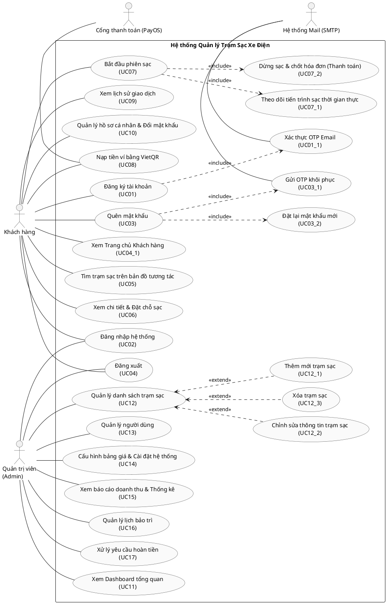

<div style="page-break-after: always;"></div>

---

# BÀI 4: PHÂN TÍCH HỆ THỐNG

Dựa trên yêu cầu của đề tài, hệ thống **Quản lý trạm sạc xe điện** được phân tích chi tiết thông qua hai giai đoạn: Phân tích tĩnh và Phân tích động.

## 4.1 Phân tích tĩnh

### 4.1.1 Xác định các lớp

Dựa trên yêu cầu nghiệp vụ của hệ thống, chúng ta xác định được các lớp (Class) chi tiết như sau:

**- Lớp Người Sử Dụng (User) - Lớp Cha:** Cho phép người dùng đăng ký, đăng nhập, cập nhật thông tin cá nhân.
- **Thuộc tính:**
  - userId: String
  - name: String
  - gender: String
  - phoneNumber: String
  - email: String
  - password: String
- **Phương thức:**
  - login()
  - register()
  - updateInformation()

*(Mã PlantUML để vẽ hộp xanh lớp User)*
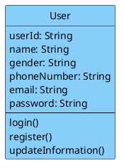

**- Lớp Khách hàng (Customer) - Kế thừa từ User:** Quản lý ví tiền cá nhân, xem lịch sử sạc, đánh giá trạm sạc.
- **Thuộc tính:**
  - userType: String
  - address: String
  - balance: Float
  - paymentMethods: List
- **Phương thức:**
  - viewChargingHistory()
  - rateStation()
  - depositMoney()

*(Mã PlantUML để vẽ hộp xanh lớp Customer)*
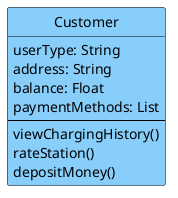

**- Lớp Quản Trị Viên (Administrator) - Kế thừa từ User:** Quản lý khách hàng, trạm sạc, bảo trì, giá điện.
- **Thuộc tính:**
  - managementPermissions: List
- **Phương thức:**
  - manageCustomers()
  - manageStations()
  - managePricingRates()
  - manageMaintenance()

*(Mã PlantUML để vẽ hộp xanh lớp Administrator)*
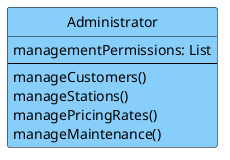

**- Lớp Trạm Sạc (ChargingStation) - Lớp Trọng tâm:** Quản lý thông tin chung của một trạm, cập nhật tình trạng hoạt động tổng thể.
- **Thuộc tính:**
  - stationId: String
  - name: String
  - address: String
  - locationCoordinates: String
  - totalChargers: Integer
  - operationStatus: String
- **Phương thức:**
  - updateStationStatus()
  - checkAvailability()

*(Mã PlantUML để vẽ hộp xanh lớp ChargingStation)*
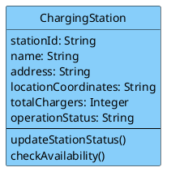

**- Lớp Trụ Sạc/Cổng Sạc (Charger) - Phụ thuộc Trạm sạc:** Quản lý từng trụ sạc cụ thể tại trạm (ví dụ: sạc nhanh, sạc thường).
- **Thuộc tính:**
  - chargerId: String
  - stationId: String
  - chargerType: String
  - maxPower: Float
  - status: String
- **Phương thức:**
  - updateChargerStatus()
  - startChargingProcess()
  - stopChargingProcess()

*(Mã PlantUML để vẽ hộp xanh lớp Charger)*
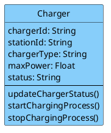

**- Lớp Phương Tiện (ElectricVehicle):** Thông tin về xe điện của khách hàng để hệ thống tính toán thời gian và công suất sạc phù hợp.
- **Thuộc tính:**
  - vehicleId: String
  - customerId: String
  - licensePlate: String
  - vehicleModel: String
  - batteryCapacity: Float
- **Phương thức:**
  - getVehicleInfo()

*(Mã PlantUML)*
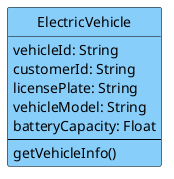

**- Lớp Bảo Trì Trạm Sạc (StationMaintenance):** Lên lịch bảo trì trạm hoặc trụ sạc cụ thể, cập nhật trạng thái bảo trì.
- **Thuộc tính:**
  - maintenanceId: String
  - stationId: String
  - chargerId: String
  - maintenanceDate: Date
  - status: String
- **Phương thức:**
  - scheduleMaintenance()
  - updateStatus()

*(Mã PlantUML)*
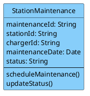

**- Lớp Đặt Chỗ Sạc (Reservation):** Cho phép khách hàng tìm và đặt trước trụ sạc để tối ưu hóa thời gian.
- **Thuộc tính:**
  - reservationId: String
  - customerId: String
  - chargerId: String
  - reservedStartTime: DateTime
  - reservedEndTime: DateTime
  - status: String
- **Phương thức:**
  - bookSlot()
  - cancelReservation()

*(Mã PlantUML)*
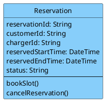

**- Lớp Sự Cố Trạm Sạc (StationIncident):** Báo cáo sự cố về điện, hỏng hóc thiết bị tại trạm.
- **Thuộc tính:**
  - incidentId: String
  - stationId: String
  - chargerId: String
  - description: String
  - timestamp: DateTime
  - status: String
- **Phương thức:**
  - reportIncident()
  - updateStatus()

*(Mã PlantUML)*
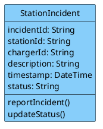

**- Lớp Quản Lý Phiên Sạc (ChargingSession):** Quản lý quá trình sạc thực tế từ lúc cắm súng sạc đến lúc thanh toán.
- **Thuộc tính:**
  - sessionId: String
  - customerId: String
  - chargerId: String
  - vehicleId: String
  - startTime: DateTime
  - endTime: DateTime
  - energyConsumed: Float
  - totalPrice: Float
  - status: String
- **Phương thức:**
  - startSession()
  - stopSession()
  - calculateFee()
  - processPayment()

*(Mã PlantUML)*
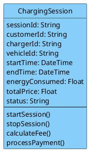

### 4.1.2 Xác định quan hệ giữa các lớp

**1) Quan hệ kế thừa**
**Customer kế thừa User**
- Customer là một loại người dùng trong hệ thống.
- Kế thừa các thuộc tính và phương thức chung như:
  - userId, name, email, password
  - login(), register(), updateInformation()

**Administrator kế thừa User**
- Administrator cũng là một loại người dùng.
- Kế thừa thông tin và chức năng chung từ User.

*(Mã PlantUML cho quan hệ kế thừa)*
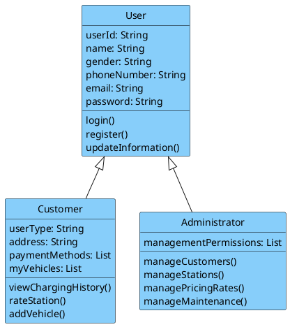

**Thành phần/Tập hợp (Composition/Aggregation):** Lớp Charger là một thành phần (thuộc về) của lớp ChargingStation.
*(Mã PlantUML)*
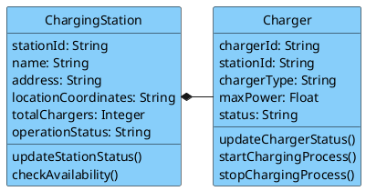

**2) Quan hệ kết hợp / liên kết giữa các lớp**

**Customer — ElectricVehicle**
- Một khách hàng có thể sở hữu nhiều xe điện.
- Mỗi xe điện thuộc về một khách hàng.
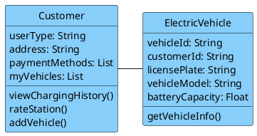

**ChargingStation — Charger**
- Một trạm sạc gồm nhiều trụ sạc.
- Mỗi trụ sạc thuộc về một trạm sạc.
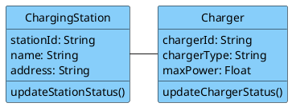

**Customer — Reservation**
- Một khách hàng có thể tạo nhiều lượt đặt chỗ.
- Mỗi lượt đặt chỗ thuộc về một khách hàng.
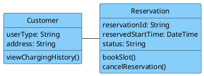

**Charger — Reservation**
- Một trụ sạc có thể xuất hiện trong nhiều lượt đặt chỗ ở các thời điểm khác nhau.
- Mỗi lượt đặt chỗ chỉ gắn với một trụ sạc.
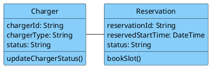

**Customer — ChargingSession**
- Một khách hàng có thể thực hiện nhiều phiên sạc.
- Mỗi phiên sạc thuộc về một khách hàng.
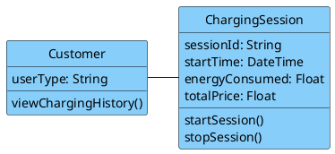

**ElectricVehicle — ChargingSession**
- Một xe điện có thể tham gia nhiều phiên sạc.
- Mỗi phiên sạc gắn với một xe điện.
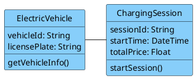

**Charger — ChargingSession**
- Một trụ sạc có thể phục vụ nhiều phiên sạc theo thời gian.
- Mỗi phiên sạc chỉ diễn ra tại một trụ sạc.
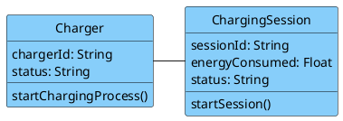

**ChargingStation — StationMaintenance**
- Một trạm sạc có thể có nhiều lần bảo trì.
- Mỗi bản ghi bảo trì thuộc về một trạm sạc.
```plantuml
@startuml
skinparam classBackgroundColor #87CEFA
skinparam classBorderColor black
class ChargingStation {
  stationId: String
  operationStatus: String
  updateStationStatus()
}
class StationMaintenance {
  maintenanceId: String
  maintenanceDate: Date
  status: String
  scheduleMaintenance()
}
ChargingStation -right- StationMaintenance
hide circle
@enduml
```

**Charger — StationMaintenance**
- Một lần bảo trì có thể áp dụng cho một trụ sạc cụ thể.
- Nếu không gắn với trụ nào thì là bảo trì toàn trạm.
```plantuml
@startuml
skinparam classBackgroundColor #87CEFA
skinparam classBorderColor black
class Charger {
  chargerId: String
  status: String
  updateChargerStatus()
}
class StationMaintenance {
  maintenanceId: String
  maintenanceDate: Date
  status: String
  scheduleMaintenance()
}
Charger -right- StationMaintenance
hide circle
@enduml
```

**ChargingStation — StationIncident**
- Một trạm sạc có thể phát sinh nhiều sự cố.
- Mỗi sự cố thuộc về một trạm sạc.
```plantuml
@startuml
skinparam classBackgroundColor #87CEFA
skinparam classBorderColor black
class ChargingStation {
  stationId: String
  operationStatus: String
}
class StationIncident {
  incidentId: String
  description: String
  status: String
  reportIncident()
}
ChargingStation -right- StationIncident
hide circle
@enduml
```

**Charger — StationIncident**
- Một sự cố có thể liên quan đến một trụ sạc cụ thể.
- Nếu không xác định trụ cụ thể thì đó là sự cố toàn trạm.
```plantuml
@startuml
skinparam classBackgroundColor #87CEFA
skinparam classBorderColor black
class Charger {
  chargerId: String
  status: String
}
class StationIncident {
  incidentId: String
  description: String
  status: String
  reportIncident()
}
Charger -right- StationIncident
hide circle
@enduml
```

**3) Quan hệ phụ thuộc**

**Administrator → Customer**
- Quản trị viên có quyền quản lý khách hàng.
```plantuml
@startuml
skinparam classBackgroundColor #87CEFA
skinparam classBorderColor black
class Administrator {
  managementPermissions: List
  manageCustomers()
}
class Customer {
  userType: String
  viewChargingHistory()
}
Administrator .right.> Customer
hide circle
@enduml
```

**Administrator → ChargingStation**
- Quản trị viên quản lý thông tin trạm sạc.
```plantuml
@startuml
skinparam classBackgroundColor #87CEFA
skinparam classBorderColor black
class Administrator {
  manageStations()
}
class ChargingStation {
  stationId: String
  operationStatus: String
}
Administrator .right.> ChargingStation
hide circle
@enduml
```

**Administrator → StationMaintenance**
- Quản trị viên theo dõi và cập nhật bảo trì.
```plantuml
@startuml
skinparam classBackgroundColor #87CEFA
skinparam classBorderColor black
class Administrator {
  manageMaintenance()
}
class StationMaintenance {
  maintenanceId: String
  status: String
}
Administrator .right.> StationMaintenance
hide circle
@enduml
```

**Administrator → StationIncident**
- Quản trị viên xử lý và cập nhật sự cố.
```plantuml
@startuml
skinparam classBackgroundColor #87CEFA
skinparam classBorderColor black
class Administrator {
  manageMaintenance()
}
class StationIncident {
  incidentId: String
  status: String
}
Administrator .right.> StationIncident
hide circle
@enduml
```

**Customer → ChargingStation**
- Khách hàng có thể đánh giá trạm sạc thông qua rateStation().
```plantuml
@startuml
skinparam classBackgroundColor #87CEFA
skinparam classBorderColor black
class Customer {
  rateStation()
}
class ChargingStation {
  operationStatus: String
}
Customer .right.> ChargingStation
hide circle
@enduml
```

### 4.1.3 Xây dựng biểu đồ lớp


Dưới đây là Sơ đồ lớp Tổng thể bao gồm toàn bộ 10 Lớp, các Thuộc tính, Phương thức và đầy đủ các mối Quan hệ:

```plantuml
@startuml
skinparam classAttributeIconSize 0
skinparam classBackgroundColor #87CEFA
skinparam classBorderColor black

class User {
  + userId: String
  + name: String
  + gender: String
  + phoneNumber: String
  + email: String
  + password: String
  + login()
  + register()
  + updateInformation()
}

class Customer {
  + userType: String
  + address: String
  + balance: Float
  + paymentMethods: List
  + viewChargingHistory()
  + rateStation()
  + depositMoney()
}

class Administrator {
  + managementPermissions: List
  + manageCustomers()
  + manageStations()
  + managePricingRates()
  + manageMaintenance()
}

class ChargingStation {
  + stationId: String
  + name: String
  + address: String
  + locationCoordinates: String
  + totalChargers: Integer
  + operationStatus: String
  + updateStationStatus()
  + checkAvailability()
}

class Charger {
  + chargerId: String
  + stationId: String
  + chargerType: String
  + maxPower: Float
  + status: String
  + updateChargerStatus()
  + startChargingProcess()
  + stopChargingProcess()
}

class ElectricVehicle {
  + vehicleId: String
  + customerId: String
  + licensePlate: String
  + vehicleModel: String
  + batteryCapacity: Float
  + getVehicleInfo()
}

class StationMaintenance {
  + maintenanceId: String
  + stationId: String
  + chargerId: String
  + maintenanceDate: Date
  + status: String
  + scheduleMaintenance()
  + updateStatus()
}

class Reservation {
  + reservationId: String
  + customerId: String
  + chargerId: String
  + reservedStartTime: DateTime
  + reservedEndTime: DateTime
  + status: String
  + bookSlot()
  + cancelReservation()
}

class StationIncident {
  + incidentId: String
  + stationId: String
  + chargerId: String
  + description: String
  + timestamp: DateTime
  + status: String
  + reportIncident()
  + updateStatus()
}

class ChargingSession {
  + sessionId: String
  + customerId: String
  + chargerId: String
  + vehicleId: String
  + startTime: DateTime
  + endTime: DateTime
  + energyConsumed: Float
  + totalPrice: Float
  + status: String
  + startSession()
  + stopSession()
  + calculateFee()
  + processPayment()
}

' Quan hệ kế thừa
User <|-- Customer
User <|-- Administrator

' Quan hệ Thành phần (Aggregation / Composition)
ChargingStation *-- "1..*" Charger

' Quan hệ Liên kết
Customer "1" -- "0..*" ElectricVehicle
Customer "1" -- "0..*" Reservation
Charger "1" -- "0..*" Reservation
Customer "1" -- "0..*" ChargingSession
ElectricVehicle "1" -- "0..*" ChargingSession
Charger "1" -- "0..*" ChargingSession

ChargingStation "1" -- "0..*" StationMaintenance
Charger "1" -- "0..*" StationMaintenance

ChargingStation "1" -- "0..*" StationIncident
Charger "1" -- "0..*" StationIncident

' Quan hệ Phụ thuộc
Administrator ..> Customer
Administrator ..> ChargingStation
Administrator ..> StationMaintenance
Administrator ..> StationIncident
Customer ..> ChargingStation
@enduml
```

### 4.1.4 Xác định thuộc tính lớp

**1. Lớp người dùng (User) - Lớp cha**
| Thuộc tính | Kiểu dữ liệu | Mô tả |
| :--- | :--- | :--- |
| userId | String | Mã định danh duy nhất của người dùng |
| name | String | Họ và tên |
| gender | String | Giới tính (nam, nữ) |
| phoneNumber | String | Số điện thoại |
| email | String | Địa chỉ email (dùng để đăng nhập) |
| password | String | Mật khẩu đã mã hóa |

**2. Lớp khách hàng (Customer) - Kế thừa User**
| Thuộc tính | Kiểu dữ liệu | Mô tả |
| :--- | :--- | :--- |
| userType | String | Loại người dùng, mặc định "Customer" |
| address | String | Địa chỉ thường trú |
| paymentMethods| List<String> | Danh sách phương thức thanh toán |
| balance | Float | Số dư ví tiền PayOS |

**3. Lớp quản trị viên (Administrator) - Kế thừa User**
| Thuộc tính | Kiểu dữ liệu | Mô tả |
| :--- | :--- | :--- |
| userType | String | Loại người dùng, mặc định "Administrator" |
| managementPermissions| List<String> | Danh sách các quyền quản trị |

**4. Lớp trạm sạc (ChargingStation)**
| Thuộc tính | Kiểu dữ liệu | Mô tả |
| :--- | :--- | :--- |
| stationId | String | Mã định danh duy nhất của trạm |
| name | String | Tên trạm |
| address | String | Địa chỉ chi tiết |
| locationCoordinates| String | Tọa độ (kinh độ, vĩ độ) |
| totalChargers | Integer | Tổng số trụ sạc tại trạm |
| operationStatus| String | Trạng thái hoạt động |

**5. Lớp trụ sạc (Charger)**
| Thuộc tính | Kiểu dữ liệu | Mô tả |
| :--- | :--- | :--- |
| chargerId | String | Mã định danh duy nhất của trụ sạc |
| stationId | String | Mã trạm sạc mà trụ này thuộc về |
| chargerType | String | Loại trụ (AC Normal, DC Fast) |
| maxPower | Float | Công suất tối đa (kW) |
| status | String | Trạng thái hiện tại |

**6. Lớp phương tiện (ElectricVehicle)**
| Thuộc tính | Kiểu dữ liệu | Mô tả |
| :--- | :--- | :--- |
| vehicleId | String | Mã định danh duy nhất của xe |
| customerId | String | Mã khách hàng sở hữu |
| licensePlate | String | Biển số xe |
| vehicleModel | String | Mẫu xe |
| batteryCapacity| Float | Dung lượng pin |

**7. Lớp Bảo Trì Trạm Sạc (StationMaintenance)**
| Thuộc tính | Kiểu dữ liệu | Mô tả |
| :--- | :--- | :--- |
| maintenanceId | String | Mã phiếu bảo trì |
| stationId | String | Mã trạm được bảo trì |
| chargerId | String | Mã trụ sạc cụ thể (có thể null) |
| maintenanceDate| Date | Ngày dự kiến bảo trì |
| status | String | Trạng thái (Scheduled, Completed) |

**8. Lớp Đặt Chỗ Sạc (Reservation)**
| Thuộc tính | Kiểu dữ liệu | Mô tả |
| :--- | :--- | :--- |
| reservationId | String | Mã đặt chỗ |
| customerId | String | Mã khách hàng đặt chỗ |
| chargerId | String | Mã trụ sạc được đặt |
| reservedStartTime| DateTime | Thời gian bắt đầu đặt chỗ |
| reservedEndTime| DateTime | Thời gian kết thúc đặt chỗ |
| status | String | Trạng thái (Active, Expired) |

**9. Lớp Sự Cố Trạm Sạc (StationIncident)**
| Thuộc tính | Kiểu dữ liệu | Mô tả |
| :--- | :--- | :--- |
| incidentId | String | Mã sự cố |
| stationId | String | Mã trạm xảy ra sự cố |
| chargerId | String | Mã trụ sạc |
| description | String | Mô tả sự cố |
| timestamp | DateTime | Thời điểm báo cáo |
| status | String | Trạng thái xử lý |

**10. Lớp Quản Lý Phiên Sạc (ChargingSession)**
| Thuộc tính | Kiểu dữ liệu | Mô tả |
| :--- | :--- | :--- |
| sessionId | String | Mã phiên sạc |
| customerId | String | Mã khách hàng thực hiện |
| chargerId | String | Mã trụ sạc được sử dụng |
| vehicleId | String | Mã phương tiện đang sạc |
| startTime | DateTime | Thời điểm bắt đầu sạc |
| endTime | DateTime | Thời điểm kết thúc sạc |
| energyConsumed| Float | Lượng điện tiêu thụ (kWh) |
| totalPrice | Float | Tổng tiền phải trả |
| status | String | Trạng thái phiên sạc |

---

## 4.2 Phân tích động

### 4.2.1 Xây dựng biểu đồ trạng thái

Trong mục này, hệ thống xây dựng biểu đồ trạng thái phiên sạc (Statechart Diagram) để mô tả chi tiết vòng đời sạc xe, đồng thời xây dựng các biểu đồ hoạt động (Activity Diagram) cho các nghiệp vụ vận hành chính:

**- Biểu đồ trạng thái phiên sạc (Statechart Diagram)**


```plantuml
@startuml Statechart_ChargingSession
skinparam backgroundColor white
skinparam state {
  BackgroundColor #E0FFFF
  BorderColor #008B8B
  ArrowColor #2F4F4F
}

[*] --> Cho_Kich_Hoat : Khách bấm "Bắt đầu sạc"

state Cho_Kich_Hoat : entry / Tạo ChargingSession
state Cho_Kich_Hoat : do / Kiểm tra số dư >= 200.000đ

state Dang_Sac : entry / Khóa súng sạc (connector.status = in_use)
state Dang_Sac : do / Cập nhật liên tục số điện kWh, công suất kW
state Dang_Sac : exit / Chốt hóa đơn tiền sạc

state Da_Hoan_Thanh : entry / Trạng thái thanh toán = Đã thanh toán
state Da_Hoan_Thanh : do / Trừ số dư tài khoản, giải phóng cổng sạc

state Da_Huy : entry / Giải phóng cổng sạc, không trừ tiền

state Loi_He_Thong : entry / Ghi nhận mã lỗi sự cố
state Loi_He_Thong : do / Thông báo cho Quản trị viên xử lý

Cho_Kich_Hoat --> Dang_Sac : [Số dư >= 200.000đ & cổng sạc khả dụng]
Cho_Kich_Hoat --> Da_Huy : [Khách hàng hủy]
Dang_Sac --> Da_Hoan_Thanh : [Đạt mục tiêu sạc hoặc bấm Dừng sạc]
Dang_Sac --> Loi_He_Thong : [Mất kết nối hoặc quá tải điện]
Da_Hoan_Thanh --> [*]
Da_Huy --> [*]
Loi_He_Thong --> [*] : [Quản trị viên xử lý xong]
@enduml
```

**- Quản lý tài khoản (Biểu đồ trạng thái)**
```plantuml
@startuml Statechart_AccountManagement
skinparam backgroundColor white
skinparam state {
  BackgroundColor #E0FFFF
  BorderColor #008B8B
  ArrowColor #2F4F4F
}

[*] --> Chon_GD_QL_Tai_Khoan
Chon_GD_QL_Tai_Khoan : Chọn giao diện quản lý tài khoản

Chon_GD_QL_Tai_Khoan --> Tim_Kiem_Tai_Khoan : Hiển thị danh sách người dùng
Tim_Kiem_Tai_Khoan : Tìm kiếm tài khoản cần quản lý

Tim_Kiem_Tai_Khoan --> Tim_Kiem_That_Bai : Tài khoản không tồn tại
Tim_Kiem_That_Bai : Tìm kiếm thất bại

Tim_Kiem_That_Bai --> Chon_GD_QL_Tai_Khoan : Thực hiện lại thao tác
Tim_Kiem_That_Bai --> [*] : Thoát khỏi quản lý tài khoản

Tim_Kiem_Tai_Khoan --> Chinh_Sua_Vo_Hieu_Hoa : Hiển thị kết quả tìm kiếm
Chinh_Sua_Vo_Hieu_Hoa : Chỉnh sửa hoặc vô hiệu hóa tài khoản

Chinh_Sua_Vo_Hieu_Hoa --> Xac_Nhan_Thao_Tac : Gửi yêu cầu
Xac_Nhan_Thao_Tac : Xác nhận thao tác

Xac_Nhan_Thao_Tac --> Vo_Hieu_Hoa : Tài khoản người dùng bị vô hiệu hóa
Vo_Hieu_Hoa : Tài khoản người dùng bị vô hiệu hóa

Xac_Nhan_Thao_Tac --> Cap_Nhat_Thanh_Cong : Cập nhật thông tin
Cap_Nhat_Thanh_Cong : Cập nhật thành công

Vo_Hieu_Hoa --> Cap_Nhat_Thanh_Cong : Gửi thông báo đến người dùng

Cap_Nhat_Thanh_Cong --> [*] : Thoát
@enduml
```

**- Quản lý trạm sạc (Biểu đồ trạng thái)**
```plantuml
@startuml Statechart_StationManagement
skinparam backgroundColor white
skinparam state {
  BackgroundColor #E0FFFF
  BorderColor #008B8B
  ArrowColor #2F4F4F
}

[*] --> Chon_GD_QL_Tram
Chon_GD_QL_Tram : Chọn giao diện quản lý trạm sạc

Chon_GD_QL_Tram --> Xem_Danh_Sach_Tram : Tải danh sách trạm sạc
Xem_Danh_Sach_Tram : Hiển thị danh sách trạm sạc

Xem_Danh_Sach_Tram --> Yeu_Cau_Thao_Tac : Chọn trạm sạc
Yeu_Cau_Thao_Tac : Yêu cầu thao tác (Thêm/Sửa/Xóa)

Yeu_Cau_Thao_Tac --> Chon_GD_QL_Tram : [Hủy thao tác]

Yeu_Cau_Thao_Tac --> Xac_Nhan_Xoa : [Yêu cầu Xóa]
Xac_Nhan_Xoa : Xác nhận xóa trạm sạc

Xac_Nhan_Xoa --> Loi_Xoa_Tram : Có phiên sạc đang hoạt động
Loi_Xoa_Tram : Lỗi xóa trạm sạc

Loi_Xoa_Tram --> Xem_Danh_Sach_Tram : Quay lại danh sách

Xac_Nhan_Xoa --> Luu_Du_Lieu : [Xác nhận] / Xóa thành công
Luu_Du_Lieu : Lưu dữ liệu thành công

Yeu_Cau_Thao_Tac --> Cap_Nhat_Thong_Tin : [Yêu cầu Thêm/Sửa]
Cap_Nhat_Thong_Tin : Cập nhật thông tin trạm sạc

Cap_Nhat_Thong_Tin --> Cap_Nhat_Thong_Tin : Dữ liệu không hợp lệ / Hiển thị lỗi
Cap_Nhat_Thong_Tin --> Luu_Du_Lieu : Dữ liệu hợp lệ / Lưu database

Luu_Du_Lieu --> [*] : Thoát
@enduml
```

**- Quản lý bảo trì (Biểu đồ trạng thái)**
```plantuml
@startuml Statechart_MaintenanceManagement
skinparam backgroundColor white
skinparam state {
  BackgroundColor #E0FFFF
  BorderColor #008B8B
  ArrowColor #2F4F4F
}

[*] --> Chon_GD_Bao_Tri
Chon_GD_Bao_Tri : Chọn giao diện quản lý bảo trì

Chon_GD_Bao_Tri --> Xem_Lich_Bao_Tri : Tải dữ liệu lịch bảo trì
Xem_Lich_Bao_Tri : Hiển thị lịch bảo trì hiện tại

Xem_Lich_Bao_Tri --> Lap_Phieu_Bao_Tri : Chọn tạo phiếu mới
Lap_Phieu_Bao_Tri : Lập phiếu yêu cầu bảo trì mới

Lap_Phieu_Bao_Tri --> Loi_Dien_Khuyet : Thông tin không hợp lệ
Loi_Dien_Khuyet : Lỗi thiếu thông tin / Phiếu không hợp lệ

Loi_Dien_Khuyet --> Lap_Phieu_Bao_Tri : Nhập lại thông tin

Lap_Phieu_Bao_Tri --> Luu_Lich_Bao_Tri : Phiếu hợp lệ / Lưu lịch bảo trì
Luu_Lich_Bao_Tri : Lưu lịch bảo trì thành công

Xem_Lich_Bao_Tri --> Cap_Nhat_Trang_Thai : Chọn phiếu hiện có
Cap_Nhat_Trang_Thai : Cập nhật trạng thái bảo trì

Cap_Nhat_Trang_Thai --> Luu_Lich_Bao_Tri : [Xác nhận] / Cập nhật database

Luu_Lich_Bao_Tri --> Chuyen_Offline : Áp dụng trạng thái cổng sạc
Chuyen_Offline : Chuyển trạng thái cổng sạc sang Offline

Chuyen_Offline --> [*] : Thoát khỏi quản lý bảo trì
@enduml
```

**- Quản lý Giá Cước (Biểu đồ trạng thái)**
```plantuml
@startuml Statechart_PricingManagement
skinparam backgroundColor white
skinparam state {
  BackgroundColor #E0FFFF
  BorderColor #008B8B
  ArrowColor #2F4F4F
}

[*] --> Chon_GD_Gia_Cuoc
Chon_GD_Gia_Cuoc : Chọn quản lý giá cước điện

Chon_GD_Gia_Cuoc --> Xem_Bang_Gia : Tải dữ liệu bảng giá
Xem_Bang_Gia : Hiển thị bảng giá hiện hành

Xem_Bang_Gia --> Thiet_Lap_Khung_Gio : Chọn cập nhật giá cước
Thiet_Lap_Khung_Gio : Thiết lập giá cước theo khung giờ mới

Thiet_Lap_Khung_Gio --> Kiem_Tra_Gia_Cuoc : Gửi cấu hình mới
Kiem_Tra_Gia_Cuoc : Hệ thống xác thực đơn giá mới

Kiem_Tra_Gia_Cuoc --> Loi_Nhap_Lieu : Giá cước < 0 hoặc sai định dạng
Loi_Nhap_Lieu : Thông báo đơn giá không hợp lệ

Loi_Nhap_Lieu --> Thiet_Lap_Khung_Gio : Nhập lại cấu hình

Kiem_Tra_Gia_Cuoc --> Ap_Dung_Gia_Moi : Dữ liệu hợp lệ / Lưu database
Ap_Dung_Gia_Moi : Áp dụng bảng giá mới thành công

Ap_Dung_Gia_Moi --> [*] : Thoát
@enduml
```

**- Khởi động sạc (Biểu đồ trạng thái)**
```plantuml
@startuml Statechart_StartCharging
skinparam backgroundColor white
skinparam state {
  BackgroundColor #E0FFFF
  BorderColor #008B8B
  ArrowColor #2F4F4F
}

[*] --> Quet_Ma_QR
Quet_Ma_QR : Khách hàng quét mã QR tại cổng sạc

Quet_Ma_QR --> Kiem_Tra_Ket_Noi : Tải thông tin trụ sạc
Kiem_Tra_Ket_Noi : Kiểm tra kết nối vật lý (cáp sạc)

Kiem_Tra_Ket_Noi --> Cho_Cam_Sung_Sac : Súng sạc chưa được cắm
Cho_Cam_Sung_Sac : Chờ khách cắm súng sạc (Offline)

Cho_Cam_Sung_Sac --> Kiem_Tra_Ket_Noi : Khách cắm súng sạc

Kiem_Tra_Ket_Noi --> Kiem_Tra_So_Du : Súng sạc đã cắm thành công
Kiem_Tra_So_Du : Kiểm tra số dư ví PayOS

Kiem_Tra_So_Du --> Yeu_Cau_Nap_Tien : Số dư < 200.000đ
Yeu_Cau_Nap_Tien : Yêu cầu nạp tiền ví qua VietQR

Yeu_Cau_Nap_Tien --> Kiem_Tra_So_Du : Khách hàng nạp tiền thành công

Kiem_Tra_So_Du --> Xac_Nhan_Khoi_Dong : Số dư >= 200.000đ
Xac_Nhan_Khoi_Dong : Xác nhận bắt đầu sạc trên app

Xac_Nhan_Khoi_Dong --> Kich_Hoat_Trurele : Gửi lệnh bắt đầu
Kich_Hoat_Trurele : Trụ sạc đóng rơ le, cấp điện

Kich_Hoat_Trurele --> Dang_Sac_Thoi_Gian_Thuc : Rơ le đóng thành công
Dang_Sac_Thoi_Gian_Thuc : Hiển thị tiến trình sạc thời gian thực

Dang_Sac_Thoi_Gian_Thuc --> [*] : Bắt đầu phiên sạc
@enduml
```

**- Đặt chỗ trước (Biểu đồ trạng thái)**
```plantuml
@startuml Statechart_Reservation
skinparam backgroundColor white
skinparam state {
  BackgroundColor #E0FFFF
  BorderColor #008B8B
  ArrowColor #2F4F4F
}

[*] --> Tim_Tram_Tren_Map
Tim_Tram_Tren_Map : Mở bản đồ tìm kiếm trạm sạc

Tim_Tram_Tren_Map --> Chon_Cong_Sac : Xem chi tiết trạm sạc
Chon_Cong_Sac : Chọn cổng sạc muốn đặt chỗ

Chon_Cong_Sac --> Cong_Khong_Kha_Dung : Trạng thái != Available
Cong_Khong_Kha_Dung : Thông báo cổng sạc không khả dụng

Cong_Khong_Kha_Dung --> Tim_Tram_Tren_Map : Chọn lại cổng khác

Chon_Cong_Sac --> Xac_Nhan_Dat_Cho : Trạng thái == Available
Xac_Nhan_Dat_Cho : Hiển thị thông tin và xác nhận đặt chỗ

Xac_Nhan_Dat_Cho --> Khoa_Cong_Tam_Thoi : Xác nhận đặt chỗ
Khoa_Cong_Tam_Thoi : Tạm thời khóa cổng sạc (Status = Reserved)

Khoa_Cong_Tam_Thoi --> Kich_Hoat_Phien_Sac : Quét QR trong vòng 30 phút
Kich_Hoat_Phien_Sac : Khách đến sạc trong 30 phút / Quét QR

Kich_Hoat_Phien_Sac --> [*] : Chuyển sang phiên sạc

Khoa_Cong_Tam_Thoi --> Tu_Dong_Huy_Dat : Quá thời hạn 30 phút
Tu_Dong_Huy_Dat : Hủy đặt chỗ (Quá thời hạn 30 phút)

Tu_Dong_Huy_Dat --> Giai_Phong_Cong : Giải phóng tài nguyên
Giai_Phong_Cong : Mở khóa cổng sạc về Available

Giai_Phong_Cong --> [*] : Hoàn tất hủy
@enduml
```

**- Thanh toán (Biểu đồ trạng thái)**
```plantuml
@startuml Statechart_Payment
skinparam backgroundColor white
skinparam state {
  BackgroundColor #E0FFFF
  BorderColor #008B8B
  ArrowColor #2F4F4F
}

[*] --> Kien_Nhan_Thong_Bao
Kien_Nhan_Thong_Bao : Nhận thông báo kết thúc sạc

Kien_Nhan_Thong_Bao --> Tinh_Toan_Chi_Phi : Kết thúc phiên sạc
Tinh_Toan_Chi_Phi : Tính tiền sạc và tạo hóa đơn (PaymentInvoice)

Tinh_Toan_Chi_Phi --> Chon_Phuong_Thuc : Hiển thị hóa đơn
Chon_Phuong_Thuc : Chọn phương thức thanh toán

Chon_Phuong_Thuc --> Kiem_Tra_Vi_PayOS : [Trừ số dư ví PayOS]
Kiem_Tra_Vi_PayOS : Kiểm tra số dư ví PayOS

Kiem_Tra_Vi_PayOS --> Nap_Tien_VietQR : Số dư ví không đủ
Nap_Tien_VietQR : Hiển thị VietQR nạp tiền ví

Nap_Tien_VietQR --> Kiem_Tra_Vi_PayOS : Khách nạp tiền ví

Kiem_Tra_Vi_PayOS --> Thanh_Toan_Thanh_Cong : Đủ số dư / Khấu trừ ví
Thanh_Toan_Thanh_Cong : Giao dịch hoàn tất

Chon_Phuong_Thuc --> Tao_Link_VietQR : [Quét VietQR trực tiếp]
Tao_Link_VietQR : Tạo cổng thanh toán PayOS VietQR

Tao_Link_VietQR --> Cho_Webhook_PayOS : Hiển thị mã QR PayOS
Cho_Webhook_PayOS : Chờ webhook xác nhận giao dịch thành công

Cho_Webhook_PayOS --> Tao_Link_VietQR : Webhook báo lỗi hoặc hết hạn

Cho_Webhook_PayOS --> Thanh_Toan_Thanh_Cong : Webhook báo thành công

Thanh_Toan_Thanh_Cong --> Dong_Phien_Sac : Ghi nhận hóa đơn Paid
Dong_Phien_Sac : Cập nhật trạng thái hóa đơn & phiên sạc

Dong_Phien_Sac --> [*] : Hoàn thành thanh toán
@enduml
```

---

### 4.2.2 Xây dựng biểu đồ tuần tự

Dưới đây là 7 biểu đồ tuần tự được xây dựng theo đúng nguyên lý Robustness ECB (Entity - Control - Boundary) và đã được dịch nghĩa toàn bộ sang tiếng Việt cho dễ hiểu:

**- Quản lý tài khoản**
```plantuml
@startuml
skinparam backgroundColor white
skinparam sequenceArrowThickness 1
skinparam sequenceLifeLineBorderColor #333333

actor "Quản trị viên" as Admin
boundary "ManHinh_DanhSachNguoiDung" as Boundary
control "QuanLyNguoiDungController" as Control
entity "ThucThe_NguoiDung" as Entity

Admin -> Boundary: 1: Mở giao diện quản lý tài khoản
Boundary -> Control: 1.1: layDanhSachNguoiDungActive()
Control -> Entity: 1.2: timKiemNguoiDungActive()
Entity --> Control: 1.3: danhSachNguoiDung
Control --> Boundary: 1.4: hienThiDanhSach(danhSachNguoiDung)
Boundary --> Admin: 1.5: Hiển thị danh sách tài khoản

Admin -> Boundary: 2: Chỉnh sửa tài khoản (maNguoiDung, thongTinMoi)
Boundary -> Control: 2.1: capNhatThongTinNguoiDung(maNguoiDung, thongTinMoi)
Control -> Entity: 2.2: timKiemVaCapNhat(maNguoiDung, thongTinMoi)
Entity --> Control: 2.3: capNhatThanhCong
Control --> Boundary: 2.4: hienThiThongBao("Cập nhật thành công")
Boundary --> Admin: 2.5: Hiển thị thông báo thành công
@enduml
```

**- Quản lý trạm sạc**
```plantuml
@startuml
skinparam backgroundColor white
skinparam sequenceArrowThickness 1
skinparam sequenceLifeLineBorderColor #333333

actor "Quản trị viên" as Admin
boundary "ManHinh_DanhSachTramSac" as Boundary
control "QuanLyTramSacController" as Control
entity "ThucThe_TramSac" as Station
entity "ThucThe_TruSac" as Charger

Admin -> Boundary: 1: Mở giao diện quản lý trạm sạc
Boundary -> Control: 1.1: layDanhSachTramVaTru()
Control -> Station: 1.2: timKiemTatCaTram()
Station --> Control: 1.3: danhSachTram
Control -> Charger: 1.4: timKiemTruTheoTram()
Charger --> Control: 1.5: danhSachTru
Control --> Boundary: 1.6: hienThiDanhSachTramVaTru(danhSachTram, danhSachTru)
Boundary --> Admin: 1.7: Hiển thị danh sách trạm & trụ sạc

Admin -> Boundary: 2: Thêm trạm sạc mới (thongTinTram)
Boundary -> Control: 2.1: taoTramSacMoi(thongTinTram)
Control -> Station: 2.2: luuTramSacMoi(thongTinTram)
Station --> Control: 2.3: luuThanhCong
Control --> Boundary: 2.4: hienThiThongBao("Thêm trạm thành công")
Boundary --> Admin: 2.5: Cập nhật hiển thị trạm mới
@enduml
```

**- Quản lý bảo trì**
```plantuml
@startuml
skinparam backgroundColor white
skinparam sequenceArrowThickness 1
skinparam sequenceLifeLineBorderColor #333333

actor "Quản trị viên" as Admin
boundary "ManHinh_LichBaoTri" as Boundary
control "QuanLyBaoTriController" as Control
entity "ThucThe_LichBaoTri" as Maintenance
entity "ThucThe_TruSac" as Charger

Admin -> Boundary: 1: Mở lịch bảo trì trạm sạc
Boundary -> Control: 1.1: layDanhSachPhieuBaoTri()
Control -> Maintenance: 1.2: timKiemPhieuBaoTri()
Maintenance --> Control: 1.3: danhSachPhieu
Control --> Boundary: 1.4: hienThiLichBaoTri(danhSachPhieu)
Boundary --> Admin: 1.5: Hiển thị danh sách phiếu bảo trì

Admin -> Boundary: 2: Lên lịch bảo trì (maTram, maTru, ngayBaoTri)
Boundary -> Control: 2.1: taoPhieuBaoTriMoi(maTram, maTru, ngayBaoTri)
Control -> Maintenance: 2.2: luuPhieuBaoTri(maTram, maTru, ngayBaoTri, trangThai="ChoBaoTri")
Maintenance --> Control: 2.3: thongTinPhieu
Control -> Charger: 2.4: capNhatTrangThaiTru(maTru, trangThai="NgoaiTuyen")
Charger --> Control: 2.5: capNhatThanhCong
Control --> Boundary: 2.6: hienThiThongBao("Lên lịch bảo trì thành công")
Boundary --> Admin: 2.7: Cập nhật giao diện bảo trì
@enduml
```

**- Quản lý Giá Cước**
```plantuml
@startuml
skinparam backgroundColor white
skinparam sequenceArrowThickness 1
skinparam sequenceLifeLineBorderColor #333333

actor "Quản trị viên" as Admin
boundary "ManHinh_CauHinhGiaCuoc" as Boundary
control "QuanLyGiaCuocController" as Control
entity "ThucThe_TramSac" as Station

Admin -> Boundary: 1: Xem cấu hình bảng giá điện hiện tại
Boundary -> Control: 1.1: layGiaCuocHienTai()
Control -> Station: 1.2: timKiemDonGiaTram()
Station --> Control: 1.3: bangGiaCuoc
Control --> Boundary: 1.4: hienThiBangGiaCuoc(bangGiaCuoc)
Boundary --> Admin: 1.5: Hiển thị bảng giá điện theo khung giờ

Admin -> Boundary: 2: Cập nhật giá cước (maTram, donGiaMoi)
Boundary -> Control: 2.1: thietLapGiaCuocMoi(maTram, donGiaMoi)
Control -> Station: 2.2: capNhatDonGiaTram(maTram, donGiaMoi)
Station --> Control: 2.3: capNhatThanhCong
Control --> Boundary: 2.4: hienThiThongBao("Cấu hình giá thành công")
Boundary --> Admin: 2.5: Hiển thị bảng giá mới áp dụng
@enduml
```

**- Khởi động sạc**


```plantuml
@startuml
skinparam backgroundColor white
skinparam sequenceArrowThickness 1
skinparam sequenceLifeLineBorderColor #333333

actor "Khách hàng" as KH
boundary "ManHinh_DangSac" as Boundary
control "DieuKhienSacController" as Control
entity "ThucThe_KhachHang" as Wallet
entity "ThucThe_TruSac" as Charger
entity "ThucThe_PhienSac" as Session
actor "TruSacPhanCung" as Hardware

KH -> Boundary: 1: Mở app & Quét mã QR tại trụ sạc
Boundary -> Control: 1.1: kiemTraTrangThaiTru(maTru)
Control -> Charger: 1.2: timKiemTruTheoMa(maTru)
Charger --> Control: 1.3: thongTinTru (trangThai="SanSang")
Control -> Wallet: 1.4: kiemTraSoDuVi(maKhachHang)
Wallet --> Control: 1.5: soDuVi (>= 200.000đ)
Control --> Boundary: 1.6: hienThiXacNhanBatDau(thongTinTru)
Boundary --> KH: 1.7: Hiển thị nút "Bắt đầu sạc"

KH -> Boundary: 2: Bấm nút "Xác nhận sạc"
Boundary -> Control: 2.1: batDauPhienSac(maKhachHang, maTru)
Control -> Session: 2.2: taoPhienSacMoi(maKhachHang, maTru, thoiGianBatDau=now, trangThai="DangSac")
Session --> Control: 2.3: thongTinPhienSac
Control -> Charger: 2.4: capNhatTrangThaiTru(maTru, trangThai="DangSac")
Charger --> Control: 2.5: capNhatThanhCong
Control -> Hardware: 2.6: kichHoatDongReLeCapDien()
Hardware --> Control: 2.7: reLeDaDong
Control --> Boundary: 2.8: hienThiTienTrinhSac(thongTinPhienSac)
Boundary --> KH: 2.9: Hiển thị tiến trình sạc (kW, kWh, %) thời gian thực
@enduml
```

**- Đặt chỗ trước**
```plantuml
@startuml
skinparam backgroundColor white
skinparam sequenceArrowThickness 1
skinparam sequenceLifeLineBorderColor #333333

actor "Khách hàng" as KH
boundary "ManHinh_DatChoTruoc" as Boundary
control "QuanLyDatChoController" as Control
entity "ThucThe_TruSac" as Charger
entity "ThucThe_DatCho" as Reservation

KH -> Boundary: 1: Tìm trạm sạc & Chọn cổng sạc
Boundary -> Control: 1.1: kiemTraTrangThaiCong(maTru)
Control -> Charger: 1.2: timKiemTruTheoMa(maTru)
Charger --> Control: 1.3: thongTinTru (trangThai="SanSang")
Control --> Boundary: 1.4: hienThiGiaoDienDatCho(thongTinTru)
Boundary --> KH: 1.5: Hiển thị thông tin đặt chỗ

KH -> Boundary: 2: Chọn khung giờ & Bấm "Đặt chỗ"
Boundary -> Control: 2.1: datChoTruoc(maKhachHang, maTru, thoiGianDat)
Control -> Reservation: 2.2: taoPhieuDatCho(maKhachHang, maTru, thoiGianDat, trangThai="KichHoat")
Reservation --> Control: 2.3: thongTinDatCho
Control -> Charger: 2.4: capNhatTrangThaiTru(maTru, trangThai="DaDatCho")
Charger --> Control: 2.5: capNhatThanhCong
Control --> Boundary: 2.6: hienThiThongBao("Đặt chỗ thành công")
Boundary --> KH: 2.7: Màn hình giữ chỗ (30 phút)
@enduml
```

**- Thanh toán**


```plantuml
@startuml
skinparam backgroundColor white
skinparam sequenceArrowThickness 1
skinparam sequenceLifeLineBorderColor #333333

actor "Khách hàng" as KH
boundary "ManHinh_ThanhToan" as Boundary
control "ThanhToanController" as Control
entity "ThucThe_PhienSac" as Session
entity "ThucThe_HoaDon" as Invoice
entity "ThucThe_KhachHang" as Wallet
actor "CongThanhToan_PayOS" as PayOS

KH -> Boundary: 1: Chọn phiên sạc kết thúc & Bấm "Thanh toán"
Boundary -> Control: 1.1: taoHoaDonThanhToan(maPhienSac)
Control -> Session: 1.2: layLuongDienTieuThu(maPhienSac)
Session --> Control: 1.3: duLieuTieuThu
Control -> Control: 1.4: tinhTongTienSac(duLieuTieuThu)
Control -> Invoice: 1.5: taoHoaDonMoi(maPhienSac, tongTien, trangThai="ChoThanhToan")
Invoice --> Control: 1.6: thongTinHoaDon
Control --> Boundary: 1.7: hienThiChiTietHoaDon(thongTinHoaDon)
Boundary --> KH: 1.8: Hiển thị số tiền và các phương thức thanh toán

KH -> Boundary: 2: Chọn phương thức "Cổng PayOS VietQR"
Boundary -> Control: 2.1: yeuCauLienKetPayOS(maHoaDon)
Control -> PayOS: 2.2: taoLienKetThanhToanVietQR(maHoaDon, tongTien)
PayOS --> Control: 2.3: duongDanThanhToan & maQRVietQR
Control --> Boundary: 2.4: hienThiMaQRVietQR(maQRVietQR)
Boundary --> KH: 2.5: Hiển thị mã QR để quét thanh toán

KH -> PayOS: 3: Quét mã QR & chuyển khoản qua ngân hàng
PayOS -> Control: 3.1: guiWebhookXacNhan(maGiaoDich, trangThai="DA_THANH_TOAN")
Control -> Control: 3.2: xacThucChuKyBaoMatHMAC()
Control -> Invoice: 3.3: capNhatTrangThaiHoaDon(maHoaDon, trangThai="DaThanhToan")
Invoice --> Control: 3.4: capNhatThanhCong
Control -> Session: 3.5: capNhatTrangThaiPhienSac(maPhienSac, trangThai="DaHoanThanh")
Session --> Control: 3.6: capNhatThanhCong
Control --> Boundary: 3.7: hienThiBienLai(thongTinHoaDon)
Boundary --> KH: 3.8: Hiển thị biên lai điện tử & mở khóa đầu súng sạc
@enduml
```

---

### 4.2.3 Vẽ lại biểu đồ lớp hoàn chỉnh


*(Đây là biểu đồ lớp hoàn chỉnh được thiết kế tập trung vào 7 lớp nghiệp vụ chính yếu nhất với đầy đủ các thuộc tính và phương thức từ đầu, sử dụng tông màu vàng).*

```plantuml
@startuml
skinparam classBackgroundColor #FFE4B5
skinparam classBorderColor #B8860B

class User {
  + userID: String
  + name: String
  + phoneNumber: String
  + email: String
  + password: String
  + status: String
  + login()
  + register()
  + updateInformation()
}

class Administrator {
  + managementPermissions: List
  + manageCustomers()
  + manageStations()
  + manageMaintenance()
  + manageFareRates()
}

class Customer {
  + customerID: String
  + vehicleInfo: String
  + address: String
  + paymentMethods: List
  + rewardPoints: Integer
  + viewChargingHistory()
  + rateStation()
}

class ChargingStation {
  + stationID: String
  + stationName: String
  + location: String
  + totalChargers: Integer
  + status: String
  + updateStationStatus()
  + getChargingSlots()
}

class Charger {
  + chargerID: String
  + stationID: String
  + chargerType: String
  + powerOutput: Float
  + status: String
  + checkConnection()
  + startPowerSupply()
  + stopPowerSupply()
  + transmitData()
}

class ChargingSession {
  + sessionID: String
  + customerID: String
  + chargerID: String
  + status: String
  + startTime: DateTime
  + endTime: DateTime
  + energyConsumed: Float
  + totalPrice: Float
  + startSession()
  + stopSession()
  + makePayment()
}

class PaymentInvoice {
  + invoiceID: String
  + sessionID: String
  + amount: Float
  + paymentMethod: String
  + timestamp: DateTime
  + status: String
  + processPayment()
  + generateReceipt()
}

User <|-- Customer : Extends
User <|-- Administrator : Extends

Customer "1" -- "1..*" ChargingSession
ChargingSession "1" -- "1" PaymentInvoice
ChargingStation "1" *-- "1..*" Charger
Charger "1" -- "1..*" ChargingSession
@enduml
```

<div style="page-break-after: always;"></div>

---

# BÀI 5: THIẾT KẾ CƠ SỞ DỮ LIỆU

---

## 5.1. CÁC THỰC THỂ VÀ THUỘC TÍNH

Dựa trên cấu trúc lớp ở Bài 4, hệ thống Quản lý trạm sạc xe điện được xây dựng cơ sở dữ liệu quan hệ với các thực thể và thuộc tính tiếng Anh đồng bộ như sau:

* **Customer (Khách hàng)**
  - Thuộc tính: `customerID`, `name`, `gender`, `phoneNumber`, `email`, `password`, `address`, `paymentMethods`, `balance`
* **Administrator (Quản trị viên)**
  - Thuộc tính: `adminID`, `username`, `password`, `managementPermissions`
* **ElectricVehicle (Xe điện)**
  - Thuộc tính: `vehicleId`, `customerId`, `licensePlate`, `vehicleModel`, `batteryCapacity`
* **ChargingStation (Trạm sạc)**
  - Thuộc tính: `stationId`, `name`, `address`, `locationCoordinates`, `totalChargers`, `operationStatus`
* **Charger (Trụ sạc)**
  - Thuộc tính: `chargerId`, `stationId`, `chargerType`, `maxPower`, `status`
* **Reservation (Đặt chỗ trước)**
  - Thuộc tính: `reservationId`, `customerId`, `chargerId`, `reservedStartTime`, `reservedEndTime`, `status`
* **ChargingSession (Phiên sạc)**
  - Thuộc tính: `sessionId`, `customerId`, `vehicleId`, `chargerId`, `startTime`, `endTime`, `energyConsumed`, `totalPrice`, `status`
* **PaymentInvoice (Hóa đơn thanh toán)**
  - Thuộc tính: `invoiceId`, `sessionId`, `amount`, `paymentMethod`, `transactionCode`, `timestamp`, `status`
* **StationReview (Đánh giá trạm sạc)**
  - Thuộc tính: `reviewId`, `customerId`, `stationId`, `rating`, `comment`, `timestamp`
* **StationMaintenance (Bảo trì trạm sạc)**
  - Thuộc tính: `maintenanceId`, `stationId`, `chargerId`, `maintenanceDate`, `status`
* **StationIncident (Sự cố trạm sạc)**
  - Thuộc tính: `incidentId`, `stationId`, `chargerId`, `description`, `timestamp`, `status`

---

## 5.2. MỐI QUAN HỆ GIỮA CÁC THỰC THỂ

* **Customer – Owns – ElectricVehicle**
  - *Mô tả:* Quan hệ 1 - Nhiều (1 khách hàng sở hữu nhiều xe điện).
* **Customer – Makes – Reservation**
  - *Mô tả:* Quan hệ 1 - Nhiều (1 khách hàng thực hiện nhiều đơn đặt chỗ trước).
* **Charger – Receives – Reservation**
  - *Mô tả:* Quan hệ 1 - Nhiều (1 trụ sạc nhận nhiều lượt đặt chỗ theo thời gian).
* **Customer – Initiates – ChargingSession**
  - *Mô tả:* Quan hệ 1 - Nhiều (1 khách hàng thực hiện nhiều phiên sạc).
* **ElectricVehicle – Undergoes – ChargingSession**
  - *Mô tả:* Quan hệ 1 - Nhiều (1 xe điện tham gia vào nhiều phiên sạc).
* **Charger – Hosts – ChargingSession**
  - *Mô tả:* Quan hệ 1 - Nhiều (1 trụ sạc phục vụ nhiều phiên sạc).
* **ChargingSession – Generates – PaymentInvoice**
  - *Mô tả:* Quan hệ 1 - 1 (1 phiên sạc tạo ra duy nhất 1 hóa đơn thanh toán).
* **ChargingStation – Contains – Charger**
  - *Mô tả:* Quan hệ thành phần (1 trạm sạc chứa nhiều trụ sạc).
* **Customer – Writes – StationReview**
  - *Mô tả:* Quan hệ 1 - Nhiều (1 khách hàng gửi nhiều đánh giá trạm sạc).
* **ChargingStation – Receives – StationReview**
  - *Mô tả:* Quan hệ 1 - Nhiều (1 trạm sạc nhận nhiều đánh giá từ khách hàng).
* **ChargingStation – Incident/Maintenance**
  - *Mô tả:* Quan hệ 1 - Nhiều (1 trạm sạc có nhiều phiếu bảo trì và báo cáo sự cố kỹ thuật).

---

## 5.3. CHUẨN HÓA 3NF

Các bảng dữ liệu trên hoàn toàn đạt chuẩn hóa 3NF:
* **Đạt chuẩn 1NF:** Tất cả các thuộc tính đều chứa giá trị nguyên tố đơn trị. Không có mảng hoặc nhóm lặp trong các ô dữ liệu (ví dụ: `paymentMethods` và `managementPermissions` được phân rã hoặc lưu dưới dạng quan hệ chuẩn).
* **Đạt chuẩn 2NF:** Đạt 1NF và toàn bộ các cột không phải khóa đều phụ thuộc hoàn toàn vào khóa chính (các bảng đều sử dụng khóa đơn duy nhất).
* **Đạt chuẩn 3NF:** Đạt 2NF và loại bỏ hoàn toàn các phụ thuộc bắc cầu. Các thông tin thực thể liên đới đều được phân tách rõ ràng thành các bảng riêng biệt (`Customer`, `ElectricVehicle`, `ChargingStation`, `Charger`), chỉ giữ lại các khóa ngoại để tham chiếu liên kết.

---

## 5.4. SƠ ĐỒ DATABASE DIAGRAM (ERD)

```plantuml
@startuml ERD_HeThong_English
skinparam linetype ortho
skinparam EntityBackgroundColor #F8F9FA
skinparam EntityBorderColor #343A40
skinparam EntityHeaderBackgroundColor #E9ECEF
skinparam ArrowColor #495057

entity "Customer" as cust {
  * customerID : VARCHAR [PK]
  --
  name : VARCHAR
  gender : VARCHAR
  phoneNumber : VARCHAR
  email : VARCHAR
  password : VARCHAR
  address : VARCHAR
  paymentMethods : VARCHAR
  balance : DECIMAL
}

entity "Administrator" as admin {
  * adminID : VARCHAR [PK]
  --
  username : VARCHAR
  password : VARCHAR
  managementPermissions : VARCHAR
}

entity "ElectricVehicle" as ev {
  * vehicleId : VARCHAR [PK]
  --
  * customerId : VARCHAR [FK]
  licensePlate : VARCHAR
  vehicleModel : VARCHAR
  batteryCapacity : FLOAT
}

entity "ChargingStation" as station {
  * stationId : VARCHAR [PK]
  --
  name : VARCHAR
  address : VARCHAR
  locationCoordinates : VARCHAR
  totalChargers : INT
  operationStatus : VARCHAR
}

entity "Charger" as charger {
  * chargerId : VARCHAR [PK]
  --
  * stationId : VARCHAR [FK]
  chargerType : VARCHAR
  maxPower : FLOAT
  status : VARCHAR
}

entity "Reservation" as res {
  * reservationId : VARCHAR [PK]
  --
  * customerId : VARCHAR [FK]
  * chargerId : VARCHAR [FK]
  reservedStartTime : DATETIME
  reservedEndTime : DATETIME
  status : VARCHAR
}

entity "ChargingSession" as session {
  * sessionId : VARCHAR [PK]
  --
  * customerId : VARCHAR [FK]
  * vehicleId : VARCHAR [FK]
  * chargerId : VARCHAR [FK]
  startTime : DATETIME
  endTime : DATETIME
  energyConsumed : FLOAT
  totalPrice : DECIMAL
  status : VARCHAR
}

entity "PaymentInvoice" as invoice {
  * invoiceId : VARCHAR [PK]
  --
  * sessionId : VARCHAR [FK]
  amount : DECIMAL
  paymentMethod : VARCHAR
  transactionCode : VARCHAR
  timestamp : DATETIME
  status : VARCHAR
}

entity "StationReview" as review {
  * reviewId : VARCHAR [PK]
  --
  * customerId : VARCHAR [FK]
  * stationId : VARCHAR [FK]
  rating : INT
  comment : TEXT
  timestamp : DATETIME
}

entity "StationMaintenance" as maint {
  * maintenanceId : VARCHAR [PK]
  --
  * stationId : VARCHAR [FK]
  * chargerId : VARCHAR [FK]
  maintenanceDate : DATETIME
  status : VARCHAR
}

entity "StationIncident" as incident {
  * incidentId : VARCHAR [PK]
  --
  * stationId : VARCHAR [FK]
  * chargerId : VARCHAR [FK]
  description : TEXT
  timestamp : DATETIME
  status : VARCHAR
}

cust ||--o{ ev : "owns"
cust ||--o{ res : "makes"
cust ||--o{ session : "starts"
cust ||--o{ review : "writes"
station ||--o{ charger : "contains"
station ||--o{ review : "receives"
station ||--o{ maint : "needs"
station ||--o{ incident : "has"
charger ||--o{ res : "reserved"
charger ||--o{ session : "hosts"
ev ||--o{ session : "charged"
session ||--o| invoice : "generates"
@enduml
```

<div style="page-break-after: always;"></div>

---

# BÀI 6: THIẾT KẾ HỆ THỐNG

---

Dựa trên các yêu cầu phân tích hệ thống, chương này tập trung thiết kế kiến trúc phần mềm và hạ tầng triển khai vật lý của hệ thống Quản lý Trạm sạc Xe điện thông qua Biểu đồ thành phần (Component Diagram) và Biểu đồ triển khai (Deployment Diagram) chi tiết.

---

## 6.1. BIỂU ĐỒ THÀNH PHẦN (COMPONENT DIAGRAM)

Biểu đồ thành phần mô tả cấu trúc vật lý của các mô-đun phần mềm (tài liệu giao diện, logic backend, các module nhúng và cơ sở dữ liệu) và mối quan hệ phụ thuộc giữa chúng:


```plantuml
@startuml Component_Diagram_EV
skinparam backgroundColor white
skinparam linetype ortho
skinparam package {
  BackgroundColor #F8F9FA
  BorderColor #343A40
}
skinparam component {
  BackgroundColor #FFFFFF
  BorderColor #495057
}

package "Passenger Mobile Device" as mobilePkg {
  component "map_view.js" <<document>>
  component "reservation_client.js" <<document>>
  component "charging_monitor.js" <<document>>
  component "payment_client.js" <<document>>
  component "auth_helper.js" <<document>>
}

package "Admin Workstation" as adminPkg {
  component "dashboard_view.js" <<document>>
  component "station_manager.js" <<document>>
  component "incident_handler.js" <<document>>
  component "pricing_config.js" <<document>>
}

package "Cloud Backend" as backendPkg {
  component "api_gateway.js" <<executable>>
  component "auth_service.js" <<executable>>
  component "reservation_service.js" <<executable>>
  component "session_manager.js" <<executable>>
  component "payment_handler.js" <<executable>>
  component "mqtt_dispatcher.js" <<executable>>
}

package "Database Connector" as dbConnectorPkg {
  component "db_pool_connector.js" <<library>>
  component "user_model.js" <<library>>
  component "station_model.js" <<library>>
  component "session_model.js" <<library>>
}

package "Cloud Database Server" as dbServerPkg {
  component "users_table.sql" <<database>>
  component "stations_table.sql" <<database>>
  component "sessions_table.sql" <<database>>
  component "payments_table.sql" <<database>>
}

package "IoT Smart Charger Firmware" as iotPkg {
  component "wifi_manager.cpp" <<executable>>
  component "mqtt_client.cpp" <<executable>>
  component "relay_controller.cpp" <<executable>>
  component "energy_sensor.cpp" <<executable>>
}

package "External Payment Gateway" as payosPkg {
  component "payos_sdk.js" <<library>>
}

mobilePkg ..> backendPkg : "HTTP / HTTPS"
adminPkg ..> backendPkg : "HTTP / HTTPS"
backendPkg ..> payosPkg : "API Calls"
backendPkg ..> dbConnectorPkg : "gọi hàm"
dbConnectorPkg ..> dbServerPkg : "truy vấn SQL"
backendPkg ..> iotPkg : "lệnh MQTT"
@enduml
```

---

## 6.2. BIỂU ĐỒ TRIỂN KHAI (DEPLOYMENT DIAGRAM)

Biểu đồ triển khai mô tả cấu trúc phân bổ các thành phần phần mềm lên các thiết bị phần cứng vật lý và các giao thức truyền thông kết nối giữa chúng:


```plantuml
@startuml Deployment_Diagram_EV
skinparam backgroundColor white
skinparam linetype ortho
skinparam node {
  BackgroundColor #F8F9FA
  BorderColor #343A40
}
skinparam component {
  BackgroundColor #FFFFFF
  BorderColor #495057
}

node "User Mobile" <<Device>> as mobile {
  component "map_view.js" <<document>>
  component "reservation_client.js" <<document>>
  component "charging_monitor.js" <<document>>
  component "payment_client.js" <<document>>
  component "auth_helper.js" <<document>>
}

node "Admin PC" <<Device>> as pc {
  component "dashboard_view.js" <<document>>
  component "station_manager.js" <<document>>
  component "incident_handler.js" <<document>>
  component "pricing_config.js" <<document>>
}

node "Cloud VPS" <<Processor>> as server {
  component "api_gateway.js" <<executable>>
  component "auth_service.js" <<executable>>
  component "reservation_service.js" <<executable>>
  component "session_manager.js" <<executable>>
  component "payment_handler.js" <<executable>>
  component "mqtt_dispatcher.js" <<executable>>
  component "payos_sdk.js" <<library>>
  component "db_pool_connector.js" <<library>>
}

node "Database Server" <<Processor>> as dbServer {
  component "users_table.sql" <<database>>
  component "stations_table.sql" <<database>>
  component "sessions_table.sql" <<database>>
  component "payments_table.sql" <<database>>
}

node "Charging Station" <<Device>> as station {
  node "Microcontroller" <<Processor>> as mcu {
    component "wifi_manager.cpp" <<executable>>
    component "mqtt_client.cpp" <<executable>>
    component "relay_controller.cpp" <<executable>>
    component "energy_sensor.cpp" <<executable>>
  }
}

mobile -- server : "HTTPS (Port 443)"
pc -- server : "HTTPS (Port 443)"
server -- dbServer : "TCP/IP (Port 3306)"
server -- mcu : "MQTT (Port 1883)"
@enduml
```

<div style="page-break-after: always;"></div>

---

<div style="text-align: center; margin-top: 50px; font-style: italic; color: gray;">
  KẾT THÚC BÁO CÁO CUỐI KỲ <br/>
  Hệ thống Quản lý Trạm Sạc Xe Điện (EV Charging Station Management System)
</div>
