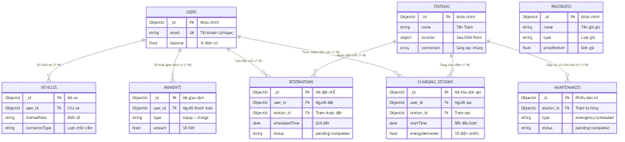

  <h2>BÁO CÁO CUỐI KỲ MÔN HỌC</h2>
  <h1>PHÂN TÍCH THIẾT KẾ HỆ THỐNG</h1>
  <h2>HỆ THỐNG QUẢN LÝ TRẠM SẠC XE ĐIỆN</h2>
  <h3>(EV Charging Station Management System)</h3>

---

# BÀI 1: XÁC ĐỊNH YÊU CẦU

---

## 1.1. MÔ TẢ HỆ THỐNG

### 1.1.1. Giới thiệu tổng quan

Hệ thống Quản lý Trạm Sạc Xe Điện (EV Charging Station Management System) là một ứng dụng Web toàn diện được xây dựng nhằm giải quyết bài toán quản lý và vận hành mạng lưới trạm sạc xe điện. Trong bối cảnh xu hướng chuyển đổi từ phương tiện sử dụng nhiên liệu hóa thạch sang xe điện đang diễn ra mạnh mẽ trên toàn cầu, nhu cầu về một hệ thống quản lý trạm sạc thông minh, tự động hóa và thân thiện với người dùng là vô cùng cấp thiết.

Hệ thống được thiết kế để phục vụ hai nhóm đối tượng chính: Khách hàng sử dụng dịch vụ sạc xe và Quản trị viên vận hành hệ thống. Toàn bộ quy trình từ tìm kiếm trạm sạc trên bản đồ tương tác, đặt chỗ trước, sạc xe theo thời gian thực, thanh toán qua ví điện tử cho đến quản lý hạ tầng và báo cáo doanh thu đều được số hóa và tự động hóa hoàn toàn thông qua nền tảng Web.

Hệ thống được xây dựng trên nền tảng công nghệ hiện đại: Node.js làm môi trường Runtime phía máy chủ, Express.js làm Web Framework, MongoDB Atlas làm cơ sở dữ liệu NoSQL trên đám mây, EJS làm View Engine để render giao diện HTML động, và tích hợp các dịch vụ bên ngoài như PayOS (cổng thanh toán VietQR) và Nodemailer (gửi Email OTP qua Gmail SMTP).

### 1.1.2. Nghiệp vụ — Công việc hệ thống sẽ làm

Hệ thống thực hiện các nghiệp vụ chính sau đây, được phân chia theo từng nhóm đối tượng sử dụng:

**A. Nghiệp vụ dành cho Khách hàng (Customer):**

**1. Đăng ký và Xác thực tài khoản:**
Khách hàng truy cập trang web và thực hiện đăng ký tài khoản mới bằng cách cung cấp các thông tin: Họ và tên đầy đủ, Địa chỉ Email (đồng thời là tên đăng nhập), Số điện thoại liên hệ, và Mật khẩu. Hệ thống yêu cầu mật khẩu phải tuân thủ chính sách bảo mật nghiêm ngặt: tối thiểu 6 ký tự, phải chứa ít nhất 1 chữ cái viết hoa và 1 ký tự đặc biệt (ví dụ: @, #, $, %). Sau khi nhận được thông tin đăng ký, máy chủ (Server) thực hiện các bước xử lý: (a) Kiểm tra Email đã tồn tại trong cơ sở dữ liệu chưa, (b) Băm mật khẩu bằng thuật toán bcrypt với 12 vòng lặp (salt rounds) để đảm bảo an toàn tuyệt đối ngay cả khi cơ sở dữ liệu bị xâm phạm, (c) Sinh mã OTP ngẫu nhiên 6 chữ số có thời hạn 5 phút, (d) Lưu thông tin người dùng vào MongoDB với trạng thái isActive = false (chưa kích hoạt), (e) Gửi mã OTP qua Email thông qua dịch vụ Nodemailer kết nối máy chủ Gmail SMTP. Khách hàng phải nhập đúng mã OTP nhận được qua Email để kích hoạt tài khoản, lúc này trường isActive được chuyển thành true.

**2. Đăng nhập và Phân quyền truy cập:**
Hệ thống hỗ trợ đăng nhập bằng Email và Mật khẩu. Quy trình xử lý đăng nhập phía Server: (a) Truy vấn MongoDB tìm document User có email tương ứng, (b) Sử dụng hàm bcrypt.compare() để so sánh mật khẩu nhập vào với chuỗi hash đã lưu, (c) Kiểm tra trường isActive — nếu tài khoản chưa kích hoạt, hệ thống tự động gửi lại mã OTP và chuyển hướng đến trang xác thực, (d) Nếu đăng nhập thành công, Server tạo một Session Cookie được lưu trữ trên MongoDB (thông qua thư viện connect-mongo với MongoStore) với thời hạn 7 ngày. Session chứa các thông tin quan trọng: _id, fullName, email, phone, role, avatar, balance. (e) Hệ thống tự động phân quyền dựa trên trường role: nếu role = 'customer' thì chuyển hướng đến giao diện Khách hàng (/customer), nếu role = 'admin' thì chuyển hướng đến bảng điều khiển Quản trị (/admin/dashboard). Đặc biệt, hệ thống có cơ chế returnTo: nếu người dùng chưa đăng nhập mà cố truy cập một trang yêu cầu xác thực, URL đó sẽ được lưu lại và tự động chuyển hướng sau khi đăng nhập thành công.

**3. Khôi phục mật khẩu (Forgot Password):**
Khi quên mật khẩu, khách hàng truy cập trang /auth/forgot-password và nhập Email đã đăng ký. Hệ thống không tiết lộ Email có tồn tại hay không (chống dò quét tài khoản — Security Best Practice). Nếu Email hợp lệ, hệ thống sinh mã OTP 6 số, gửi qua Email với template HTML chuyên nghiệp (tiêu đề "Khôi phục mật khẩu EV Charge", nội dung gồm logo, mã OTP nổi bật, và ghi chú thời hạn 5 phút). Sau khi xác thực OTP thành công, khách hàng được chuyển đến trang đặt lại mật khẩu mới. Mật khẩu mới phải tuân thủ cùng chính sách bảo mật như khi đăng ký.

**4. Tìm kiếm trạm sạc trên bản đồ tương tác (GIS Map):**
Đây là chức năng cốt lõi nhất của phía khách hàng. Hệ thống tích hợp thư viện JavaScript mã nguồn mở Leaflet.js để hiển thị bản đồ tương tác toàn màn hình. Các trạm sạc được đánh dấu bằng các marker (điểm đánh dấu) trên bản đồ. Khi khách hàng bấm vào một marker, một popup (cửa sổ nổi) hiển thị thông tin tóm tắt: tên trạm, địa chỉ, đơn giá điện (VNĐ/kWh), số lượng súng sạc khả dụng/tổng, và nút "Xem chi tiết". Phía Backend, hệ thống sử dụng chỉ mục không gian 2dsphere (Geospatial Index) của MongoDB được khai báo trên trường location (GeoJSON Point) để thực hiện truy vấn không gian (Geospatial Query), tìm các trạm sạc trong bán kính lân cận vị trí GPS hiện tại của khách hàng. Phía trên bản đồ có thanh tìm kiếm cho phép lọc trạm theo tên hoặc địa chỉ bằng biểu thức chính quy (Regular Expression) không phân biệt hoa thường.

**5. Đặt chỗ sạc trước (Reservation):**
Khách hàng có thể "đặt gạch" một súng sạc cụ thể tại một trạm sạc trước khi di chuyển đến. Quy trình: chọn trạm sạc, chọn vị trí súng sạc (connectorIndex), chọn thời gian dự kiến đến (scheduledTime), nhập thời lượng dự kiến sạc (duration, mặc định 60 phút). Hệ thống tạo một document Reservation với trạng thái pending. Khách hàng có thể hủy đặt chỗ bất cứ lúc nào trước thời gian hẹn.

**6. Sạc xe và Theo dõi thời gian thực (Real-time Charging):**
Khi đến trạm sạc, khách hàng bấm nút "Bắt đầu sạc" trên giao diện Web. Hệ thống thực hiện các bước: (a) Kiểm tra số dư ví điện tử >= 200.000 VNĐ (yêu cầu tối thiểu để đảm bảo thanh toán), (b) Kiểm tra súng sạc được chọn có trạng thái available không, (c) Tạo một document ChargingSession với status = 'charging' và ghi nhận startTime, (d) Chuyển trạng thái súng sạc từ available sang in_use trong mảng connectors embedded của Station. Trong suốt quá trình sạc, giao diện Client sử dụng kỹ thuật Polling — gọi API GET /customer/charging/:id/status mỗi 2 giây — để cập nhật các chỉ số thời gian thực: công suất hiện tại (kW), lượng điện đã nạp (kWh), phần trăm pin (%), và tổng chi phí tạm tính (VNĐ). Khi khách hàng bấm "Dừng sạc" hoặc lượng điện đạt đến targetEnergy, hệ thống tự động: chốt hóa đơn (tính totalCost = energyDelivered * pricePerKwh), trừ tiền từ ví điện tử (balance -= totalCost), cập nhật paymentStatus = 'paid', giải phóng súng sạc (connector.status = 'available'), và cộng doanh thu vào trạm sạc (station.totalRevenue += totalCost).

**7. Ví điện tử và Nạp tiền qua VietQR:**
Mỗi tài khoản khách hàng được trang bị một ví điện tử nội bộ (trường balance trong collection users). Khách hàng nạp tiền vào ví thông qua cổng thanh toán PayOS. Quy trình: (a) Khách nhập số tiền muốn nạp (tối thiểu 10.000 VNĐ), (b) Server gọi PayOS SDK tạo Payment Link kèm mã đơn hàng (orderCode = Date.now()), thời hạn thanh toán 2 phút, URL callback (returnUrl/cancelUrl), (c) PayOS trả về checkoutUrl và mã QR theo chuẩn VietQR, (d) Giao diện hiển thị mã QR để khách quét bằng ứng dụng ngân hàng, (e) Khi khách chuyển khoản thành công, PayOS gửi Webhook callback HTTP POST đến endpoint /webhook/payos của hệ thống, (f) Server xác minh tính toàn vẹn dữ liệu Webhook bằng chữ ký HMAC checksum (sử dụng hàm payos.webhooks.verifyPaymentWebhookData), (g) Nếu hợp lệ, Server cập nhật Payment status = 'completed' và cộng tiền vào balance.

**8. Xem lịch sử giao dịch:**
Khách hàng xem lại toàn bộ lịch sử phiên sạc và giao dịch tài chính. Hệ thống truy vấn các document ChargingSession và Payment có user = userId, sắp xếp theo thời gian mới nhất (sort createdAt: -1). Mỗi bản ghi hiển thị đầy đủ: thời gian bắt đầu/kết thúc, tên trạm sạc, lượng điện tiêu thụ (kWh), đơn giá, tổng tiền, trạng thái thanh toán.

**9. Quản lý hồ sơ cá nhân:**
Khách hàng cập nhật thông tin cá nhân: họ tên, số điện thoại. Khách hàng cũng có thể đổi mật khẩu (yêu cầu nhập mật khẩu cũ để xác minh).

**B. Nghiệp vụ dành cho Quản trị viên (Admin):**

**1. Dashboard thống kê tổng quan:**
Bảng điều khiển (Dashboard) được thiết kế theo phong cách Dark Mode chuyên nghiệp, hiển thị các chỉ số KPI (Key Performance Indicator) quan trọng: Tổng số trạm sạc trong hệ thống, Số trạm sạc đang hoạt động (status = active), Tổng số khách hàng đã đăng ký, Tổng số phiên sạc đã thực hiện, Số phiên sạc đang diễn ra thời gian thực (status = charging), Tổng doanh thu tích lũy (tính bằng MongoDB Aggregation Pipeline: match paymentStatus = 'paid' rồi group sum totalCost), Số yêu cầu bảo trì đang chờ xử lý. Biểu đồ doanh thu được vẽ bằng thư viện Chart.js với 3 chế độ xem: Theo Tuần (nhóm theo ngày trong tuần — $dayOfWeek), Theo Tháng (nhóm theo tuần trong tháng — $week), và Theo Năm (nhóm theo tháng trong năm — $month). Bên cạnh biểu đồ cột doanh thu là biểu đồ tròn (Doughnut Chart) thể hiện phân bố trạng thái trạm sạc (active/inactive/maintenance). Cuối Dashboard là bảng 10 phiên sạc gần nhất, populate thông tin tên khách hàng và tên trạm sạc.

**2. Quản lý trạm sạc — Thao tác CRUD đầy đủ:**
- **Create (Thêm mới):** Admin nhập thông tin: tên trạm, địa chỉ, tọa độ GPS (kinh độ longitude, vĩ độ latitude), đơn giá điện (VNĐ/kWh), mô tả. Admin thêm động nhiều súng sạc, mỗi súng sạc chọn loại đầu cắm (Type1, Type2, CCS, CHAdeMO, Tesla) và nhập công suất (kW). Hệ thống lưu tọa độ dưới dạng GeoJSON Point { type: 'Point', coordinates: [lng, lat] }, các súng sạc được lưu dưới dạng mảng embedded (connectors) bên trong document Station. Sau khi tạo thành công, hệ thống ghi nhận thông báo vào biến toàn cục global.adminNotifications để hiển thị real-time trên giao diện.
- **Read (Xem):** Hiển thị danh sách trạm sạc dạng bảng DataTable với các cột: Tên, Địa chỉ, Giá/kWh, Số súng sạc, Trạng thái, Hành động. Có thanh tìm kiếm theo tên hoặc địa chỉ (sử dụng $regex MongoDB).
- **Update (Sửa):** Admin sửa mọi thông tin trạm sạc, bao gồm cả trạng thái (active/inactive/maintenance).
- **Delete (Xóa):** Xóa trạm sạc khỏi hệ thống, hệ thống ghi nhận thông báo xóa.

**3. Quản lý người dùng:** Admin xem danh sách toàn bộ khách hàng. Admin khóa/mở tài khoản bằng nút toggle. Admin xóa tài khoản vĩnh viễn.

**4. Cấu hình bảng giá điện theo khung giờ:** Admin tạo các gói giá: Giá tiêu chuẩn (standard), Giá giờ cao điểm (peak), Giá giờ thấp điểm (off_peak), Giá cuối tuần (weekend). Mỗi gói gồm: tên, đơn giá, giờ bắt đầu, giờ kết thúc, mô tả.

**5. Báo cáo kế toán:** Hệ thống tổng hợp báo cáo doanh thu chi tiết từ các document ChargingSession đã thanh toán.

**6. Quản lý bảo trì thiết bị:** Admin tạo phiếu bảo trì khi phát hiện sự cố (loại: khẩn cấp/định kỳ/kiểm tra), ghi nhận trạm bị ảnh hưởng, mô tả sự cố, chỉ định kỹ thuật viên, theo dõi tiến độ, ghi nhận chi phí sửa chữa.

**7. Xử lý hoàn tiền:** Admin duyệt và xử lý hoàn tiền cho khách hàng khi có sự cố.

### 1.1.3. Thiết bị sử dụng

| STT | Thiết bị | Mục đích | Yêu cầu |
|:---:|:---|:---|:---|
| 1 | Điện thoại thông minh | Khách hàng tìm trạm sạc, đặt chỗ, theo dõi sạc, nạp tiền | Chrome/Safari, Internet, GPS |
| 2 | Máy tính bảng | Truy cập hệ thống | Trình duyệt hiện đại |
| 3 | Máy tính xách tay / PC | Admin quản lý hệ thống qua Dashboard | Chrome, Internet |
| 4 | Cloud VPS Ubuntu | Chạy Node.js Backend | Node.js v22+, PM2 |
| 5 | MongoDB Atlas Cloud | Lưu trữ dữ liệu | Replica Set 3 node |

### 1.1.4. Đối tượng sử dụng hệ thống — Tác nhân (Actors)

| STT | Tác nhân | Vai trò chi tiết |
|:---:|:---|:---|
| 1 | **Khách hàng (Customer)** | Người sở hữu xe điện, sử dụng dịch vụ sạc xe. Là nguồn tạo ra doanh thu chính. Tương tác qua giao diện Web trên điện thoại hoặc máy tính. |
| 2 | **Quản trị viên (Admin)** | Nhân viên vận hành. Toàn quyền quản lý hạ tầng trạm sạc, người dùng, bảng giá, báo cáo tài chính và bảo trì. Truy cập qua Dashboard trên máy tính. |
| 3 | **Cổng thanh toán PayOS** | Hệ thống bên ngoài (External System), trung gian xử lý giao dịch ngân hàng. Tự động gửi Webhook khi khách chuyển khoản thành công. |

## 1.2. PHẠM VI CỦA HỆ THỐNG

### 1.2.1. Phạm vi chức năng (Trong phạm vi)

- **Quản lý danh tính:** Đăng ký, Đăng nhập, Xác thực OTP qua Email, Khôi phục mật khẩu, Phân quyền Customer/Admin.
- **Quản lý trạm sạc:** CRUD trạm sạc, Quản lý súng sạc embedded, Hiển thị trên bản đồ GIS Leaflet.js, Tìm kiếm Geospatial.
- **Quản lý giao dịch sạc xe:** Đặt chỗ trước, Bắt đầu/Dừng sạc, Theo dõi thời gian thực bằng Polling, Chốt hóa đơn tự động.
- **Quản lý tài chính:** Ví điện tử nội bộ, Nạp tiền qua VietQR (PayOS SDK), Xác minh Webhook HMAC, Lịch sử giao dịch.
- **Quản lý vận hành:** Dashboard KPI với Chart.js, Biểu đồ doanh thu (Tuần/Tháng/Năm), Bảng giá động, Bảo trì thiết bị, Hoàn tiền.

### 1.2.2. Ngoài phạm vi

- Không quản lý phần cứng vật lý thực tế của trụ sạc (không điều khiển dòng điện, không đọc cảm biến IoT).
- Không tích hợp ứng dụng di động Native (iOS/Android), chỉ hoạt động trên trình duyệt Web (Responsive).
- Không xử lý thuế VAT hoặc xuất hóa đơn đỏ theo quy định kế toán Việt Nam.

---

# BÀI 2: PHÁT HỌA GIAO DIỆN HỆ THỐNG

---

## 2.1. GIAO DIỆN XÁC THỰC (Authentication)

### 2.1.1. Trang Đăng nhập

Giao diện đăng nhập được thiết kế theo phong cách hiện đại, sử dụng gradient màu xanh lá cây (#00d26a) làm chủ đạo, phù hợp với thương hiệu "Năng lượng xanh" của hệ thống. Bố cục chia làm 2 phần: bên trái là hình minh họa xe điện đang sạc, bên phải là form đăng nhập. Form gồm 2 ô nhập liệu (Email và Mật khẩu), nút "Đăng nhập" nổi bật, liên kết "Quên mật khẩu?" và liên kết "Chưa có tài khoản? Đăng ký ngay". Thiết kế responsive, trên điện thoại form sẽ chiếm toàn bộ màn hình.

### 2.1.2. Trang Đăng ký

Giao diện đăng ký mở rộng từ trang đăng nhập (cùng file login.ejs, chuyển đổi bằng biến isRegister). Bổ sung thêm các trường: Họ và tên, Số điện thoại, Mật khẩu và Xác nhận mật khẩu. Giao diện hiển thị gợi ý chính sách mật khẩu (ít nhất 1 chữ hoa + 1 ký tự đặc biệt) ngay dưới ô nhập để người dùng biết trước khi submit.

### 2.1.3. Trang Xác thực OTP

Sau khi đăng ký, hệ thống chuyển hướng đến trang nhập mã OTP 6 số. Giao diện hiển thị rõ Email đã đăng ký để người dùng biết kiểm tra đúng hộp thư. Có hướng dẫn "Mã OTP có hiệu lực trong 5 phút" và nút Xác nhận.

### 2.1.4. Trang Quên mật khẩu

Giao diện đơn giản: 1 ô nhập Email và nút "Gửi mã OTP". Thiết kế tối giản, tập trung vào hành động duy nhất.

### 2.1.5. Trang Đặt lại mật khẩu

Sau khi xác thực OTP khôi phục thành công, khách hàng nhập mật khẩu mới và xác nhận. Giao diện giống trang đăng ký nhưng chỉ có 2 ô: Mật khẩu mới và Xác nhận mật khẩu mới.

## 2.2. GIAO DIỆN KHÁCH HÀNG (Customer)

### 2.2.1. Trang chủ Khách hàng

Trang chủ hiển thị lời chào cá nhân hóa ("Xin chào, [Tên]!"), các trạm sạc gần đây dạng card ngang, và thanh điều hướng dạng Bottom Navigation Bar (Trang chủ, Bản đồ, Ví tiền, Lịch sử, Hồ sơ) phù hợp với trải nghiệm di động (Mobile-First). Giao diện sử dụng tone màu xanh lá (#00d26a) xuyên suốt, tạo cảm giác năng lượng sạch và thân thiện môi trường.

### 2.2.2. Bản đồ Trạm sạc (GIS Map)

Đây là màn hình cốt lõi nhất của phía khách hàng. Bản đồ tương tác toàn màn hình được xây dựng bằng thư viện Leaflet.js, sử dụng tile map từ OpenStreetMap. Toàn bộ trạm sạc được hiển thị dưới dạng marker (điểm đánh dấu) với biểu tượng sạc điện tùy chỉnh. Khi bấm vào marker, popup nổi hiển thị: tên trạm, địa chỉ, giá điện (VNĐ/kWh), số súng sạc khả dụng/tổng, và nút "Xem chi tiết" chuyển đến trang chi tiết trạm. Phía trên bản đồ có thanh tìm kiếm cho phép lọc trạm theo tên hoặc địa chỉ. Bản đồ tự động lấy vị trí GPS hiện tại của người dùng (nếu được cấp quyền) và hiển thị marker vị trí của họ.

### 2.2.3. Chi tiết Trạm sạc

Khi khách hàng bấm vào một trạm sạc trên bản đồ, màn hình chi tiết hiển thị đầy đủ: tên trạm, địa chỉ đầy đủ, đơn giá điện, giờ hoạt động, mô tả. Phần quan trọng nhất là danh sách từng súng sạc: hiển thị dạng card với thông tin loại đầu cắm (Type1/Type2/CCS/CHAdeMO/Tesla), công suất (kW), và trạng thái (Available — màu xanh, In Use — màu cam, Maintenance — màu đỏ). Có 2 nút hành động: "Đặt chỗ" và "Bắt đầu sạc" (chỉ hiện khi súng sạc Available).

### 2.2.4. Ví điện tử và Nạp tiền

Giao diện ví điện tử hiển thị số dư hiện tại nổi bật ở trên cùng (font lớn, in đậm). Phía dưới là form nạp tiền: ô nhập số tiền, các nút gợi ý nhanh (50K, 100K, 200K, 500K), và nút "Nạp tiền". Khi bấm Nạp tiền, modal popup hiển thị mã QR VietQR để khách quét bằng app ngân hàng. Bên dưới form nạp tiền là danh sách lịch sử giao dịch (nạp tiền — màu xanh, trừ tiền sạc — màu đỏ) sắp xếp theo thời gian mới nhất.

### 2.2.5. Lịch sử Giao dịch

Màn hình hiển thị toàn bộ lịch sử phiên sạc dạng danh sách card. Mỗi card gồm: ngày giờ sạc, tên trạm sạc, lượng điện tiêu thụ (kWh), tổng tiền (VNĐ), và trạng thái (Completed — badge xanh, Cancelled — badge đỏ). Bấm vào card để xem chi tiết hóa đơn.

### 2.2.6. Hồ sơ cá nhân

Khách hàng xem và chỉnh sửa thông tin: họ tên, email (không đổi được), số điện thoại, ảnh đại diện. Giao diện dạng tab: Tab "Thông tin" và Tab "Đổi mật khẩu". Tab đổi mật khẩu yêu cầu nhập mật khẩu cũ để xác minh trước khi cho phép đặt mật khẩu mới.

## 2.3. GIAO DIỆN QUẢN TRỊ VIÊN (Admin Dashboard)

### 2.3.1. Bảng điều khiển tổng quan (Dashboard)

Dashboard được thiết kế theo phong cách Dark Mode sang trọng, chuyên nghiệp. Bố cục gồm: Thanh sidebar trái (menu điều hướng: Dashboard, Trạm sạc, Người dùng, Bảng giá, Báo cáo, Bảo trì, Cài đặt). Phần trên cùng của nội dung chính là 4 thẻ KPI card nổi bật với biểu tượng và số liệu: Tổng trạm sạc, Tổng người dùng, Tổng phiên sạc, Tổng doanh thu. Phía dưới chia 2 cột: cột trái là biểu đồ cột/đường doanh thu theo thời gian (Chart.js) với 3 tab chuyển đổi Tuần/Tháng/Năm; cột phải là biểu đồ tròn Doughnut phân bố trạng thái trạm sạc. Cuối trang là bảng DataTable hiển thị 10 phiên sạc gần nhất (populate tên khách hàng + tên trạm).

### 2.3.2. Quản lý Trạm sạc

Giao diện dạng DataTable hiển thị danh sách trạm sạc với các cột: Tên trạm, Địa chỉ, Giá/kWh, Số súng sạc, Trạng thái (badge màu: Active-xanh, Inactive-xám, Maintenance-cam), Hành động (nút Sửa — icon bút, nút Xóa — icon thùng rác màu đỏ, có xác nhận SweetAlert2 chống xóa nhầm). Phía trên bảng có nút "Thêm trạm mới" và thanh tìm kiếm.

### 2.3.3. Form Thêm/Sửa Trạm sạc

Form nhập liệu chi tiết: Tên trạm, Địa chỉ, Tọa độ GPS (2 ô nhập Latitude/Longitude), Đơn giá điện, Mô tả. Phần đặc biệt: khu vực "Danh sách súng sạc" cho phép Admin thêm động nhiều súng sạc bằng nút "Thêm súng sạc" — mỗi dòng gồm dropdown chọn loại đầu cắm (Type1/Type2/CCS/CHAdeMO/Tesla) và ô nhập công suất (kW).

### 2.3.4. Quản lý Người dùng

Bảng danh sách người dùng: Họ tên, Email, Số dư ví (định dạng VNĐ), Trạng thái (Active — badge xanh, Inactive — badge đỏ), Ngày đăng ký, Hành động (nút Toggle khóa/mở, nút Xóa).

### 2.3.5. Báo cáo Kế toán

Giao diện báo cáo tổng hợp: biểu đồ phân tích doanh thu theo thời gian, bảng chi tiết từng giao dịch đã thanh toán, tổng doanh thu tích lũy.

### 2.3.6. Quản lý Bảo trì

Bảng danh sách phiếu bảo trì: Trạm sạc, Loại (Emergency — badge đỏ, Scheduled — badge xanh), Mô tả sự cố, Trạng thái (Pending/In Progress/Completed), Kỹ thuật viên, Chi phí, Ngày tạo. Có form tạo phiếu bảo trì mới ngay trên trang.

### 2.3.7. Cài đặt Hệ thống

Giao diện cài đặt cho phép Admin tùy chỉnh các thông số hệ thống và xem thông tin cấu hình.

---

# BÀI 3: PHÂN TÍCH CHỨC NĂNG

---

## 3.1. TÁC NHÂN (ACTORS)

Hệ thống có 3 tác nhân tương tác trực tiếp:

| STT | Tác nhân | Ký hiệu | Mô tả chi tiết |
|:---:|:---|:---:|:---|
| 1 | Khách hàng (Customer) | KH | Người sở hữu xe điện, đăng ký tài khoản để sử dụng dịch vụ sạc xe. Là nguồn tạo ra doanh thu chính cho hệ thống. Tương tác qua giao diện Web trên điện thoại hoặc máy tính. |
| 2 | Quản trị viên (Admin) | QTV | Nhân viên vận hành hệ thống. Có toàn quyền quản lý hạ tầng trạm sạc, người dùng, bảng giá, báo cáo tài chính và bảo trì thiết bị. Truy cập qua Dashboard quản trị trên máy tính. |
| 3 | Cổng thanh toán PayOS | PayOS | Hệ thống bên ngoài (External System Actor), đóng vai trò trung gian xử lý giao dịch ngân hàng. PayOS tự động gửi thông báo Webhook HTTP POST đến endpoint /webhook/payos của hệ thống khi phát hiện khách hàng chuyển khoản thành công qua VietQR. |

## 3.2. USE CASE — CHỨC NĂNG CHÍNH VÀ CHỨC NĂNG CON

### A. Nhóm chức năng Xác thực (Authentication) — 4 Use Case

| UC | Tên chức năng | Tác nhân | Chức năng con |
|:---|:---|:---|:---|
| UC01 | Đăng ký tài khoản | KH | UC01.1 Xác thực OTP Email |
| UC02 | Đăng nhập | KH, QTV | — |
| UC03 | Quên mật khẩu | KH | UC03.1 Gửi OTP khôi phục, UC03.2 Đặt lại mật khẩu mới |
| UC04 | Đăng xuất | KH, QTV | — |

### B. Nhóm chức năng Khách hàng (Customer) — 6 Use Case

| UC | Tên chức năng | Tác nhân | Chức năng con |
|:---|:---|:---|:---|
| UC05 | Tìm kiếm trạm sạc trên bản đồ | KH | UC05.1 Lọc theo tên/địa chỉ, UC05.2 Xem chi tiết trạm |
| UC06 | Đặt chỗ sạc | KH | UC06.1 Hủy đặt chỗ |
| UC07 | Bắt đầu phiên sạc | KH | UC07.1 Theo dõi thời gian thực, UC07.2 Dừng sạc và chốt hóa đơn |
| UC08 | Nạp tiền ví điện tử | KH, PayOS | UC08.1 Kiểm tra trạng thái nạp tiền (Polling) |
| UC09 | Xem lịch sử giao dịch | KH | UC09.1 Xem chi tiết hóa đơn |
| UC10 | Quản lý hồ sơ cá nhân | KH | UC10.1 Đổi mật khẩu |

### C. Nhóm chức năng Quản trị (Admin) — 7 Use Case

| UC | Tên chức năng | Tác nhân | Chức năng con |
|:---|:---|:---|:---|
| UC11 | Xem Dashboard thống kê | QTV | — |
| UC12 | Quản lý trạm sạc (CRUD) | QTV | UC12.1 Thêm mới, UC12.2 Sửa, UC12.3 Xóa |
| UC13 | Quản lý người dùng | QTV | UC13.1 Khóa/Mở, UC13.2 Xóa |
| UC14 | Cấu hình bảng giá điện | QTV | UC14.1 Thêm, UC14.2 Sửa, UC14.3 Xóa |
| UC15 | Xem báo cáo kế toán | QTV | — |
| UC16 | Quản lý bảo trì | QTV | UC16.1 Tạo phiếu, UC16.2 Cập nhật tiến độ |
| UC17 | Xử lý hoàn tiền | QTV | — |

**Tổng cộng: 17 Use Case chính + 15 Use Case con = 32 chức năng.**

## 3.3. ĐẶC TẢ USE CASE (KỊCH BẢN)

### 3.3.1. Đặc tả UC01 — Đăng ký tài khoản

| Mục | Nội dung |
|:---|:---|
| **Tên UC** | Đăng ký tài khoản mới |
| **Tác nhân** | Khách hàng |
| **Mô tả** | Khách hàng tạo tài khoản mới để sử dụng dịch vụ sạc xe |
| **Điều kiện tiên quyết** | Email chưa được đăng ký trong hệ thống |
| **Luồng chính** | 1. Khách hàng mở trang /auth/register. 2. Nhập Họ tên, Email, SĐT, Mật khẩu, Xác nhận mật khẩu. 3. Bấm nút Đăng ký. 4. Server kiểm tra Regex mật khẩu (chứa chữ hoa + ký tự đặc biệt). 5. Server kiểm tra Email trùng lặp trong MongoDB. 6. Server băm mật khẩu bằng bcrypt 12 rounds. 7. Tạo document User với isActive=false. 8. Sinh OTP 6 số, lưu vào trường otp và otpExpires (5 phút). 9. Gửi Email OTP qua Nodemailer/Gmail SMTP. 10. Chuyển hướng đến /auth/verify-otp. 11. Khách nhập OTP → Server xác thực → isActive=true → Tự động đăng nhập. |
| **Luồng ngoại lệ** | 4a. Mật khẩu yếu → Hiển thị lỗi "Mật khẩu phải chứa ít nhất 1 chữ hoa và 1 ký tự đặc biệt". 5a. Email đã tồn tại và isActive=true → Hiển thị lỗi "Email đã được sử dụng". 5b. Email đã tồn tại nhưng isActive=false → Cập nhật thông tin mới, gửi lại OTP. 11a. OTP sai hoặc hết hạn → Hiển thị lỗi "Mã OTP không hợp lệ hoặc đã hết hạn". |
| **Kết quả** | Tài khoản được kích hoạt, khách hàng được đăng nhập tự động vào trang chủ |

### 3.3.2. Đặc tả UC02 — Đăng nhập

| Mục | Nội dung |
|:---|:---|
| **Tên UC** | Đăng nhập hệ thống |
| **Tác nhân** | Khách hàng, Quản trị viên |
| **Mô tả** | Người dùng xác thực danh tính để truy cập hệ thống |
| **Điều kiện tiên quyết** | Tài khoản đã đăng ký và đã xác thực OTP (isActive=true) |
| **Luồng chính** | 1. Mở trang /auth/login. 2. Nhập Email và Mật khẩu. 3. Bấm nút Đăng nhập. 4. Server truy vấn User.findOne({ email }). 5. Gọi user.comparePassword() dùng bcrypt.compare(). 6. Kiểm tra isActive=true. 7. Ghi nhận lastLogin = new Date(). 8. Tạo Session Cookie chứa {_id, fullName, email, phone, role, avatar, balance}. 9. Phân quyền: role='admin' → /admin/dashboard, role='customer' → /customer. |
| **Luồng ngoại lệ** | 4a. Email không tồn tại → Báo lỗi "Email hoặc mật khẩu không đúng". 5a. Mật khẩu sai → Cùng thông báo lỗi (chống dò). 6a. isActive=false → Gửi lại OTP, chuyển /auth/verify-otp. |
| **Kết quả** | Người dùng được chuyển đến trang chủ tương ứng vai trò |

### 3.3.3. Đặc tả UC07 — Bắt đầu phiên sạc

| Mục | Nội dung |
|:---|:---|
| **Tên UC** | Bắt đầu phiên sạc xe điện |
| **Tác nhân** | Khách hàng |
| **Mô tả** | Khách hàng cắm sạc xe tại trạm và theo dõi quá trình sạc thời gian thực |
| **Điều kiện tiên quyết** | Đã đăng nhập, số dư ví >= 200.000 VNĐ, súng sạc có trạng thái Available |
| **Luồng chính** | 1. Chọn trạm sạc và súng sạc (connectorIndex). 2. Bấm "Bắt đầu sạc". 3. Server kiểm tra User.balance >= 200000. 4. Server kiểm tra connector.status === 'available'. 5. Tạo document ChargingSession: status='charging', startTime=now, pricePerKwh=station.pricePerKwh. 6. Chuyển station.connectors[i].status = 'in_use', station.save(). 7. Client chuyển sang giao diện theo dõi sạc. 8. Client gọi API GET /customer/charging/:id/status mỗi 2 giây (Polling). 9. Server tính toán energyDelivered tăng dần, currentPower ngẫu nhiên 22-30kW, batteryEnd tăng theo %. 10. Giao diện cập nhật thời gian thực: thanh progress bar, số kWh, % pin, chi phí VNĐ. 11. Khi đạt targetEnergy hoặc khách bấm "Dừng sạc": status='completed', endTime=now. 12. Tính totalCost = energyDelivered × pricePerKwh. 13. Trừ tiền User.balance -= totalCost. 14. Cập nhật paymentStatus='paid'. 15. Giải phóng connector.status = 'available'. 16. Cộng doanh thu station.totalRevenue += totalCost. |
| **Luồng ngoại lệ** | 3a. Số dư < 200.000đ → JSON {success:false, message:"Ví phải có tối thiểu 200.000đ"}. 4a. Súng sạc đang bận → JSON {success:false, message:"Trụ sạc không khả dụng"}. |
| **Kết quả** | Phiên sạc hoàn tất, tiền trừ từ ví, súng sạc giải phóng, doanh thu cộng vào trạm |

### 3.3.4. Đặc tả UC08 — Nạp tiền ví điện tử

| Mục | Nội dung |
|:---|:---|
| **Tên UC** | Nạp tiền vào ví điện tử qua VietQR |
| **Tác nhân** | Khách hàng, Hệ thống PayOS |
| **Mô tả** | Khách hàng nạp tiền vào ví nội bộ thông qua chuyển khoản ngân hàng |
| **Điều kiện tiên quyết** | Đã đăng nhập, số tiền nạp >= 10.000 VNĐ |
| **Luồng chính** | 1. Nhập số tiền muốn nạp. 2. Server tạo Payment document: type='topup', status='pending', orderCode=Date.now(). 3. Server gọi PayOS SDK paymentService.createPaymentLink() với returnUrl, cancelUrl, expiredAt (2 phút). 4. PayOS trả về checkoutUrl và mã QR. 5. Giao diện hiển thị mã QR VietQR cho khách quét. 6. Khách mở app ngân hàng, quét QR, chuyển khoản. 7. PayOS phát hiện giao dịch thành công, gửi HTTP POST Webhook đến /webhook/payos. 8. Server gọi paymentService.verifyWebhook() xác minh HMAC checksum. 9. Nếu hợp lệ: Payment.status='completed', User.balance += amount. 10. Client polling API /payment/check/:orderCode phát hiện status='completed' → Cập nhật giao diện. |
| **Luồng ngoại lệ** | 6a. Khách không chuyển khoản trong 2 phút → Đơn hết hạn. 8a. HMAC checksum không khớp → Từ chối giao dịch (chống gian lận). |
| **Kết quả** | Số dư ví tăng, giao dịch được ghi nhận trong lịch sử |

### 3.3.5. Đặc tả UC12 — Quản lý trạm sạc (CRUD)

| Mục | Nội dung |
|:---|:---|
| **Tên UC** | Quản lý trạm sạc |
| **Tác nhân** | Quản trị viên |
| **Mô tả** | Admin thêm, xem, sửa, xóa trạm sạc trong hệ thống |
| **Điều kiện tiên quyết** | Đã đăng nhập với role='admin', đã qua middleware isAuthenticated + isAdmin |
| **Luồng chính (Thêm mới)** | 1. Bấm nút "Thêm trạm mới" tại /admin/stations. 2. Điền form: tên, địa chỉ, tọa độ (lat, lng), giá/kWh, mô tả. 3. Thêm súng sạc: chọn loại đầu cắm (Type1/Type2/CCS/CHAdeMO/Tesla), nhập công suất kW. 4. Bấm Lưu. 5. Server parse connectors thành mảng object. 6. Tạo document Station với location: {type:'Point', coordinates:[lng,lat]}, connectors embedded. 7. Ghi thông báo global.adminNotifications.push(). 8. Redirect /admin/stations?msg=created. |
| **Luồng ngoại lệ** | 3a. Không thêm súng sạc nào → Server tự thêm 1 súng Type2 22kW mặc định. |
| **Kết quả** | Trạm sạc mới xuất hiện trên bản đồ khách hàng và danh sách quản lý |

## 3.4. BIỂU ĐỒ USE CASE

```mermaid
graph TD
    subgraph "Hệ thống Quản lý Trạm Sạc Xe Điện"
        UC01["UC01: Đăng ký tài khoản"]
        UC02["UC02: Đăng nhập"]
        UC03["UC03: Quên mật khẩu"]
        UC04["UC04: Đăng xuất"]
        UC05["UC05: Tìm trạm sạc bản đồ"]
        UC06["UC06: Đặt chỗ sạc"]
        UC07["UC07: Bắt đầu phiên sạc"]
        UC08["UC08: Nạp tiền ví"]
        UC09["UC09: Xem lịch sử"]
        UC10["UC10: Quản lý hồ sơ"]
        UC11["UC11: Dashboard thống kê"]
        UC12["UC12: CRUD Trạm sạc"]
        UC13["UC13: Quản lý người dùng"]
        UC14["UC14: Cấu hình bảng giá"]
        UC15["UC15: Báo cáo kế toán"]
        UC16["UC16: Quản lý bảo trì"]
        UC17["UC17: Xử lý hoàn tiền"]
    end
    KH(("Khách hàng"))
    QTV(("Quản trị viên"))
    PAYOS(("PayOS"))
    KH --- UC01
    KH --- UC02
    KH --- UC03
    KH --- UC04
    KH --- UC05
    KH --- UC06
    KH --- UC07
    KH --- UC08
    KH --- UC09
    KH --- UC10
    QTV --- UC02
    QTV --- UC04
    QTV --- UC11
    QTV --- UC12
    QTV --- UC13
    QTV --- UC14
    QTV --- UC15
    QTV --- UC16
    QTV --- UC17
    PAYOS --- UC08
```

---

# BÀI 4: PHÂN TÍCH HỆ THỐNG

---

## 4.1. PHÂN TÍCH TĨNH

### 4.1.1. Xác định các lớp (Classes)

Dựa trên phân tích chức năng ở Bài 3 và cấu trúc mã nguồn thực tế (thư mục models/ gồm 8 file Schema Mongoose), hệ thống bao gồm 9 lớp thực thể:

| STT | Tên lớp | Collection MongoDB | Vai trò trong hệ thống |
|:---:|:---|:---|:---|
| 1 | User | users | Quản lý danh tính và phân quyền người dùng (Customer + Admin) |
| 2 | Station | stations | Quản lý hạ tầng vật lý trạm sạc và vị trí GeoJSON |
| 3 | Connector | (Embedded trong Station) | Đại diện cho một súng sạc vật lý gắn trên trạm |
| 4 | Vehicle | vehicles | Quản lý phương tiện xe điện đã đăng ký của khách hàng |
| 5 | ChargingSession | chargingsessions | Ghi nhận giao dịch sạc xe (hóa đơn điện) |
| 6 | Payment | payments | Ghi nhận giao dịch tài chính (nạp ví, trừ tiền, hoàn tiền) |
| 7 | Reservation | reservations | Quản lý đơn đặt chỗ giữ súng sạc trước |
| 8 | PriceRate | pricerates | Quản lý bảng giá điện theo khung giờ cao/thấp điểm |
| 9 | Maintenance | maintenances | Quản lý nhật ký bảo trì và sự cố thiết bị |

### 4.1.2. Xác định quan hệ giữa các lớp

- **User (1) ←→ (N) Vehicle:** Một khách hàng sở hữu nhiều xe điện. Mỗi xe chỉ thuộc một chủ.
- **User (1) ←→ (N) Payment:** Một khách hàng có nhiều giao dịch tài chính.
- **User (1) ←→ (N) ChargingSession:** Một khách hàng thực hiện nhiều phiên sạc tại nhiều trạm khác nhau.
- **User (1) ←→ (N) Reservation:** Một khách hàng tạo nhiều đơn đặt chỗ.
- **Station (1) ◆→ (N) Connector:** Quan hệ Composition (nhúng) — súng sạc là thành phần không thể tách rời khỏi trạm sạc. Khi xóa trạm, toàn bộ súng sạc bị xóa theo.
- **Station (1) ←→ (N) ChargingSession:** Một trạm sạc phục vụ nhiều phiên sạc.
- **Station (1) ←→ (N) Reservation:** Một trạm sạc nhận nhiều đơn đặt chỗ.
- **Station (1) ←→ (N) Maintenance:** Một trạm sạc có nhiều phiếu bảo trì qua thời gian.
- **ChargingSession (N) ←→ (1) User + (1) Station:** Đây là bảng trung gian thể hiện quan hệ nhiều-nhiều giữa User và Station.

### 4.1.3. Biểu đồ lớp (Class Diagram)

### 4.1.4. Xác định thuộc tính lớp

**Lớp User (models/User.js):**
- `_id`: ObjectId — Khóa chính, MongoDB tự sinh
- `fullName`: String, Required — Họ và tên đầy đủ
- `email`: String, Unique, Lowercase — Email đăng nhập (chỉ mục duy nhất)
- `phone`: String — Số điện thoại liên hệ
- `password`: String, Required — Mật khẩu đã băm bcrypt 12 rounds
- `role`: String, Enum ['customer','admin'], Default 'customer' — Cờ phân quyền
- `avatar`: String — Đường dẫn ảnh đại diện
- `balance`: Number, Default 0 — Số dư ví điện tử (VNĐ)
- `isActive`: Boolean, Default false — Trạng thái kích hoạt OTP
- `otp`: String — Mã OTP 6 số tạm thời
- `otpExpires`: Date — Thời điểm hết hạn OTP (5 phút)
- `lastLogin`: Date — Lần đăng nhập gần nhất
- `createdAt`, `updatedAt`: Date — Timestamps tự động (Mongoose)

**Lớp Station (models/Station.js):**
- `_id`: ObjectId — Khóa chính
- `name`: String, Required — Tên hiển thị trạm sạc
- `address`: String, Required — Địa chỉ đầy đủ
- `location`: Object {type:'Point', coordinates:[lng,lat]} — GeoJSON Point, Index 2dsphere
- `connectors`: Array of Connector — Mảng súng sạc nhúng (Embedded)
- `status`: String, Enum ['active','inactive','maintenance'], Default 'active'
- `pricePerKwh`: Number, Default 5000 — Đơn giá điện (VNĐ/kWh)
- `rating`: Number, Min 0, Max 5 — Đánh giá trung bình
- `totalRatings`: Number — Tổng lượt đánh giá
- `operatingHours`: Object {open:'00:00', close:'23:59'} — Giờ hoạt động
- `amenities`: Array of String — Tiện ích (wifi, WC, cafe...)
- `images`: Array of String — Ảnh trạm sạc
- `description`: String — Mô tả chi tiết
- `totalSessions`: Number, Default 0 — Đếm tổng phiên sạc
- `totalRevenue`: Number, Default 0 — Tổng doanh thu tích lũy

**Lớp Connector (Embedded Sub-document):**
- `type`: String, Enum ['Type1','Type2','CCS','CHAdeMO','Tesla'], Required
- `power`: Number, Required — Công suất sạc (kW)
- `status`: String, Enum ['available','in_use','maintenance','offline'], Default 'available'

**Lớp ChargingSession (models/ChargingSession.js):**
- `_id`: ObjectId — Khóa chính
- `user`: ObjectId, Ref 'User', Required — FK khách hàng
- `station`: ObjectId, Ref 'Station', Required — FK trạm sạc
- `connectorIndex`: Number, Default 0 — Vị trí súng sạc
- `vehicle`: ObjectId, Ref 'Vehicle' — FK xe điện (tùy chọn)
- `status`: String, Enum ['pending','charging','completed','cancelled','error']
- `startTime`, `endTime`: Date — Thời gian bắt đầu/kết thúc
- `energyDelivered`: Number, Default 0 — Lượng điện đã nạp (kWh)
- `targetEnergy`: Number — Mục tiêu kWh
- `currentPower`: Number — Công suất hiện tại (kW)
- `batteryStart`, `batteryEnd`: Number — Pin đầu/cuối (%)
- `pricePerKwh`: Number, Required — Đơn giá áp dụng
- `totalCost`: Number, Default 0 — Tổng tiền hóa đơn (VNĐ)
- `paymentStatus`: String, Enum ['unpaid','paid','refunded']
- `rating`: Number 1-5, `review`: String — Đánh giá sau sạc

**Lớp Payment (models/Payment.js):**
- `user`: ObjectId FK, `session`: ObjectId FK, `type`: Enum ['charge','topup','refund'], `amount`: Number, `method`: Enum ['wallet','payos','bank_transfer'], `status`: Enum ['pending','completed','failed','refunded'], `payosOrderCode`: Number, `payosPaymentLink`: String, `description`: String, `transactionDate`: Date

**Lớp Reservation, Vehicle, PriceRate, Maintenance:** Thuộc tính chi tiết đã được trình bày đầy đủ trong Bài 5 — Thiết kế CSDL.

## 4.2. PHÂN TÍCH ĐỘNG

### 4.2.1. Biểu đồ trạng thái — Phiên sạc (ChargingSession)

**Mô tả chi tiết các trạng thái:**
- **Pending:** Phiên sạc vừa được tạo, chờ hệ thống khởi động bơm điện. Chuyển sang Charging khi connector sẵn sàng.
- **Charging:** Đang bơm điện vào xe. Client polling mỗi 2 giây để cập nhật energyDelivered (tăng dần), currentPower (dao động 22-30kW), batteryEnd (tăng theo %), totalCost (= energyDelivered × pricePerKwh). Chuyển sang Completed khi đạt targetEnergy hoặc khách bấm Dừng.
- **Completed:** Sạc hoàn tất. Hóa đơn đã chốt, tiền đã trừ từ ví, súng sạc đã giải phóng. Đây là trạng thái cuối (Final State).
- **Cancelled:** Khách hủy phiên sạc trước khi bắt đầu bơm điện. Không phát sinh chi phí.
- **Error:** Lỗi kỹ thuật trong quá trình sạc (mất kết nối server, quá tải điện, lỗi phần cứng). Admin cần xử lý thủ công.

### 4.2.2. Biểu đồ tuần tự — Quy trình sạc xe

### 4.2.3. Biểu đồ tuần tự — Quy trình nạp tiền VietQR

### 4.2.4. Bổ sung phương thức vào các lớp

**Lớp User — Phương thức:**
- `comparePassword(candidatePassword)`: Phương thức instance, gọi bcrypt.compare() để so sánh mật khẩu nhập vào với chuỗi hash đã lưu trong DB. Trả về Boolean.
- `pre('save') Hook`: Middleware Mongoose, tự động kiểm tra nếu trường password bị thay đổi (isModified) thì băm lại bằng bcrypt.hash(password, 12) trước khi lưu.

**Lớp ChargingSession — Phương thức (trong Controller):**
- `startCharging()`: Kiểm tra balance >= 200000, kiểm tra connector available, tạo session, chuyển connector status.
- `getChargingStatus()`: Tính toán energyDelivered tăng dần theo thời gian, currentPower dao động ngẫu nhiên, batteryEnd tăng theo %.
- `stopCharging()`: Chốt endTime, tính totalCost, trừ balance, cập nhật paymentStatus='paid', giải phóng connector, cộng doanh thu station.

**Lớp Payment — Phương thức (trong Controller):**
- `createTopup()`: Gọi PayOS SDK tạo Payment Link với orderCode, amount, returnUrl, cancelUrl, expiredAt.
- `checkTopupStatus()`: Polling gọi PayOS API kiểm tra trạng thái thanh toán.
- `webhook()`: Nhận HTTP POST từ PayOS, gọi verifyWebhook() xác minh HMAC, cộng tiền vào balance.

### 4.2.5. Biểu đồ lớp hoàn chỉnh (sau bổ sung phương thức)

---

# BÀI 5: THIẾT KẾ CƠ SỞ DỮ LIỆU

---

## 5.1. XÁC ĐỊNH CÁC THỰC THỂ VÀ THUỘC TÍNH

Dựa vào phân tích lớp ở Bài 4, hệ thống gồm **8 thực thể** (tương ứng 8 collections trong MongoDB), mỗi thực thể được mô tả chi tiết thuộc tính như sau:

### 5.1.1. Thực thể Người dùng (users)

| Thuộc tính | Kiểu dữ liệu | Ràng buộc | Ý nghĩa |
|:---|:---|:---|:---|
| _id | ObjectId | PK (Khóa chính) | Mã định danh duy nhất, MongoDB tự sinh |
| fullName | String | Required | Họ và tên đầy đủ |
| email | String | Unique, Lowercase | Email đăng nhập, đồng thời là tên tài khoản |
| phone | String | Trim | Số điện thoại liên hệ |
| password | String | Required | Mật khẩu đã được băm bằng bcrypt (12 salt rounds) |
| role | String | Enum: customer / admin | Cờ phân quyền truy cập hệ thống |
| avatar | String | Default: '' | Đường dẫn file ảnh đại diện |
| balance | Number | Default: 0 | Số dư ví điện tử tính bằng VNĐ |
| isActive | Boolean | Default: false | Trạng thái kích hoạt tài khoản (true sau khi xác thực OTP) |
| otp | String | — | Mã OTP 6 chữ số tạm thời (xóa sau khi xác thực) |
| otpExpires | Date | — | Thời điểm hết hạn OTP (5 phút sau khi sinh) |
| lastLogin | Date | — | Thời điểm đăng nhập gần nhất |
| createdAt | Date | Auto (Mongoose timestamps) | Ngày tạo tài khoản |
| updatedAt | Date | Auto (Mongoose timestamps) | Ngày cập nhật gần nhất |

### 5.1.2. Thực thể Trạm sạc (stations)

| Thuộc tính | Kiểu dữ liệu | Ràng buộc | Ý nghĩa |
|:---|:---|:---|:---|
| _id | ObjectId | PK | Mã trạm sạc |
| name | String | Required, Trim | Tên hiển thị của trạm |
| address | String | Required | Địa chỉ đầy đủ |
| location | GeoJSON Object | Index 2dsphere | Tọa độ GPS: {type:'Point', coordinates:[lng, lat]} |
| connectors | Array of Object | Embedded Sub-documents | Danh sách súng sạc nhúng bên trong |
| status | String | Enum: active/inactive/maintenance | Trạng thái hoạt động của trạm |
| pricePerKwh | Number | Default: 5000 | Đơn giá tiền điện (VNĐ/kWh) |
| rating | Number | Min 0, Max 5, Default 0 | Điểm đánh giá trung bình |
| totalRatings | Number | Default: 0 | Tổng số lượt đánh giá |
| operatingHours | Object | {open: '00:00', close: '23:59'} | Giờ mở cửa và đóng cửa |
| amenities | Array of String | — | Danh sách tiện ích (Wifi, WC, Cafe) |
| images | Array of String | — | Danh sách ảnh trạm sạc |
| description | String | — | Mô tả chi tiết trạm |
| totalSessions | Number | Default: 0 | Tổng phiên sạc đã phục vụ |
| totalRevenue | Number | Default: 0 | Tổng doanh thu tích lũy (VNĐ) |

### 5.1.3. Thực thể Súng sạc — connectors (Embedded trong stations)

| Thuộc tính | Kiểu | Ràng buộc | Ý nghĩa |
|:---|:---|:---|:---|
| type | String | Enum: Type1/Type2/CCS/CHAdeMO/Tesla, Required | Chuẩn đầu cắm sạc |
| power | Number | Required | Công suất sạc tối đa (kW) |
| status | String | Enum: available/in_use/maintenance/offline, Default: available | Trạng thái hiện tại |

### 5.1.4. Thực thể Xe điện (vehicles)

| Thuộc tính | Kiểu | Ràng buộc | Ý nghĩa |
|:---|:---|:---|:---|
| _id | ObjectId | PK | Mã xe |
| user | ObjectId | FK → users, Required | Chủ sở hữu xe |
| name | String | Required | Tên gợi nhớ (VD: Xe VF8 của tôi) |
| manufacturer | String | — | Hãng sản xuất (VinFast, Tesla, BYD...) |
| model | String | — | Dòng xe |
| year | Number | — | Năm sản xuất |
| licensePlate | String | Required | Biển số xe |
| batteryCapacity | Number | Required | Dung lượng pin tối đa (kWh) |
| connectorType | String | Enum: Type1/Type2/CCS/CHAdeMO/Tesla | Chuẩn cắm sạc tương thích |
| isDefault | Boolean | Default: false | Xe mặc định khi sạc |

### 5.1.5. Thực thể Phiên sạc (chargingsessions)

| Thuộc tính | Kiểu | Ràng buộc | Ý nghĩa |
|:---|:---|:---|:---|
| _id | ObjectId | PK | Mã hóa đơn phiên sạc |
| user | ObjectId | FK → users, Required | Khách hàng cắm sạc |
| station | ObjectId | FK → stations, Required | Trạm sạc cung cấp dịch vụ |
| connectorIndex | Number | Default: 0 | Vị trí súng sạc trong mảng connectors |
| vehicle | ObjectId | FK → vehicles | Xe điện được sạc (tùy chọn) |
| status | String | Enum: pending/charging/completed/cancelled/error | Trạng thái phiên |
| startTime | Date | — | Thời điểm bắt đầu bơm điện |
| endTime | Date | — | Thời điểm dừng điện |
| energyDelivered | Number | Default: 0 | Tổng lượng điện đã nạp (kWh) |
| targetEnergy | Number | — | Mục tiêu kWh cần nạp |
| currentPower | Number | Default: 0 | Công suất sạc hiện tại (kW) |
| batteryStart | Number | Default: 0 | Phần trăm pin khi bắt đầu |
| batteryEnd | Number | Default: 0 | Phần trăm pin khi kết thúc |
| pricePerKwh | Number | Required | Đơn giá áp dụng cho phiên sạc này |
| totalCost | Number | Default: 0 | Tổng tiền hóa đơn (VNĐ) |
| paymentStatus | String | Enum: unpaid/paid/refunded | Trạng thái thanh toán |
| rating | Number | Min 1, Max 5 | Đánh giá dịch vụ (1-5 sao) |
| review | String | — | Nhận xét bằng văn bản |

### 5.1.6. Thực thể Giao dịch tài chính (payments)

| Thuộc tính | Kiểu | Ràng buộc | Ý nghĩa |
|:---|:---|:---|:---|
| _id | ObjectId | PK | Mã giao dịch |
| user | ObjectId | FK → users, Required | Chủ thể dòng tiền |
| session | ObjectId | FK → chargingsessions | Phiên sạc liên quan (nếu có) |
| type | String | Enum: charge/topup/refund, Required | Loại giao dịch |
| amount | Number | Required | Số tiền giao dịch (VNĐ) |
| method | String | Enum: wallet/payos/bank_transfer | Phương thức thanh toán |
| status | String | Enum: pending/completed/failed/refunded | Trạng thái giao dịch |
| payosOrderCode | Number | — | Mã đối soát với cổng PayOS |
| payosPaymentLink | String | — | URL trang thanh toán PayOS |
| description | String | — | Mô tả nội dung giao dịch |
| transactionDate | Date | Default: Date.now | Thời điểm giao dịch |

### 5.1.7. Thực thể Đặt chỗ (reservations)

| Thuộc tính | Kiểu | Ràng buộc | Ý nghĩa |
|:---|:---|:---|:---|
| _id | ObjectId | PK | Mã đặt chỗ |
| user | ObjectId | FK → users, Required | Người đặt chỗ |
| station | ObjectId | FK → stations, Required | Trạm sạc được đặt |
| connectorIndex | Number | Default: 0 | Vị trí súng sạc được giữ |
| scheduledTime | Date | Required | Thời điểm dự kiến đến sạc |
| duration | Number | Default: 60 | Thời lượng dự kiến (phút) |
| status | String | Enum: pending/confirmed/cancelled/completed/expired | Trạng thái đơn |
| notes | String | — | Ghi chú bổ sung |

### 5.1.8. Thực thể Bảng giá (pricerates)

| Thuộc tính | Kiểu | Ràng buộc | Ý nghĩa |
|:---|:---|:---|:---|
| _id | ObjectId | PK | Mã bảng giá |
| name | String | Required | Tên gói giá (VD: Giá đêm) |
| type | String | Enum: standard/peak/off_peak/weekend | Loại khung giờ |
| pricePerKwh | Number | Required | Đơn giá áp dụng (VNĐ/kWh) |
| startHour | Number | Default: 0, Range 0-24 | Giờ bắt đầu áp dụng |
| endHour | Number | Default: 24, Range 0-24 | Giờ kết thúc áp dụng |
| days | Array of Number | — | Các ngày trong tuần áp dụng |
| isActive | Boolean | Default: true | Đang kích hoạt hay không |
| description | String | — | Mô tả gói giá |

### 5.1.9. Thực thể Bảo trì (maintenances)

| Thuộc tính | Kiểu | Ràng buộc | Ý nghĩa |
|:---|:---|:---|:---|
| _id | ObjectId | PK | Mã phiếu bảo trì |
| station | ObjectId | FK → stations, Required | Trạm sạc cần sửa chữa |
| connectorIndex | Number | — | Số thứ tự súng sạc bị hỏng |
| type | String | Enum: scheduled/emergency/inspection | Loại bảo trì |
| description | String | Required | Mô tả tình trạng hư hỏng chi tiết |
| status | String | Enum: pending/in_progress/completed/cancelled | Tiến độ xử lý |
| assignedTo | String | — | Kỹ thuật viên được giao |
| scheduledDate | Date | — | Ngày dự kiến bảo trì |
| completedDate | Date | — | Ngày hoàn tất bảo trì |
| cost | Number | Default: 0 | Chi phí sửa chữa / thay linh kiện |
| notes | String | — | Ghi chú bổ sung |

## 5.2. MỐI LIÊN KẾT GIỮA CÁC THỰC THỂ

| STT | Thực thể 1 | Kiểu liên kết | Thực thể 2 | Mô tả | Thuộc tính liên kết |
|:---:|:---|:---:|:---|:---|:---|
| 1 | Người dùng | 1 — N | Xe điện | Một KH SỞ HỮU nhiều xe | user (FK) |
| 2 | Người dùng | 1 — N | Giao dịch | Một KH TẠO nhiều giao dịch | user (FK) |
| 3 | Người dùng | 1 — N | Phiên sạc | Một KH THỰC HIỆN nhiều phiên sạc | user (FK) |
| 4 | Người dùng | 1 — N | Đặt chỗ | Một KH ĐẶT CHỖ nhiều lần | user (FK) |
| 5 | Trạm sạc | 1 — N | Súng sạc | Một trạm CHỨA nhiều súng (Composition) | Embedded Array |
| 6 | Trạm sạc | 1 — N | Phiên sạc | Một trạm CUNG CẤP nhiều phiên sạc | station (FK) |
| 7 | Trạm sạc | 1 — N | Đặt chỗ | Một trạm NHẬN nhiều đơn đặt | station (FK) |
| 8 | Trạm sạc | 1 — N | Bảo trì | Một trạm CẦN nhiều lần bảo trì | station (FK) |

## 5.3. CHIẾN LƯỢC THIẾT KẾ EMBEDDED VS REFERENCE

**Mô hình Embedded (Nhúng dữ liệu):**
- Áp dụng cho: Mảng `connectors` (súng sạc) bên trong `stations`.
- Lý do: Súng sạc là thành phần phụ thuộc chặt chẽ vào trạm sạc (quan hệ Composition). Vòng đời súng sạc sinh ra và mất đi cùng với trạm. Ứng dụng luôn cần hiển thị thông tin trạm KÈM THEO trạng thái từng súng sạc trên bản đồ. Nhúng thẳng giúp MongoDB chỉ cần 1 thao tác đọc (Read Operation) lấy hết dữ liệu, tối ưu tốc độ load bản đồ.

**Mô hình Reference (Tham chiếu Khóa ngoại):**
- Áp dụng cho: Các collection `chargingsessions`, `payments`, `reservations`, `maintenances`.
- Lý do: Dữ liệu giao dịch có tốc độ tăng trưởng không giới hạn (Unbounded Growth). Nếu nhúng sẽ vượt giới hạn 16MB/document của MongoDB. Dùng Reference (ObjectId) trỏ về `users` và `stations` đảm bảo chuẩn hóa 3NF, tránh dư thừa và chống dị thường cập nhật.

## 5.4. CHUẨN HÓA 3NF

Mặc dù MongoDB là NoSQL, tư duy thiết kế vẫn tuân thủ chuẩn hóa:
- **1NF:** Mỗi thuộc tính chỉ chứa giá trị nguyên tử (atomic). Không có nhóm lặp.
- **2NF:** Mọi thuộc tính phi khóa đều phụ thuộc hoàn toàn vào khóa chính _id.
- **3NF:** Không có phụ thuộc bắc cầu. Ví dụ: Bảng ChargingSession chỉ lưu user_id và station_id, KHÔNG lưu tên người dùng hay tên trạm. Khi cần hiển thị tên, sử dụng populate() (tương đương JOIN trong SQL).

## 5.5. SƠ ĐỒ DATABASE DIAGRAM (ERD)

**Giải thích sơ đồ:**
1. Trái tim của hệ thống là 2 bảng `USERS` và `STATIONS` — hai thực thể trung tâm.
2. `VEHICLES` và `PAYMENTS` là bảng con phụ thuộc một chiều vào `USERS` (sinh ra để quản lý xe và tiền của khách).
3. `MAINTENANCES` phụ thuộc một chiều vào `STATIONS` (sinh ra để quản lý lỗi kỹ thuật của nhà trạm).
4. `RESERVATIONS` và `CHARGING_SESSIONS` là 2 bảng giao dịch cấp độ cao (bảng trung gian). Chúng bắt buộc phải tham chiếu đến cả `USERS` lẫn `STATIONS` để ghi nhận sự kiện Khách hàng sử dụng dịch vụ của nhà trạm.
5. `PRICERATES` đóng vai trò bảng tham chiếu chính sách giá chung, admin thiết lập khung giờ và giá độc lập.

---

# BÀI 6: THIẾT KẾ HỆ THỐNG

---

## 6.1. BIỂU ĐỒ THÀNH PHẦN (COMPONENT DIAGRAM)

Hệ thống được chia thành **3 tầng kiến trúc** rõ ràng theo mô hình MVC (Model-View-Controller):

### Tầng 1 — Giao diện / Tương tác (View Layer - Frontend)

- **Client Browsers (Chrome, Safari):** Người dùng truy cập hệ thống thông qua trình duyệt Web trên điện thoại hoặc máy tính. Giao diện responsive, tự động điều chỉnh bố cục theo kích thước màn hình.
- **EJS Templating Engine:** Hệ thống sử dụng View Engine EJS (Embedded JavaScript) để render HTML động phía Server. Gồm 2 layout chính: Customer Layout (giao diện khách hàng Mobile-First với Bottom Navigation Bar) và Admin Dashboard Layout (giao diện quản trị Desktop-First với Sidebar Navigation).
- **Static Assets (CSS, Images, JS):** Các file tĩnh được phục vụ qua middleware express.static(), bao gồm CSS tùy chỉnh, hình ảnh thương hiệu, và JavaScript phía client.
- **Leaflet.js Map Module:** Thư viện JavaScript mã nguồn mở để hiển thị bản đồ tương tác. Sử dụng tile map từ OpenStreetMap, marker tùy chỉnh, popup thông tin trạm sạc, và chức năng định vị GPS.
- **Chart.js Analytics Module:** Thư viện JavaScript để vẽ biểu đồ thống kê trên Dashboard. Hỗ trợ biểu đồ cột (Bar), đường (Line), và tròn (Doughnut) với animation mượt mà.

### Tầng 2 — Logic Xử Lý (Controller Layer - Backend Core)

- **Express.js App Router:** Bộ định tuyến trung tâm, phân luồng mọi HTTP request đến đúng controller xử lý. Chia thành 3 nhóm route: /auth (xác thực), /customer (khách hàng), /admin (quản trị).
- **Business Controllers:** Tầng xử lý logic nghiệp vụ cốt lõi:
  - Auth Controller: Xử lý đăng ký, đăng nhập, OTP, quên/đặt lại mật khẩu.
  - Station Controller: CRUD trạm sạc với GeoJSON Point và connectors embedded.
  - Charging Controller: Quản lý vòng đời phiên sạc (start → polling → stop).
  - Payment Controller: Tích hợp PayOS SDK, sinh VietQR, xử lý Webhook.
  - Dashboard Controller: Aggregate Pipeline MongoDB cho KPI và biểu đồ.
- **Security Middlewares:** Lớp bảo vệ an ninh:
  - Auth Guard (isAuthenticated): Kiểm tra Session Cookie tồn tại.
  - Role Guard (isAdmin, isCustomer): Phân quyền truy cập theo role.
  - Guest Guard (isGuest): Ngăn người đã đăng nhập truy cập trang login.
  - Error Handler: Middleware try-catch toàn cục, bắt mọi lỗi runtime.

### Tầng 3 — Dữ liệu và Dịch vụ Phụ Trợ (Model Layer)

- **Mongoose ORM / Models:** 8 file Schema Mongoose (User, Station, ChargingSession, Payment, Vehicle, Reservation, PriceRate, Maintenance) ánh xạ đến 8 collections trong MongoDB. Mỗi Schema định nghĩa cấu trúc document, kiểu dữ liệu, ràng buộc, chỉ mục, và middleware hooks.
- **Nodemailer Service (services/mailer.js):** Dịch vụ gửi Email OTP qua Gmail SMTP (cổng 465, SSL). Sử dụng template HTML chuyên nghiệp với logo thương hiệu EV Charge, mã OTP nổi bật, và ghi chú thời hạn.
- **PayOS SDK (services/paymentService.js):** Dịch vụ tích hợp cổng thanh toán PayOS. Cung cấp 4 hàm: createPaymentLink() tạo link thanh toán VietQR, getPaymentInfo() kiểm tra trạng thái, cancelPayment() hủy đơn, verifyWebhook() xác minh HMAC checksum.

## 6.2. BIỂU ĐỒ TRIỂN KHAI (DEPLOYMENT DIAGRAM)

Hệ thống được triển khai trên hạ tầng đám mây (Cloud Infrastructure) với kiến trúc phân tán đảm bảo tính sẵn sàng cao:

### Node 1 — Hạ tầng Người dùng (Client Devices)

Thiết bị di động (Smartphone) và Laptop chạy trình duyệt Chrome hoặc Safari. Người dùng truy cập hệ thống thông qua URL HTTPS. Giao diện Web responsive tự động điều chỉnh bố cục phù hợp với mọi kích thước màn hình (Mobile-First Design cho khách hàng, Desktop-First cho Admin Dashboard).

### Node 2 — Bức tường lửa (Cloudflare CDN)

Tầng bảo vệ đầu tiên trước khi request đến máy chủ ứng dụng:
- **WAF (Web Application Firewall):** Lọc và chặn các cuộc tấn công DDoS, SQL Injection, XSS.
- **Chứng chỉ SSL/TLS:** Mã hóa toàn bộ luồng dữ liệu HTTPS giữa trình duyệt và máy chủ.
- **CDN Cache:** Lưu trữ tạm các file tĩnh (CSS, JS, Images) tại edge server gần người dùng nhất, giảm tải cho máy chủ gốc.

### Node 3 — Máy chủ Ứng dụng (Cloud VPS Ubuntu Linux)

- **Node.js Runtime:** Môi trường chạy JavaScript phía server, phiên bản 22+.
- **PM2 Process Manager:** Công cụ quản lý tiến trình sản phẩm (Production), tự động restart ứng dụng khi crash, load balancing giữa nhiều CPU core, và log management.
- **Mã nguồn EV Charging Backend:** Toàn bộ code Express.js, controllers, models, middlewares, services, views.
- **Cổng lắng nghe:** Server lắng nghe tại cổng 3000, Cloudflare proxy chuyển tiếp từ cổng 443 (HTTPS) vào.

### Node 4 — Cụm Cơ sở Dữ liệu Phân tán (MongoDB Atlas)

- **Replica Set 3 Node:** Cấu hình 3 máy chủ MongoDB đồng bộ dữ liệu, đảm bảo tính sẵn sàng cao (High Availability). Nếu Primary Node gặp sự cố, Secondary Node tự động được bầu chọn lên làm Primary (Automatic Failover).
- **Primary Node:** Đặt tại khu vực Singapore (ap-southeast-1), phục vụ mọi thao tác đọc/ghi chính.
- **Secondary Node:** Đặt tại khu vực Hong Kong, tự động nhân bản (replicate) dữ liệu từ Primary để backup.
- **Kết nối:** Giao thức TCP cổng 27017 với xác thực SCRAM-SHA-256 và mã hóa TLS/SSL trong quá trình truyền tải.

### Node 5 — Đối tác Ngoại vi (External Services)

- **Cổng thanh toán PayOS / Napas:** Giao tiếp qua RESTful API (HTTPS) và Webhook hai chiều. Server gọi API PayOS để tạo Payment Link, PayOS gọi ngược Webhook đến server khi phát hiện chuyển khoản thành công.
- **Máy chủ Google SMTP:** Gửi Email OTP qua giao thức SMTP cổng 465 (SSL). Sử dụng App Password của Gmail cho xác thực an toàn.

---

  KẾT THÚC BÁO CÁO CUỐI KỲ  
  Hệ thống Quản lý Trạm Sạc Xe Điện (EV Charging Station Management System)

