# 2. Phân tích động

Trong phần này, hệ thống sẽ được phân tích chi tiết thông qua các biểu đồ trạng thái để mô tả vòng đời của các đối tượng, biểu đồ tuần tự để mô tả tương tác giữa các đối tượng theo thời gian, và biểu đồ lớp hoàn chỉnh để tổng hợp lại toàn bộ cấu trúc hệ thống.

## 2.1 Xây dựng biểu đồ trạng thái (Statechart Diagram)

### 2.1.1 Xác thực tài khoản (Khách hàng)
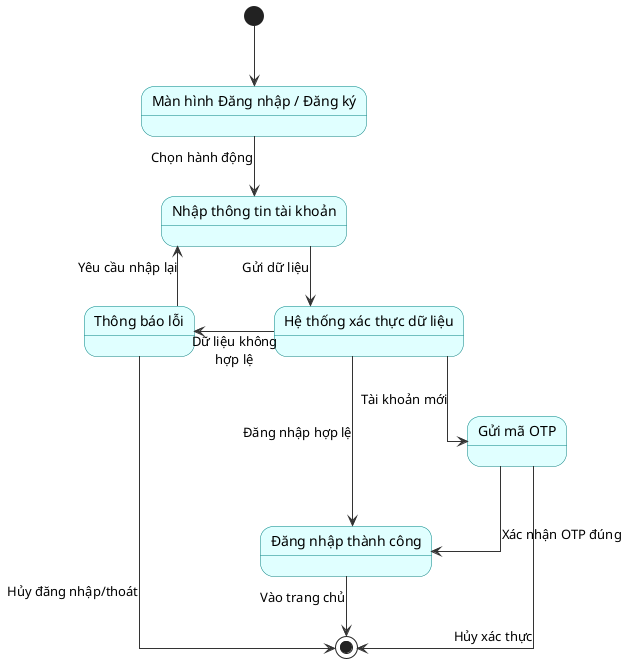

### 2.1.2 Quản lý trạm sạc (Admin)
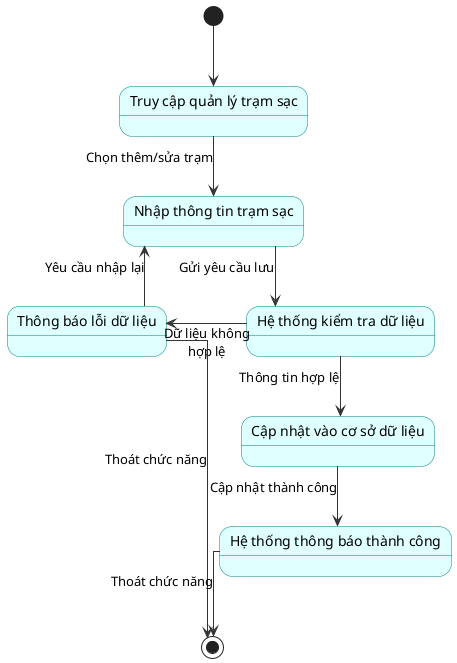

### 2.1.3 Quản lý bảo trì (Admin)
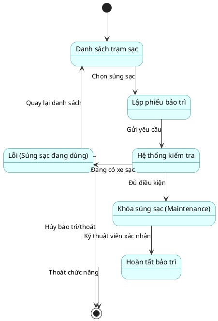

### 2.1.4 Cấu hình bảng giá cước (Admin)
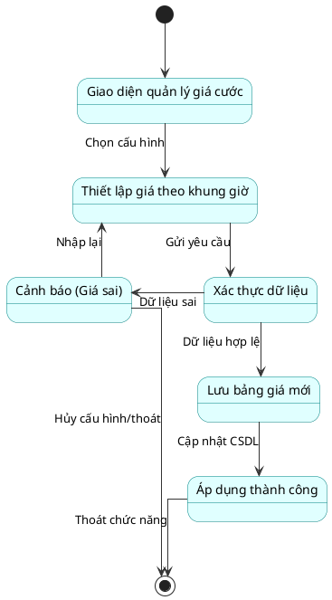

### 2.1.5 Khóa / Mở khóa tài khoản (Admin)
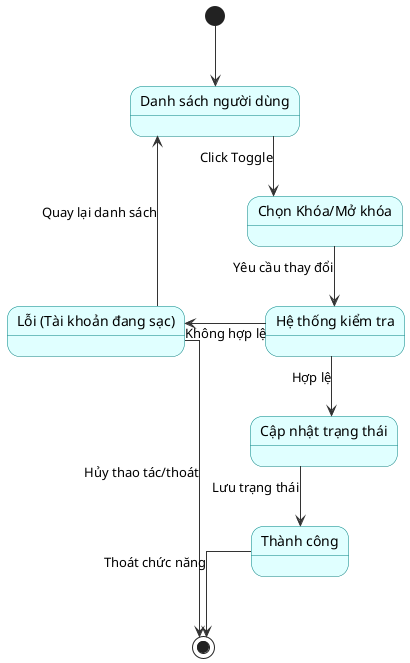

### 2.1.6 Tìm kiếm & Đặt chỗ trước (Khách hàng)
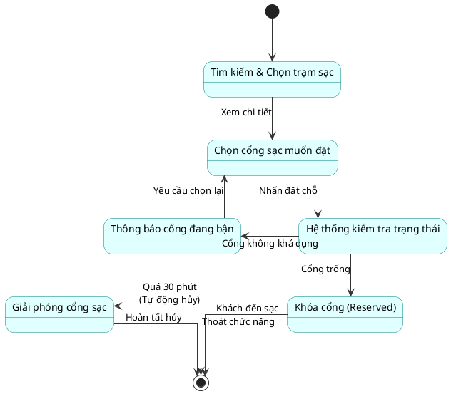

### 2.1.7 Khởi động & Dừng sạc (Khách hàng)
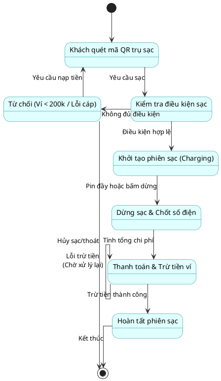

### 2.1.8 Nạp tiền ví VietQR PayOS (Khách hàng)
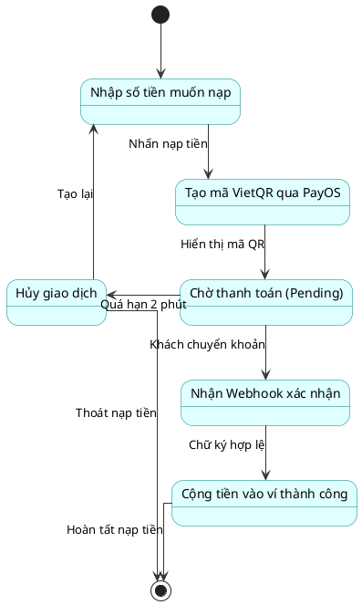

### 2.1.9 Xử lý hoàn tiền Refund (Admin)
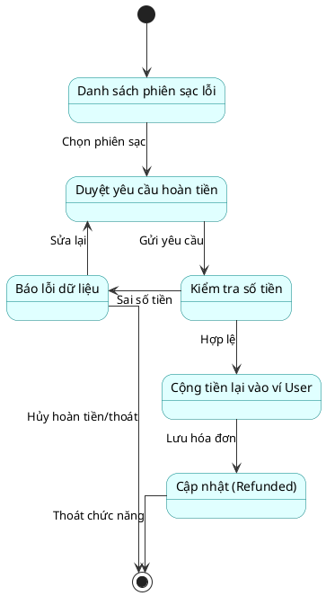

## 2.2 Xây dựng biểu đồ tuần tự (Sequence Diagram)

### 2.2.1 Đăng ký tài khoản & Xác thực OTP
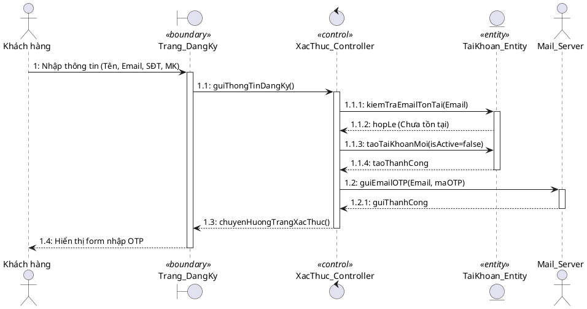

### 2.2.2 Đăng nhập hệ thống
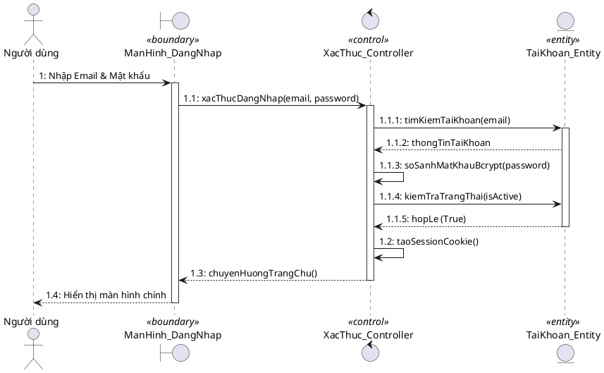

### 2.2.3 Quên & Đặt lại mật khẩu
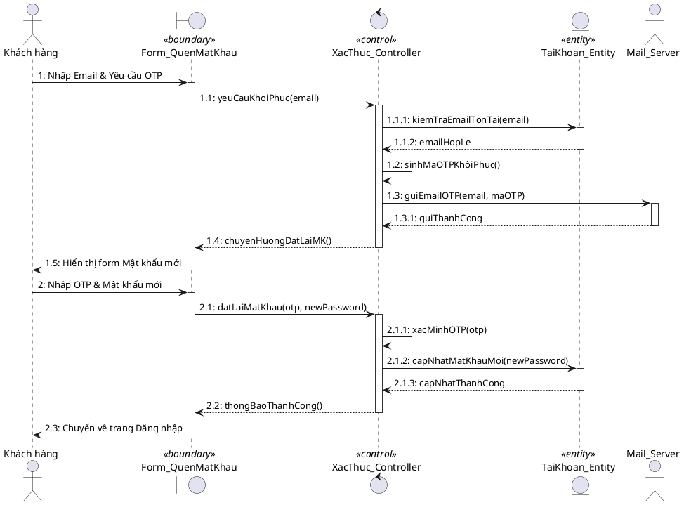

### 2.2.4 Tìm trạm sạc trên bản đồ (Leaflet.js)
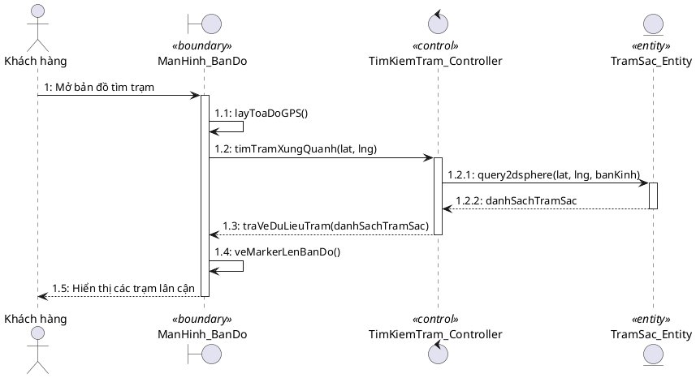

### 2.2.5 Đặt chỗ sạc
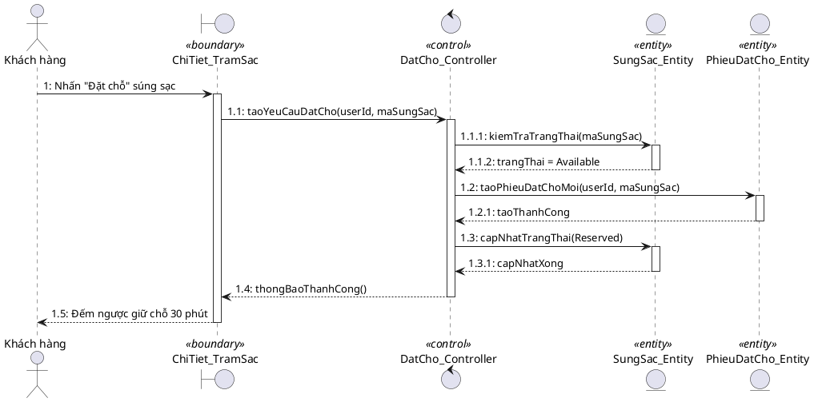

### 2.2.6 Khởi động sạc
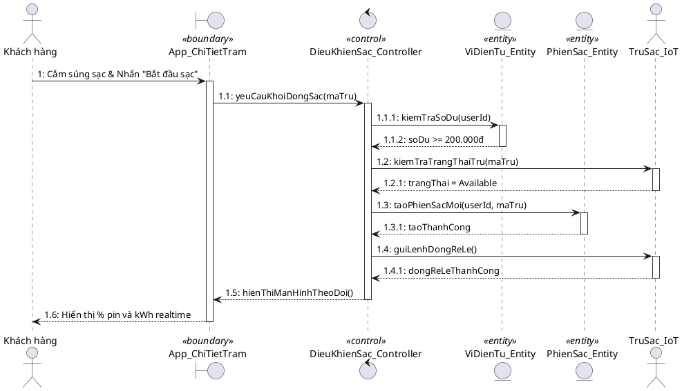

### 2.2.7 Dừng sạc & Trừ tiền ví
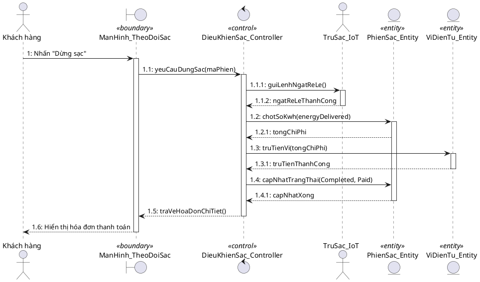

### 2.2.8 Nạp tiền VietQR (PayOS)
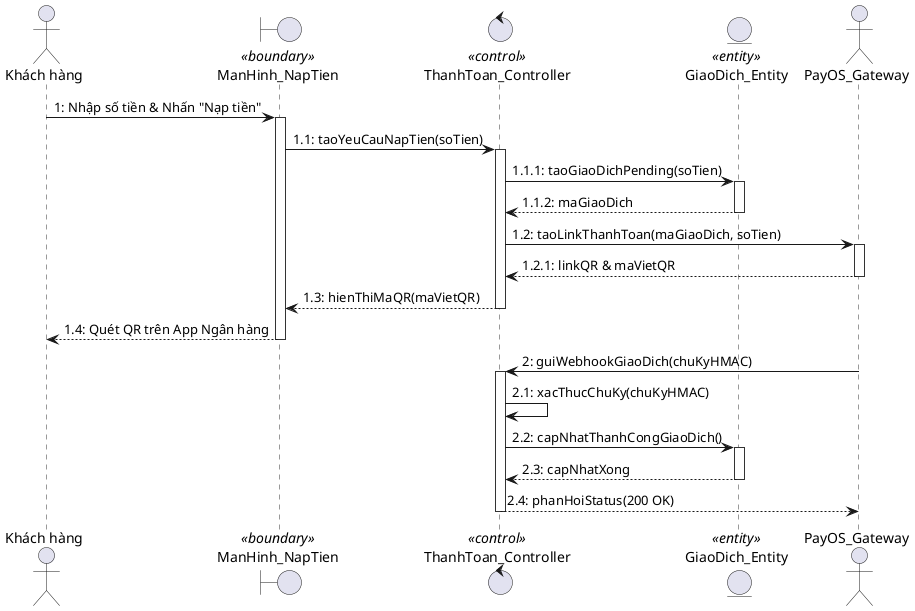

### 2.2.9 Xem lịch sử giao dịch
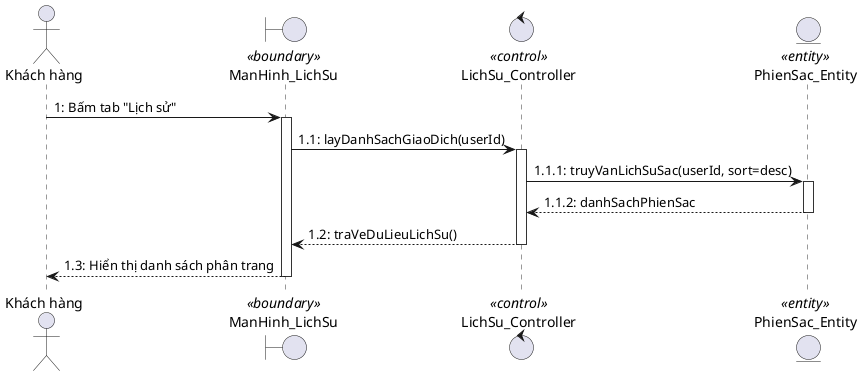

### 2.2.10 Xem Dashboard Thống kê (Admin)
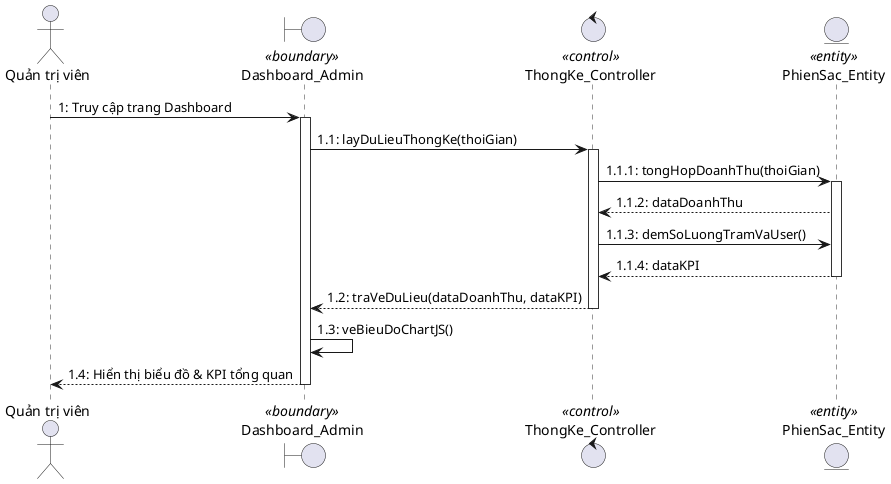

### 2.2.11 Quản lý trạm sạc (Thêm/Sửa trạm - Admin)
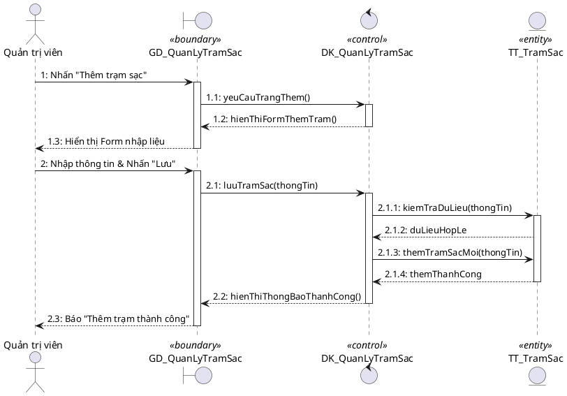

### 2.2.12 Lập phiếu bảo trì (Admin)
```plantuml
@startuml
skinparam backgroundColor white
skinparam sequenceArrowThickness 1
skinparam sequenceLifeLineBorderColor #333333

actor "Quản trị viên" as Admin
boundary "GD_QuanLyBaoTri" as Boundary <<boundary>>
control "BaoTri_Controller" as Control <<control>>
entity "SungSac_Entity" as SungSac <<entity>>
entity "PhieuBaoTri_Entity" as Phieu <<entity>>

Admin -> Boundary: 1: Tạo phiếu bảo trì súng sạc
activate Boundary
Boundary -> Control: 1.1: taoPhieuBaoTri(maSungSac, lyDo)
activate Control
Control -> SungSac: 1.1.1: kiemTraTrangThai(maSungSac)
activate SungSac
SungSac --> Control: 1.1.2: hopLe (Không có người sạc)
Control -> SungSac: 1.1.3: chuyenTrangThai(Maintenance)
SungSac --> Control: 1.1.4: chuyenThanhCong
deactivate SungSac
Control -> Phieu: 1.2: luuPhieuBaoTriMoi()
activate Phieu
Phieu --> Control: 1.2.1: luuThanhCong
deactivate Phieu
Control --> Boundary: 1.3: thongBaoThanhCong()
deactivate Control
Boundary --> Admin: 1.4: Hiển thị danh sách phiếu
deactivate Boundary
@enduml
```

## 2.3 Vẽ lại biểu đồ lớp hoàn chỉnh

```plantuml
@startuml
skinparam class {
  BackgroundColor White
  ArrowColor #333333
  BorderColor #333333
}

class User {
  - userId: String
  - fullName: String
  - email: String
  - phone: String
  - passwordHash: String
  - role: String
  - walletBalance: Float
  - isActive: Boolean
  + login(): Boolean
  + register(): Boolean
  + verifyOTP(otp: String): Boolean
  + updateProfile(): void
  + resetPassword(): void
}

class Station {
  - stationId: String
  - name: String
  - address: String
  - latitude: Float
  - longitude: Float
  - pricePerKwh: Float
  - status: String
  + addStation(): void
  + updateStation(): void
  + deleteStation(): void
  + getAvailableConnectors(): Int
}

class Connector {
  - connectorId: String
  - type: String (Type2/CCS)
  - powerKw: Float
  - status: String (Available/InUse/Maintenance)
  + lockConnector(): void
  + unlockConnector(): void
  + updateStatus(): void
}

class ChargingSession {
  - sessionId: String
  - startTime: DateTime
  - endTime: DateTime
  - energyDeliveredKwh: Float
  - currentPercent: Int
  - totalCost: Float
  - status: String
  + startSession(): void
  + updateProgress(): void
  + stopSession(): void
  + calculateTotalCost(): Float
}

class Payment {
  - paymentId: String
  - amount: Float
  - paymentMethod: String
  - transactionCode: String
  - timestamp: DateTime
  - status: String
  + processWalletPayment(): Boolean
  + generateVietQR(): String
  + verifyWebhookHMAC(): Boolean
}

class Reservation {
  - reservationId: String
  - timeSlot: DateTime
  - status: String
  + makeReservation(): Boolean
  + cancelReservation(): void
  + checkTimeout(): Boolean
}

class MaintenanceTicket {
  - ticketId: String
  - issueDescription: String
  - reportedDate: DateTime
  - resolvedDate: DateTime
  - status: String
  + createTicket(): void
  + updateProgress(): void
  + resolveTicket(): void
}

User "1" -- "*" ChargingSession : initiates >
User "1" -- "*" Payment : makes >
User "1" -- "*" Reservation : books >
Station "1" *-- "1..*" Connector : contains >
Connector "1" -- "*" ChargingSession : hosts >
Connector "1" -- "*" Reservation : reserved by >
ChargingSession "1" -- "1" Payment : paid via >
Station "1" -- "*" MaintenanceTicket : has >
User "1" -- "*" MaintenanceTicket : assigned to >

@enduml
```
